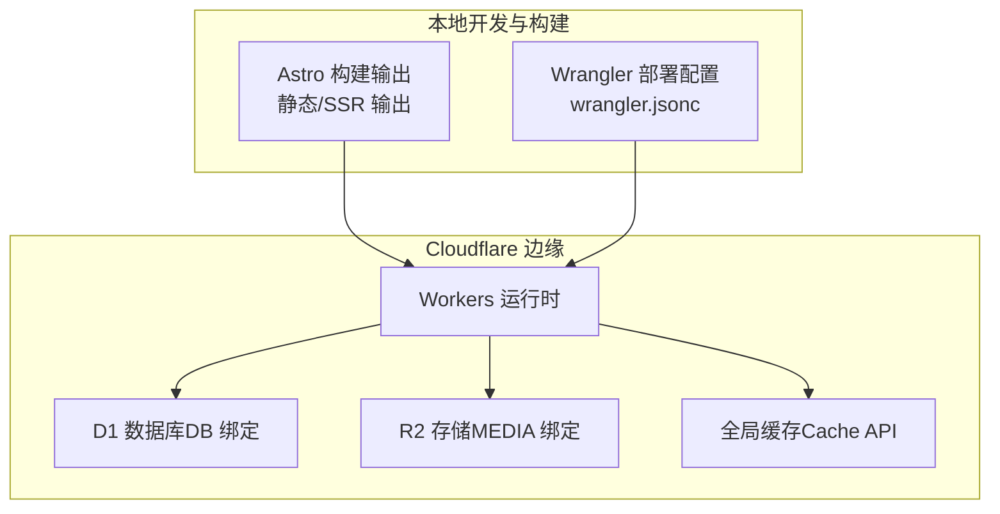
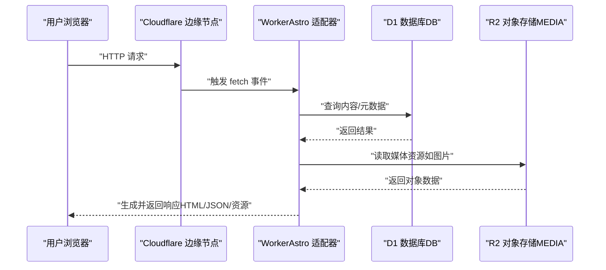
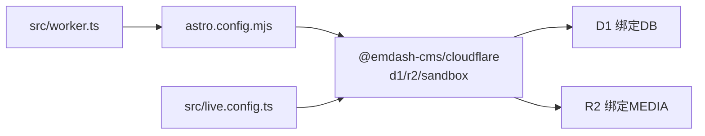

# Cloudflare 部署

<cite>
**本文引用的文件**
- [wrangler.jsonc](file://wrangler.jsonc)
- [worker-configuration.d.ts](file://worker-configuration.d.ts)
- [src/worker.ts](file://src/worker.ts)
- [astro.config.mjs](file://astro.config.mjs)
- [src/live.config.ts](file://src/live.config.ts)
- [package.json](file://package.json)
- [README.md](file://README.md)
- [seed/seed.json](file://seed/seed.json)
</cite>

## 目录
1. [简介](#简介)
2. [项目结构](#项目结构)
3. [核心组件](#核心组件)
4. [架构总览](#架构总览)
5. [详细组件分析](#详细组件分析)
6. [依赖关系分析](#依赖关系分析)
7. [性能考虑](#性能考虑)
8. [故障排除指南](#故障排除指南)
9. [结论](#结论)
10. [附录](#附录)

## 简介
本文件面向运维与开发团队，系统化阐述 EmDash 在 Cloudflare Workers 上的部署方案，覆盖以下主题：
- 部署配置文件结构与参数说明（D1 数据库绑定、R2 存储配置、边缘缓存）
- 生产环境部署流程（环境变量、域名绑定、SSL 证书）
- 部署前性能优化（代码分割、资源压缩、CDN 配置）
- 监控与日志（错误追踪、性能分析）
- 回滚策略与紧急修复流程
- 成本优化与资源管理最佳实践
- 运维排障与性能调优指导

## 项目结构
该仓库采用 Astro + EmDash 的组合，通过 @astrojs/cloudflare 适配器在 Cloudflare Workers 上运行；数据层使用 D1（SQLite 兼容）与 R2（对象存储），并通过 @emdash-cms/cloudflare 插件集成内容数据库与媒体存储。

图表来源
- [wrangler.jsonc:1-20](file://wrangler.jsonc#L1-L20)
- [astro.config.mjs:1-45](file://astro.config.mjs#L1-L45)
- [src/worker.ts:1-6](file://src/worker.ts#L1-L6)

章节来源
- [README.md:40-46](file://README.md#L40-L46)
- [astro.config.mjs:1-45](file://astro.config.mjs#L1-L45)
- [wrangler.jsonc:1-20](file://wrangler.jsonc#L1-L20)

## 核心组件
- Workers 入口与适配器
  - 使用 Astro 的 Cloudflare 适配器导出默认 handler，作为 Worker 的入口。
  - 可选导出 Sandbox 插件桥接能力，用于安全沙箱执行。
- 配置与类型
  - wrangler.jsonc 定义 Worker 名称、入口、兼容性日期、D1 与 R2 绑定。
  - worker-configuration.d.ts 提供 Env 类型声明，确保在编译期明确 DB 与 MEDIA 的可用性。
- Astro 集成
  - astro.config.mjs 启用 cloudflare 适配器，配置 emdash 集成（D1、R2、插件、沙箱运行器等）。
  - src/live.config.ts 定义实时内容集合，通过 emdashLoader 从数据库加载内容。
- 种子数据
  - seed/seed.json 提供初始站点结构、分类标签、菜单、挂件区与示例内容，便于快速初始化。

章节来源
- [src/worker.ts:1-6](file://src/worker.ts#L1-L6)
- [worker-configuration.d.ts:1-11](file://worker-configuration.d.ts#L1-L11)
- [astro.config.mjs:1-45](file://astro.config.mjs#L1-L45)
- [src/live.config.ts:1-14](file://src/live.config.ts#L1-L14)
- [seed/seed.json:1-275](file://seed/seed.json#L1-L275)

## 架构总览
EmDash 在 Cloudflare 的运行架构如下：客户端请求经由 Cloudflare 全球网络到达最近的边缘节点，由 Worker 按路由交由 Astro SSR 或静态页面生成；内容数据来自 D1，媒体资源来自 R2；全局缓存可加速响应。

图表来源
- [src/worker.ts:1-6](file://src/worker.ts#L1-L6)
- [astro.config.mjs:16-26](file://astro.config.mjs#L16-L26)
- [wrangler.jsonc:7-18](file://wrangler.jsonc#L7-L18)

## 详细组件分析

### 部署配置文件（wrangler.jsonc）
- 关键字段说明
  - name：Worker 名称，用于在 Cloudflare 控制台识别与部署。
  - main：入口文件路径，指向 Astro 适配器导出的 handler。
  - compatibility_date/compatibility_flags：运行时兼容性配置，确保 Node.js 兼容特性按预期工作。
  - d1_databases：定义 D1 绑定名称与数据库名，供代码通过 Env.DB 访问。
  - r2_buckets：定义 R2 绑定名称与桶名，供代码通过 Env.MEDIA 访问。
- 建议
  - 在生产环境中，将数据库与存储桶名称与账户内实际资源保持一致。
  - 如需启用边缘缓存策略，可在路由规则或 KV/缓存 API 中进行补充配置（见“依赖关系分析”与“性能考虑”）。

章节来源
- [wrangler.jsonc:1-20](file://wrangler.jsonc#L1-L20)

### 类型与环境声明（worker-configuration.d.ts）
- Env 接口扩展 Cloudflare 内置类型，声明 DB（D1）与 MEDIA（R2）两个绑定，确保在 TypeScript 层面具备类型安全。
- 该类型由 Wrangler 自动生成，随运行时版本更新而变化，建议在 CI 中同步生成以避免类型不匹配。

章节来源
- [worker-configuration.d.ts:1-11](file://worker-configuration.d.ts#L1-L11)

### Astro 集成与运行时（astro.config.mjs）
- 输出模式与适配器
  - output: "server" 表示采用服务端渲染（SSR）模式，适合动态内容与 SEO。
  - adapter: cloudflare() 将 Astro 构建产物适配到 Cloudflare Workers。
- 集成项
  - emdash 集成：通过 d1({ binding: "DB", session: "auto" }) 与 r2({ binding: "MEDIA" }) 绑定数据库与存储；plugins 与 sandboxed 配置启用插件生态与沙箱执行。
  - image 集成：开启约束式图片布局与响应式样式，配合 R2 存储使用。
  - 字体：配置 Google Fonts 提供者与字体变量，提升首屏渲染体验。
  - devToolbar：关闭开发工具栏，减少生产环境开销。
- 运行时加载
  - src/live.config.ts 使用 emdashLoader() 动态加载内容集合，与 D1 数据库联动。

章节来源
- [astro.config.mjs:1-45](file://astro.config.mjs#L1-L45)
- [src/live.config.ts:1-14](file://src/live.config.ts#L1-L14)

### Worker 入口（src/worker.ts）
- 导入 Astro 的 Cloudflare 适配器入口，并导出 Sandbox 桥接能力。
- 默认导出 handler 作为 Worker 的 fetch 入口，负责处理所有请求。

章节来源
- [src/worker.ts:1-6](file://src/worker.ts#L1-L6)

### 种子数据（seed/seed.json）
- 包含站点元信息、内容集合（posts/pages）、分类与标签、作者署名、菜单、挂件区与示例内容。
- 通过 EmDash CLI 或控制台导入，快速完成初始站点搭建。

章节来源
- [seed/seed.json:1-275](file://seed/seed.json#L1-L275)

### 部署流程（生产环境）
- 环境准备
  - 在 Cloudflare 控制台创建并配置 D1 数据库与 R2 存储桶，确保名称与绑定一致。
  - 在 Wrangler 配置中核对 d1_databases 与 r2_buckets 的 binding 与名称。
- 域名与 SSL
  - 在 Cloudflare DNS 中添加站点域名，并将域名指向 Worker 或自定义域。
  - Cloudflare 自动签发与续期免费 SSL 证书，无需额外配置。
- 部署命令
  - 使用脚本一键构建并部署：参见 package.json 中的 deploy 脚本。
- 预览与验证
  - 部署后通过预览链接访问站点，检查首页、文章页、分类/标签页、RSS 等功能是否正常。

章节来源
- [package.json:10-16](file://package.json#L10-L16)
- [README.md:55-61](file://README.md#L55-L61)

### 性能优化（部署前）
- 代码与资源优化
  - 图片：使用 Astro image 集成与 R2 存储，按需生成多尺寸与格式，减少带宽与延迟。
  - 字体：通过 Google Fonts 提供者与 CSS 变量，避免 FOIT/FOFT 并减少阻塞。
  - 代码分割：Astro 会自动进行模块拆分与懒加载，结合 Worker 边缘就近分发降低时延。
- CDN 与缓存
  - 利用 Cloudflare 全局缓存与边缘缓存策略，对静态资源与动态响应进行缓存。
  - 对于频繁访问的页面与资源，合理设置缓存头与缓存键，平衡新鲜度与性能。
- 构建与打包
  - 在 CI 中启用类型检查与构建校验，确保产物质量。
  - 使用最小化与压缩策略（由 Astro/适配器处理），减少传输体积。

章节来源
- [astro.config.mjs:12-15](file://astro.config.mjs#L12-L15)
- [astro.config.mjs:27-42](file://astro.config.mjs#L27-L42)

### 监控与日志
- 错误追踪
  - 使用 Worker 的全局 console 与错误捕获机制，记录异常堆栈与上下文。
  - 结合 Cloudflare 日志与 Tracing（tail/traces），定位请求链路中的问题。
- 性能分析
  - 使用 performance API 记录关键阶段耗时，评估 D1 查询与 R2 读取耗时。
  - 通过缓存命中率与边缘节点响应时间评估整体性能。
- 建议
  - 在关键路径增加埋点与采样，避免生产环境日志过多导致性能下降。
  - 对高频错误建立告警，结合缓存与降级策略保障稳定性。

章节来源
- [worker-configuration.d.ts:455-466](file://worker-configuration.d.ts#L455-L466)

### 回滚策略与紧急修复
- 回滚策略
  - 保留最近几个版本的部署快照，出现问题时可快速回退至上一个稳定版本。
  - 对于数据库变更，先在测试环境验证迁移脚本，再灰度发布。
- 紧急修复
  - 通过 Worker 代码热修复（如开关控制）快速止损，随后提交正式修复。
  - 若涉及 D1/R2，优先使用只读操作与备份恢复，避免进一步影响。
- 文档化
  - 记录每次变更与回滚原因，形成知识库，提升团队应急响应效率。

[本节为通用运维建议，无需特定文件来源]

### 成本优化与资源管理
- 数据与存储
  - 合理规划 D1 表结构与索引，避免冗余列与大字段，降低读写成本。
  - 对 R2 对象生命周期进行管理，清理不再使用的媒体资源。
- 边缘与流量
  - 通过缓存策略与压缩减少带宽消耗；根据业务峰值调整计划外资源。
- 运维自动化
  - 在 CI 中加入构建与部署校验，减少人工干预带来的成本与风险。

[本节为通用运维建议，无需特定文件来源]

## 依赖关系分析
- 组件耦合
  - Worker 入口依赖 Astro 适配器；Astro 配置依赖 @astrojs/cloudflare 与 @emdash-cms/cloudflare。
  - emdash 集成通过 D1 与 R2 绑定访问数据库与存储；live.config 使用 emdashLoader 加载内容。
- 外部依赖
  - Cloudflare Workers 运行时、Cache API、D1 与 R2 服务。
- 可能的循环依赖
  - 当前结构清晰，无明显循环依赖；若后续引入自定义中间件，请避免双向依赖。

图表来源
- [src/worker.ts:1-6](file://src/worker.ts#L1-L6)
- [astro.config.mjs:1-45](file://astro.config.mjs#L1-L45)
- [src/live.config.ts:1-14](file://src/live.config.ts#L1-L14)

章节来源
- [astro.config.mjs:16-26](file://astro.config.mjs#L16-L26)
- [src/live.config.ts:8-13](file://src/live.config.ts#L8-L13)

## 性能考虑
- 缓存策略
  - 对静态资源与可缓存页面设置合适的 Cache-Control 与 ETag。
  - 利用 Cache API 与全局缓存，减少重复计算与数据库/R2 访问。
- 数据库访问
  - 为常用查询建立索引；避免 N+1 查询；对复杂查询使用事务与批处理。
- 媒体优化
  - 使用 R2 存储与 Astro 图像集成，按需生成多尺寸与现代格式（如 AVIF/WebP）。
- 渲染与传输
  - SSR 页面尽量缩短首屏渲染路径；对非关键资源采用懒加载与异步加载。
- 监控指标
  - 关注 TTFB、P95/P99 延迟、缓存命中率、D1 查询耗时与 R2 读取耗时。

[本节为通用性能建议，无需特定文件来源]

## 故障排除指南
- 常见问题
  - 数据库连接失败：检查 D1 绑定名称与数据库名是否一致；确认账户权限。
  - 媒体资源 404：检查 R2 桶名与对象键；确认上传路径与访问权限。
  - Worker 冷启动慢：优化入口逻辑与依赖加载；减少不必要的初始化。
- 排查步骤
  - 查看 Cloudflare 日志与 Tracing，定位具体环节耗时。
  - 使用 console 输出关键路径参数，结合缓存命中情况判断问题来源。
  - 对比不同边缘节点的响应时间，排查区域性问题。
- 应急措施
  - 临时关闭高开销功能（如某些插件或图片格式转换）以恢复服务。
  - 回滚至上一稳定版本，同时修复问题并重新发布。

章节来源
- [worker-configuration.d.ts:94-211](file://worker-configuration.d.ts#L94-L211)

## 结论
本方案以 Astro + EmDash + Cloudflare Workers 为基础，结合 D1 与 R2 实现高性能、低延迟的现代化博客部署。通过规范化的配置、完善的监控与缓存策略、以及标准化的回滚与应急流程，可在保证用户体验的同时，持续优化成本与性能。建议在生产环境中严格执行变更管理与容量规划，确保系统稳定与可维护性。

## 附录
- 快速参考
  - 部署命令：参见 package.json 的 deploy 脚本。
  - 站点页面与路由：参见 README.md 的页面表格。
  - 初始内容：参见 seed/seed.json 的结构与示例。

章节来源
- [package.json:10-16](file://package.json#L10-L16)
- [README.md:20-32](file://README.md#L20-L32)
- [seed/seed.json:1-275](file://seed/seed.json#L1-L275)