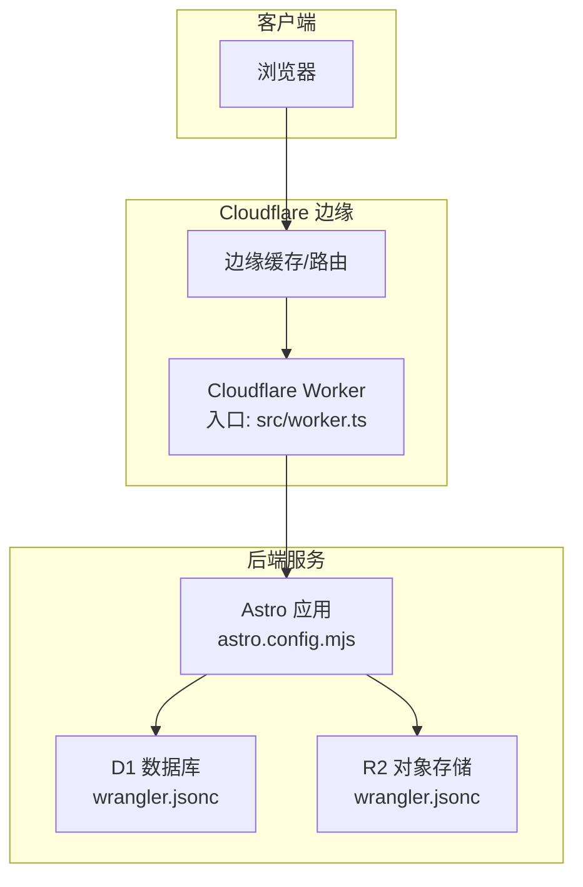
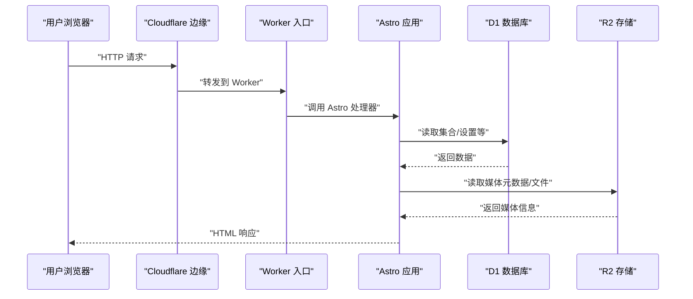
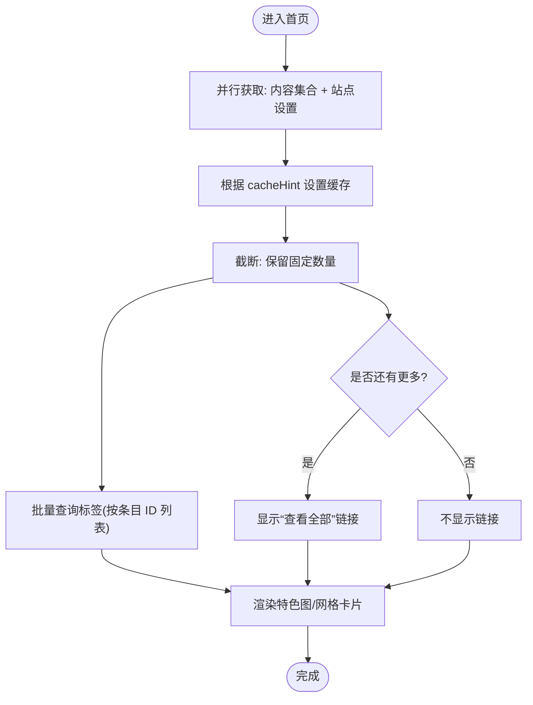
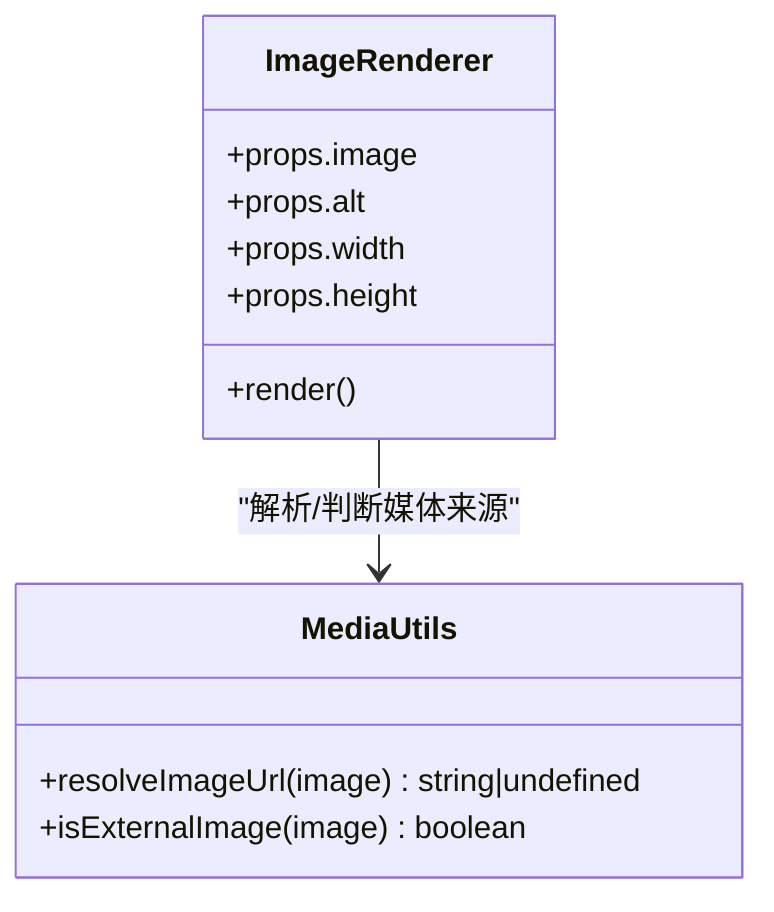
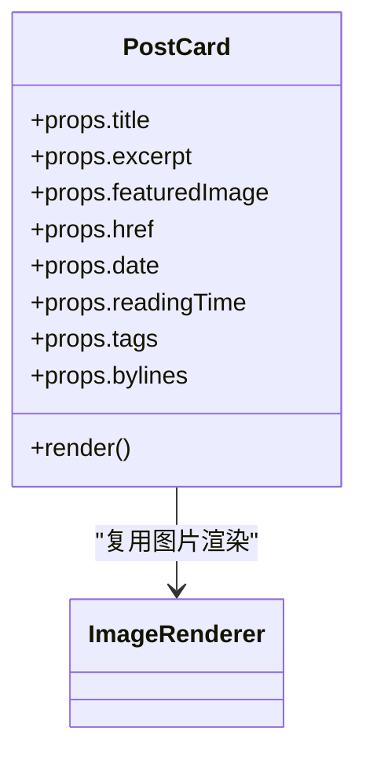

# 性能优化

<cite>
**本文引用的文件**
- [src/worker.ts](file://src/worker.ts)
- [wrangler.jsonc](file://wrangler.jsonc)
- [package.json](file://package.json)
- [astro.config.mjs](file://astro.config.mjs)
- [src/pages/index.astro](file://src/pages/index.astro)
- [src/components/ImageRenderer.astro](file://src/components/ImageRenderer.astro)
- [src/utils/media.ts](file://src/utils/media.ts)
- [src/utils/constants.ts](file://src/utils/constants.ts)
- [src/utils/reading-time.ts](file://src/utils/reading-time.ts)
- [src/utils/date.ts](file://src/utils/date.ts)
- [src/utils/site-identity.ts](file://src/utils/site-identity.ts)
- [src/components/PostCard.astro](file://src/components/PostCard.astro)
- [seed/seed.json](file://seed/seed.json)
</cite>

## 目录
1. [简介](#简介)
2. [项目结构](#项目结构)
3. [核心组件](#核心组件)
4. [架构总览](#架构总览)
5. [详细组件分析](#详细组件分析)
6. [依赖关系分析](#依赖关系分析)
7. [性能考量与优化策略](#性能考量与优化策略)
8. [故障排查指南](#故障排查指南)
9. [结论](#结论)
10. [附录](#附录)

## 简介
本指南面向在 Cloudflare Workers 平台上部署 EmDash 的团队与个人开发者，系统阐述边缘计算优势与 Workers 的性能特性，并结合当前仓库实现，给出可落地的性能优化方案：包括代码分割与懒加载、缓存策略、数据库查询优化（D1）、静态资源优化（图片压缩、CDN 缓存、预加载）、内存与执行时间优化、冷启动与热身策略、成本优化（请求频率与资源配额）、以及性能测试与基准测试方法。

## 项目结构
EmDash 使用 Astro 作为静态生成与服务端渲染框架，并通过 @astrojs/cloudflare 适配器部署到 Cloudflare Workers。数据层采用 D1（SQLite 兼容）与 R2（对象存储）；媒体访问通过站点内部 API 路由统一处理，以支持本地与外部图片两种来源。



图表来源
- [src/worker.ts:1-6](file://src/worker.ts#L1-L6)
- [astro.config.mjs:1-45](file://astro.config.mjs#L1-L45)
- [wrangler.jsonc:1-20](file://wrangler.jsonc#L1-L20)

章节来源
- [src/worker.ts:1-6](file://src/worker.ts#L1-L6)
- [astro.config.mjs:1-45](file://astro.config.mjs#L1-L45)
- [wrangler.jsonc:1-20](file://wrangler.jsonc#L1-L20)

## 核心组件
- Worker 入口与适配器
  - 入口导出默认处理器，适配 Cloudflare 运行时。
  - 参考路径：[src/worker.ts:1-6](file://src/worker.ts#L1-L6)
- 配置与绑定
  - Astro 适配器、图像优化、字体、插件集成、D1/R2 绑定。
  - 参考路径：[astro.config.mjs:1-45](file://astro.config.mjs#L1-L45)，[wrangler.jsonc:1-20](file://wrangler.jsonc#L1-L20)
- 页面与组件
  - 首页并行获取内容与设置，批量标签查询避免 N+1；图片渲染组件区分本地与外部来源。
  - 参考路径：[src/pages/index.astro:1-463](file://src/pages/index.astro#L1-L463)，[src/components/ImageRenderer.astro:1-36](file://src/components/ImageRenderer.astro#L1-L36)，[src/utils/media.ts:1-39](file://src/utils/media.ts#L1-L39)
- 工具函数
  - 常量、阅读时长估算、日期格式化、站点身份解析。
  - 参考路径：[src/utils/constants.ts:1-9](file://src/utils/constants.ts#L1-L9)，[src/utils/reading-time.ts:1-67](file://src/utils/reading-time.ts#L1-L67)，[src/utils/date.ts:1-18](file://src/utils/date.ts#L1-L18)，[src/utils/site-identity.ts:1-25](file://src/utils/site-identity.ts#L1-L25)

章节来源
- [src/worker.ts:1-6](file://src/worker.ts#L1-L6)
- [astro.config.mjs:1-45](file://astro.config.mjs#L1-L45)
- [wrangler.jsonc:1-20](file://wrangler.jsonc#L1-L20)
- [src/pages/index.astro:1-463](file://src/pages/index.astro#L1-L463)
- [src/components/ImageRenderer.astro:1-36](file://src/components/ImageRenderer.astro#L1-L36)
- [src/utils/media.ts:1-39](file://src/utils/media.ts#L1-L39)
- [src/utils/constants.ts:1-9](file://src/utils/constants.ts#L1-L9)
- [src/utils/reading-time.ts:1-67](file://src/utils/reading-time.ts#L1-L67)
- [src/utils/date.ts:1-18](file://src/utils/date.ts#L1-L18)
- [src/utils/site-identity.ts:1-25](file://src/utils/site-identity.ts#L1-L25)

## 架构总览
EmDash 在 Cloudflare 上的运行链路如下：浏览器请求经由 Cloudflare 边缘路由到达 Worker；Worker 将请求交由 Astro 应用处理；Astro 通过 emdash 集成访问 D1 与 R2；媒体资源通过内部 API 统一输出，既可走本地存储也可指向外部 URL。



图表来源
- [src/worker.ts:1-6](file://src/worker.ts#L1-L6)
- [astro.config.mjs:1-45](file://astro.config.mjs#L1-L45)
- [wrangler.jsonc:1-20](file://wrangler.jsonc#L1-L20)

## 详细组件分析

### 首页渲染与并行查询
首页通过 Promise.all 并行获取内容集合与站点设置，同时对标签进行批量查询，避免逐条查询导致的 N+1 开销；并利用 cacheHint 设置页面级缓存提示。



图表来源
- [src/pages/index.astro:19-65](file://src/pages/index.astro#L19-L65)

章节来源
- [src/pages/index.astro:19-65](file://src/pages/index.astro#L19-L65)

### 图片渲染与媒体解析
图片渲染组件根据 provider 类型选择直接输出外链或通过内部 API 渲染本地媒体；媒体工具负责将不同来源的图片转换为可显示的 URL。



图表来源
- [src/components/ImageRenderer.astro:1-36](file://src/components/ImageRenderer.astro#L1-L36)
- [src/utils/media.ts:1-39](file://src/utils/media.ts#L1-L39)

章节来源
- [src/components/ImageRenderer.astro:1-36](file://src/components/ImageRenderer.astro#L1-L36)
- [src/utils/media.ts:1-39](file://src/utils/media.ts#L1-L39)

### 文章卡片组件
文章卡片组件负责展示缩略图、作者署名、日期、阅读时长、摘要与标签，样式上使用 CSS 变量与响应式布局，减少重复计算与 DOM 操作。



图表来源
- [src/components/PostCard.astro:1-285](file://src/components/PostCard.astro#L1-L285)
- [src/components/ImageRenderer.astro:1-36](file://src/components/ImageRenderer.astro#L1-L36)

章节来源
- [src/components/PostCard.astro:1-285](file://src/components/PostCard.astro#L1-L285)

### 工具函数与常量
- 常量：断点与每页文章数，用于前端布局与分页策略。
- 阅读时长：基于 Portable Text 内容统计字词与 CJK 字符，估算分钟数。
- 日期格式化：按中文区域格式化日期。
- 站点身份：从站点设置中解析标题、副标题与 Logo。

章节来源
- [src/utils/constants.ts:1-9](file://src/utils/constants.ts#L1-L9)
- [src/utils/reading-time.ts:1-67](file://src/utils/reading-time.ts#L1-L67)
- [src/utils/date.ts:1-18](file://src/utils/date.ts#L1-L18)
- [src/utils/site-identity.ts:1-25](file://src/utils/site-identity.ts#L1-L25)

## 依赖关系分析
- 运行时与适配器
  - @astrojs/cloudflare 提供 Worker 适配器与运行时集成。
  - 参考路径：[package.json:17-27](file://package.json#L17-L27)，[astro.config.mjs:1-11](file://astro.config.mjs#L1-L11)
- 数据与存储
  - D1 绑定 DB，R2 绑定 MEDIA，用于内容与媒体。
  - 参考路径：[wrangler.jsonc:7-18](file://wrangler.jsonc#L7-L18)，[astro.config.mjs:18-25](file://astro.config.mjs#L18-L25)
- 插件与沙箱
  - 表单插件启用；Webhook 通知器在沙箱中运行。
  - 参考路径：[astro.config.mjs:16-25](file://astro.config.mjs#L16-L25)，[package.json:21-22](file://package.json#L21-L22)

```mermaid
graph LR
Pkg["package.json 依赖"] --> CF["@astrojs/cloudflare"]
Pkg --> EM["@emdash-cms/cloudflare"]
Pkg --> Forms["@emdash-cms/plugin-forms"]
Pkg --> Webhook["@emdash-cms/plugin-webhook-notifier"]
Cfg["astro.config.mjs"] --> D1["d1({ binding:'DB' })"]
Cfg --> R2["r2({ binding:'MEDIA' })"]
Cfg --> Plugins["plugins: formsPlugin()"]
Cfg --> Sandbox["sandboxRunner()"]
WC["wrangler.jsonc"] --> BindDB["\"DB\" -> D1"]
WC --> BindMedia["\"MEDIA\" -> R2"]
```

图表来源
- [package.json:17-32](file://package.json#L17-L32)
- [astro.config.mjs:16-26](file://astro.config.mjs#L16-L26)
- [wrangler.jsonc:7-18](file://wrangler.jsonc#L7-L18)

章节来源
- [package.json:17-32](file://package.json#L17-L32)
- [astro.config.mjs:16-26](file://astro.config.mjs#L16-L26)
- [wrangler.jsonc:7-18](file://wrangler.jsonc#L7-L18)

## 性能考量与优化策略

### 边缘计算与 Cloudflare Workers 的性能优势
- 低延迟：请求就近路由至最近边缘节点，显著降低往返时间。
- 无服务器弹性：自动扩缩容，无需维护服务器状态。
- 冷启动与执行时间：Workers 启动快、生命周期短，适合短请求场景；需配合缓存与预热策略。
- 安全与合规：内置 WAF、DDoS 防护与 TLS 终止。

### 代码优化策略
- 代码分割与懒加载
  - 将非首屏交互组件（如评论、搜索）按需加载，减少初始包体积。
  - 使用动态导入与 Suspense 边界，确保首屏优先渲染。
- 缓存策略
  - 页面级缓存：利用 Astro.cache.set(cacheHint) 设置缓存提示，结合 Cloudflare 缓存头。
  - 资源级缓存：静态资源与媒体文件使用强缓存与 ETag/Cache-Control。
  - 查询结果缓存：对稳定数据（如分类、标签、站点设置）使用 KV 或短期缓存。

章节来源
- [src/pages/index.astro:28](file://src/pages/index.astro#L28)

### 数据库查询优化（D1）
- 索引设计
  - 为常用过滤字段建立单列或复合索引，例如按 created_at 降序分页、按 formId + createdAt 组合过滤。
  - 参考：[storage.md 中的索引建议:120-127](file://.agents/skills/creating-plugins/references/storage.md#L120-L127)
- 查询计划与扫描
  - 仅对已建立索引的字段进行 where 查询；避免全表扫描与隐式类型转换。
  - 使用 limit 与分页游标，避免一次性拉取大量数据。
- 批量操作
  - 使用 getMany、putMany、deleteMany 减少网络往返。
- 读写分离与会话
  - 配置数据库会话策略，避免长事务占用连接。

章节来源
- [.agents/skills/creating-plugins/references/storage.md:62-118](file://.agents/skills/creating-plugins/references/storage.md#L62-L118)

### 静态资源优化
- 图片压缩与自适应
  - 使用 Astro 的 image 配置与响应式样式，自动生成多尺寸与 WebP/JPEG。
  - 参考：[astro.config.mjs:12-15](file://astro.config.mjs#L12-L15)
- CDN 缓存与预加载
  - R2 对象存储天然具备 CDN 加速能力；为关键资源添加预取与预连接。
- 媒体路由与直链
  - 本地媒体通过内部 API 输出，外部图片直接使用 previewUrl，减少额外跳转。
  - 参考：[src/utils/media.ts:5-30](file://src/utils/media.ts#L5-L30)，[src/components/ImageRenderer.astro:21-35](file://src/components/ImageRenderer.astro#L21-L35)

章节来源
- [astro.config.mjs:12-15](file://astro.config.mjs#L12-L15)
- [src/utils/media.ts:5-30](file://src/utils/media.ts#L5-L30)
- [src/components/ImageRenderer.astro:21-35](file://src/components/ImageRenderer.astro#L21-L35)

### 内存使用与执行时间优化
- 避免大对象驻留：及时释放临时数组与字符串拼接结果。
- 控制并发：合理设置并行请求数，避免超出 Worker 内存上限。
- 计算下沉：将复杂计算（如阅读时长）尽量在构建期或缓存中处理。
- 参考实现：
  - 阅读时长估算：[src/utils/reading-time.ts:51-59](file://src/utils/reading-time.ts#L51-L59)
  - 日期格式化：[src/utils/date.ts:7-17](file://src/utils/date.ts#L7-L17)

章节来源
- [src/utils/reading-time.ts:51-59](file://src/utils/reading-time.ts#L51-L59)
- [src/utils/date.ts:7-17](file://src/utils/date.ts#L7-L17)

### 冷启动与热身策略
- 冷启动优化
  - 减少入口包大小，拆分非必要模块；使用更小的依赖与更少的 polyfill。
  - 避免在入口处做重逻辑初始化。
- 热身策略
  - 通过定时健康检查或边缘脚本触发轻量请求，维持 Worker 实例活跃。
  - 对热点页面设置持久缓存，降低首次命中成本。

### 成本优化
- 请求频率控制
  - 合理设置缓存 TTL，减少重复请求；对后台任务使用队列或定时器而非高频轮询。
- 资源使用限制
  - 控制媒体尺寸与格式，避免超大文件；限制并发与超时时间。
- D1/R2 成本
  - 通过索引与查询优化降低读取次数；对不常访问的数据迁移至更低频层。

### 性能测试与基准测试
- 压力测试
  - 使用 k6 或 Artillery 发起并发请求，观察 P50/P90/P99 延迟与错误率。
- 负载测试
  - 模拟峰值流量，评估边缘缓存命中率与数据库负载。
- 基准测试
  - 固定环境与数据集，对比不同优化措施前后的 TTFB、FCP、LCP 等指标。
- 关键指标
  - TTFB（首字节时间）、PWA 指标（CLS、INP、LCP）、CPU/内存使用、请求失败率。

## 故障排查指南
- 缓存未生效
  - 检查页面是否正确设置 cacheHint；确认边缘缓存头与浏览器缓存策略。
  - 参考：[src/pages/index.astro:28](file://src/pages/index.astro#L28)
- 图片无法显示
  - 核对媒体 provider 类型与 URL 解析逻辑；确认 R2 Bucket 名称与绑定一致。
  - 参考：[src/utils/media.ts:5-30](file://src/utils/media.ts#L5-L30)，[wrangler.jsonc:13-18](file://wrangler.jsonc#L13-L18)
- 查询缓慢
  - 检查 where 条件是否命中索引；必要时增加复合索引或调整排序字段。
  - 参考：[storage.md 索引与查询:62-127](file://.agents/skills/creating-plugins/references/storage.md#L62-L127)
- 内存溢出或超时
  - 减少单次处理的数据量，拆分批处理；避免在 Worker 入口执行重逻辑。
  - 参考：[src/worker.ts:1-6](file://src/worker.ts#L1-L6)

章节来源
- [src/pages/index.astro:28](file://src/pages/index.astro#L28)
- [src/utils/media.ts:5-30](file://src/utils/media.ts#L5-L30)
- [wrangler.jsonc:13-18](file://wrangler.jsonc#L13-L18)
- [.agents/skills/creating-plugins/references/storage.md:62-127](file://.agents/skills/creating-plugins/references/storage.md#L62-L127)
- [src/worker.ts:1-6](file://src/worker.ts#L1-L6)

## 结论
通过充分利用 Cloudflare 边缘网络与 Workers 的低延迟特性，结合 Astro 的静态生成能力与 D1/R2 的高可用数据层，EmDash 可在保证功能完整性的同时实现卓越的性能表现。建议优先落实并行查询、批量标签、强缓存与媒体优化，并持续以指标驱动迭代优化。

## 附录
- 示例种子数据（包含多篇带图片与分类的博文）可用于性能测试与验证。
  - 参考路径：[seed/seed.json:420-511](file://seed/seed.json#L420-L511)