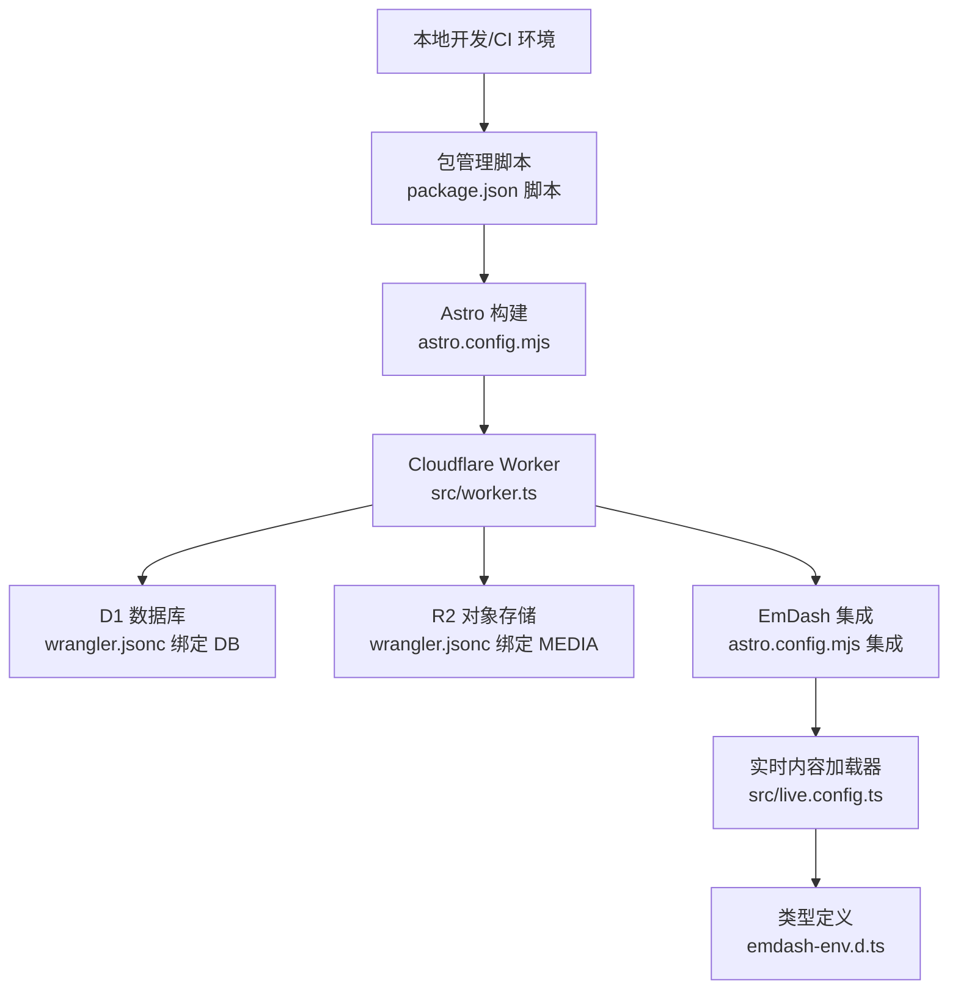
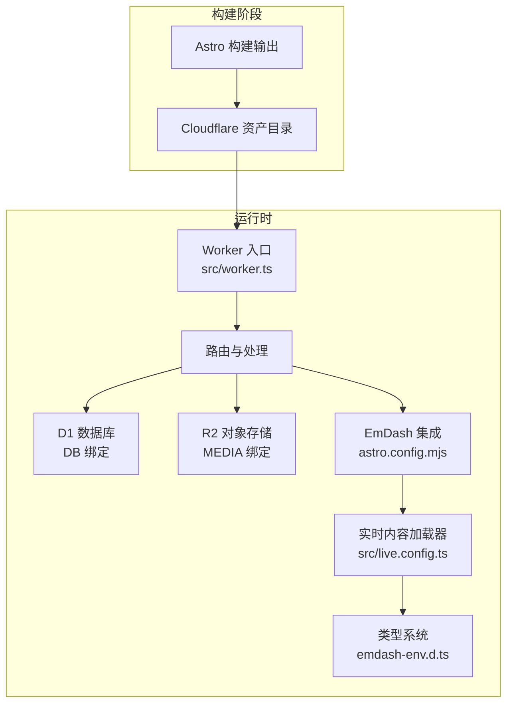
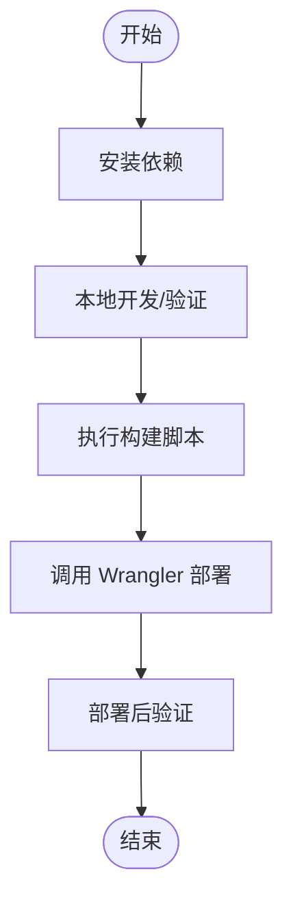
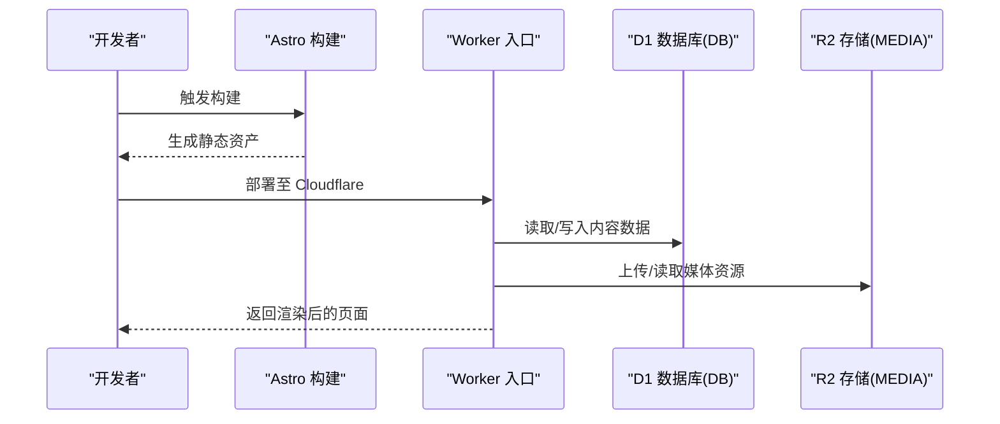
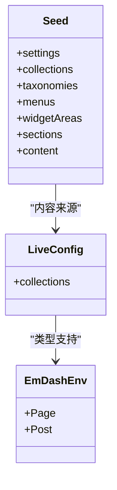
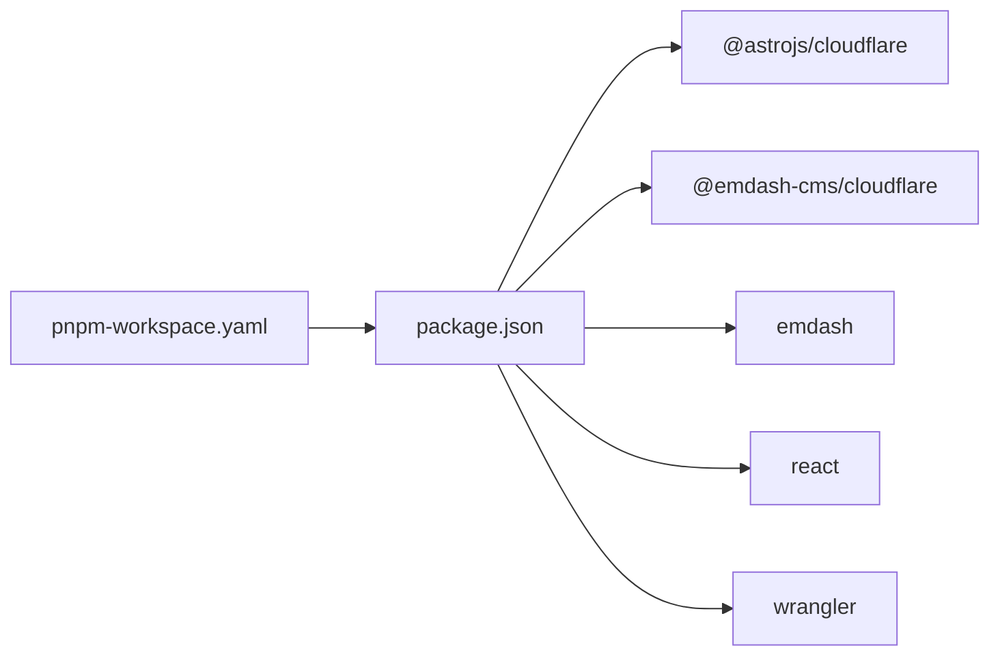

# 生产环境部署

<cite>
**本文引用的文件**
- [README.md](file://README.md)
- [package.json](file://package.json)
- [astro.config.mjs](file://astro.config.mjs)
- [wrangler.jsonc](file://wrangler.jsonc)
- [src/worker.ts](file://src/worker.ts)
- [src/live.config.ts](file://src/live.config.ts)
- [emdash-env.d.ts](file://emdash-env.d.ts)
- [tsconfig.json](file://tsconfig.json)
- [seed/seed.json](file://seed/seed.json)
- [.gitignore](file://.gitignore)
- [pnpm-workspace.yaml](file://pnpm-workspace.yaml)
- [.agents/skills/building-emdash-site/references/configuration.md](file://.agents/skills/building-emdash-site/references/configuration.md)
- [.agents/skills/emdash-cli/SKILL.md](file://.agents/skills/emdash-cli/SKILL.md)
</cite>

## 目录
1. [简介](#简介)
2. [项目结构](#项目结构)
3. [核心组件](#核心组件)
4. [架构总览](#架构总览)
5. [详细组件分析](#详细组件分析)
6. [依赖关系分析](#依赖关系分析)
7. [性能考量](#性能考量)
8. [故障排查指南](#故障排查指南)
9. [结论](#结论)
10. [附录](#附录)

## 简介
本指南面向在 Cloudflare Workers 上部署 EmDash 博客模板的生产环境团队，覆盖从开发到生产的完整流程：环境准备、依赖安装与构建、运行时配置（数据库 D1、对象存储 R2）、域名与 SSL、版本与发布策略（蓝绿/滚动）、部署前后验证、CI/CD 自动化以及回滚与应急恢复。

## 项目结构
该仓库为基于 Astro 的 EmDash 模板，采用 Cloudflare Workers 运行时，使用 D1 数据库与 R2 存储。关键文件与职责如下：
- 构建与部署脚本：通过包管理器脚本统一执行 Astro 构建与 Wrangler 部署
- 运行时适配：Astro 使用 @astrojs/cloudflare 适配器，Worker 入口导出服务处理函数
- 数据与存储：通过 @emdash-cms/cloudflare 集成 D1 与 R2，并在 Astro 配置中注册 EmDash 集成
- 类型与内容：生成的 emdash-env.d.ts 提供集合类型；src/live.config.ts 注册实时内容加载器
- 种子数据：seed/seed.json 定义集合、分类、菜单、挂件等初始内容

图表来源
- [package.json:10-16](file://package.json#L10-L16)
- [astro.config.mjs:1-44](file://astro.config.mjs#L1-L44)
- [src/worker.ts:1-6](file://src/worker.ts#L1-L6)
- [wrangler.jsonc:1-19](file://wrangler.jsonc#L1-L19)
- [src/live.config.ts:1-14](file://src/live.config.ts#L1-L14)
- [emdash-env.d.ts:1-39](file://emdash-env.d.ts#L1-L39)

章节来源
- [README.md:40-68](file://README.md#L40-L68)
- [package.json:10-16](file://package.json#L10-L16)
- [astro.config.mjs:1-44](file://astro.config.mjs#L1-L44)
- [wrangler.jsonc:1-19](file://wrangler.jsonc#L1-L19)
- [src/worker.ts:1-6](file://src/worker.ts#L1-L6)
- [src/live.config.ts:1-14](file://src/live.config.ts#L1-L14)
- [emdash-env.d.ts:1-39](file://emdash-env.d.ts#L1-L39)
- [tsconfig.json:1-7](file://tsconfig.json#L1-L7)

## 核心组件
- 包管理与脚本
  - 开发、构建、预览、部署命令集中在脚本字段，部署脚本串联 Astro 构建与 Wrangler 部署
- Astro 配置
  - 输出模式为 server，适配 Cloudflare；集成 React、EmDash、字体与沙箱运行器
  - 数据库与存储通过 d1/r2 绑定，插件与沙盒组件在集成中声明
- Worker 入口
  - 导出 Cloudflare 服务器入口处理函数，作为运行时路由分发
- Wrangler 配置
  - 声明 Worker 名称、兼容日期、D1 与 R2 绑定名称与数据库/桶名
- 实时内容加载器
  - 在 src/live.config.ts 中注册 _emdash 集合，由 emdashLoader 提供运行时内容查询能力
- 类型定义
  - emdash-env.d.ts 自动生成，包含页面与文章集合的 TS 类型，供 Astro 与编辑器使用
- 种子数据
  - seed/seed.json 描述集合、字段、分类、标签、菜单、挂件区、小节与示例内容

章节来源
- [package.json:10-16](file://package.json#L10-L16)
- [astro.config.mjs:9-26](file://astro.config.mjs#L9-L26)
- [src/worker.ts:1-6](file://src/worker.ts#L1-L6)
- [wrangler.jsonc:3-18](file://wrangler.jsonc#L3-L18)
- [src/live.config.ts:8-13](file://src/live.config.ts#L8-L13)
- [emdash-env.d.ts:1-39](file://emdash-env.d.ts#L1-L39)
- [seed/seed.json:1-67](file://seed/seed.json#L1-L67)

## 架构总览
EmDash 在 Cloudflare Workers 上以“静态生成 + 边缘运行时”的方式工作：Astro 在构建阶段生成静态资源，运行时通过 Worker 处理请求并访问 D1/R2，实时加载内容并通过 EmDash 集成渲染页面。

图表来源
- [astro.config.mjs:10-26](file://astro.config.mjs#L10-L26)
- [src/worker.ts:1-6](file://src/worker.ts#L1-L6)
- [wrangler.jsonc:7-18](file://wrangler.jsonc#L7-L18)
- [src/live.config.ts:8-13](file://src/live.config.ts#L8-L13)
- [emdash-env.d.ts:1-39](file://emdash-env.d.ts#L1-L39)

## 详细组件分析

### 构建与部署流水线
- 开发到生产的路径
  - 本地开发：安装依赖后启动开发服务器
  - 构建：执行构建脚本生成静态产物
  - 部署：构建完成后自动调用 Wrangler 将产物部署至 Cloudflare Workers
- 关键脚本与行为
  - dev/build/preview/deploy/typecheck 等脚本集中于 package.json
  - deploy 脚本串联 astro build 与 wrangler deploy
- 版本与元信息
  - 项目版本在 package.json 中定义，用于发布与追踪

图表来源
- [README.md:47-61](file://README.md#L47-L61)
- [package.json:10-16](file://package.json#L10-L16)

章节来源
- [README.md:47-61](file://README.md#L47-L61)
- [package.json:10-16](file://package.json#L10-L16)

### 数据库与存储配置（D1/R2）
- D1 数据库
  - 在 wrangler.jsonc 中声明绑定名为 DB 的数据库实例
  - Astro 配置中通过 d1({ binding: "DB", session: "auto" }) 注入到 EmDash 集成
- R2 对象存储
  - 在 wrangler.jsonc 中声明绑定名为 MEDIA 的存储桶
  - Astro 配置中通过 r2({ binding: "MEDIA" }) 注入到 EmDash 集成
- 运行时访问
  - Worker 入口导出服务处理函数，运行时通过绑定名称访问 D1/R2

图表来源
- [wrangler.jsonc:7-18](file://wrangler.jsonc#L7-L18)
- [astro.config.mjs:18-20](file://astro.config.mjs#L18-L20)
- [src/worker.ts:1-6](file://src/worker.ts#L1-L6)

章节来源
- [wrangler.jsonc:7-18](file://wrangler.jsonc#L7-L18)
- [astro.config.mjs:18-20](file://astro.config.mjs#L18-L20)
- [src/worker.ts:1-6](file://src/worker.ts#L1-L6)

### 内容与类型系统
- 实时内容加载器
  - 在 src/live.config.ts 中注册 _emdash 集合，使用 emdashLoader 提供运行时查询
- 类型定义
  - emdash-env.d.ts 自动生成，包含页面与文章集合的 TS 接口，供 Astro 与编辑器使用
  - tsconfig.json 引入 emdash-env.d.ts，确保类型可用
- 集合与种子
  - seed/seed.json 定义集合、字段、分类、标签、菜单、挂件区、小节与示例内容，首次请求时可自动应用

图表来源
- [src/live.config.ts:8-13](file://src/live.config.ts#L8-L13)
- [emdash-env.d.ts:8-39](file://emdash-env.d.ts#L8-L39)
- [seed/seed.json:9-275](file://seed/seed.json#L9-L275)

章节来源
- [src/live.config.ts:8-13](file://src/live.config.ts#L8-L13)
- [emdash-env.d.ts:1-39](file://emdash-env.d.ts#L1-L39)
- [tsconfig.json:1-7](file://tsconfig.json#L1-L7)
- [seed/seed.json:1-67](file://seed/seed.json#L1-L67)

### 插件与安全沙箱
- 插件
  - formsPlugin 已在集成中注册，用于表单相关功能
- 沙箱与隔离
  - webhookNotifier 被列入沙箱组件列表，sandboxRunner 提供沙箱运行器
  - marketplace 地址在集成中声明，便于扩展生态

章节来源
- [astro.config.mjs:21-25](file://astro.config.mjs#L21-L25)

### 环境变量与密钥管理
- 环境与密钥
  - .gitignore 中排除了 .env、.env.*、.dev.vars、.dev.vars.*，避免敏感信息进入版本控制
  - 项目未在仓库中直接定义数据库连接字符串或存储桶密钥，通常通过 Wrangler Secrets 或 Cloudflare 平台侧注入
- 建议实践
  - 使用 Wrangler Secrets 管理敏感值，如第三方服务令牌、加密密钥等
  - 通过平台侧的变量管理界面或 CLI 设置，确保仅在生产环境生效

章节来源
- [.gitignore:7-12](file://.gitignore#L7-L12)

### 域名绑定与 SSL 证书
- 域名与 SSL
  - 通过 Cloudflare Workers 平台绑定自定义域名并启用 SSL 证书
  - 建议在平台侧完成 DNS 解析、证书申请与自动续期配置
- 注意事项
  - 若使用反向代理或 CDN，请确保 TLS 终止位置与站点 URL 配置一致，避免 CSRF 与重定向问题

章节来源
- [.agents/skills/building-emdash-site/references/configuration.md:57-86](file://.agents/skills/building-emdash-site/references/configuration.md#L57-L86)

### 版本管理与发布策略
- 版本号
  - 项目版本在 package.json 中定义，建议遵循语义化版本控制
- 发布策略
  - 蓝绿部署：通过两个独立 Worker 版本（如主站与备用站）进行切换，降低风险
  - 滚动更新：在 Cloudflare Workers 上通过渐进式流量切换实现平滑升级
- 发布前检查
  - 本地构建与类型检查通过
  - 数据库迁移与种子应用成功
  - 媒体资源上传与访问正常
  - 域名解析与 SSL 证书生效
- 发布后验证
  - 首屏渲染与关键路径性能
  - 内容查询与搜索功能
  - 表单提交与 Webhook 通知（若启用）

章节来源
- [package.json:3](file://package.json#L3)
- [.agents/skills/building-emdash-site/references/configuration.md:57-86](file://.agents/skills/building-emdash-site/references/configuration.md#L57-L86)

### CI/CD 集成与自动化部署
- 自动化要点
  - 在 CI 中安装依赖并执行构建脚本
  - 使用 Wrangler CLI 执行部署，结合平台侧的 Secrets 与认证
- CLI 支持
  - EmDash CLI 支持远程命令与服务令牌，适合在 CI 中自动化内容操作与类型生成
- 参考命令
  - 构建与部署：见 README 中的部署命令
  - 类型生成与登录：见 EmDash CLI 技能文档

章节来源
- [README.md:55-61](file://README.md#L55-L61)
- [.agents/skills/emdash-cli/SKILL.md:13-27](file://.agents/skills/emdash-cli/SKILL.md#L13-L27)
- [.agents/skills/emdash-cli/SKILL.md:71-88](file://.agents/skills/emdash-cli/SKILL.md#L71-L88)
- [.agents/skills/emdash-cli/SKILL.md:90-104](file://.agents/skills/emdash-cli/SKILL.md#L90-L104)

### 回滚与紧急恢复
- 回滚策略
  - 利用平台提供的版本回滚能力，快速切换到上一个稳定版本
  - 若涉及数据库变更，需同步回滚或应用逆向迁移
- 应急恢复
  - 快速验证：检查 Worker 日志、数据库连接与存储访问
  - 降级：临时关闭高风险插件或功能，优先保证核心页面可用
  - 通知：通过 Webhook 或监控告警机制通知运维与产品团队

章节来源
- [.agents/skills/emdash-cli/SKILL.md:105-119](file://.agents/skills/emdash-cli/SKILL.md#L105-L119)

## 依赖关系分析
- 依赖与运行时
  - Astro 与 @astrojs/cloudflare 提供构建与适配
  - @emdash-cms/cloudflare 提供 D1/R2 集成与沙箱运行器
  - React 集成用于组件化渲染
- 工作空间与供应链安全
  - pnpm-workspace.yaml 限制构建依赖范围，提升供应链安全性

图表来源
- [package.json:17-32](file://package.json#L17-L32)
- [pnpm-workspace.yaml:1-17](file://pnpm-workspace.yaml#L1-L17)

章节来源
- [package.json:17-32](file://package.json#L17-L32)
- [pnpm-workspace.yaml:1-17](file://pnpm-workspace.yaml#L1-L17)

## 性能考量
- 构建优化
  - 合理设置图片响应式与布局，减少首屏阻塞
  - 启用必要的字体与资源优化策略
- 运行时优化
  - 利用 Cloudflare 边缘网络就近分发
  - 控制请求路径与缓存策略，减少数据库与存储访问次数
- 监控与度量
  - 结合平台日志与指标，持续观察冷启动、请求延迟与错误率

## 故障排查指南
- 常见问题定位
  - 构建失败：检查脚本与依赖版本，确认本地与 CI 环境一致
  - 部署失败：核对 Wrangler 配置、绑定名称与平台侧权限
  - 运行时错误：查看 Worker 日志，确认 D1/R2 绑定是否正确
- 类型与内容
  - emdash-env.d.ts 缺失或过期：重新生成类型或检查生成命令
  - 种子数据未生效：确认首次请求是否触发迁移与种子应用
- 安全与密钥
  - .env 与 .dev.vars 被忽略属预期；确保生产密钥通过平台侧注入

章节来源
- [.gitignore:7-12](file://.gitignore#L7-L12)
- [.agents/skills/emdash-cli/SKILL.md:71-104](file://.agents/skills/emdash-cli/SKILL.md#L71-L104)

## 结论
本指南提供了从开发到生产的完整落地路径：明确的构建与部署脚本、清晰的数据与存储绑定、完善的类型与内容体系、以及可操作的域名与 SSL、版本与发布、CI/CD 与回滚策略。按此流程执行，可在 Cloudflare Workers 上稳定地交付 EmDash 博客站点。

## 附录
- 快速参考
  - 本地开发与部署命令：见 README
  - 类型生成与登录：见 EmDash CLI 技能文档
  - 配置参考：见构建站点技能中的配置参考文档

章节来源
- [README.md:47-61](file://README.md#L47-L61)
- [.agents/skills/emdash-cli/SKILL.md:71-119](file://.agents/skills/emdash-cli/SKILL.md#L71-L119)
- [.agents/skills/building-emdash-site/references/configuration.md:57-86](file://.agents/skills/building-emdash-site/references/configuration.md#L57-L86)