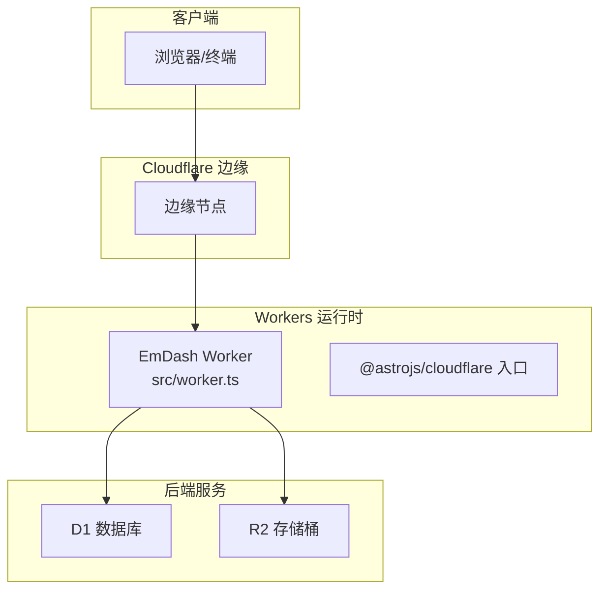
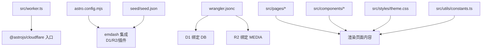
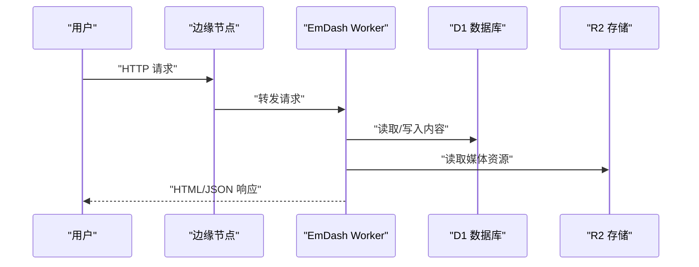
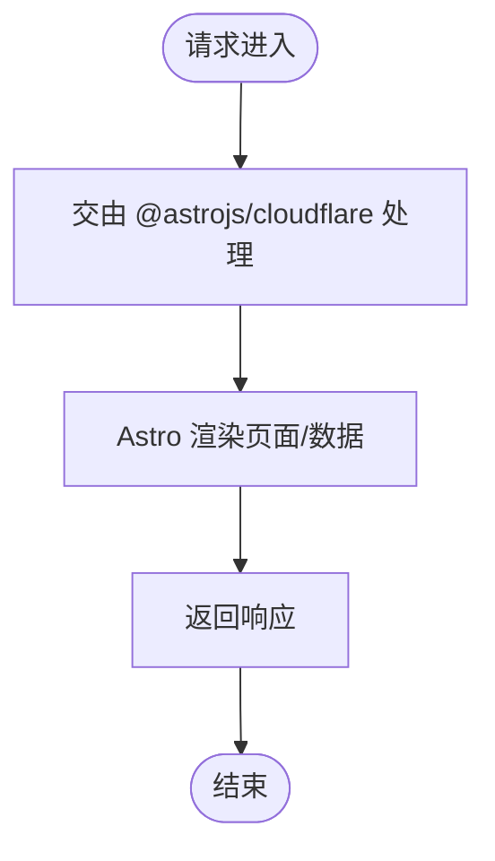
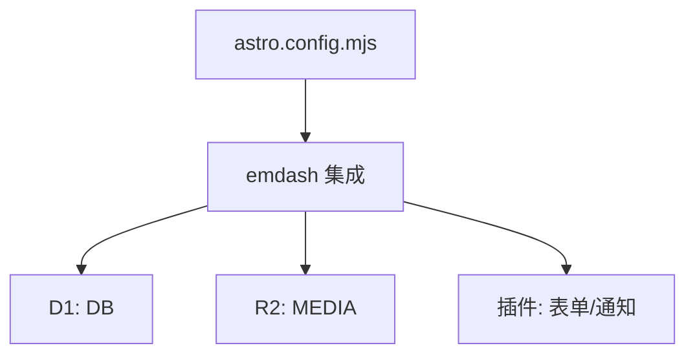
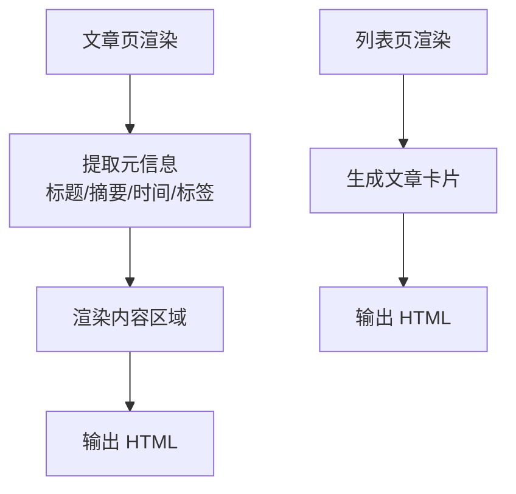
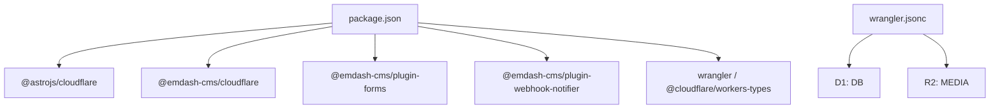

# 监控和日志记录

<cite>
**本文引用的文件**
- [src/worker.ts](file://src/worker.ts)
- [wrangler.jsonc](file://wrangler.jsonc)
- [package.json](file://package.json)
- [astro.config.mjs](file://astro.config.mjs)
- [README.md](file://README.md)
- [.gitignore](file://.gitignore)
- [src/pages/posts/[slug].astro](file://src/pages/posts/[slug].astro)
- [src/pages/posts/index.astro](file://src/pages/posts/index.astro)
- [src/components/PostCard.astro](file://src/components/PostCard.astro)
- [src/styles/theme.css](file://src/styles/theme.css)
- [src/utils/constants.ts](file://src/utils/constants.ts)
- [seed/seed.json](file://seed/seed.json)
</cite>

## 目录
1. [简介](#简介)
2. [项目结构](#项目结构)
3. [核心组件](#核心组件)
4. [架构总览](#架构总览)
5. [详细组件分析](#详细组件分析)
6. [依赖关系分析](#依赖关系分析)
7. [性能考量](#性能考量)
8. [故障排除指南](#故障排除指南)
9. [结论](#结论)
10. [附录](#附录)

## 简介
本文件面向在 Cloudflare Workers 上运行 EmDash 的运维与开发团队，系统性阐述如何利用 Cloudflare 平台提供的内置监控能力与日志记录最佳实践，实现对请求计数、错误率、响应时间、资源使用（内存、执行时间、带宽）的观测与告警，并提供日志格式化、关键事件追踪、错误与性能问题排查方法，以及日志分析与趋势预测思路。

EmDash 使用 Astro 配合 @astrojs/cloudflare 适配器部署于 Cloudflare Workers，数据通过 D1（数据库）与 R2（对象存储）进行持久化，整体基础设施与监控观测点如下图所示。

图表来源
- [src/worker.ts:1-6](file://src/worker.ts#L1-L6)
- [astro.config.mjs:1-44](file://astro.config.mjs#L1-L44)
- [wrangler.jsonc:1-20](file://wrangler.jsonc#L1-L20)

章节来源
- [README.md:1-68](file://README.md#L1-L68)
- [astro.config.mjs:1-44](file://astro.config.mjs#L1-L44)
- [wrangler.jsonc:1-20](file://wrangler.jsonc#L1-L20)

## 项目结构
- 入口与适配器：Worker 入口导出由 @astrojs/cloudflare 提供的服务器处理函数；Astro 通过 cloudflare 适配器输出到 Workers。
- 配置文件：wrangler.jsonc 定义了 Workers 名称、兼容日期、D1 与 R2 绑定；astro.config.mjs 集成 emdash 插件、D1/R2 与沙箱插件。
- 页面与组件：页面组件负责内容渲染与元信息展示；主题样式与常量定义用于统一布局与行为。
- 种子数据：seed.json 包含示例文章与分类标签，便于本地与生产环境快速填充。

图表来源
- [src/worker.ts:1-6](file://src/worker.ts#L1-L6)
- [astro.config.mjs:1-44](file://astro.config.mjs#L1-L44)
- [wrangler.jsonc:1-20](file://wrangler.jsonc#L1-L20)
- [seed/seed.json:315-839](file://seed/seed.json#L315-L839)

章节来源
- [src/worker.ts:1-6](file://src/worker.ts#L1-L6)
- [astro.config.mjs:1-44](file://astro.config.mjs#L1-L44)
- [wrangler.jsonc:1-20](file://wrangler.jsonc#L1-L20)
- [seed/seed.json:315-839](file://seed/seed.json#L315-L839)

## 核心组件
- Worker 入口与路由分发
  - 入口导出由 @astrojs/cloudflare 提供的服务器处理函数，作为 Cloudflare Workers 的请求入口。
  - 该入口负责将请求交由 Astro 渲染管线处理，返回 HTML/JSON 等响应。
- Astro 适配器与集成
  - 通过 cloudflare 适配器输出到 Workers；集成 emdash 插件以启用 D1/R2、表单插件与 Webhook 通知等能力。
  - 沙箱运行器允许安全地加载 Webhook Notifier 等第三方插件。
- 配置与绑定
  - wrangler.jsonc 中声明 D1 与 R2 的绑定名称，确保运行时可通过环境变量访问对应资源。
- 日志与可观测性
  - 项目未直接引入专用日志库或指标上报 SDK；可借助 Cloudflare Workers 内置日志与平台监控能力进行观测。

章节来源
- [src/worker.ts:1-6](file://src/worker.ts#L1-L6)
- [astro.config.mjs:1-44](file://astro.config.mjs#L1-L44)
- [wrangler.jsonc:1-20](file://wrangler.jsonc#L1-L20)

## 架构总览
下图展示了从客户端到 Workers、再到 D1/R2 的完整链路，以及可观测性建议落点：

图表来源
- [src/worker.ts:1-6](file://src/worker.ts#L1-L6)
- [astro.config.mjs:1-44](file://astro.config.mjs#L1-L44)
- [wrangler.jsonc:1-20](file://wrangler.jsonc#L1-L20)

## 详细组件分析

### 组件一：Worker 入口与请求处理
- 职责
  - 将 Cloudflare Workers 的请求交由 @astrojs/cloudflare 的服务器处理函数进行路由与渲染。
- 关键点
  - 默认导出 handler，确保 Workers 可以正确处理 GET/HEAD/OPTIONS 等请求。
  - 与 Astro 渲染管线配合，生成静态/动态页面内容。
- 监控建议
  - 利用平台日志记录请求路径、状态码、响应大小等，结合边缘日志进行聚合分析。
  - 对异常路径或高延迟响应进行标记，辅助定位问题。

图表来源
- [src/worker.ts:1-6](file://src/worker.ts#L1-L6)

章节来源
- [src/worker.ts:1-6](file://src/worker.ts#L1-L6)

### 组件二：Astro 集成与数据层
- 职责
  - 通过 emdash 集成 D1/R2，提供内容管理、表单提交、Webhook 通知等能力。
  - 使用沙箱运行器加载 Webhook Notifier 插件，确保第三方扩展的安全执行。
- 关键点
  - D1 绑定名称为 DB，R2 绑定名称为 MEDIA。
  - 插件体系支持扩展功能，如表单与通知。
- 监控建议
  - 记录 D1/R2 操作耗时与失败次数，识别慢查询与存储异常。
  - 对插件调用（如 Webhook 发送）进行超时与重试统计。

图表来源
- [astro.config.mjs:1-44](file://astro.config.mjs#L1-L44)
- [wrangler.jsonc:1-20](file://wrangler.jsonc#L1-L20)

章节来源
- [astro.config.mjs:1-44](file://astro.config.mjs#L1-L44)
- [wrangler.jsonc:1-20](file://wrangler.jsonc#L1-L20)

### 组件三：页面渲染与元信息
- 职责
  - 文章页展示标题、摘要、发布时间、阅读时长、标签等信息；列表页展示文章卡片与元信息。
- 关键点
  - 阅读时长计算与标签展示逻辑在页面组件中实现。
  - 主题样式与常量定义统一布局与间距。
- 监控建议
  - 记录页面渲染耗时与资源加载时间，识别慢页面与大体积资源。
  - 对 404/重定向等异常路径进行统计，辅助优化用户体验。

图表来源
- [src/pages/posts/[slug].astro:185-250](file://src/pages/posts/[slug].astro#L185-L250)
- [src/pages/posts/index.astro:80-105](file://src/pages/posts/index.astro#L80-L105)
- [src/components/PostCard.astro:82-112](file://src/components/PostCard.astro#L82-L112)
- [src/styles/theme.css:45-108](file://src/styles/theme.css#L45-L108)
- [src/utils/constants.ts:1-9](file://src/utils/constants.ts#L1-L9)

章节来源
- [src/pages/posts/[slug].astro:185-250](file://src/pages/posts/[slug].astro#L185-L250)
- [src/pages/posts/index.astro:80-105](file://src/pages/posts/index.astro#L80-L105)
- [src/components/PostCard.astro:82-112](file://src/components/PostCard.astro#L82-L112)
- [src/styles/theme.css:45-108](file://src/styles/theme.css#L45-L108)
- [src/utils/constants.ts:1-9](file://src/utils/constants.ts#L1-L9)

## 依赖关系分析
- 运行时依赖
  - @astrojs/cloudflare：将 Astro 应用编译并适配到 Cloudflare Workers。
  - @emdash-cms/cloudflare：提供 D1/R2 集成与沙箱运行器。
  - @emdash-cms/plugin-forms、@emdash-cms/plugin-webhook-notifier：内容表单与 Webhook 通知插件。
- 开发依赖
  - @cloudflare/workers-types、wrangler：类型定义与部署工具。
- 部署与配置
  - package.json 中定义了构建与部署脚本，wrangler.jsonc 中声明 D1/R2 绑定。

图表来源
- [package.json:1-33](file://package.json#L1-L33)
- [wrangler.jsonc:1-20](file://wrangler.jsonc#L1-L20)

章节来源
- [package.json:1-33](file://package.json#L1-L33)
- [wrangler.jsonc:1-20](file://wrangler.jsonc#L1-L20)

## 性能考量
- 请求计数与错误率
  - 利用平台日志与边缘日志聚合，按路径、状态码、IP/UA 维度统计请求总量与错误率。
  - 对 5xx 错误进行分级统计，识别热点路径与异常时段。
- 响应时间监控
  - 记录从边缘到 Worker 的处理时延（如通过自定义头或日志字段），并区分静态资源与动态渲染。
  - 对慢查询（D1）与慢存储（R2）进行单独统计，定位瓶颈。
- 资源使用监控
  - 内存使用：关注 Worker 内存峰值与 GC 行为，避免长时间持有大对象。
  - 执行时间：限制单次请求最大执行时长，对超时请求进行告警。
  - 带宽消耗：统计请求体与响应体大小，识别大流量页面与资源。
- 日志与指标
  - 结构化日志：统一字段如请求 ID、路径、状态码、耗时、错误码、用户代理、来源 IP、资源类型等。
  - 指标采集：对请求速率、错误率、P50/P95 响应时间、D1/R2 操作耗时进行采样与上送。

[本节为通用指导，不直接分析具体文件，故无“章节来源”]

## 故障排除指南
- 常见问题与定位步骤
  - 页面 404 或重定向异常：检查路径映射与 Astro 路由配置，确认页面组件是否正确渲染。
  - 动态内容缺失：检查 D1 绑定与查询逻辑，确认 DB 绑定名称与数据存在。
  - 媒体资源加载失败：检查 R2 绑定与对象键名，确认权限与 CORS 设置。
  - 插件异常：检查 Webhook Notifier 插件配置与网络连通性，关注超时与重试。
- 日志与调试
  - 启用结构化日志，记录关键事件（请求开始、D1 查询、R2 读取、渲染完成、错误抛出）。
  - 使用浏览器开发者工具与网络面板，观察请求与响应详情；结合平台日志进行交叉验证。
- 工具与命令
  - 部署与预览：使用构建与部署脚本，确保本地预览无误后再上线。
  - 配置校验：核对 wrangler.jsonc 中的 D1/R2 绑定与名称一致性。
  - 环境变量：确保 .env/.dev.vars 中的密钥与凭据正确注入。

章节来源
- [README.md:47-68](file://README.md#L47-L68)
- [wrangler.jsonc:1-20](file://wrangler.jsonc#L1-L20)
- [.gitignore:1-12](file://.gitignore#L1-L12)

## 结论
通过将 EmDash 与 @astrojs/cloudflare 适配器结合，并利用 D1/R2 的数据与存储能力，可以在 Cloudflare Workers 上实现高效、低成本的博客站点。结合平台日志与边缘观测能力，可以有效覆盖请求计数、错误率、响应时间与资源使用等关键指标，满足日常监控与告警需求。对于更复杂的日志分析与趋势预测，可在现有结构化日志基础上接入外部日志平台或时序数据库，进一步提升可观测性与自动化水平。

[本节为总结性内容，不直接分析具体文件，故无“章节来源”]

## 附录

### A. 日志记录最佳实践
- 结构化字段建议
  - 请求级：请求 ID、路径、方法、状态码、响应大小、用户代理、来源 IP、时区偏移。
  - 处理级：阶段（解析/路由/D1/R2/渲染）、耗时（毫秒）、错误码/消息、堆栈摘要。
  - 资源级：资源类型（HTML/JSON/图片/字体）、命中率、缓存策略。
- 关键事件追踪
  - 请求开始、D1 查询开始/结束、R2 读取开始/结束、渲染开始/结束、错误捕获、响应发送。
- 日志级别
  - info：正常流程与关键事件
  - warn：潜在问题（如慢查询阈值）
  - error：异常与失败（附带上下文与简化堆栈）

[本节为通用指导，不直接分析具体文件，故无“章节来源”]

### B. 告警规则与通知机制
- 规则建议
  - 错误率：近 5 分钟内错误率超过阈值触发告警。
  - 响应时间：P95 响应时间超过阈值触发告警。
  - 资源使用：内存峰值或执行时间超过阈值触发告警。
  - 业务指标：特定页面/接口的异常波动。
- 通知渠道
  - 平台内告警通道（邮件/Slack/Webhook）
  - 自动化修复：限流、降级、回滚策略

[本节为通用指导，不直接分析具体文件，故无“章节来源”]

### C. 日志分析与趋势预测
- 分析方法
  - 按路径、状态码、来源 IP、UA 等维度聚合统计，识别异常模式。
  - 对慢查询与慢资源进行回归分析，定位热点与瓶颈。
- 趋势预测
  - 基于历史数据拟合增长曲线，预测带宽与存储需求。
  - 对流量高峰进行预警，提前扩容或缓存策略调整。

[本节为通用指导，不直接分析具体文件，故无“章节来源”]