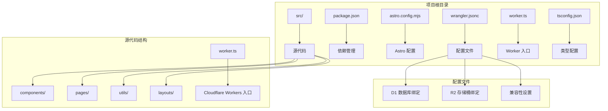
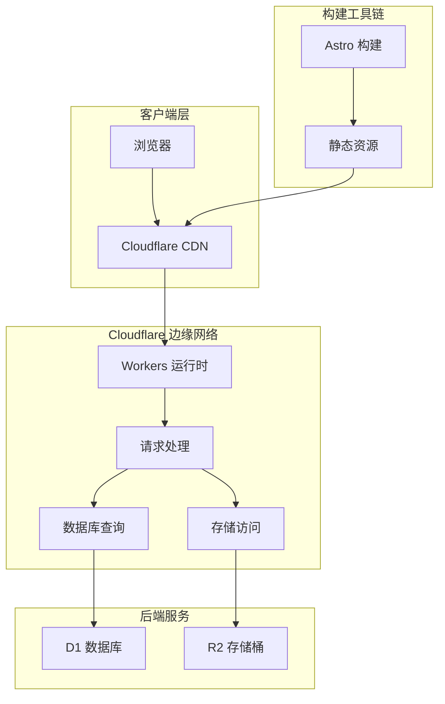
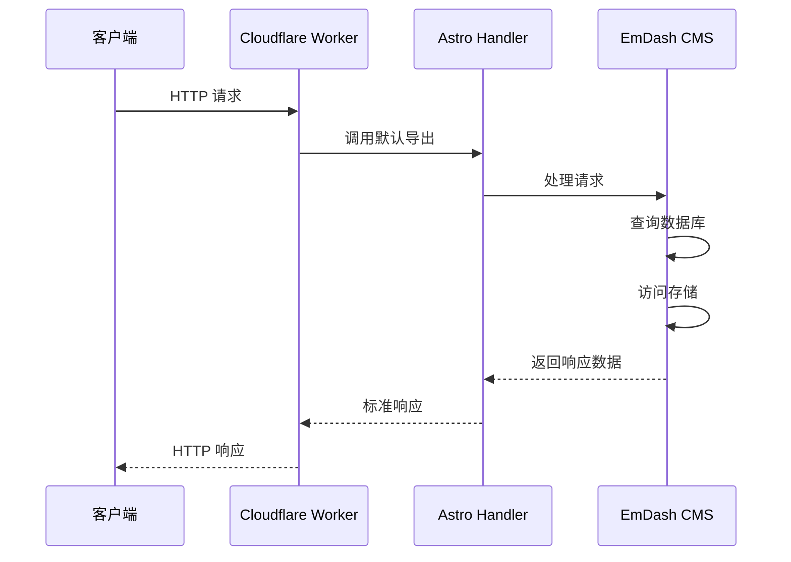
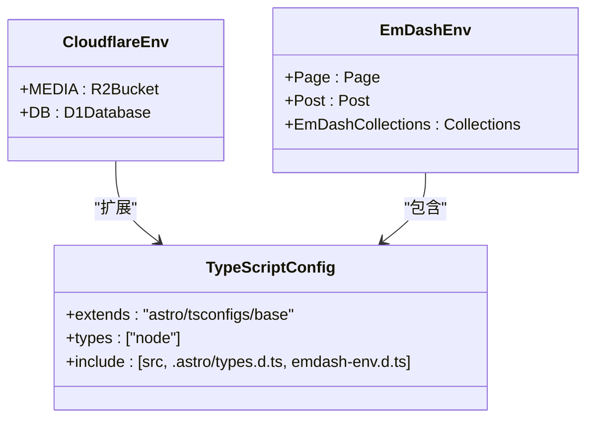

# 部署配置详解

<cite>
**本文档引用的文件**
- [wrangler.jsonc](file://wrangler.jsonc)
- [worker.ts](file://src/worker.ts)
- [package.json](file://package.json)
- [astro.config.mjs](file://astro.config.mjs)
- [worker-configuration.d.ts](file://worker-configuration.d.ts)
- [emdash-env.d.ts](file://emdash-env.d.ts)
- [tsconfig.json](file://tsconfig.json)
- [README.md](file://README.md)
</cite>

## 目录
1. [简介](#简介)
2. [项目结构概览](#项目结构概览)
3. [核心配置组件](#核心配置组件)
4. [架构总览](#架构总览)
5. [详细组件分析](#详细组件分析)
6. [依赖关系分析](#依赖关系分析)
7. [性能考虑](#性能考虑)
8. [故障排除指南](#故障排除指南)
9. [结论](#结论)

## 简介

EmDash 是一个基于 Astro 框架构建的博客系统，专门针对 Cloudflare Workers 平台进行了优化。该项目展示了如何在 Cloudflare 的无服务器环境中部署现代静态站点生成器，充分利用 D1 关系型数据库和 R2 对象存储的优势。

本项目采用 Astro 与 @astrojs/cloudflare 适配器的组合，实现了完整的静态站点生成和动态内容管理功能。通过 Cloudflare Workers 运行时环境，项目能够在全球边缘网络上提供低延迟的内容交付。

## 项目结构概览

项目采用模块化组织结构，主要包含以下关键目录和文件：



**图表来源**
- [wrangler.jsonc:1-20](file://wrangler.jsonc#L1-L20)
- [astro.config.mjs:1-45](file://astro.config.mjs#L1-L45)
- [src/worker.ts:1-6](file://src/worker.ts#L1-L6)

**章节来源**
- [README.md:1-68](file://README.md#L1-L68)
- [wrangler.jsonc:1-20](file://wrangler.jsonc#L1-L20)
- [astro.config.mjs:1-45](file://astro.config.mjs#L1-L45)

## 核心配置组件

### Wrangler 配置文件详解

Wrangler 配置文件是 Cloudflare Workers 部署的核心，定义了应用的基本信息、运行时配置和资源绑定。

#### 基础配置参数

| 参数名 | 值 | 作用说明 |
|--------|-----|----------|
| `$schema` | `"node_modules/wrangler/config-schema.json"` | JSON Schema 定义，提供配置自动补全和验证 |
| `name` | `"emdash"` | 应用名称，在 Cloudflare 控制台中显示 |
| `main` | `"./src/worker.ts"` | 主入口文件路径 |
| `compatibility_date` | `"2026-02-24"` | 兼容性日期，决定可用的 API 版本 |
| `compatibility_flags` | `["nodejs_compat"]` | 启用 Node.js 兼容模式 |

#### 数据库绑定配置

D1 数据库绑定配置使用数组形式定义多个数据库连接：

```mermaid
flowchart TD
A[D1 绑定配置] --> B[数组格式]
B --> C[binding: "DB"]
B --> D[database_name: "emdash"]
C --> E[代码中使用: env.DB]
D --> F[Cloudflare D1 实例]
```

**图表来源**
- [wrangler.jsonc:7-12](file://wrangler.jsonc#L7-L12)

#### 存储桶绑定配置

R2 存储桶配置同样采用数组格式，支持多存储桶配置：

```mermaid
flowchart TD
A[R2 绑定配置] --> B[数组格式]
B --> C[binding: "MEDIA"]
B --> D[bucket_name: "emdash"]
C --> E[代码中使用: env.MEDIA]
D --> F[Cloudflare R2 桶]
```

**图表来源**
- [wrangler.jsonc:13-18](file://wrangler.jsonc#L13-L18)

**章节来源**
- [wrangler.jsonc:1-20](file://wrangler.jsonc#L1-L20)

### Astro 配置集成

Astro 配置文件通过 @astrojs/cloudflare 适配器实现了与 Cloudflare 平台的深度集成：

#### 数据库集成配置

数据库配置通过 d1 工厂函数实现，支持自动会话管理：
- 绑定名称：`DB`
- 会话模式：`auto`（自动管理数据库连接）
- 集成位置：`integrations` 数组中的 emdash 插件配置

#### 存储集成配置

R2 存储配置通过 r2 工厂函数实现：
- 绑定名称：`MEDIA`
- 集成位置：`integrations` 数组中的 emdash 插件配置

**章节来源**
- [astro.config.mjs:1-45](file://astro.config.mjs#L1-L45)

## 架构总览

EmDash 在 Cloudflare Workers 上的部署架构展现了现代无服务器应用的最佳实践：



**图表来源**
- [src/worker.ts:1-6](file://src/worker.ts#L1-L6)
- [astro.config.mjs:1-45](file://astro.config.mjs#L1-L45)

该架构的关键优势包括：
- **全球边缘部署**：利用 Cloudflare 的全球 CDN 网络
- **低延迟响应**：数据在用户附近处理
- **自动扩展**：根据流量自动调整资源
- **成本效益**：按需付费的无服务器模型

## 详细组件分析

### Worker 入口文件实现

Worker 入口文件采用了极简的设计模式，专注于将 Astro 的 Cloudflare 适配器暴露给 Workers 运行时：



**图表来源**
- [src/worker.ts:1-6](file://src/worker.ts#L1-L6)

#### 导入模块分析

入口文件导入了两个关键模块：
1. `@astrojs/cloudflare/entrypoints/server` - 提供 Cloudflare Workers 适配器
2. `@emdash-cms/cloudflare/sandbox` - 提供安全沙箱环境

#### 导出接口设计

- 默认导出：`handler` - 用于处理所有 HTTP 请求
- 命名导出：`PluginBridge` - 为插件系统提供桥接功能

**章节来源**
- [src/worker.ts:1-6](file://src/worker.ts#L1-L6)

### 类型定义系统

项目采用了多层次的类型定义系统，确保开发时的类型安全和智能提示：



**图表来源**
- [worker-configuration.d.ts:5-10](file://worker-configuration.d.ts#L5-L10)
- [emdash-env.d.ts:34-39](file://emdash-env.d.ts#L34-L39)
- [tsconfig.json:1-8](file://tsconfig.json#L1-L8)

#### Cloudflare 环境类型

Cloudflare 环境类型定义了 Workers 运行时可用的全局对象：
- `MEDIA`: R2Bucket 类型，用于对象存储操作
- `DB`: D1Database 类型，用于数据库查询

#### EmDash 内容类型

EmDash 内容类型定义了博客系统的数据结构：
- `Page`: 页面内容模型
- `Post`: 文章内容模型
- `EmDashCollections`: 集合类型定义

**章节来源**
- [worker-configuration.d.ts:1-800](file://worker-configuration.d.ts#L1-L800)
- [emdash-env.d.ts:1-39](file://emdash-env.d.ts#L1-L39)
- [tsconfig.json:1-8](file://tsconfig.json#L1-L8)

### 依赖管理系统

项目使用 pnpm 作为包管理器，配置了完整的开发和生产依赖：

```mermaid
graph LR
subgraph "开发依赖"
A[wrangler] --> B[^4.95.0]
C[@cloudflare/workers-types] --> D[^4.20260305.1]
E[@astrojs/check] --> F[^0.9.7]
end
subgraph "运行时依赖"
G[astro] --> H[^6.3.0]
I[@astrojs/cloudflare] --> J[^13.5.3]
K[emdash] --> L[^0.16.1]
M[@emdash-cms/cloudflare] --> N[^0.16.1]
O[react] --> P[19.2.4]
Q[react-dom] --> R[19.2.4]
end
subgraph "插件依赖"
S[@emdash-cms/plugin-forms] --> T[^0.2.3]
U[@emdash-cms/plugin-webhook-notifier] --> V[^0.2.0]
end
```

**图表来源**
- [package.json:17-32](file://package.json#L17-L32)

#### 核心框架依赖

- **Astro**: ^6.3.0 - 主要的静态站点生成器
- **@astrojs/cloudflare**: ^13.5.3 - Cloudflare Workers 适配器
- **@emdash-cms/cloudflare**: ^0.16.1 - EmDash CMS Cloudflare 集成

#### 开发工具依赖

- **wrangler**: ^4.95.0 - Cloudflare Workers CLI 工具
- **@cloudflare/workers-types**: ^4.20260305.1 - Workers 运行时类型定义
- **@astrojs/check**: ^0.9.7 - TypeScript 类型检查工具

**章节来源**
- [package.json:1-33](file://package.json#L1-L33)

## 依赖关系分析

项目各组件之间的依赖关系展现了清晰的分层架构：

```mermaid
graph TB
subgraph "配置层"
A[wrangler.jsonc] --> B[astro.config.mjs]
B --> C[package.json]
end
subgraph "运行时层"
D[src/worker.ts] --> E[@astrojs/cloudflare/entrypoints/server]
E --> F[Cloudflare Workers 运行时]
end
subgraph "类型系统"
G[worker-configuration.d.ts] --> H[Cloudflare 环境类型]
I[emdash-env.d.ts] --> J[内容类型定义]
K[tsconfig.json] --> L[类型配置]
end
subgraph "构建流程"
M[package.json:deploy] --> N[Astro 构建]
N --> O[Wrangler 部署]
end
A --> D
B --> D
G --> D
I --> D
```

**图表来源**
- [wrangler.jsonc:1-20](file://wrangler.jsonc#L1-L20)
- [astro.config.mjs:1-45](file://astro.config.mjs#L1-L45)
- [src/worker.ts:1-6](file://src/worker.ts#L1-L6)
- [package.json:10-16](file://package.json#L10-L16)

### 关键依赖关系

1. **配置驱动的依赖**: 所有运行时行为都由配置文件驱动
2. **类型安全的依赖**: 通过 TypeScript 类型系统确保运行时安全
3. **渐进式集成**: 从基础配置到高级功能的渐进式集成

**章节来源**
- [wrangler.jsonc:1-20](file://wrangler.jsonc#L1-L20)
- [astro.config.mjs:1-45](file://astro.config.mjs#L1-L45)
- [src/worker.ts:1-6](file://src/worker.ts#L1-L6)

## 性能考虑

### 边缘计算优势

Cloudflare Workers 的边缘计算架构为 EmDash 带来了显著的性能优势：

- **就近处理**: 请求在用户附近的边缘节点处理，减少网络延迟
- **自动缓存**: 利用 Cloudflare 的全球 CDN 缓存静态资源
- **无服务器扩展**: 根据流量自动调整计算资源

### 数据库优化策略

D1 数据库的使用需要考虑以下优化因素：

- **连接池管理**: 使用自动会话管理减少连接开销
- **查询优化**: 合理设计数据库查询以提高响应速度
- **索引策略**: 为常用查询字段建立适当的索引

### 存储优化策略

R2 对象存储的优化包括：

- **对象压缩**: 在上传前对媒体文件进行适当压缩
- **CDN 缓存**: 利用 Cloudflare 的缓存机制加速静态资源访问
- **分块传输**: 对大文件采用分块传输策略

## 故障排除指南

### 常见配置错误及解决方案

#### D1 数据库连接问题

**问题症状**:
- 运行时出现数据库连接错误
- 查询超时或失败

**可能原因**:
1. 数据库绑定名称不匹配
2. 数据库实例未正确创建
3. 权限配置错误

**解决方案**:
1. 验证 `wrangler.jsonc` 中的 `binding` 和 `database_name` 配置
2. 确认 Cloudflare D1 数据库已创建并处于活动状态
3. 检查数据库权限设置

#### R2 存储桶访问问题

**问题症状**:
- 对象存储读写失败
- 权限被拒绝错误

**可能原因**:
1. 存储桶绑定配置错误
2. 存储桶名称不正确
3. 访问权限不足

**解决方案**:
1. 检查 `wrangler.jsonc` 中的 R2 配置
2. 确认存储桶名称与实际创建的桶一致
3. 验证 Cloudflare 账户权限

#### Worker 入口文件问题

**问题症状**:
- Workers 部署失败
- 运行时导入错误

**可能原因**:
1. 入口文件路径错误
2. 导入模块版本不兼容
3. 类型定义缺失

**解决方案**:
1. 验证 `main` 字段指向正确的入口文件
2. 检查依赖版本兼容性
3. 确保类型定义文件存在且正确

### 部署验证方法

#### 本地验证步骤

1. **类型检查**: 运行 `pnpm typecheck` 验证类型定义
2. **构建测试**: 执行 `pnpm build` 确认构建过程正常
3. **预览验证**: 使用 `pnpm preview` 在本地测试应用

#### 生产环境验证

1. **健康检查**: 访问根路径确认应用正常响应
2. **数据库连接**: 测试内容查询功能
3. **存储访问**: 验证媒体文件上传和下载功能

**章节来源**
- [package.json:10-16](file://package.json#L10-L16)
- [wrangler.jsonc:1-20](file://wrangler.jsonc#L1-L20)

## 结论

EmDash 的 Cloudflare 部署配置展现了现代无服务器应用的最佳实践。通过精心设计的配置文件、类型安全的代码架构和优化的性能策略，该项目成功地在 Cloudflare Workers 平台上实现了高性能的博客系统。

关键成功因素包括：

1. **清晰的配置分离**: 将基础设施配置与应用逻辑分离
2. **类型安全保证**: 通过 TypeScript 确保运行时安全
3. **边缘计算优化**: 充分利用 Cloudflare 的全球网络优势
4. **渐进式集成**: 从基础功能到高级特性的逐步实现

这种架构为其他类似项目提供了宝贵的参考，展示了如何在无服务器环境中构建可扩展、高性能的内容管理系统。