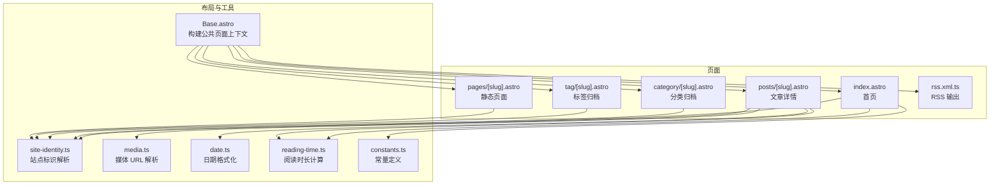
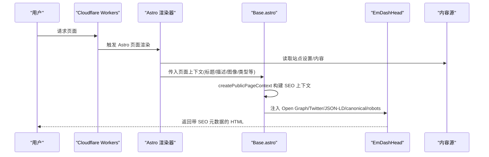
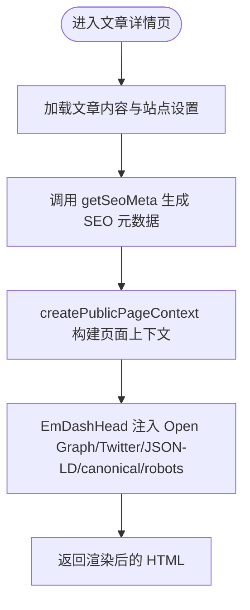
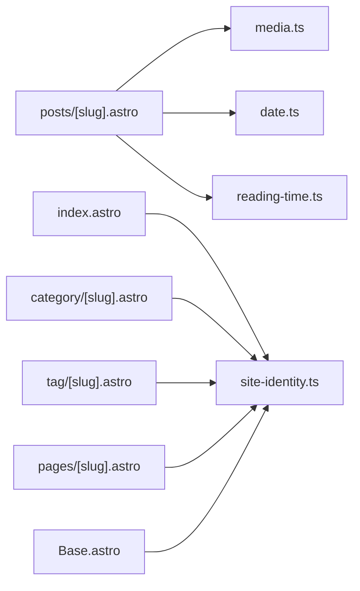

# SEO 和元数据

<cite>
**本文引用的文件**
- [README.md](file://README.md)
- [package.json](file://package.json)
- [src/layouts/Base.astro](file://src/layouts/Base.astro)
- [src/utils/site-identity.ts](file://src/utils/site-identity.ts)
- [src/utils/media.ts](file://src/utils/media.ts)
- [src/utils/date.ts](file://src/utils/date.ts)
- [src/utils/reading-time.ts](file://src/utils/reading-time.ts)
- [src/utils/constants.ts](file://src/utils/constants.ts)
- [src/pages/index.astro](file://src/pages/index.astro)
- [src/pages/posts/[slug].astro](file://src/pages/posts/[slug].astro)
- [src/pages/category/[slug].astro](file://src/pages/category/[slug].astro)
- [src/pages/tag/[slug].astro](file://src/pages/tag/[slug].astro)
- [src/pages/pages/[slug].astro](file://src/pages/pages/[slug].astro)
- [src/pages/rss.xml.ts](file://src/pages/rss.xml.ts)
- [src/components/PostCard.astro](file://src/components/PostCard.astro)
</cite>

## 目录
1. [简介](#简介)
2. [项目结构](#项目结构)
3. [核心组件](#核心组件)
4. [架构总览](#架构总览)
5. [详细组件分析](#详细组件分析)
6. [依赖关系分析](#依赖关系分析)
7. [性能考量](#性能考量)
8. [故障排查指南](#故障排查指南)
9. [结论](#结论)
10. [附录](#附录)

## 简介
本文件系统性梳理 EmDash 博客模板在 Cloudflare Workers 上的 SEO 与元数据管理能力，覆盖自动元数据生成（Open Graph、Twitter Card、JSON-LD）、页面类型最佳实践（标题、描述、关键词）、社交媒体分享（预览图与链接优化）、性能监控与分析工具集成、高级 SEO 技巧（sitemap、robots.txt、加速体验）以及面向内容创作者的策略建议。目标是帮助技术与非技术读者快速理解并正确配置与优化站点的 SEO 表现。

## 项目结构
EmDash 模板采用 Astro + Cloudflare Workers 架构，结合 EmDash CMS 提供的内容模型与渲染能力，形成可部署、可扩展的静态生成博客。关键目录与文件如下：
- 布局与通用逻辑：src/layouts/Base.astro、src/utils/*.ts
- 页面路由：src/pages/index.astro、src/pages/posts/[slug].astro、src/pages/category/[slug].astro、src/pages/tag/[slug].astro、src/pages/pages/[slug].astro、src/pages/rss.xml.ts
- 组件：src/components/PostCard.astro、src/components/ImageRenderer.astro 等
- 项目信息：README.md、package.json

图表来源
- [src/layouts/Base.astro](file://src/layouts/Base.astro)
- [src/utils/site-identity.ts](file://src/utils/site-identity.ts)
- [src/utils/media.ts](file://src/utils/media.ts)
- [src/utils/date.ts](file://src/utils/date.ts)
- [src/utils/reading-time.ts](file://src/utils/reading-time.ts)
- [src/utils/constants.ts](file://src/utils/constants.ts)
- [src/pages/index.astro](file://src/pages/index.astro)
- [src/pages/posts/[slug].astro](file://src/pages/posts/[slug].astro)
- [src/pages/category/[slug].astro](file://src/pages/category/[slug].astro)
- [src/pages/tag/[slug].astro](file://src/pages/tag/[slug].astro)
- [src/pages/pages/[slug].astro](file://src/pages/pages/[slug].astro)
- [src/pages/rss.xml.ts](file://src/pages/rss.xml.ts)

章节来源
- [README.md:1-68](file://README.md#L1-L68)
- [package.json:1-33](file://package.json#L1-L33)

## 核心组件
- 公共布局与元数据注入：Base.astro 负责从站点设置与页面上下文中提取并注入 SEO 元数据，包括标题、描述、Open Graph 图像、canonical、robots 等，并通过 EmDashHead 安全渲染。
- 站点标识解析：site-identity.ts 提供站点标题、副标题与 Logo 的解析与默认值处理。
- 媒体 URL 解析：media.ts 将内容中的图片对象解析为可展示的绝对 URL，支持本地与外部图片。
- 日期与阅读时长：date.ts 与 reading-time.ts 用于文章元信息展示与 SEO 友好的时间戳输出。
- 页面路由与 SEO 数据生成：
  - 首页：基于站点设置生成标题与描述。
  - 文章详情：调用 getSeoMeta 自动生成 Open Graph、Twitter Card、JSON-LD 与 canonical/robots 等。
  - 归档页（分类/标签）：使用术语标签作为标题与描述。
  - 静态页面：直接以页面标题作为 SEO 标题。
  - RSS：生成标准 RSS 2.0，包含标题、描述、链接、更新时间等。

章节来源
- [src/layouts/Base.astro:1-120](file://src/layouts/Base.astro#L1-L120)
- [src/utils/site-identity.ts:1-25](file://src/utils/site-identity.ts#L1-L25)
- [src/utils/media.ts:1-39](file://src/utils/media.ts#L1-L39)
- [src/utils/date.ts:1-18](file://src/utils/date.ts#L1-L18)
- [src/utils/reading-time.ts:1-67](file://src/utils/reading-time.ts#L1-L67)
- [src/pages/index.astro:1-120](file://src/pages/index.astro#L1-L120)
- [src/pages/posts/[slug].astro:1-120](file://src/pages/posts/[slug].astro#L1-L120)
- [src/pages/category/[slug].astro:1-93](file://src/pages/category/[slug].astro#L1-L93)
- [src/pages/tag/[slug].astro:1-95](file://src/pages/tag/[slug].astro#L1-L95)
- [src/pages/pages/[slug].astro:1-109](file://src/pages/pages/[slug].astro#L1-L109)
- [src/pages/rss.xml.ts:1-71](file://src/pages/rss.xml.ts#L1-L71)

## 架构总览
下图展示了从请求到页面渲染再到元数据注入的整体流程，强调 SEO 数据如何在各页面中被统一生成与注入。

图表来源
- [src/layouts/Base.astro:60-90](file://src/layouts/Base.astro#L60-L90)
- [src/pages/posts/[slug].astro:70-125](file://src/pages/posts/[slug].astro#L70-L125)
- [src/pages/index.astro:70-70](file://src/pages/index.astro#L70-L70)
- [src/pages/category/[slug].astro:39-39](file://src/pages/category/[slug].astro#L39-L39)
- [src/pages/tag/[slug].astro:38-41](file://src/pages/tag/[slug].astro#L38-L41)
- [src/pages/pages/[slug].astro:21-24](file://src/pages/pages/[slug].astro#L21-L24)

## 详细组件分析

### 自动元数据生成机制（Open Graph、Twitter Card、JSON-LD）
- 文章详情页通过 getSeoMeta 生成：
  - 标题与描述：优先使用内容字段，回退至站点设置与路径信息。
  - Open Graph 图像：默认使用文章首图，若无则回退至站点设置或默认图。
  - Twitter Card：由 Open Graph 自动派生，亦可按需扩展。
  - JSON-LD：Article 结构化数据，包含作者、发布时间、修改时间、主要图片等。
  - Canonical 与 Robots：根据内容状态与 SEO 需求动态设置。
- 布局层通过 createPublicPageContext 传递 pageType、articleMeta、seo 等字段，最终由 EmDashHead 安全注入到 <head> 中。

图表来源
- [src/pages/posts/[slug].astro:70-125](file://src/pages/posts/[slug].astro#L70-L125)
- [src/layouts/Base.astro:60-90](file://src/layouts/Base.astro#L60-L90)

章节来源
- [src/pages/posts/[slug].astro:70-125](file://src/pages/posts/[slug].astro#L70-L125)
- [src/layouts/Base.astro:60-90](file://src/layouts/Base.astro#L60-L90)

### 页面类型 SEO 最佳实践
- 首页
  - 标题：站点标题；描述：站点副标题。
  - 建议：确保站点设置中的标题与副标题准确反映品牌定位。
- 文章详情页（Article）
  - 标题：优先使用文章标题；描述：使用摘要或正文片段；图像：使用首图。
  - 结构化数据：Article 类型，包含作者、发布时间、修改时间、主要图片。
  - Canonical：指向当前文章 URL；Robots：正常索引。
- 分类归档页
  - 标题：分类名称；描述：该分类下的文章数量与说明。
  - 建议：为每个分类维护清晰的描述，提升点击率与相关性。
- 标签归档页
  - 标题：标签名称；描述：该标签下的文章数量与说明。
  - 建议：控制标签粒度，避免过细导致页面分散。
- 静态页面
  - 标题：页面标题；描述：可选，建议简要说明页面用途。
- RSS
  - 建议：保持标题与描述与站点一致；定期更新 lastBuildDate。

章节来源
- [src/pages/index.astro:70-70](file://src/pages/index.astro#L70-L70)
- [src/pages/posts/[slug].astro:114-125](file://src/pages/posts/[slug].astro#L114-L125)
- [src/pages/category/[slug].astro:39-41](file://src/pages/category/[slug].astro#L39-L41)
- [src/pages/tag/[slug].astro:38-41](file://src/pages/tag/[slug].astro#L38-L41)
- [src/pages/pages/[slug].astro:21-24](file://src/pages/pages/[slug].astro#L21-L24)
- [src/pages/rss.xml.ts:6-54](file://src/pages/rss.xml.ts#L6-L54)

### 社交媒体分享功能实现
- 预览图生成与回退策略
  - 使用文章首图作为 OG 图像；若无，则回退至站点 Logo 或默认图。
  - 外部图片与本地图片均通过 resolveImageUrl 统一解析为绝对 URL。
- 分享链接优化
  - 通过 canonical 指定唯一 URL，避免重复内容。
  - 在文章详情页注入 Twitter Card 相关 meta，便于分享时显示卡片。
- 建议
  - 为不同页面类型准备合适的 OG 图像尺寸与比例，确保在社交平台展示效果一致。
  - 对外部图片进行缓存与压缩，减少首屏加载时间。

章节来源
- [src/pages/posts/[slug].astro:39-76](file://src/pages/posts/[slug].astro#L39-L76)
- [src/utils/media.ts:1-39](file://src/utils/media.ts#L1-L39)
- [src/layouts/Base.astro:60-90](file://src/layouts/Base.astro#L60-L90)

### SEO 性能监控与分析工具集成
- 建议在 Base.astro 的 <head> 中安全地注入第三方分析脚本（如统计、A/B 测试等），确保不会破坏 SEO 元数据。
- 利用 Cloudflare Workers 的日志与边缘缓存策略，结合 Astro 的缓存提示（cacheHint）实现性能可观测性。
- 对于图片与字体资源，建议启用 Cloudflare 的压缩与缓存策略，降低 TTFB 与 FCP。

章节来源
- [src/layouts/Base.astro:80-90](file://src/layouts/Base.astro#L80-L90)
- [src/pages/posts/[slug].astro:37-37](file://src/pages/posts/[slug].astro#L37-L37)

### 高级 SEO 技巧
- sitemap 生成
  - 当前仓库未内置 sitemap 生成器。可在 Cloudflare Worker 层或构建阶段生成 XML 并托管于 /sitemap.xml。
  - 建议包含所有可索引页面（文章、分类、标签、静态页面），并设置 lastmod 与变更频率。
- robots.txt
  - 在根目录放置 robots.txt，允许搜索引擎抓取内容页与 RSS，限制后台路径与调试接口。
- 加速体验优化
  - 启用 Cloudflare 的压缩、缓存与图片优化。
  - 使用骨架屏与占位图提升感知性能；对首屏关键资源进行内联或预加载。
  - 控制第三方脚本的加载时机，避免阻塞主线程。

章节来源
- [src/pages/rss.xml.ts:6-54](file://src/pages/rss.xml.ts#L6-L54)

### 内容创作者 SEO 策略指导
- 标题优化
  - 首页：使用品牌词 + 副标题，突出站点定位。
  - 文章：标题应包含关键词且具吸引力；长度控制在 50-60 字符以内更利于搜索结果展示。
- 描述生成
  - 文章摘要：简洁概括文章要点，包含主关键词；长度控制在 120-160 字符之间。
  - 归档页：明确分类/标签下的内容规模与主题。
- 关键词处理
  - 文章内容与元数据中自然融入关键词，避免堆砌。
  - 标签与分类应语义清晰，避免过度细分。
- 图片与多媒体
  - 为每篇文章提供高质量首图，确保在社交平台展示效果良好。
  - 为图片添加 alt 属性，提升可访问性与 SEO 表现。

章节来源
- [src/pages/index.astro:70-70](file://src/pages/index.astro#L70-L70)
- [src/pages/posts/[slug].astro:114-125](file://src/pages/posts/[slug].astro#L114-L125)
- [src/pages/category/[slug].astro:39-41](file://src/pages/category/[slug].astro#L39-L41)
- [src/pages/tag/[slug].astro:38-41](file://src/pages/tag/[slug].astro#L38-L41)

## 依赖关系分析
- 页面与工具模块的耦合度低，通过布局层统一注入 SEO 数据，提升一致性与可维护性。
- 媒体解析与日期/阅读时长工具被多页面复用，形成高内聚低耦合的设计。

图表来源
- [src/pages/posts/[slug].astro:20-25](file://src/pages/posts/[slug].astro#L20-L25)
- [src/pages/index.astro:11-14](file://src/pages/index.astro#L11-L14)
- [src/pages/category/[slug].astro:11-16](file://src/pages/category/[slug].astro#L11-L16)
- [src/pages/tag/[slug].astro:11-16](file://src/pages/tag/[slug].astro#L11-L16)
- [src/pages/pages/[slug].astro:6-18](file://src/pages/pages/[slug].astro#L6-L18)
- [src/layouts/Base.astro:12-14](file://src/layouts/Base.astro#L12-L14)

章节来源
- [src/pages/posts/[slug].astro:20-25](file://src/pages/posts/[slug].astro#L20-L25)
- [src/pages/index.astro:11-14](file://src/pages/index.astro#L11-L14)
- [src/pages/category/[slug].astro:11-16](file://src/pages/category/[slug].astro#L11-L16)
- [src/pages/tag/[slug].astro:11-16](file://src/pages/tag/[slug].astro#L11-L16)
- [src/pages/pages/[slug].astro:6-18](file://src/pages/pages/[slug].astro#L6-L18)
- [src/layouts/Base.astro:12-14](file://src/layouts/Base.astro#L12-L14)

## 性能考量
- 数据查询优化：批量查询标签与相关文章，减少往返次数，缩短 TTFB。
- 缓存策略：利用 Astro 的 cacheHint 与 Cloudflare 边缘缓存，提升重复访问性能。
- 资源优化：图片与字体启用压缩与缓存；首屏关键资源内联或预加载。
- 渲染性能：合理拆分组件，避免单次渲染过大节点树。

章节来源
- [src/pages/posts/[slug].astro:84-110](file://src/pages/posts/[slug].astro#L84-L110)
- [src/pages/index.astro:19-32](file://src/pages/index.astro#L19-L32)
- [src/utils/constants.ts:7-9](file://src/utils/constants.ts#L7-L9)

## 故障排查指南
- 无法生成 Open Graph 图像
  - 检查文章是否设置首图；确认 resolveImageUrl 能正确解析媒体对象。
  - 若为外部图片，确保 previewUrl 存在且可访问。
- 标准化链接与重复内容
  - 确认文章详情页已注入 canonical；归档页与静态页也应设置。
- RSS 订阅异常
  - 检查 RSS 输出是否包含有效标题、描述与链接；确保缓存头设置合理。
- 标题与描述不符合预期
  - 首页与归档页的标题/描述来源于站点设置与术语标签；检查站点设置与术语数据。

章节来源
- [src/utils/media.ts:1-39](file://src/utils/media.ts#L1-L39)
- [src/pages/posts/[slug].astro:114-125](file://src/pages/posts/[slug].astro#L114-L125)
- [src/pages/rss.xml.ts:6-54](file://src/pages/rss.xml.ts#L6-L54)

## 结论
EmDash 在 Cloudflare Workers 上提供了开箱即用的 SEO 能力：通过统一布局注入元数据、自动化的 Open Graph/Twitter/JSON-LD 生成、完善的 RSS 输出与可扩展的站点设置，能够满足博客类站点的核心 SEO 需求。配合合理的 sitemap、robots.txt 与性能优化策略，可进一步提升搜索引擎表现与用户体验。内容创作者只需关注标题、描述与首图质量，即可获得良好的 SEO 收益。

## 附录
- 项目与运行环境
  - 运行时：Cloudflare Workers
  - 数据库：D1
  - 存储：R2
  - 框架：Astro + @astrojs/cloudflare
- 页面清单
  - 首页、全部文章、文章详情、分类归档、标签归档、搜索、静态页面、404、RSS

章节来源
- [README.md:40-68](file://README.md#L40-L68)
- [package.json:17-27](file://package.json#L17-L27)