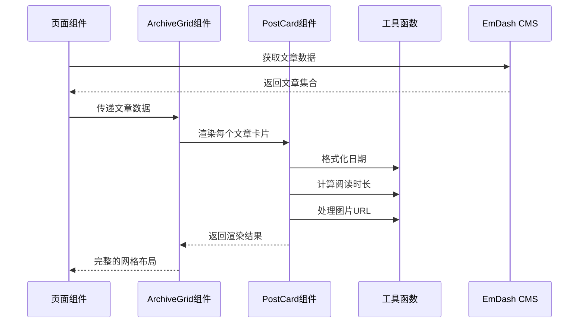
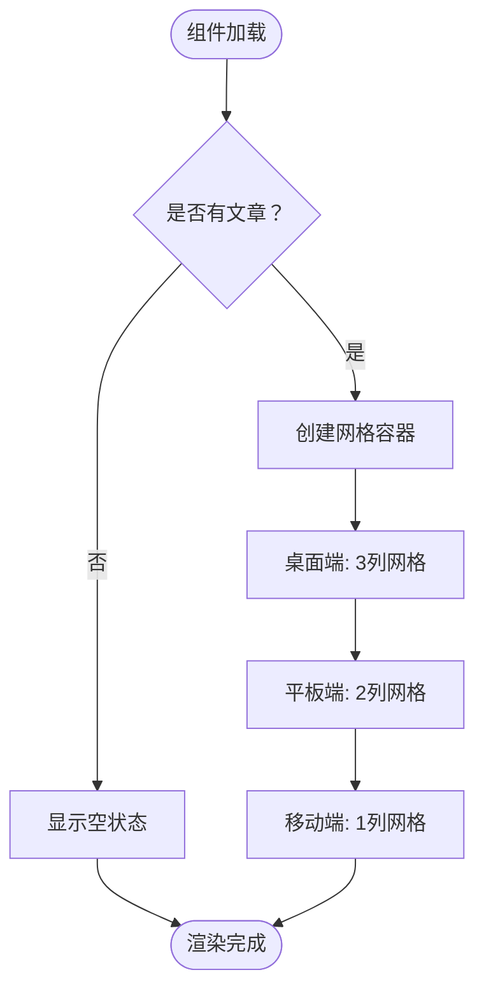
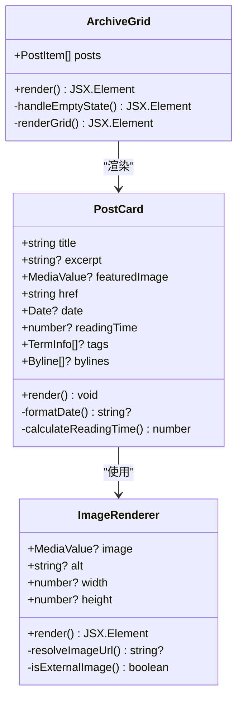
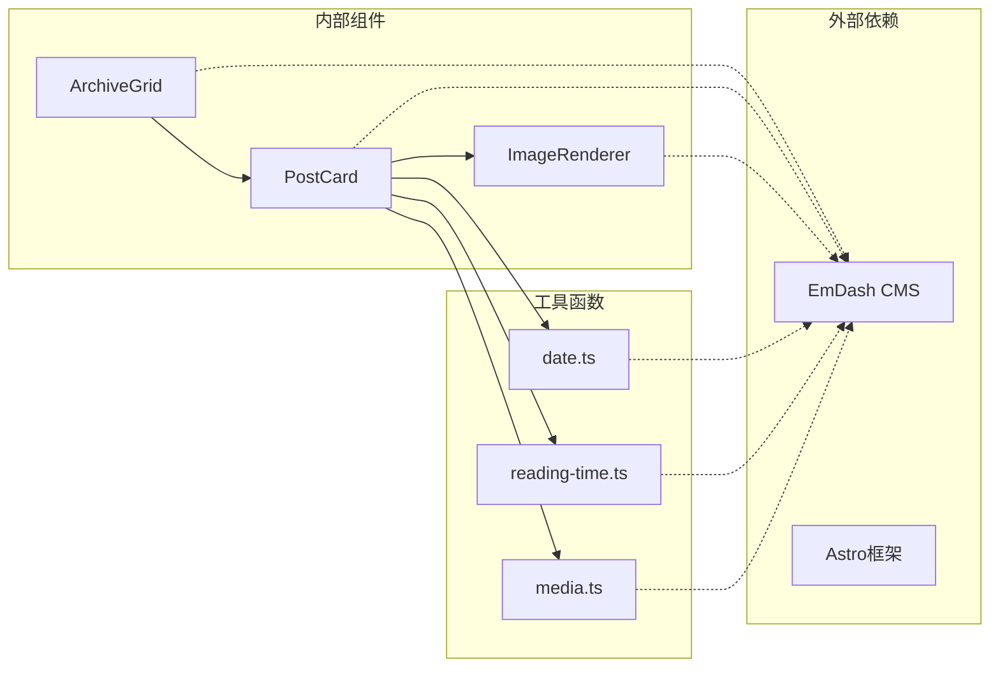

# ArchiveGrid 组件

<cite>
**本文档引用的文件**
- [ArchiveGrid.astro](file://src/components/ArchiveGrid.astro)
- [PostCard.astro](file://src/components/PostCard.astro)
- [ImageRenderer.astro](file://src/components/ImageRenderer.astro)
- [date.ts](file://src/utils/date.ts)
- [reading-time.ts](file://src/utils/reading-time.ts)
- [media.ts](file://src/utils/media.ts)
- [posts/index.astro](file://src/pages/posts/index.astro)
- [category/[slug].astro](file://src/pages/category/[slug].astro)
- [tag/[slug].astro](file://src/pages/tag/[slug].astro)
- [theme.css](file://src/styles/theme.css)
- [Base.astro](file://src/layouts/Base.astro)
</cite>

## 目录
1. [简介](#简介)
2. [项目结构](#项目结构)
3. [核心组件](#核心组件)
4. [架构概览](#架构概览)
5. [详细组件分析](#详细组件分析)
6. [依赖分析](#依赖分析)
7. [性能考虑](#性能考虑)
8. [故障排除指南](#故障排除指南)
9. [结论](#结论)

## 简介

ArchiveGrid 是一个专门用于展示文章归档网格的 Astro 组件，它提供了响应式的网格布局来显示文章列表。该组件支持按分类和标签进行内容筛选，并集成了 EmDash 内容管理系统的时间线数据结构。

该组件的核心功能包括：
- 响应式网格布局（3列桌面端，2列平板端，1列移动端）
- 文章卡片展示（标题、摘要、特色图片、发布时间、阅读时长、标签）
- 与 EmDash 内容管理系统的深度集成
- 支持按分类和标签进行内容筛选
- 优化的性能处理（批量查询术语）

## 项目结构

ArchiveGrid 组件位于项目的组件目录中，与相关的辅助组件共同构成完整的文章归档系统：

```mermaid
graph TB
subgraph "组件层"
ArchiveGrid[ArchiveGrid.astro<br/>主组件]
PostCard[PostCard.astro<br/>文章卡片]
ImageRenderer[ImageRenderer.astro<br/>图片渲染器]
end
subgraph "页面层"
PostsIndex[posts/index.astro<br/>全部文章页]
CategoryPage[category/[slug].astro<br/>分类归档页]
TagPage[tag/[slug].astro<br/>标签归档页]
end
subgraph "工具层"
DateUtils[date.ts<br/>日期格式化]
ReadingTime[reading-time.ts<br/>阅读时长计算]
MediaUtils[media.ts<br/>媒体处理]
end
subgraph "布局层"
BaseLayout[Base.astro<br/>基础布局]
ThemeCSS[theme.css<br/>主题样式]
end
ArchiveGrid --> PostCard
PostCard --> ImageRenderer
ArchiveGrid --> DateUtils
ArchiveGrid --> ReadingTime
ArchiveGrid --> MediaUtils
PostsIndex --> ArchiveGrid
CategoryPage --> ArchiveGrid
TagPage --> ArchiveGrid
PostCard --> BaseLayout
ArchiveGrid --> BaseLayout
BaseLayout --> ThemeCSS
```

**图表来源**
- [ArchiveGrid.astro:1-64](file://src/components/ArchiveGrid.astro#L1-L64)
- [PostCard.astro:1-285](file://src/components/PostCard.astro#L1-L285)
- [posts/index.astro:1-269](file://src/pages/posts/index.astro#L1-L269)

**章节来源**
- [ArchiveGrid.astro:1-64](file://src/components/ArchiveGrid.astro#L1-L64)
- [PostCard.astro:1-285](file://src/components/PostCard.astro#L1-L285)
- [posts/index.astro:1-269](file://src/pages/posts/index.astro#L1-L269)

## 核心组件

### ArchiveGrid 主组件

ArchiveGrid 是一个轻量级的 Astro 组件，主要负责接收文章数据并渲染为网格布局。它通过 PostCard 子组件来展示每个文章的详细信息。

**主要特性：**
- 接收文章数组作为 props
- 动态渲染网格布局
- 处理空状态显示
- 集成响应式设计

**Props 接口定义：**

```typescript
interface TermInfo {
  slug: string;
  label: string;
}

interface Props {
  posts: Array<{
    post: EmDashEntry;
    tags: TermInfo[];
  }>;
}
```

**数据结构说明：**
- `posts`: 文章数组，每个元素包含文章实体和关联的标签信息
- `EmDashEntry`: EmDash 内容管理系统的标准文章数据结构
- `TermInfo`: 分类或标签的元数据信息

**章节来源**
- [ArchiveGrid.astro:6-16](file://src/components/ArchiveGrid.astro#L6-L16)

### PostCard 子组件

PostCard 是 ArchiveGrid 的子组件，负责渲染单个文章卡片的所有信息。

**主要功能：**
- 显示文章标题和摘要
- 渲染特色图片（支持本地和外部图片）
- 显示发布时间和阅读时长
- 展示作者信息和标签
- 提供悬停交互效果

**Props 接口：**

```typescript
interface Props {
  title: string;
  excerpt?: string;
  featuredImage?: MediaValue | string;
  href: string;
  date?: Date;
  readingTime?: number;
  tags?: Array<{ slug: string; label: string }>;
  bylines?: ContentBylineCredit[];
}
```

**章节来源**
- [PostCard.astro:5-14](file://src/components/PostCard.astro#L5-L14)

## 架构概览

ArchiveGrid 组件采用分层架构设计，从页面到组件再到工具函数形成了清晰的数据流：



**图表来源**
- [posts/index.astro:8-28](file://src/pages/posts/index.astro#L8-L28)
- [ArchiveGrid.astro:26-36](file://src/components/ArchiveGrid.astro#L26-L36)
- [PostCard.astro:16-25](file://src/components/PostCard.astro#L16-L25)

## 详细组件分析

### 响应式网格布局

ArchiveGrid 实现了基于 CSS Grid 的响应式布局系统，能够根据屏幕尺寸自动调整列数：



**图表来源**
- [ArchiveGrid.astro:21-39](file://src/components/ArchiveGrid.astro#L21-L39)
- [ArchiveGrid.astro:41-63](file://src/components/ArchiveGrid.astro#L41-L63)

### 数据处理流程

组件的数据处理遵循以下流程：

1. **接收数据**: 从父组件接收预处理的文章数据
2. **批量查询**: 使用 `getTermsForEntries` 批量获取所有文章的标签信息
3. **数据映射**: 将文章数据转换为 ArchiveGrid 所需的格式
4. **渲染输出**: 通过 PostCard 组件渲染每个文章卡片

**章节来源**
- [posts/index.astro:18-28](file://src/pages/posts/index.astro#L18-L28)
- [category/[slug].astro:28-36](file://src/pages/category/[slug].astro#L28-L36)
- [tag/[slug].astro:27-35](file://src/pages/tag/[slug].astro#L27-L35)

### 交互效果实现

组件实现了多种用户交互效果：



**图表来源**
- [PostCard.astro:16-25](file://src/components/PostCard.astro#L16-L25)
- [ImageRenderer.astro:6-15](file://src/components/ImageRenderer.astro#L6-L15)
- [ArchiveGrid.astro:18](file://src/components/ArchiveGrid.astro#L18)

**章节来源**
- [PostCard.astro:114-285](file://src/components/PostCard.astro#L114-L285)
- [ArchiveGrid.astro:41-63](file://src/components/ArchiveGrid.astro#L41-L63)

## 依赖分析

### 组件间依赖关系



**图表来源**
- [ArchiveGrid.astro:2-4](file://src/components/ArchiveGrid.astro#L2-L4)
- [PostCard.astro:2-3](file://src/components/PostCard.astro#L2-L3)
- [ImageRenderer.astro:2-4](file://src/components/ImageRenderer.astro#L2-L4)

### 数据流分析

组件的数据流遵循单向数据流原则：

1. **页面层**: 负责从 EmDash CMS 获取原始数据
2. **处理层**: 对数据进行预处理和批量查询
3. **渲染层**: 将处理后的数据传递给 ArchiveGrid 组件
4. **展示层**: 通过 PostCard 组件展示最终结果

**章节来源**
- [posts/index.astro:8-28](file://src/pages/posts/index.astro#L8-L28)
- [category/[slug].astro:18-36](file://src/pages/category/[slug].astro#L18-L36)
- [tag/[slug].astro:18-35](file://src/pages/tag/[slug].astro#L18-L35)

## 性能考虑

### 批量查询优化

组件采用了关键的性能优化策略：

1. **批量术语查询**: 使用 `getTermsForEntries` 一次性获取所有文章的标签信息，避免 N+1 查询问题
2. **数据库排序**: 在数据库层面进行排序，减少客户端处理开销
3. **缓存机制**: 利用 EmDash 的缓存提示机制提升加载速度

### 响应式设计优化

- **CSS Grid**: 使用原生 CSS Grid 实现高性能的网格布局
- **媒体查询**: 针对不同设备尺寸优化布局
- **图片懒加载**: 通过 ImageRenderer 组件实现智能图片处理

**章节来源**
- [posts/index.astro:18-28](file://src/pages/posts/index.astro#L18-L28)
- [ArchiveGrid.astro:41-63](file://src/components/ArchiveGrid.astro#L41-L63)

## 故障排除指南

### 常见问题及解决方案

1. **文章数据为空**
   - 检查 EmDash CMS 中是否正确配置了文章内容
   - 确认查询参数是否正确设置

2. **图片显示异常**
   - 验证媒体字段格式是否符合 EmDash 规范
   - 检查图片 URL 解析逻辑

3. **布局显示问题**
   - 确认 CSS 变量定义是否正确
   - 检查响应式断点设置

### 调试建议

- 使用浏览器开发者工具检查网络请求
- 验证数据结构是否符合预期
- 检查控制台是否有错误信息

**章节来源**
- [ArchiveGrid.astro:22-24](file://src/components/ArchiveGrid.astro#L22-L24)
- [PostCard.astro:39-51](file://src/components/PostCard.astro#L39-L51)

## 结论

ArchiveGrid 组件是一个设计精良的文章归档展示组件，具有以下特点：

**优势：**
- 清晰的组件层次结构
- 优秀的响应式设计
- 高效的数据处理机制
- 与 EmDash CMS 的深度集成

**适用场景：**
- 博客网站的文章归档页面
- 内容管理系统的内容展示
- 分类和标签过滤的前端界面

**扩展建议：**
- 可以添加分页功能支持大量内容
- 可以增加排序选项（按时间、热度等）
- 可以支持更多内容类型的展示

该组件为构建现代化的内容展示界面提供了良好的基础，通过合理的架构设计和性能优化，能够为用户提供流畅的阅读体验。