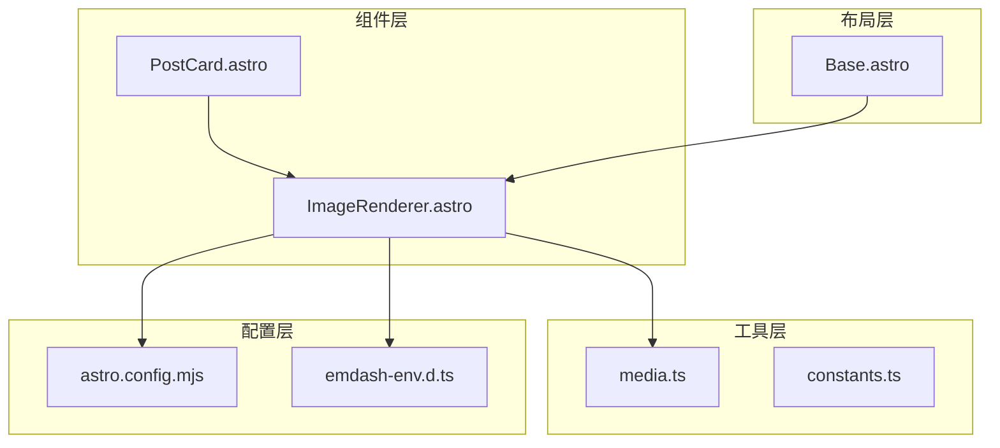
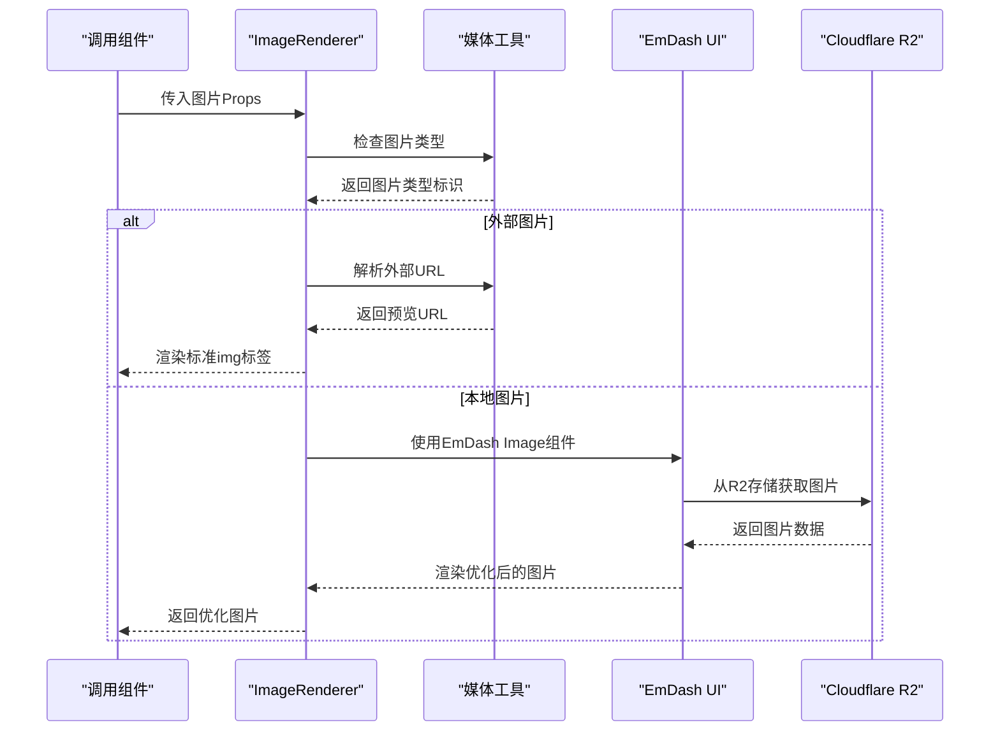
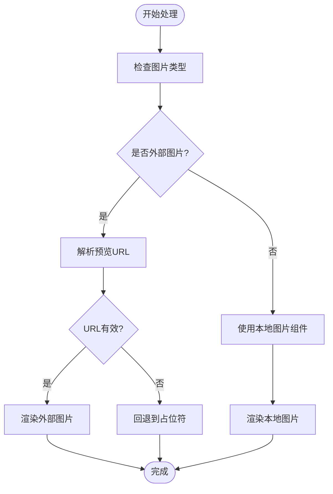
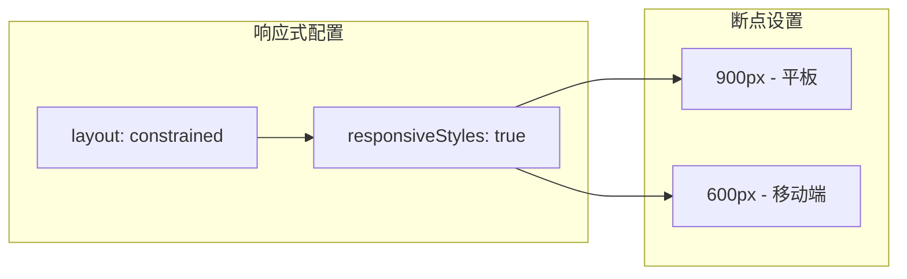
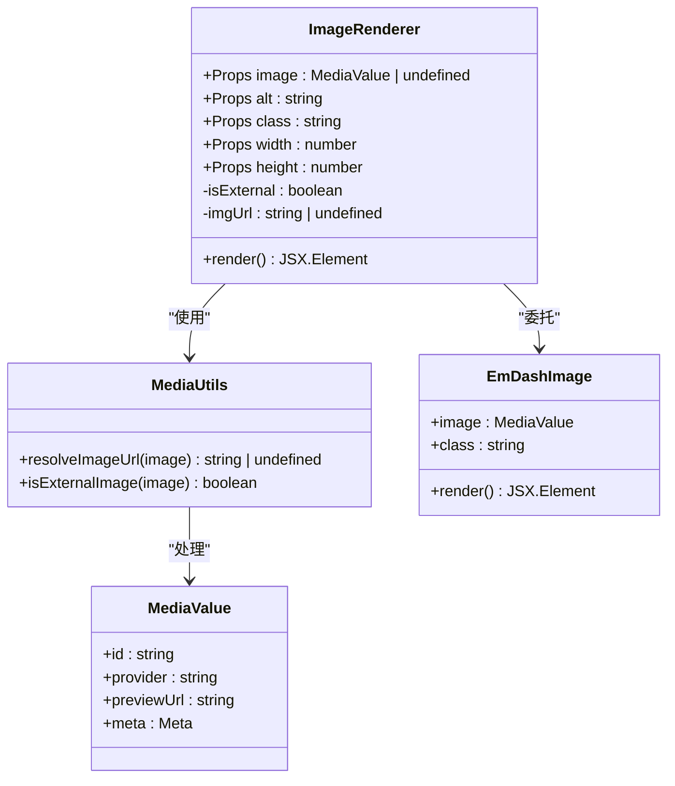
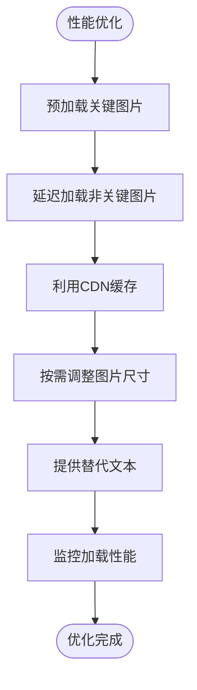

# ImageRenderer 组件

<cite>
**本文档引用的文件**
- [ImageRenderer.astro](file://src/components/ImageRenderer.astro)
- [media.ts](file://src/utils/media.ts)
- [constants.ts](file://src/utils/constants.ts)
- [PostCard.astro](file://src/components/PostCard.astro)
- [index.astro](file://src/pages/index.astro)
- [Base.astro](file://src/layouts/Base.astro)
- [astro.config.mjs](file://astro.config.mjs)
- [emdash-env.d.ts](file://emdash-env.d.ts)
</cite>

## 目录
1. [简介](#简介)
2. [项目结构](#项目结构)
3. [核心组件](#核心组件)
4. [架构概览](#架构概览)
5. [详细组件分析](#详细组件分析)
6. [依赖关系分析](#依赖关系分析)
7. [性能考虑](#性能考虑)
8. [故障排除指南](#故障排除指南)
9. [结论](#结论)

## 简介

ImageRenderer 是 EmDash CMS 生态系统中的一个关键组件，专门用于优化图片渲染和加载体验。该组件提供了智能的图片处理能力，包括响应式图片、懒加载、占位符处理以及与 Cloudflare R2 存储的深度集成。

该组件的设计目标是简化开发者在 Astro 项目中处理媒体资源的复杂性，同时确保最佳的性能表现和用户体验。通过统一的接口，ImageRenderer 能够优雅地处理本地存储和外部托管的图片资源。

## 项目结构

ImageRenderer 组件位于项目的组件目录中，与媒体工具函数和样式系统紧密集成：

**图表来源**
- [ImageRenderer.astro:1-36](file://src/components/ImageRenderer.astro#L1-L36)
- [media.ts:1-39](file://src/utils/media.ts#L1-L39)
- [astro.config.mjs:1-44](file://astro.config.mjs#L1-L44)

**章节来源**
- [ImageRenderer.astro:1-36](file://src/components/ImageRenderer.astro#L1-L36)
- [astro.config.mjs:1-44](file://astro.config.mjs#L1-L44)

## 核心组件

### Props 接口定义

ImageRenderer 组件采用简洁而强大的 Props 接口设计：

| 属性名 | 类型 | 必需 | 描述 | 默认值 |
|--------|------|------|------|--------|
| image | MediaValue \| undefined | 否 | 图片数据对象或 undefined | undefined |
| alt | string | 否 | 图片替代文本，用于可访问性和SEO | "" |
| class | string | 否 | 自定义CSS类名 | undefined |
| width | number | 否 | 图片宽度（像素） | undefined |
| height | number | 否 | 图片高度（像素） | undefined |

### 媒体类型支持

组件支持两种主要的媒体类型：

1. **外部图片**：通过 `provider: "external-url"` 标识，直接使用预览URL
2. **本地图片**：通过 `provider: "local"` 标识，从 Cloudflare R2 存储中获取

**章节来源**
- [ImageRenderer.astro:6-12](file://src/components/ImageRenderer.astro#L6-L12)
- [media.ts:5-30](file://src/utils/media.ts#L5-L30)

## 架构概览

ImageRenderer 采用了分层架构设计，确保了清晰的关注点分离和良好的可维护性：

**图表来源**
- [ImageRenderer.astro:17-35](file://src/components/ImageRenderer.astro#L17-L35)
- [media.ts:5-30](file://src/utils/media.ts#L5-L30)

## 详细组件分析

### 图片处理逻辑

ImageRenderer 的核心功能在于其智能的图片处理机制：

#### 外部图片处理流程

**图表来源**
- [ImageRenderer.astro:17-35](file://src/components/ImageRenderer.astro#L17-L35)
- [media.ts:5-30](file://src/utils/media.ts#L5-L30)

#### 本地图片处理流程

本地图片通过 EmDash UI 组件进行处理，该组件集成了 Cloudflare R2 存储的优化功能：

1. **存储键解析**：从图片元数据中提取 `storageKey`
2. **URL构建**：生成标准的 `/api/media/file/{storageKey}` URL
3. **CDN加速**：自动利用 Cloudflare CDN 进行内容分发
4. **响应式优化**：根据设备分辨率生成合适的图片尺寸

**章节来源**
- [ImageRenderer.astro:17-35](file://src/components/ImageRenderer.astro#L17-L35)
- [media.ts:17-30](file://src/utils/media.ts#L17-L30)

### 响应式图片支持

项目配置中启用了 Astro 的响应式图片功能：

**图表来源**
- [astro.config.mjs:12-15](file://astro.config.mjs#L12-L15)
- [constants.ts:2-5](file://src/utils/constants.ts#L2-L5)

**章节来源**
- [astro.config.mjs:12-15](file://astro.config.mjs#L12-L15)
- [constants.ts:2-5](file://src/utils/constants.ts#L2-L5)

### 可访问性支持

组件内置了完整的可访问性支持：

- **替代文本**：自动处理 `alt` 属性，确保屏幕阅读器可用
- **语义化标记**：使用标准 HTML `` 元素
- **SEO友好**：支持搜索引擎优化的最佳实践

**章节来源**
- [ImageRenderer.astro:24-30](file://src/components/ImageRenderer.astro#L24-L30)

## 依赖关系分析

### 组件间依赖关系

**图表来源**
- [ImageRenderer.astro:2-4](file://src/components/ImageRenderer.astro#L2-L4)
- [media.ts:5-38](file://src/utils/media.ts#L5-L38)

### 外部依赖关系

组件依赖于多个关键的外部系统：

1. **EmDash CMS**：提供媒体管理和UI组件
2. **Cloudflare R2**：提供对象存储服务
3. **Astro Image**：提供响应式图片优化
4. **Cloudflare Workers**：提供边缘计算和CDN加速

**章节来源**
- [astro.config.mjs:3-25](file://astro.config.mjs#L3-L25)
- [ImageRenderer.astro:2-4](file://src/components/ImageRenderer.astro#L2-L4)

## 性能考虑

### 图片加载优化

ImageRenderer 通过以下机制实现高性能的图片加载：

1. **懒加载策略**：外部图片使用浏览器原生懒加载
2. **CDN加速**：所有图片通过 Cloudflare CDN 分发
3. **响应式适配**：根据设备分辨率选择合适的图片尺寸
4. **缓存优化**：利用浏览器和CDN的多级缓存机制

### 内存管理

组件在内存使用方面表现出色：
- 避免不必要的DOM节点创建
- 使用条件渲染减少不必要组件实例化
- 支持图片尺寸预设以避免重排

### 性能最佳实践

## 故障排除指南

### 常见问题及解决方案

#### 图片无法显示

**症状**：图片区域显示为空白或占位符

**可能原因**：
1. 图片URL无效或已过期
2. Cloudflare R2 存储权限问题
3. 网络连接异常

**解决步骤**：
1. 检查图片对象的 `previewUrl` 或 `storageKey`
2. 验证 Cloudflare R2 绑定配置
3. 确认网络连接正常

#### 性能问题

**症状**：页面加载缓慢，图片渲染延迟

**诊断方法**：
1. 检查图片尺寸是否过大
2. 验证CDN缓存状态
3. 监控网络请求时间

**优化建议**：
1. 使用适当的图片尺寸
2. 启用浏览器缓存
3. 考虑使用WebP格式

**章节来源**
- [media.ts:5-30](file://src/utils/media.ts#L5-L30)
- [ImageRenderer.astro:17-18](file://src/components/ImageRenderer.astro#L17-L18)

### 错误处理机制

组件具备完善的错误处理能力：

1. **类型验证**：确保输入参数符合预期格式
2. **空值检查**：优雅处理未提供的图片数据
3. **回退机制**：在图片加载失败时显示占位符
4. **日志记录**：便于调试和问题追踪

## 结论

ImageRenderer 组件代表了现代静态站点生成器中图片处理的最佳实践。通过其精心设计的架构和丰富的功能特性，该组件为开发者提供了：

- **统一的API接口**：简化了不同来源图片的处理
- **高性能的渲染**：结合CDN和响应式优化技术
- **完整的可访问性支持**：确保包容性的用户体验
- **灵活的扩展性**：易于集成新的媒体源和处理逻辑

该组件的成功实施展示了 EmDash CMS 生态系统在构建高性能、可维护的现代Web应用方面的优势。通过合理使用 ImageRenderer，开发者可以专注于内容创作，而不必担心复杂的图片处理技术细节。