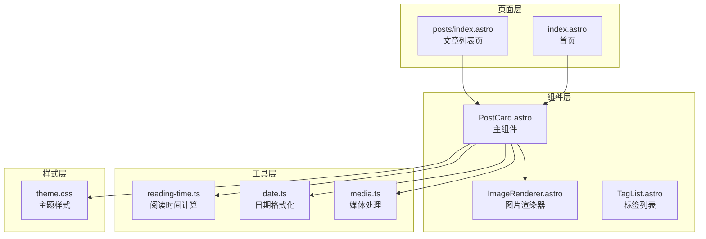
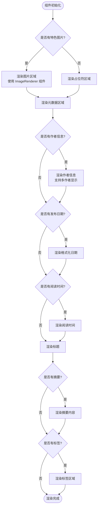
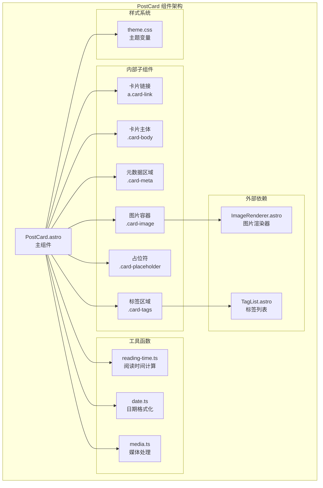
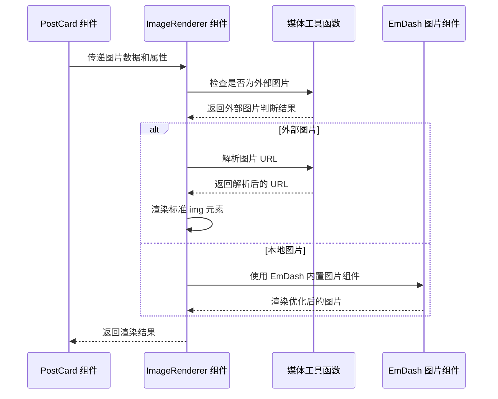
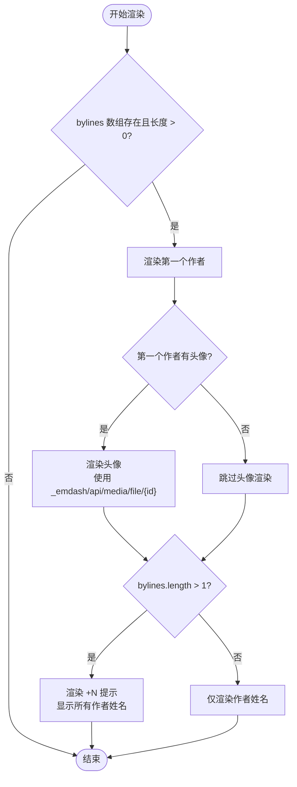
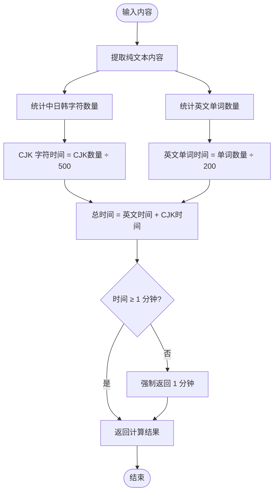
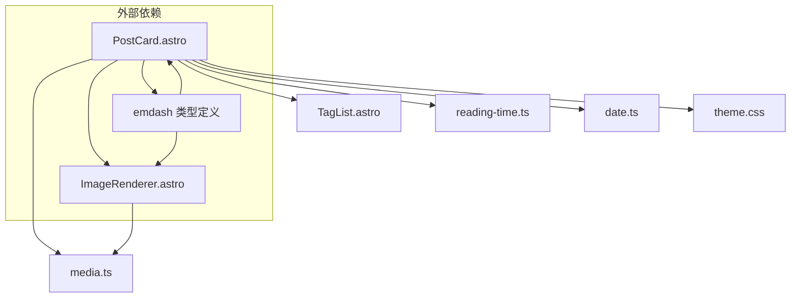
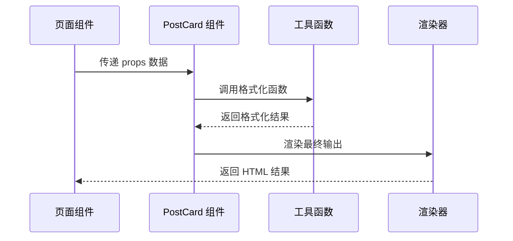

# PostCard 组件

<cite>
**本文档引用的文件**
- [PostCard.astro](file://src/components/PostCard.astro)
- [ImageRenderer.astro](file://src/components/ImageRenderer.astro)
- [TagList.astro](file://src/components/TagList.astro)
- [reading-time.ts](file://src/utils/reading-time.ts)
- [date.ts](file://src/utils/date.ts)
- [media.ts](file://src/utils/media.ts)
- [theme.css](file://src/styles/theme.css)
- [index.astro](file://src/pages/index.astro)
- [posts/index.astro](file://src/pages/posts/index.astro)
</cite>

## 目录
1. [简介](#简介)
2. [项目结构](#项目结构)
3. [核心组件](#核心组件)
4. [架构概览](#架构概览)
5. [详细组件分析](#详细组件分析)
6. [依赖关系分析](#依赖关系分析)
7. [性能考虑](#性能考虑)
8. [故障排除指南](#故障排除指南)
9. [结论](#结论)

## 简介

PostCard 组件是 emdash 博客系统中的核心文章卡片展示组件，专门用于在文章列表中呈现文章的视觉化信息。该组件提供了完整的文章卡片功能，包括标题显示、摘要内容、特色图片展示、发布日期、阅读时间计算、标签分类以及作者信息展示等特性。

组件采用 Astro 静态站点生成框架构建，充分利用了 Astro 的组件化特性和服务端渲染优势，确保了良好的性能表现和 SEO 友好性。

## 项目结构

PostCard 组件位于项目的组件目录中，与相关的工具函数和样式文件共同构成了完整的文章卡片生态系统：

**图表来源**
- [PostCard.astro:1-285](file://src/components/PostCard.astro#L1-L285)
- [ImageRenderer.astro:1-36](file://src/components/ImageRenderer.astro#L1-L36)
- [reading-time.ts:1-67](file://src/utils/reading-time.ts#L1-L67)
- [date.ts:1-18](file://src/utils/date.ts#L1-L18)
- [media.ts:1-39](file://src/utils/media.ts#L1-L39)

**章节来源**
- [PostCard.astro:1-285](file://src/components/PostCard.astro#L1-L285)
- [index.astro:170-182](file://src/pages/index.astro#L170-L182)
- [posts/index.astro:48-100](file://src/pages/posts/index.astro#L48-L100)

## 核心组件

### Props 接口定义

PostCard 组件通过严格的 TypeScript 接口定义了所有可接受的属性：

| 属性名 | 类型 | 必需 | 描述 |
|--------|------|------|------|
| title | string | 是 | 文章标题，用于显示和图片替代文本 |
| excerpt | string | 否 | 文章摘要内容，支持多行文本显示 |
| featuredImage | MediaValue \| string | 否 | 特色图片数据，支持本地和外部图片 |
| href | string | 是 | 文章链接地址，点击卡片跳转到详情页 |
| date | Date | 否 | 发布日期，用于格式化显示 |
| readingTime | number | 否 | 阅读时间（分钟），自动计算或手动指定 |
| tags | Array<{ slug: string; label: string }> | 否 | 文章标签数组，每个标签包含标识符和显示名称 |
| bylines | ContentBylineCredit[] | 否 | 作者信息数组，支持多作者显示 |

### 渲染逻辑

组件采用条件渲染策略，根据传入的数据动态决定显示内容：

**图表来源**
- [PostCard.astro:36-112](file://src/components/PostCard.astro#L36-L112)

**章节来源**
- [PostCard.astro:5-25](file://src/components/PostCard.astro#L5-L25)
- [PostCard.astro:36-112](file://src/components/PostCard.astro#L36-L112)

## 架构概览

PostCard 组件采用了模块化的架构设计，与多个辅助组件和工具函数协同工作：

**图表来源**
- [PostCard.astro:36-112](file://src/components/PostCard.astro#L36-L112)
- [ImageRenderer.astro:1-36](file://src/components/ImageRenderer.astro#L1-L36)
- [TagList.astro:1-46](file://src/components/TagList.astro#L1-L46)

## 详细组件分析

### 图片渲染系统

PostCard 组件集成了 ImageRenderer 组件来处理图片显示，支持本地和外部图片两种模式：

#### 图片类型处理流程

**图表来源**
- [ImageRenderer.astro:17-35](file://src/components/ImageRenderer.astro#L17-L35)
- [media.ts:5-30](file://src/utils/media.ts#L5-L30)

#### 图片懒加载特性

组件通过 ImageRenderer 实现了智能的图片加载策略：
- 支持外部图片的直接 URL 加载
- 本地图片使用 EmDash 优化的图片组件
- 自动处理图片尺寸和比例
- 提供占位符以改善用户体验

**章节来源**
- [PostCard.astro:39-51](file://src/components/PostCard.astro#L39-L51)
- [ImageRenderer.astro:1-36](file://src/components/ImageRenderer.astro#L1-L36)
- [media.ts:1-39](file://src/utils/media.ts#L1-L39)

### 多作者支持系统

PostCard 组件实现了优雅的多作者显示机制：

#### 多作者显示逻辑

**图表来源**
- [PostCard.astro:55-88](file://src/components/PostCard.astro#L55-L88)

#### 交互特性

- **焦点管理**：支持键盘导航和焦点状态
- **工具提示**：鼠标悬停显示完整作者列表
- **可访问性**：提供适当的 ARIA 属性和语义化标记

**章节来源**
- [PostCard.astro:55-88](file://src/components/PostCard.astro#L55-L88)

### 阅读时间计算

组件集成了智能的阅读时间计算系统，支持中英文混合内容：

#### 阅读时间算法

**图表来源**
- [reading-time.ts:51-59](file://src/utils/reading-time.ts#L51-L59)

**章节来源**
- [reading-time.ts:1-67](file://src/utils/reading-time.ts#L1-L67)

### 标签系统

PostCard 组件提供了灵活的标签显示功能：

#### 标签渲染策略

- **数量限制**：最多显示 2 个标签
- **链接功能**：每个标签都是可点击的链接
- **样式统一**：使用圆角胶囊样式，支持悬停效果

**章节来源**
- [PostCard.astro:102-111](file://src/components/PostCard.astro#L102-L111)

### 响应式设计

组件采用移动优先的设计理念，确保在各种设备上都有良好的显示效果：

#### 响应式特性

- **Flexbox 布局**：卡片采用垂直堆叠的 Flexbox 设计
- **自适应间距**：使用 CSS 变量实现统一的间距系统
- **字体缩放**：根据屏幕尺寸调整字体大小
- **图片比例**：保持 16:10 的固定宽高比

**章节来源**
- [PostCard.astro:114-284](file://src/components/PostCard.astro#L114-L284)

## 依赖关系分析

### 组件间依赖

**图表来源**
- [PostCard.astro:2-3](file://src/components/PostCard.astro#L2-L3)
- [ImageRenderer.astro:2-4](file://src/components/ImageRenderer.astro#L2-L4)

### 数据流分析

PostCard 组件的数据流体现了清晰的单向数据绑定原则：

**图表来源**
- [index.astro:170-182](file://src/pages/index.astro#L170-L182)
- [posts/index.astro:48-100](file://src/pages/posts/index.astro#L48-L100)

**章节来源**
- [PostCard.astro:16-25](file://src/components/PostCard.astro#L16-L25)
- [index.astro:170-182](file://src/pages/index.astro#L170-L182)

## 性能考虑

### 渲染优化

PostCard 组件在设计时充分考虑了性能因素：

- **条件渲染**：只在有数据时渲染对应元素
- **懒加载图片**：通过 ImageRenderer 实现图片懒加载
- **CSS 变量**：使用 CSS 变量减少样式计算开销
- **最小化 DOM**：采用扁平化的 DOM 结构

### 缓存策略

- **页面级缓存**：支持 Astro 的内置缓存机制
- **批量查询**：页面组件使用批量查询避免 N+1 问题
- **静态生成**：利用 Astro 的静态生成能力提升加载速度

## 故障排除指南

### 常见问题及解决方案

#### 图片不显示问题

**症状**：特色图片无法正常显示

**可能原因**：
1. 图片数据格式不正确
2. 外部图片 URL 无效
3. 权限问题导致图片无法访问

**解决方法**：
1. 检查 `featuredImage` 数据格式
2. 验证外部图片 URL 可访问性
3. 确认媒体权限设置

#### 作者信息显示异常

**症状**：多作者显示不正确或头像缺失

**可能原因**：
1. `bylines` 数据结构不符合预期
2. 作者头像 ID 不存在
3. API 响应格式变化

**解决方法**：
1. 验证 `ContentBylineCredit` 接口数据
2. 检查头像媒体 ID 是否有效
3. 更新组件以适配新的数据格式

#### 阅读时间计算错误

**症状**：阅读时间显示不准确

**可能原因**：
1. 内容格式不符合 Portable Text 规范
2. 中文字符识别问题
3. 计算逻辑异常

**解决方法**：
1. 确保内容符合 Portable Text 格式
2. 检查 `extractText` 函数的文本提取逻辑
3. 验证 `getReadingTime` 函数的计算结果

**章节来源**
- [PostCard.astro:55-88](file://src/components/PostCard.astro#L55-L88)
- [reading-time.ts:34-59](file://src/utils/reading-time.ts#L34-L59)

## 结论

PostCard 组件是一个设计精良、功能完整的文章卡片展示组件，具有以下特点：

### 优势特性

- **模块化设计**：清晰的组件边界和职责分离
- **类型安全**：完整的 TypeScript 接口定义
- **性能优化**：智能的懒加载和条件渲染
- **可扩展性**：易于定制和扩展的功能
- **可访问性**：良好的键盘导航和屏幕阅读器支持

### 最佳实践建议

1. **数据验证**：始终验证传入的 props 数据
2. **错误处理**：为图片加载失败提供降级方案
3. **性能监控**：关注组件的渲染性能指标
4. **测试覆盖**：为关键功能编写单元测试
5. **文档维护**：保持组件文档与实现同步更新

该组件为 emdash 博客系统提供了坚实的基础，能够满足大多数文章列表展示需求，并为未来的功能扩展奠定了良好的基础。