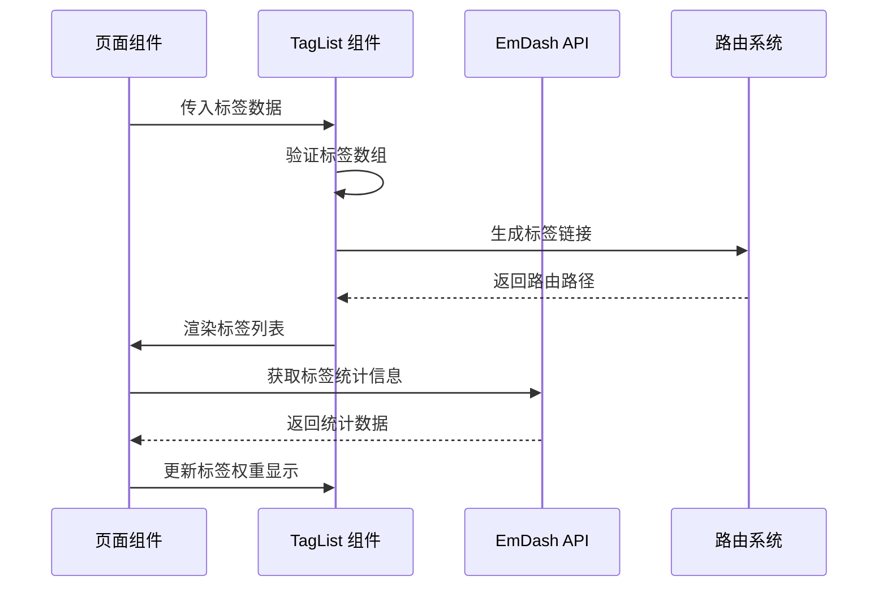
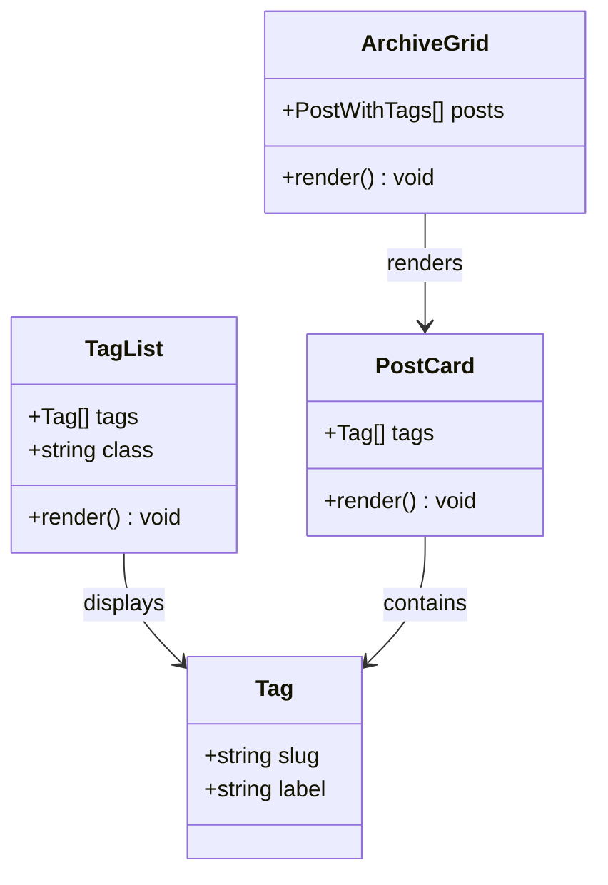
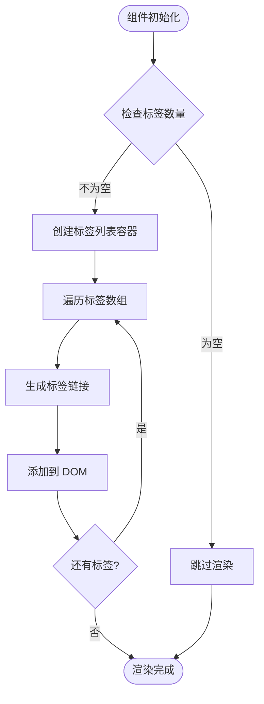
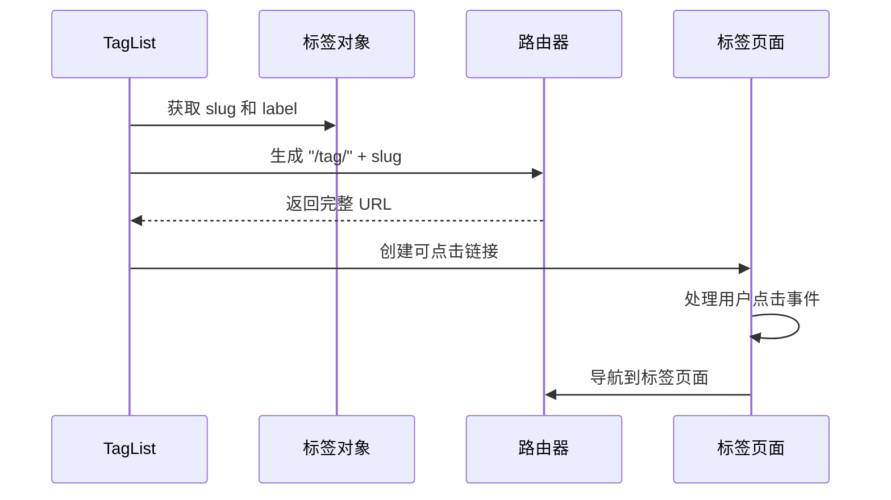
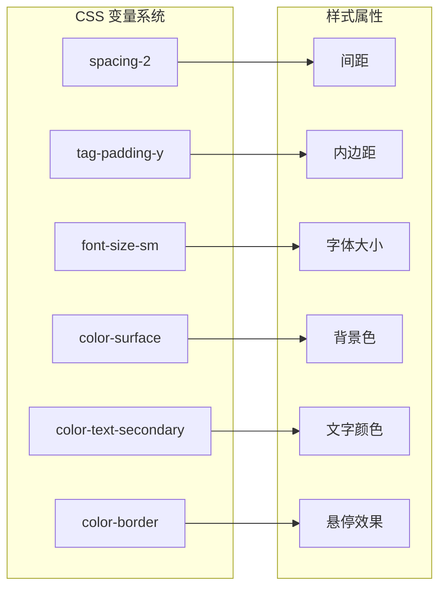
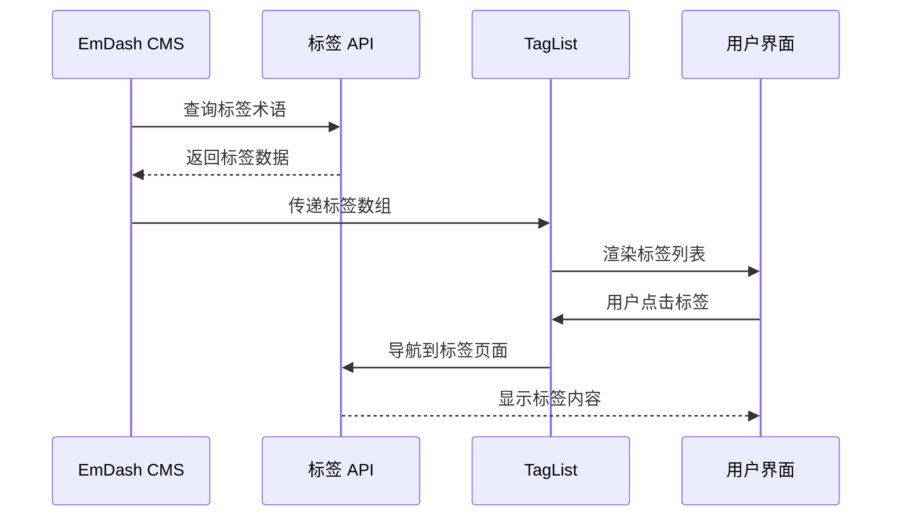
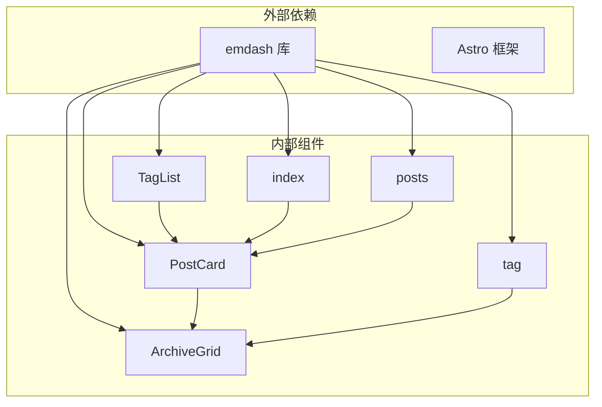
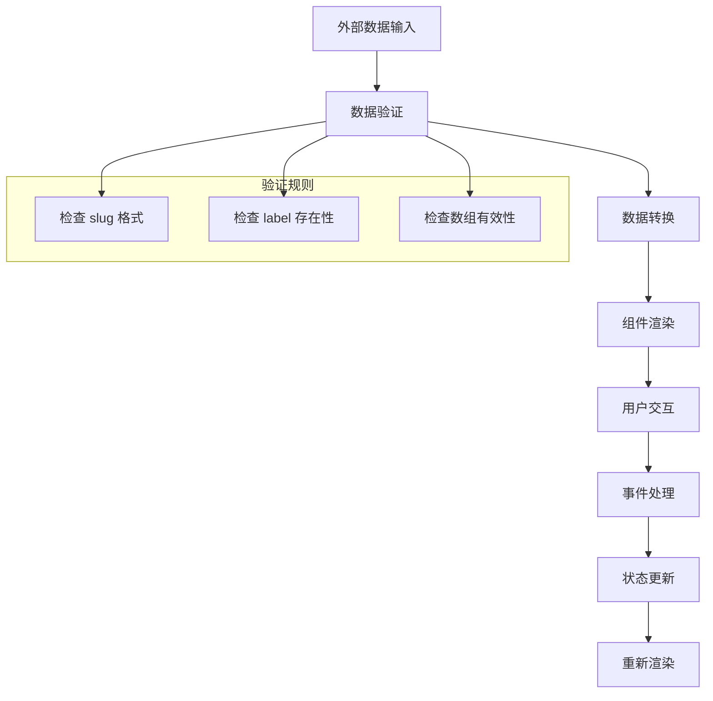

# TagList 组件

<cite>
**本文档引用的文件**
- [TagList.astro](file://src/components/TagList.astro)
- [index.astro](file://src/pages/index.astro)
- [posts/[slug].astro](file://src/pages/posts/[slug].astro)
- [tag/[slug].astro](file://src/pages/tag/[slug].astro)
- [PostCard.astro](file://src/components/PostCard.astro)
- [ArchiveGrid.astro](file://src/components/ArchiveGrid.astro)
- [theme.css](file://src/styles/theme.css)
- [seed.json](file://seed/seed.json)
</cite>

## 目录
1. [简介](#简介)
2. [项目结构](#项目结构)
3. [核心组件](#核心组件)
4. [架构概览](#架构概览)
5. [详细组件分析](#详细组件分析)
6. [依赖关系分析](#依赖关系分析)
7. [性能考虑](#性能考虑)
8. [故障排除指南](#故障排除指南)
9. [结论](#结论)
10. [附录](#附录)

## 简介

TagList 是 EmDash 博客模板中的一个轻量级组件，专门用于展示标签列表。该组件遵循 EmDash 标签系统的标准接口，提供简洁的标签云展示功能，支持标签链接生成、悬停交互效果和自定义样式。

在 EmDash 生态系统中，标签（Tag）是内容分类的重要组成部分，每个标签都有唯一的 slug 和显示标签。TagList 组件通过标准化的数据结构和接口，确保与 EmDash 内容管理系统无缝集成。

## 项目结构

EmDash 博客模板采用基于功能的组织方式，TagList 组件位于组件目录中，与其他页面组件协同工作：

```mermaid
graph TB
subgraph "组件层"
TL[TagList.astro]
PC[PostCard.astro]
AG[ArchiveGrid.astro]
end
subgraph "页面层"
HP[index.astro]
PS[posts/[slug].astro]
TG[tag/[slug].astro]
end
subgraph "样式层"
TC[theme.css]
end
subgraph "配置层"
SD[seed.json]
end
TL --> TC
PC --> TL
AG --> PC
HP --> PC
PS --> PC
TG --> AG
TL --> SD
```

**图表来源**
- [TagList.astro:1-46](file://src/components/TagList.astro#L1-L46)
- [index.astro:1-200](file://src/pages/index.astro#L1-L200)
- [theme.css:1-109](file://src/styles/theme.css#L1-L109)

**章节来源**
- [TagList.astro:1-46](file://src/components/TagList.astro#L1-L46)
- [index.astro:1-200](file://src/pages/index.astro#L1-L200)

## 核心组件

### Props 接口定义

TagList 组件的 Props 接口设计简洁而明确，遵循 EmDash 的类型约定：

```typescript
interface Props {
  tags: Array<{ slug: string; label: string }>;
  class?: string;
}
```

**属性说明：**
- `tags`: 标签数组，每个标签包含 slug 和 label 字段
- `class`: 可选的自定义 CSS 类名

### 数据结构规范

组件期望的标准标签数据结构：
- `slug`: URL 友好的标识符，用于生成标签链接
- `label`: 用户可见的标签名称

### 样式系统集成

TagList 组件完全集成到 EmDash 的 CSS 变量系统中：

```css
.tag-list {
  display: flex;
  flex-wrap: wrap;
  gap: var(--spacing-2);
  list-style: none;
  padding: 0;
  margin: 0;
}

.tag {
  display: inline-block;
  padding: var(--tag-padding-y) var(--spacing-3);
  font-size: var(--font-size-sm);
  color: var(--color-text-secondary);
  background: var(--color-surface);
  border-radius: var(--radius);
  text-decoration: none;
  transition: color var(--transition-fast), background var(--transition-fast);
}
```

**章节来源**
- [TagList.astro:2-5](file://src/components/TagList.astro#L2-L5)
- [TagList.astro:20-45](file://src/components/TagList.astro#L20-L45)
- [theme.css:105-107](file://src/styles/theme.css#L105-L107)

## 架构概览

TagList 组件在整个 EmDash 生态系统中的位置和作用：



**图表来源**
- [TagList.astro:10-18](file://src/components/TagList.astro#L10-L18)
- [index.astro:41-65](file://src/pages/index.astro#L41-L65)

### 组件关系图



**图表来源**
- [TagList.astro:2-5](file://src/components/TagList.astro#L2-L5)
- [PostCard.astro:5-14](file://src/components/PostCard.astro#L5-L14)
- [ArchiveGrid.astro:11-16](file://src/components/ArchiveGrid.astro#L11-L16)

## 详细组件分析

### 标签渲染逻辑

TagList 组件采用条件渲染策略，只有当标签数组非空时才进行渲染：



**图表来源**
- [TagList.astro:10-18](file://src/components/TagList.astro#L10-L18)

### 标签链接生成机制

每个标签都生成对应的路由链接，遵循 EmDash 的命名约定：



**图表来源**
- [TagList.astro:14](file://src/components/TagList.astro#L14)
- [tag/[slug].astro:18-21](file://src/pages/tag/[slug].astro#L18-L21)

### 样式定制系统

TagList 组件支持灵活的样式定制，通过 CSS 变量实现主题化：



**图表来源**
- [TagList.astro:21-44](file://src/components/TagList.astro#L21-L44)
- [theme.css:17-108](file://src/styles/theme.css#L17-L108)

**章节来源**
- [TagList.astro:10-18](file://src/components/TagList.astro#L10-L18)
- [TagList.astro:20-45](file://src/components/TagList.astro#L20-L45)

### 与 EmDash 标签系统的集成

TagList 组件与 EmDash 标签系统深度集成，支持完整的标签生命周期管理：



**图表来源**
- [seed.json:68-115](file://seed/seed.json#L68-L115)
- [tag/[slug].astro:11-16](file://src/pages/tag/[slug].astro#L11-L16)

**章节来源**
- [seed.json:68-115](file://seed/seed.json#L68-L115)
- [tag/[slug].astro:11-16](file://src/pages/tag/[slug].astro#L11-L16)

## 依赖关系分析

### 组件间依赖关系



**图表来源**
- [TagList.astro:1](file://src/components/TagList.astro#L1)
- [PostCard.astro:1](file://src/components/PostCard.astro#L1)
- [ArchiveGrid.astro:1](file://src/components/ArchiveGrid.astro#L1)

### 数据流分析

TagList 组件的数据流遵循单向数据绑定原则：



**图表来源**
- [TagList.astro:7](file://src/components/TagList.astro#L7)
- [TagList.astro:10-18](file://src/components/TagList.astro#L10-L18)

**章节来源**
- [TagList.astro:1-46](file://src/components/TagList.astro#L1-L46)

## 性能考虑

### 渲染优化策略

TagList 组件采用以下性能优化措施：

1. **条件渲染**: 仅在标签存在时渲染组件
2. **批量处理**: 使用 map 方法一次性处理所有标签
3. **CSS 变量**: 利用 CSS 变量减少样式计算开销
4. **最小化 DOM**: 保持简单的 HTML 结构

### 内存管理

组件的内存使用模式：
- 标签数组作为只读数据传递
- 不创建额外的状态或事件监听器
- 依赖外部路由系统处理导航

### 缓存策略

在页面级应用的缓存策略：
- 使用 EmDash 提供的 `cacheHint` 进行缓存控制
- 支持服务端渲染和客户端导航
- 避免重复的标签查询请求

## 故障排除指南

### 常见问题及解决方案

**问题 1: 标签不显示**
- 检查标签数组是否为空
- 验证 slug 和 label 字段是否存在
- 确认 CSS 类名正确应用

**问题 2: 链接无法点击**
- 检查 slug 是否符合 URL 格式
- 验证路由配置是否正确
- 确认目标标签页面存在

**问题 3: 样式异常**
- 检查 CSS 变量是否正确设置
- 验证主题配置文件
- 确认自定义样式未被覆盖

### 调试技巧

1. **开发者工具**: 使用浏览器开发者工具检查元素结构
2. **日志输出**: 在组件中添加调试日志
3. **网络监控**: 检查标签数据的加载情况
4. **样式检查**: 验证 CSS 变量的继承关系

**章节来源**
- [TagList.astro:10-18](file://src/components/TagList.astro#L10-L18)

## 结论

TagList 组件虽然功能相对简单，但在 EmDash 博客模板中发挥着重要作用。它提供了标准化的标签展示方案，与 EmDash 标签系统完美集成，支持灵活的样式定制和良好的用户体验。

组件的设计体现了现代前端开发的最佳实践：简洁的接口设计、清晰的数据流、优雅的样式系统和完善的错误处理。通过与 PostCard、ArchiveGrid 等其他组件的协作，TagList 成为了整个博客系统中不可或缺的一部分。

## 附录

### 使用示例

#### 基本用法
```astro
<TagList tags={[
  { slug: "webdev", label: "网页开发" },
  { slug: "opinion", label: "观点" }
]} />
```

#### 自定义样式
```astro
<TagList 
  tags={tags} 
  class="custom-tag-list" 
/>
```

### 最佳实践

1. **数据验证**: 始终验证标签数据的完整性
2. **性能优化**: 避免不必要的重新渲染
3. **可访问性**: 确保标签链接具有适当的语义
4. **响应式设计**: 利用 CSS 变量实现响应式布局

### 扩展建议

1. **标签权重**: 可以扩展支持标签权重显示
2. **交互效果**: 添加标签点击动画效果
3. **过滤功能**: 实现标签筛选和搜索功能
4. **统计信息**: 显示标签使用频率统计