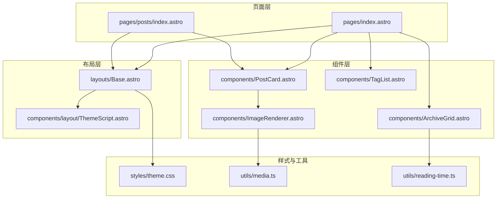
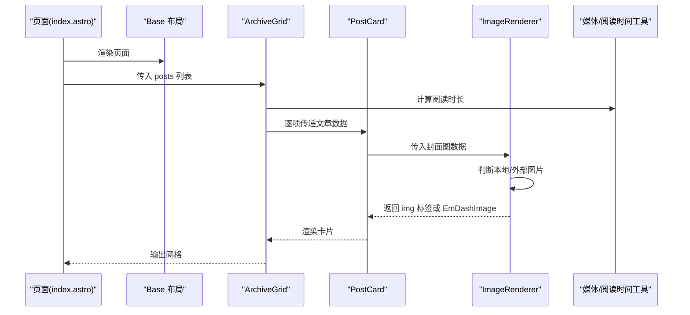
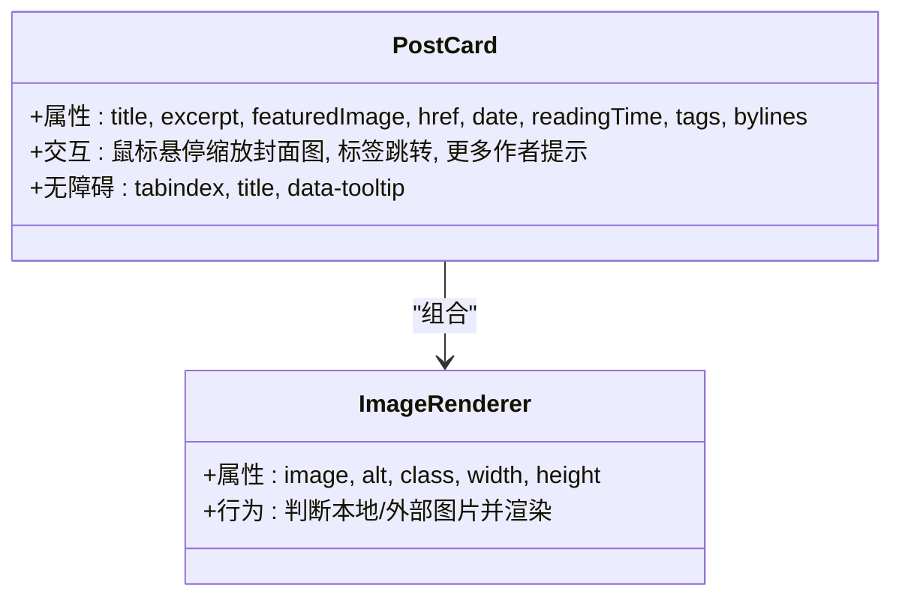
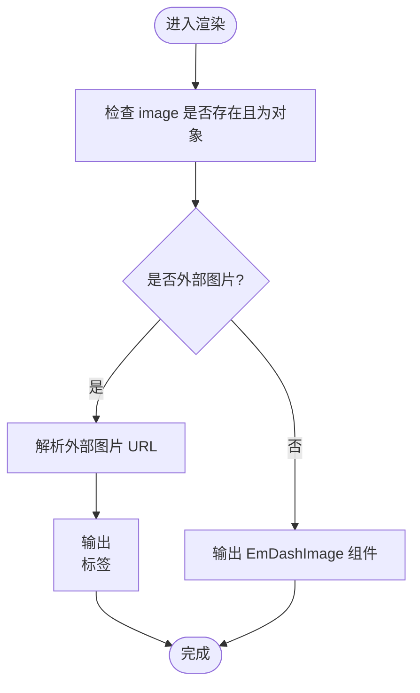
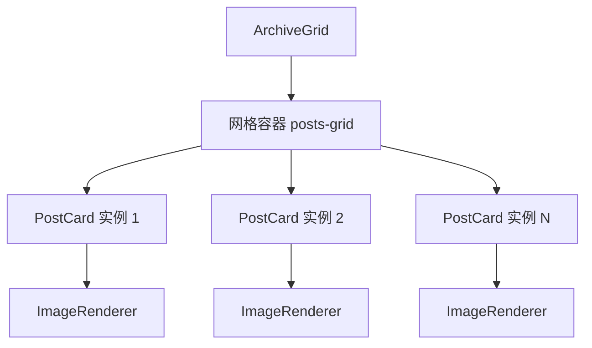
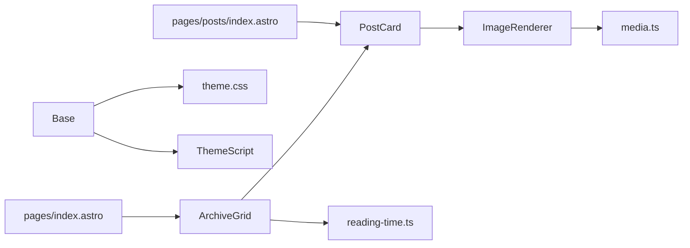

# UI 组件

<cite>
**本文引用的文件**
- [PostCard.astro](file://src/components/PostCard.astro)
- [ImageRenderer.astro](file://src/components/ImageRenderer.astro)
- [ArchiveGrid.astro](file://src/components/ArchiveGrid.astro)
- [TagList.astro](file://src/components/TagList.astro)
- [theme.css](file://src/styles/theme.css)
- [media.ts](file://src/utils/media.ts)
- [reading-time.ts](file://src/utils/reading-time.ts)
- [Base.astro](file://src/layouts/Base.astro)
- [ThemeScript.astro](file://src/components/layout/ThemeScript.astro)
- [index.astro](file://src/pages/index.astro)
- [posts/index.astro](file://src/pages/posts/index.astro)
</cite>

## 目录
1. [简介](#简介)
2. [项目结构](#项目结构)
3. [核心组件](#核心组件)
4. [架构总览](#架构总览)
5. [组件详解](#组件详解)
6. [依赖关系分析](#依赖关系分析)
7. [性能与可访问性](#性能与可访问性)
8. [故障排查](#故障排查)
9. [结论](#结论)
10. [附录：使用示例与最佳实践](#附录使用示例与最佳实践)

## 简介
本文件面向设计师与开发者，系统化梳理 EmDash UI 组件体系，重点覆盖 PostCard、ImageRenderer、ArchiveGrid、TagList 四大核心组件。内容包括：
- 设计理念与实现模式
- 属性、事件、插槽与自定义选项
- 使用示例与最佳实践（含响应式与无障碍）
- 状态管理、动画与过渡
- 样式定制与主题支持
- 组件组合与与站点其他元素的集成方式

## 项目结构
组件系统围绕 Astro 页面与布局组织，核心组件位于 src/components，主题变量与基础样式位于 src/styles，通用工具位于 src/utils。

图表来源
- [index.astro:1-463](file://src/pages/index.astro#L1-L463)
- [posts/index.astro:1-269](file://src/pages/posts/index.astro#L1-L269)
- [Base.astro:1-968](file://src/layouts/Base.astro#L1-L968)
- [ThemeScript.astro:1-84](file://src/components/layout/ThemeScript.astro#L1-L84)
- [PostCard.astro:1-285](file://src/components/PostCard.astro#L1-L285)
- [ImageRenderer.astro:1-36](file://src/components/ImageRenderer.astro#L1-L36)
- [ArchiveGrid.astro:1-64](file://src/components/ArchiveGrid.astro#L1-L64)
- [TagList.astro:1-46](file://src/components/TagList.astro#L1-L46)
- [theme.css:1-109](file://src/styles/theme.css#L1-L109)
- [media.ts:1-39](file://src/utils/media.ts#L1-L39)
- [reading-time.ts:1-67](file://src/utils/reading-time.ts#L1-L67)

章节来源
- [index.astro:1-463](file://src/pages/index.astro#L1-L463)
- [posts/index.astro:1-269](file://src/pages/posts/index.astro#L1-L269)
- [Base.astro:1-968](file://src/layouts/Base.astro#L1-L968)
- [ThemeScript.astro:1-84](file://src/components/layout/ThemeScript.astro#L1-L84)
- [PostCard.astro:1-285](file://src/components/PostCard.astro#L1-L285)
- [ImageRenderer.astro:1-36](file://src/components/ImageRenderer.astro#L1-L36)
- [ArchiveGrid.astro:1-64](file://src/components/ArchiveGrid.astro#L1-L64)
- [TagList.astro:1-46](file://src/components/TagList.astro#L1-L46)
- [theme.css:1-109](file://src/styles/theme.css#L1-L109)
- [media.ts:1-39](file://src/utils/media.ts#L1-L39)
- [reading-time.ts:1-67](file://src/utils/reading-time.ts#L1-L67)

## 核心组件
- PostCard：用于展示文章卡片，包含标题、摘要、封面图、日期、阅读时长、作者署名、标签等信息。
- ImageRenderer：统一处理本地与外部图片渲染，自动选择合适的渲染路径。
- ArchiveGrid：以网格形式渲染文章列表，支持响应式列数。
- TagList：渲染标签列表，支持自定义容器类名。

章节来源
- [PostCard.astro:1-285](file://src/components/PostCard.astro#L1-L285)
- [ImageRenderer.astro:1-36](file://src/components/ImageRenderer.astro#L1-L36)
- [ArchiveGrid.astro:1-64](file://src/components/ArchiveGrid.astro#L1-L64)
- [TagList.astro:1-46](file://src/components/TagList.astro#L1-L46)

## 架构总览
组件间协作关系如下：
- 页面通过 Base 布局注入 SEO、字体、主题脚本与全局样式。
- PostCard 内部组合 ImageRenderer 渲染封面图；ArchiveGrid 聚合多个 PostCard。
- TagList 可独立使用，或由 PostCard/页面内其他组件复用。
- 主题切换由 ThemeScript 控制，配合 Base 中的主题变量与暗色模式逻辑。

图表来源
- [index.astro:1-463](file://src/pages/index.astro#L1-L463)
- [Base.astro:1-968](file://src/layouts/Base.astro#L1-L968)
- [ArchiveGrid.astro:1-64](file://src/components/ArchiveGrid.astro#L1-L64)
- [PostCard.astro:1-285](file://src/components/PostCard.astro#L1-L285)
- [ImageRenderer.astro:1-36](file://src/components/ImageRenderer.astro#L1-L36)
- [reading-time.ts:1-67](file://src/utils/reading-time.ts#L1-L67)
- [media.ts:1-39](file://src/utils/media.ts#L1-L39)

## 组件详解

### PostCard 组件
- 功能定位：文章卡片，承载标题、摘要、封面图、日期、阅读时长、作者署名、标签等信息。
- 关键特性：
  - 封面图懒加载与缩放动效
  - 多作者署名的“更多”提示与无障碍焦点
  - 标签最多显示两个，其余通过链接跳转到标签页
  - 日期格式化与阅读时长计算
- 属性
  - title: string（必填）
  - excerpt?: string（可选）
  - featuredImage?: MediaValue | string（可选）
  - href: string（必填）
  - date?: Date（可选）
  - readingTime?: number（可选）
  - tags?: Array<{ slug: string; label: string }>（可选）
  - bylines?: ContentBylineCredit[]（可选）
- 事件与交互
  - 鼠标悬停：封面图放大、标题颜色变化
  - 标签点击：跳转至标签页
  - “更多作者”：通过 data-tooltip 提示，支持键盘焦点
- 插槽与自定义
  - 无具名/命名插槽；可通过父级传入自定义 class 或在父级样式中覆盖
- 样式与主题
  - 使用主题变量：--color-*、--font-size-*、--spacing-*、--radius-*、--transition-* 等
  - 暗色模式下颜色变量自动切换
- 无障碍
  - “更多作者”按钮具备 tabindex 与 title，支持键盘聚焦与屏幕阅读器读取
  - 图片 alt 来源于标题，确保语义清晰

章节来源
- [PostCard.astro:1-285](file://src/components/PostCard.astro#L1-L285)
- [theme.css:1-109](file://src/styles/theme.css#L1-L109)
- [Base.astro:420-449](file://src/layouts/Base.astro#L420-L449)

#### 类图（组件关系）

图表来源
- [PostCard.astro:1-285](file://src/components/PostCard.astro#L1-L285)
- [ImageRenderer.astro:1-36](file://src/components/ImageRenderer.astro#L1-L36)

### ImageRenderer 组件
- 功能定位：统一处理媒体资源渲染，兼容本地与外部图片。
- 关键特性：
  - 自动识别外部图片（provider: "external-url"）与本地图片（id/storageKey）
  - 外部图片直接使用解析后的 URL；本地图片交由 EmDashImage 渲染
- 属性
  - image: MediaValue | undefined（必填）
  - alt?: string（可选）
  - class?: string（可选）
  - width?: number（可选）
  - height?: number（可选）
- 工具函数
  - isExternalImage(image): 判断是否外部图片
  - resolveImageUrl(image): 解析外部图片 URL 或本地存储键
- 无障碍
  - 透传 alt，确保图片语义正确

章节来源
- [ImageRenderer.astro:1-36](file://src/components/ImageRenderer.astro#L1-L36)
- [media.ts:1-39](file://src/utils/media.ts#L1-L39)

#### 流程图（图片渲染决策）

图表来源
- [ImageRenderer.astro:1-36](file://src/components/ImageRenderer.astro#L1-L36)
- [media.ts:1-39](file://src/utils/media.ts#L1-L39)

### ArchiveGrid 组件
- 功能定位：以网格形式渲染文章集合，支持响应式列数。
- 属性
  - posts: Array<{ post: EmDashEntry; tags: TermInfo[] }>
- 行为
  - 无文章时显示“暂无文章”提示
  - 否则按 3 列（桌面）、2 列（平板）、1 列（手机）布局
  - 将每条文章数据映射为 PostCard 子项
- 与阅读时长的关系
  - 通过工具函数计算阅读时长并传给子组件

章节来源
- [ArchiveGrid.astro:1-64](file://src/components/ArchiveGrid.astro#L1-L64)
- [reading-time.ts:1-67](file://src/utils/reading-time.ts#L1-L67)

#### 结构图（网格布局）

图表来源
- [ArchiveGrid.astro:1-64](file://src/components/ArchiveGrid.astro#L1-L64)
- [PostCard.astro:1-285](file://src/components/PostCard.astro#L1-L285)
- [ImageRenderer.astro:1-36](file://src/components/ImageRenderer.astro#L1-L36)

### TagList 组件
- 功能定位：渲染标签列表，支持自定义容器类名。
- 属性
  - tags: Array<{ slug: string; label: string }>
  - class?: string（可选）
- 行为
  - 无标签时不渲染
  - 否则输出带链接的标签列表，点击跳转到对应标签页
- 样式
  - 使用主题变量控制颜色、圆角、间距与过渡

章节来源
- [TagList.astro:1-46](file://src/components/TagList.astro#L1-L46)
- [theme.css:1-109](file://src/styles/theme.css#L1-L109)

## 依赖关系分析
- 组件依赖
  - PostCard 依赖 ImageRenderer 进行封面图渲染
  - ArchiveGrid 依赖 PostCard 与 reading-time 工具
  - ImageRenderer 依赖 media 工具进行图片类型判断与 URL 解析
- 布局与主题
  - Base 布局提供全局样式、主题变量与暗色模式逻辑
  - ThemeScript 在首屏注入主题，避免闪烁
  - theme.css 提供默认变量与重写入口

图表来源
- [ImageRenderer.astro:1-36](file://src/components/ImageRenderer.astro#L1-L36)
- [media.ts:1-39](file://src/utils/media.ts#L1-L39)
- [PostCard.astro:1-285](file://src/components/PostCard.astro#L1-L285)
- [ArchiveGrid.astro:1-64](file://src/components/ArchiveGrid.astro#L1-L64)
- [reading-time.ts:1-67](file://src/utils/reading-time.ts#L1-L67)
- [Base.astro:1-968](file://src/layouts/Base.astro#L1-L968)
- [ThemeScript.astro:1-84](file://src/components/layout/ThemeScript.astro#L1-L84)
- [theme.css:1-109](file://src/styles/theme.css#L1-L109)
- [index.astro:1-463](file://src/pages/index.astro#L1-L463)
- [posts/index.astro:1-269](file://src/pages/posts/index.astro#L1-L269)

## 性能与可访问性
- 性能
  - ArchiveGrid 采用数据库侧排序与分页，减少前端开销
  - ImageRenderer 对外部图片直出 img，避免不必要的组件开销
  - PostCard 的封面图缩放使用 CSS 过渡，避免重排抖动
- 可访问性
  - PostCard 的“更多作者”按钮具备 tabindex、title 与 data-tooltip，支持键盘聚焦
  - 图片 alt 来自标题，保证语义清晰
  - 主题切换使用 cookie 与系统偏好，避免闪烁

章节来源
- [ArchiveGrid.astro:1-64](file://src/components/ArchiveGrid.astro#L1-L64)
- [ImageRenderer.astro:1-36](file://src/components/ImageRenderer.astro#L1-L36)
- [PostCard.astro:1-285](file://src/components/PostCard.astro#L1-L285)
- [ThemeScript.astro:1-84](file://src/components/layout/ThemeScript.astro#L1-L84)

## 故障排查
- 图片不显示
  - 检查 image 是否为有效对象，外部图片需提供 provider 与 previewUrl
  - 本地图片需提供 id 或 meta.storageKey
- 阅读时长异常
  - 确认 content 为 Portable Text 数组，且包含 block/span 文本
- 标签链接无效
  - 确认 tags 数据包含 slug 与 label 字段
- 主题切换无效
  - 检查 Cookie 中 theme 键值，确认 ThemeScript 已注入

章节来源
- [media.ts:1-39](file://src/utils/media.ts#L1-L39)
- [reading-time.ts:1-67](file://src/utils/reading-time.ts#L1-L67)
- [ThemeScript.astro:1-84](file://src/components/layout/ThemeScript.astro#L1-L84)

## 结论
EmDash UI 组件体系以简洁、可组合为核心，通过统一的媒体处理与主题变量，实现了良好的一致性与可定制性。PostCard、ImageRenderer、ArchiveGrid、TagList 各司其职，既可独立使用，也可在页面中灵活组合，满足从首页到归档页的多种场景需求。

## 附录：使用示例与最佳实践

### 使用示例
- 在首页渲染文章网格
  - 通过 ArchiveGrid 接收 posts 列表，内部自动映射为 PostCard
  - 参考路径：[index.astro:160-184](file://src/pages/index.astro#L160-L184)
- 在文章详情页渲染标签
  - 使用 TagList 传入 tags 数组
  - 参考路径：[posts/index.astro:89-99](file://src/pages/posts/index.astro#L89-L99)
- 自定义封面图渲染
  - 使用 ImageRenderer 传入 image、alt、尺寸等参数
  - 参考路径：[PostCard.astro:39-51](file://src/components/PostCard.astro#L39-L51)

### 最佳实践
- 响应式设计
  - 使用 CSS Grid 与媒体查询，确保在不同设备上合理布局
  - 参考路径：[ArchiveGrid.astro:52-62](file://src/components/ArchiveGrid.astro#L52-L62)
- 无障碍访问
  - 为图片提供 alt；为交互元素提供可聚焦能力与提示
  - 参考路径：[PostCard.astro:60-86](file://src/components/PostCard.astro#L60-L86)
- 主题与样式定制
  - 通过 theme.css 覆盖主题变量，实现品牌化定制
  - 参考路径：[theme.css:17-108](file://src/styles/theme.css#L17-L108)
- 组件组合
  - PostCard 内部组合 ImageRenderer，ArchiveGrid 组合多个 PostCard
  - 参考路径：[PostCard.astro:39-51](file://src/components/PostCard.astro#L39-L51), [ArchiveGrid.astro:26-37](file://src/components/ArchiveGrid.astro#L26-L37)