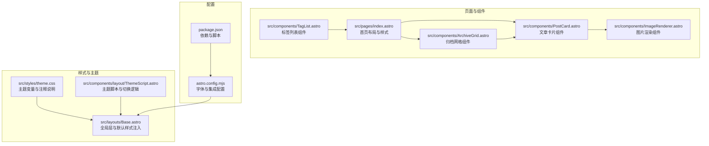
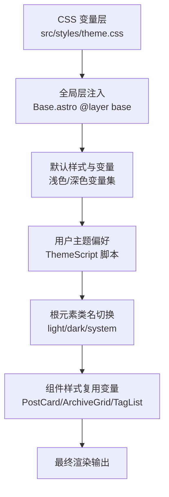
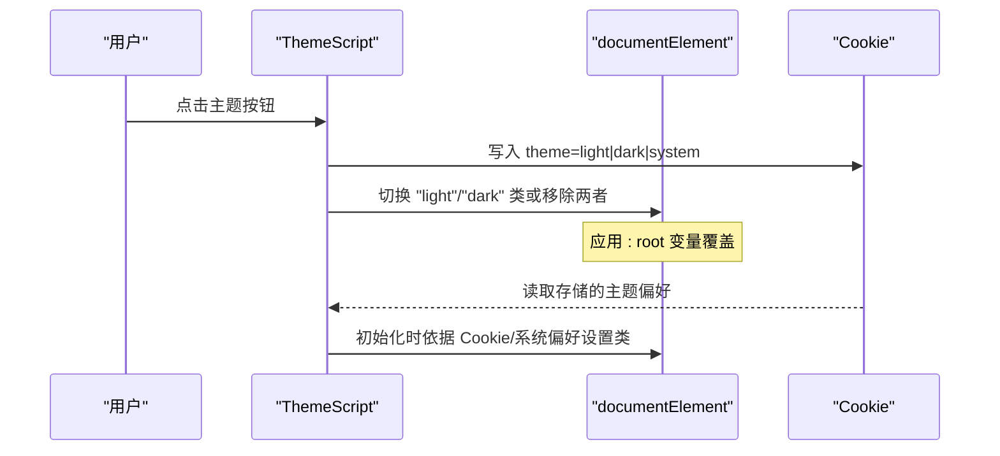
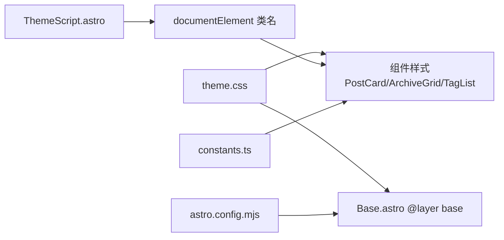

# 组件样式和主题

<cite>
**本文引用的文件**
- [src/styles/theme.css](file://src/styles/theme.css)
- [src/components/layout/ThemeScript.astro](file://src/components/layout/ThemeScript.astro)
- [src/layouts/Base.astro](file://src/layouts/Base.astro)
- [src/utils/constants.ts](file://src/utils/constants.ts)
- [src/components/ArchiveGrid.astro](file://src/components/ArchiveGrid.astro)
- [src/components/PostCard.astro](file://src/components/PostCard.astro)
- [src/components/TagList.astro](file://src/components/TagList.astro)
- [src/pages/index.astro](file://src/pages/index.astro)
- [src/components/ImageRenderer.astro](file://src/components/ImageRenderer.astro)
- [astro.config.mjs](file://astro.config.mjs)
- [package.json](file://package.json)
- [README.md](file://README.md)
</cite>

## 目录
1. [简介](#简介)
2. [项目结构](#项目结构)
3. [核心组件](#核心组件)
4. [架构总览](#架构总览)
5. [详细组件分析](#详细组件分析)
6. [依赖关系分析](#依赖关系分析)
7. [性能考量](#性能考量)
8. [故障排查指南](#故障排查指南)
9. [结论](#结论)
10. [附录](#附录)

## 简介
本文件系统性阐述 EmDash 博客模板的 UI 组件样式与主题体系，重点覆盖以下方面：
- CSS 变量系统：颜色、字号、行高、字距、间距、布局、圆角、过渡、头像尺寸、阴影等变量的定义与使用。
- 主题切换机制：基于 Cookie 的用户偏好持久化、系统深色模式检测、类名切换与媒体查询配合。
- 响应式设计原则：断点与网格布局策略，移动端优先与可访问性优化。
- 样式组织方式：全局层（layer）优先级、局部样式作用域、主题变量覆盖规则。
- 明/暗模式实现原理与使用方法：默认浅色、系统深色回退、显式深色类、变量覆盖。
- 样式定制指南：颜色系统、字体排版、间距规范、组件继承与覆盖。
- 与 Astro 组件系统的样式集成：Base 布局注入、字体配置、组件内样式作用域。

## 项目结构
EmDash 模板采用“布局 + 页面 + 组件 + 样式”的分层组织方式，主题与样式通过全局层与 CSS 变量统一管理，组件内样式遵循作用域隔离与变量复用。

图表来源
- [src/styles/theme.css:1-109](file://src/styles/theme.css#L1-L109)
- [src/layouts/Base.astro:1-968](file://src/layouts/Base.astro#L1-L968)
- [src/components/layout/ThemeScript.astro:1-84](file://src/components/layout/ThemeScript.astro#L1-L84)
- [src/pages/index.astro:1-463](file://src/pages/index.astro#L1-L463)
- [src/components/PostCard.astro:1-285](file://src/components/PostCard.astro#L1-L285)
- [src/components/ArchiveGrid.astro:1-64](file://src/components/ArchiveGrid.astro#L1-L64)
- [src/components/TagList.astro:1-46](file://src/components/TagList.astro#L1-L46)
- [src/components/ImageRenderer.astro:1-36](file://src/components/ImageRenderer.astro#L1-L36)
- [astro.config.mjs:1-45](file://astro.config.mjs#L1-L45)
- [package.json:1-33](file://package.json#L1-L33)

章节来源
- [src/styles/theme.css:1-109](file://src/styles/theme.css#L1-L109)
- [src/layouts/Base.astro:1-968](file://src/layouts/Base.astro#L1-L968)
- [src/components/layout/ThemeScript.astro:1-84](file://src/components/layout/ThemeScript.astro#L1-L84)
- [astro.config.mjs:1-45](file://astro.config.mjs#L1-L45)
- [package.json:1-33](file://package.json#L1-L33)

## 核心组件
- 主题变量与注释：集中于主题样式文件，提供颜色、类型比例、行高、字距、间距、布局、边框半径、过渡、头像尺寸、阴影等变量，便于统一定制。
- 全局层与默认样式：Base 布局以“base”层注入基础样式，确保未分层的主题变量覆盖始终生效；同时内置浅色与深色两套默认变量。
- 主题脚本：在首屏绘制前执行，依据 Cookie 或系统偏好设置根元素类名，支持用户手动切换与系统变化监听。
- 组件样式：各组件内部使用 CSS 变量进行样式声明，保证与全局主题一致；在必要处使用媒体查询实现响应式。

章节来源
- [src/styles/theme.css:1-109](file://src/styles/theme.css#L1-L109)
- [src/layouts/Base.astro:275-503](file://src/layouts/Base.astro#L275-L503)
- [src/components/layout/ThemeScript.astro:1-84](file://src/components/layout/ThemeScript.astro#L1-L84)
- [src/components/PostCard.astro:114-285](file://src/components/PostCard.astro#L114-L285)
- [src/components/ArchiveGrid.astro:41-64](file://src/components/ArchiveGrid.astro#L41-L64)
- [src/components/TagList.astro:20-46](file://src/components/TagList.astro#L20-L46)

## 架构总览
EmDash 的样式与主题系统由三层协同构成：
- 变量层：主题变量文件提供默认值与覆盖入口。
- 默认层：Base 布局以“base”层注入默认样式与深浅两套颜色变量。
- 组件层：页面与组件各自声明局部样式，遵循变量与媒体查询。

图表来源
- [src/styles/theme.css:17-108](file://src/styles/theme.css#L17-L108)
- [src/layouts/Base.astro:283-449](file://src/layouts/Base.astro#L283-L449)
- [src/components/layout/ThemeScript.astro:39-82](file://src/components/layout/ThemeScript.astro#L39-L82)
- [src/components/PostCard.astro:114-285](file://src/components/PostCard.astro#L114-L285)
- [src/components/ArchiveGrid.astro:41-64](file://src/components/ArchiveGrid.astro#L41-L64)
- [src/components/TagList.astro:20-46](file://src/components/TagList.astro#L20-L46)

## 详细组件分析

### 主题变量与覆盖规则
- 变量分类：颜色、字号、行高、字距、间距、布局、圆角、过渡、头像尺寸、阴影、标签内边距等。
- 覆盖优先级：Base 的“base”层默认样式为未分层样式提供优先级保障；主题变量文件作为未分层样式，始终覆盖默认值。
- 深色模式：系统深色回退与显式深色类共同生效；若仅覆盖浅色变量，深色模式需额外在媒体查询或深色类中覆盖对应变量。

章节来源
- [src/styles/theme.css:17-108](file://src/styles/theme.css#L17-L108)
- [src/layouts/Base.astro:312-449](file://src/layouts/Base.astro#L312-L449)

### 明/暗模式切换机制
- 初始化策略：首屏脚本读取 Cookie 中的主题偏好，若不存在则根据系统偏好设置深色类。
- 用户切换：点击主题按钮时写入 Cookie 并切换根元素类名；当偏好为“系统”时监听系统主题变化并动态切换。
- 类名控制：light/dark/system 三态，按钮激活态通过“active”类指示当前状态。

图表来源
- [src/components/layout/ThemeScript.astro:39-82](file://src/components/layout/ThemeScript.astro#L39-L82)

章节来源
- [src/components/layout/ThemeScript.astro:1-84](file://src/components/layout/ThemeScript.astro#L1-L84)

### 响应式设计原则
- 断点与网格：使用组件内媒体查询与页面样式中的断点，结合 CSS Grid 实现自适应布局。
- 移动端优先：在窄屏下调整网格列数、间距与字号，保证内容可读性与交互可用性。
- 可访问性：焦点可见性、对比度与交互反馈均通过变量与过渡统一管理。

章节来源
- [src/utils/constants.ts:1-9](file://src/utils/constants.ts#L1-L9)
- [src/components/ArchiveGrid.astro:52-62](file://src/components/ArchiveGrid.astro#L52-L62)
- [src/pages/index.astro:423-461](file://src/pages/index.astro#L423-L461)
- [src/layouts/Base.astro:858-948](file://src/layouts/Base.astro#L858-L948)

### 样式组织方式
- 全局层（layer）：Base 使用“base”层注入默认样式，确保主题变量文件的未分层样式具有最高优先级。
- 局部样式：组件与页面内的样式通过作用域选择器与变量复用，避免全局污染。
- 主题变量：所有组件样式统一引用 CSS 变量，实现主题一致性与可定制性。

章节来源
- [src/layouts/Base.astro:275-503](file://src/layouts/Base.astro#L275-L503)
- [src/components/PostCard.astro:114-285](file://src/components/PostCard.astro#L114-L285)
- [src/components/ArchiveGrid.astro:41-64](file://src/components/ArchiveGrid.astro#L41-L64)
- [src/components/TagList.astro:20-46](file://src/components/TagList.astro#L20-L46)

### 组件间样式继承与覆盖
- 继承：组件共享同一变量集，如颜色、字号、行高、圆角、阴影等，保证视觉一致性。
- 覆盖：组件可在自身作用域内对变量进行局部覆盖，或通过父容器传递类名影响子组件外观。
- 示例：文章卡片与归档网格均使用相同的间距、字号与颜色变量，确保在不同页面中风格一致。

章节来源
- [src/components/PostCard.astro:114-285](file://src/components/PostCard.astro#L114-L285)
- [src/components/ArchiveGrid.astro:41-64](file://src/components/ArchiveGrid.astro#L41-L64)
- [src/pages/index.astro:190-462](file://src/pages/index.astro#L190-L462)

### 与 Astro 组件系统的样式集成
- 字体配置：通过 Astro 配置注入 Google Fonts，分别映射到 sans 与 mono 变量，供 Base 与组件使用。
- 组件样式作用域：Astro 支持组件内样式作用域，组件样式不会泄漏至全局，变量仍通过 :root 统一管理。
- 图片渲染：图片组件通过外部链接或内部媒体组件渲染，保持样式与行为的一致性。

章节来源
- [astro.config.mjs:27-42](file://astro.config.mjs#L27-L42)
- [src/components/ImageRenderer.astro:1-36](file://src/components/ImageRenderer.astro#L1-L36)
- [src/layouts/Base.astro:80-14](file://src/layouts/Base.astro#L80-L14)

## 依赖关系分析
- 主题变量依赖 Base 的“base”层注入与未分层样式优先级。
- 主题脚本依赖浏览器 Cookie 与媒体查询事件，驱动根元素类名切换。
- 组件样式依赖全局变量与断点常量，形成稳定的视觉与交互体系。

图表来源
- [src/styles/theme.css:17-108](file://src/styles/theme.css#L17-L108)
- [src/layouts/Base.astro:283-503](file://src/layouts/Base.astro#L283-L503)
- [src/components/layout/ThemeScript.astro:39-82](file://src/components/layout/ThemeScript.astro#L39-L82)
- [src/utils/constants.ts:1-9](file://src/utils/constants.ts#L1-L9)
- [astro.config.mjs:27-42](file://astro.config.mjs#L27-L42)

章节来源
- [src/styles/theme.css:1-109](file://src/styles/theme.css#L1-L109)
- [src/layouts/Base.astro:1-968](file://src/layouts/Base.astro#L1-L968)
- [src/components/layout/ThemeScript.astro:1-84](file://src/components/layout/ThemeScript.astro#L1-L84)
- [src/utils/constants.ts:1-9](file://src/utils/constants.ts#L1-L9)
- [astro.config.mjs:1-45](file://astro.config.mjs#L1-L45)

## 性能考量
- 首屏防闪烁：主题脚本内联并在首屏绘制前执行，避免深浅主题切换导致的闪烁。
- 变量驱动：统一使用 CSS 变量减少重复样式与重排，提升维护效率与运行时性能。
- 响应式策略：在关键断点处使用媒体查询，避免过度嵌套与复杂选择器带来的计算成本。

## 故障排查指南
- 主题未生效：检查主题变量文件是否正确引入，确认 Base 的“base”层是否被正确加载。
- 深色模式不更新：确认 Cookie 中的主题偏好是否正确写入，系统主题变化监听是否触发。
- 组件样式异常：检查组件内样式是否正确引用变量，是否存在作用域选择器导致的样式失效。
- 字体未加载：确认 Astro 配置中的字体提供商与变量映射是否正确。

章节来源
- [src/components/layout/ThemeScript.astro:1-84](file://src/components/layout/ThemeScript.astro#L1-L84)
- [src/layouts/Base.astro:275-503](file://src/layouts/Base.astro#L275-L503)
- [astro.config.mjs:27-42](file://astro.config.mjs#L27-L42)

## 结论
EmDash 的样式与主题系统通过“变量 + 全局层 + 组件作用域”的组合，实现了清晰的层次结构与强大的可定制性。主题切换在首屏阶段即刻生效，组件间通过统一变量实现风格一致与易于维护。配合 Astro 的字体与组件系统，整体具备良好的扩展性与可移植性。

## 附录

### 样式定制指南（实践要点）
- 颜色系统：优先在主题变量文件中修改颜色变量，若需深色模式单独定制，请在系统深色回退或深色类中补充覆盖。
- 字体排版：通过 Astro 配置设置字体变量，组件内统一引用变量，避免硬编码字体族。
- 间距规范：使用统一的间距变量，配合媒体查询在不同断点下调整网格与留白。
- 组件继承与覆盖：组件样式尽量引用变量，必要时在父容器或组件内部进行局部覆盖，保持一致性与可维护性。
- 与 Astro 集成：确保字体变量映射正确，组件样式作用域与变量引用一致，避免跨组件污染。

章节来源
- [src/styles/theme.css:17-108](file://src/styles/theme.css#L17-L108)
- [astro.config.mjs:27-42](file://astro.config.mjs#L27-L42)
- [src/layouts/Base.astro:275-503](file://src/layouts/Base.astro#L275-L503)
- [src/components/PostCard.astro:114-285](file://src/components/PostCard.astro#L114-L285)
- [src/components/ArchiveGrid.astro:41-64](file://src/components/ArchiveGrid.astro#L41-L64)
- [src/components/TagList.astro:20-46](file://src/components/TagList.astro#L20-L46)