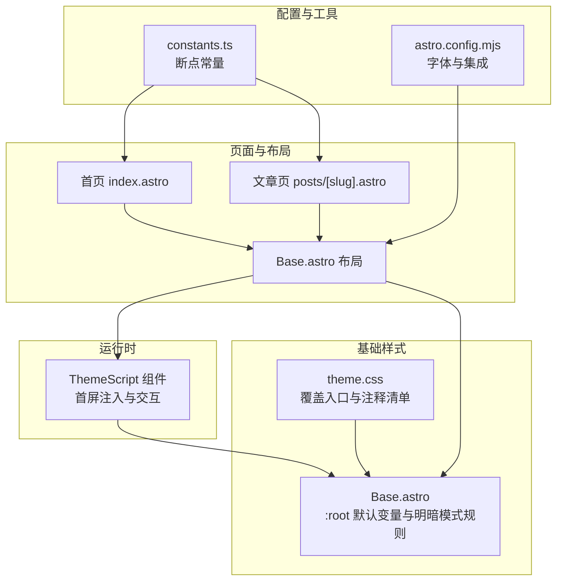
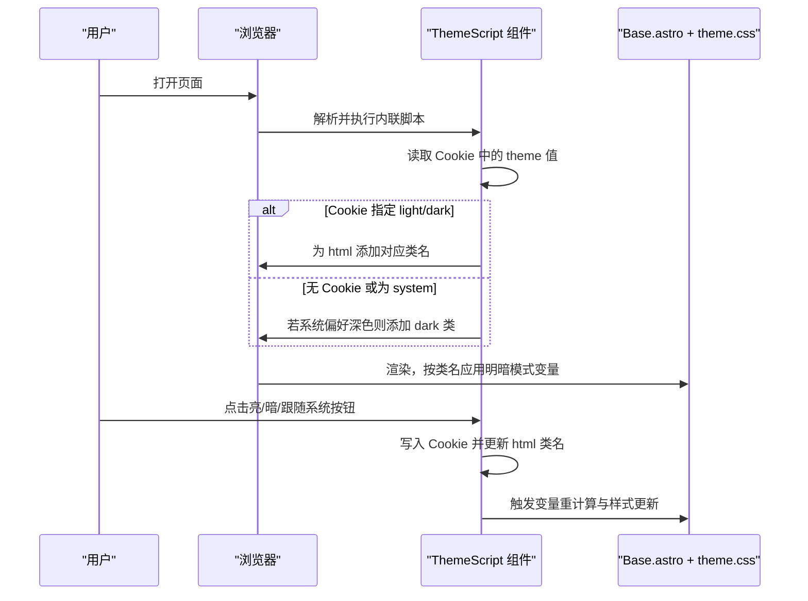
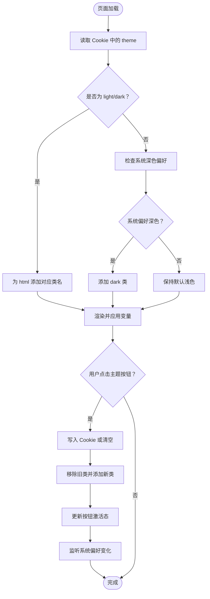
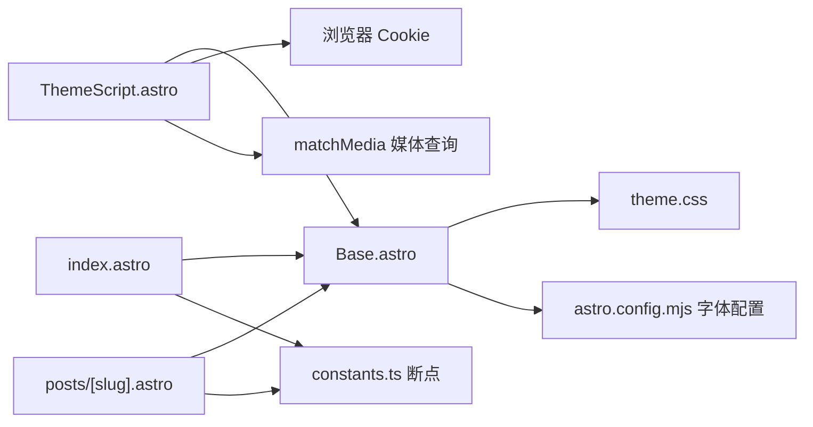

# 主题系统

<cite>
**本文引用的文件**
- [Base.astro](file://src/layouts/Base.astro)
- [ThemeScript.astro](file://src/components/layout/ThemeScript.astro)
- [theme.css](file://src/styles/theme.css)
- [constants.ts](file://src/utils/constants.ts)
- [media.ts](file://src/utils/media.ts)
- [live.config.ts](file://src/live.config.ts)
- [index.astro](file://src/pages/index.astro)
- [posts/[slug].astro](file://src/pages/posts/[slug].astro)
- [astro.config.mjs](file://astro.config.mjs)
- [package.json](file://package.json)
- [README.md](file://README.md)
</cite>

## 目录
1. [简介](#简介)
2. [项目结构](#项目结构)
3. [核心组件](#核心组件)
4. [架构总览](#架构总览)
5. [组件详解](#组件详解)
6. [依赖关系分析](#依赖关系分析)
7. [性能与缓存](#性能与缓存)
8. [故障排查](#故障排查)
9. [结论](#结论)
10. [附录：自定义主题开发指南](#附录自定义主题开发指南)

## 简介
本文件系统性阐述 EmDash 博客模板的主题系统，覆盖明暗模式自动切换机制、CSS 变量体系、主题定制选项、响应式设计策略、Base 布局如何集成主题功能（含主题脚本执行时机与状态管理）、自定义主题开发指南（颜色、字体、间距）、移动端与桌面端适配策略、性能优化与缓存机制，以及主题切换的用户体验设计建议。

## 项目结构
主题系统由三层协同构成：
- 基础样式层：在 Base 布局中以 CSS 变量与层级声明定义默认主题与明暗模式基线。
- 覆盖样式层：通过 theme.css 提供覆盖入口，遵循“未分层样式优先于 @layer base”的规则。
- 运行时控制层：通过 ThemeScript 组件在首屏前注入主题类名，避免闪烁，并提供用户交互切换。

图表来源
- [Base.astro](file://src/layouts/Base.astro)
- [ThemeScript.astro](file://src/components/layout/ThemeScript.astro)
- [theme.css](file://src/styles/theme.css)
- [index.astro](file://src/pages/index.astro)
- [posts/[slug].astro](file://src/pages/posts/[slug].astro)
- [astro.config.mjs](file://astro.config.mjs)
- [constants.ts](file://src/utils/constants.ts)

章节来源
- [Base.astro](file://src/layouts/Base.astro)
- [ThemeScript.astro](file://src/components/layout/ThemeScript.astro)
- [theme.css](file://src/styles/theme.css)
- [index.astro](file://src/pages/index.astro)
- [posts/[slug].astro](file://src/pages/posts/[slug].astro)
- [astro.config.mjs](file://astro.config.mjs)
- [constants.ts](file://src/utils/constants.ts)

## 核心组件
- Base 布局：集中定义 CSS 变量、明暗模式规则、全局样式层与站点级样式。
- ThemeScript 组件：在首屏前读取 Cookie 并设置根元素类名，随后监听系统偏好变化与用户交互，更新 Cookie 与类名。
- theme.css：仅需修改此处即可完成主题覆盖，无需关心复杂的选择器优先级。
- 页面与断点：首页与文章页使用统一断点常量，配合 CSS 变量实现一致的响应式体验。

章节来源
- [Base.astro](file://src/layouts/Base.astro)
- [ThemeScript.astro](file://src/components/layout/ThemeScript.astro)
- [theme.css](file://src/styles/theme.css)
- [constants.ts](file://src/utils/constants.ts)

## 架构总览
主题系统采用“变量驱动 + 类名切换 + 首屏注入”的组合策略：
- 变量驱动：所有颜色、字号、行高、间距、阴影等均来自 CSS 变量，便于集中覆盖。
- 类名切换：通过在 html 上添加 light/dark/system（system 为默认）类名，驱动明暗模式切换。
- 首屏注入：ThemeScript 在 <head> 中以内联脚本方式尽早执行，避免 FOUC（Flash of Unstyled Content）。
- 规则优先级：Base.astro 将默认变量置于 @layer base，theme.css 的未分层声明可无条件覆盖。

图表来源
- [ThemeScript.astro](file://src/components/layout/ThemeScript.astro)
- [Base.astro](file://src/layouts/Base.astro)
- [theme.css](file://src/styles/theme.css)

## 组件详解

### 明暗模式自动切换机制
- 首屏注入：ThemeScript 的内联脚本在 DOMContentLoaded 前读取 Cookie，若存在 theme=light 或 theme=dark，则直接为 html 添加相应类；否则根据 prefers-color-scheme 自动选择深色。
- 用户交互：点击主题按钮后，脚本写入或清除 Cookie，并移除/添加 light/dark 类，同时更新按钮激活态。
- 系统偏好监听：当用户处于 system 模式时，监听系统深色偏好变化，动态切换 dark 类。
- 样式生效：Base.astro 定义了 :root 与 :root.dark 的颜色变量，确保覆盖优先级与一致性。

图表来源
- [ThemeScript.astro](file://src/components/layout/ThemeScript.astro)
- [Base.astro](file://src/layouts/Base.astro)

章节来源
- [ThemeScript.astro](file://src/components/layout/ThemeScript.astro)
- [Base.astro](file://src/layouts/Base.astro)

### CSS 变量系统与覆盖策略
- 变量来源：Base.astro 的 :root 定义了颜色、字体、字号、行高、间距、布局、圆角、过渡、阴影、头像尺寸等变量；并在 @media (prefers-color-scheme: dark) 与 :root.dark 中给出深色模式映射。
- 覆盖入口：theme.css 提供注释化的变量清单，仅需取消注释并修改值即可覆盖默认值；由于 Base.astro 使用 @layer base，theme.css 的未分层声明优先级更高。
- 搜索主题：Base.astro 中还定义了 EmDash 搜索组件相关的 CSS 变量，可在 theme.css 中统一调整。

章节来源
- [Base.astro](file://src/layouts/Base.astro)
- [theme.css](file://src/styles/theme.css)

### 主题定制选项与配置方法
- 颜色方案：通过修改 --color-* 变量实现，深色模式需在 @media (prefers-color-scheme: dark) 与 :root.dark 中同步覆盖。
- 字体选择：在 astro.config.mjs 的 fonts 数组中配置 Google Fonts，将 Inter 绑定到 --font-sans，JetBrains Mono 绑定到 --font-mono；如需替换字体族，调整 name 字段即可。
- 间距与排版：通过修改 --spacing-*、--font-size-*、--leading-*、--tracking-* 等变量统一调整。
- 布局参数：--content-width、--wide-width、--gutter-width、--meta-col-width、--nav-height 等用于控制整体布局宽度与列宽。

章节来源
- [theme.css](file://src/styles/theme.css)
- [astro.config.mjs](file://astro.config.mjs)
- [Base.astro](file://src/layouts/Base.astro)

### Base 布局如何集成主题功能
- 引入与挂载：Base.astro 在 <head> 中引入 ThemeScript 组件与 theme.css，并在 <body> 中渲染站点头部、主内容与页脚。
- 样式层：通过 @layer base 确保默认变量优先级；同时在 <style is:global> 中定义基础盒模型、排版与通用组件样式。
- 主题开关 UI：在页脚区域提供三个按钮（light/dark/system），ThemeScript 负责绑定事件与状态管理。
- 状态管理：ThemeScript 以 Cookie 存储用户选择，以 html 的类名驱动样式切换，避免服务端渲染与客户端状态不一致。

章节来源
- [Base.astro](file://src/layouts/Base.astro)
- [ThemeScript.astro](file://src/components/layout/ThemeScript.astro)
- [theme.css](file://src/styles/theme.css)

### 响应式设计策略
- 断点常量：constants.ts 提供 tablet=900、mobile=600 的断点，首页与文章页在多处使用 max-width: 900px 与 max-width: 600px 的媒体查询。
- 首页响应式：在 tablet 与 mobile 下调整网格列数、图片比例、内边距与标题字号，保证在小屏设备上仍具可读性与视觉平衡。
- 文章页响应式：在不同断点下隐藏侧栏、调整网格与内边距，确保阅读体验优先。

章节来源
- [constants.ts](file://src/utils/constants.ts)
- [index.astro](file://src/pages/index.astro)
- [posts/[slug].astro](file://src/pages/posts/[slug].astro)

### 自定义主题开发指南
- 仅修改 theme.css：按照注释取消注释并修改目标变量，即可完成颜色、字体、间距、布局等主题化定制。
- 深色模式定制：在 theme.css 中添加 @media (prefers-color-scheme: dark) 与 :root.dark 规则，覆盖 --color-* 变量，确保浅色覆盖不会影响深色模式。
- 字体替换：在 astro.config.mjs 的 fonts 中更换 Inter/JetBrains Mono 的 name，或新增字体条目；必要时调整 --font-size-base 以提升可读性。
- 搜索组件主题：通过 --emdash-search-* 变量统一控制搜索框背景、文本、边框、悬停与高亮颜色。
- 组件变量：如需调整卡片、标签、阴影等，可在 theme.css 中覆盖对应变量，或在具体页面样式中局部微调。

章节来源
- [theme.css](file://src/styles/theme.css)
- [astro.config.mjs](file://astro.config.mjs)
- [Base.astro](file://src/layouts/Base.astro)

### 移动端与桌面端适配策略
- 桌面端：保持三栏阅读布局（元信息列 + 正文列 + 右侧栏），使用较大的 --wide-width 与合理的列宽，确保信息密度与可读性。
- 移动端：在 tablet 与 mobile 断点下，减少列数、缩小内边距、调整图片比例与标题字号，避免拥挤；在更小屏幕下隐藏右侧栏，优先正文阅读。
- 交互细节：在小屏设备上增大触摸目标尺寸，确保主题切换按钮易于点击；搜索框在聚焦时可扩展宽度，提升输入体验。

章节来源
- [index.astro](file://src/pages/index.astro)
- [posts/[slug].astro](file://src/pages/posts/[slug].astro)
- [constants.ts](file://src/utils/constants.ts)

## 依赖关系分析
- Base.astro 依赖 theme.css 的覆盖能力与 Astro 的字体预加载（Font 组件）。
- ThemeScript 依赖浏览器的 Cookie API 与 matchMedia API，负责运行时状态与类名切换。
- 页面层（index.astro、posts/[slug].astro）依赖断点常量与 CSS 变量，实现一致的响应式行为。
- astro.config.mjs 提供字体配置与集成，间接影响主题的排版与可读性。

图表来源
- [Base.astro](file://src/layouts/Base.astro)
- [ThemeScript.astro](file://src/components/layout/ThemeScript.astro)
- [theme.css](file://src/styles/theme.css)
- [astro.config.mjs](file://astro.config.mjs)
- [index.astro](file://src/pages/index.astro)
- [posts/[slug].astro](file://src/pages/posts/[slug].astro)
- [constants.ts](file://src/utils/constants.ts)

章节来源
- [Base.astro](file://src/layouts/Base.astro)
- [ThemeScript.astro](file://src/components/layout/ThemeScript.astro)
- [theme.css](file://src/styles/theme.css)
- [astro.config.mjs](file://astro.config.mjs)
- [index.astro](file://src/pages/index.astro)
- [posts/[slug].astro](file://src/pages/posts/[slug].astro)
- [constants.ts](file://src/utils/constants.ts)

## 性能与缓存
- 首屏无闪烁：ThemeScript 内联脚本在 <head> 中执行，避免等待外部脚本导致的样式闪烁。
- 变量驱动渲染：CSS 变量在运行时一次性计算并应用，避免频繁重排与重绘。
- 图片与资源：媒体工具函数支持本地与外链图片解析，结合 Astro 的图像优化能力，减少带宽与加载时间。
- 缓存提示：页面在构建阶段可利用 Astro.cache.set(cacheHint) 设置缓存提示，提升 SSR/ISR 场景下的命中率（取决于部署环境）。
- 字体加载：通过 Font 组件与 astro.config.mjs 的字体配置，实现字体变量注入与预加载，降低字体抖动风险。

章节来源
- [ThemeScript.astro](file://src/components/layout/ThemeScript.astro)
- [Base.astro](file://src/layouts/Base.astro)
- [media.ts](file://src/utils/media.ts)
- [index.astro](file://src/pages/index.astro)

## 故障排查
- 切换无效或闪烁：确认 ThemeScript 是否正确引入且位于 <head>；检查 Cookie 是否被写入；确认 html 是否包含正确的 light/dark 类。
- 深色模式未生效：确认在 theme.css 中已为深色模式覆盖 --color-* 变量；或在 Base.astro 的 :root.dark 中定义。
- 字体未生效：检查 astro.config.mjs 的 fonts 配置是否正确，字体名称与 cssVariable 是否匹配。
- 响应式异常：核对断点常量与媒体查询是否一致；在 tablet/mobile 下验证网格与内边距是否合理。
- 搜索主题不一致：通过 --emdash-search-* 变量统一调整搜索组件的颜色体系。

章节来源
- [ThemeScript.astro](file://src/components/layout/ThemeScript.astro)
- [theme.css](file://src/styles/theme.css)
- [Base.astro](file://src/layouts/Base.astro)
- [astro.config.mjs](file://astro.config.mjs)
- [constants.ts](file://src/utils/constants.ts)

## 结论
EmDash 主题系统以 CSS 变量为核心，结合运行时类名切换与首屏注入策略，实现了稳定、可维护且高性能的主题机制。通过 theme.css 的覆盖入口与 Base.astro 的变量基线，开发者可以快速完成颜色、字体、间距与布局的定制；配合断点常量与媒体查询，确保在桌面与移动设备上的一致体验。建议在生产环境中充分利用 Cookie 缓存与 CSS 变量的运行时特性，避免过度复杂的选择器优先级竞争，保持主题系统的简洁与可演进性。

## 附录：自定义主题开发指南
- 快速开始
  - 修改 theme.css 中的注释变量，取消注释并设置所需值。
  - 如需深色模式定制，分别在 @media (prefers-color-scheme: dark) 与 :root.dark 中覆盖 --color-*。
- 字体替换
  - 在 astro.config.mjs 的 fonts 中更改 Inter/JetBrains Mono 的 name，或新增字体条目；必要时调整 --font-size-base。
- 搜索主题
  - 通过 --emdash-search-* 变量统一控制搜索框背景、文本、边框、悬停与高亮颜色。
- 组件与布局
  - 使用 --content-width、--wide-width、--gutter-width、--meta-col-width、--nav-height 等变量统一布局参数。
- 用户体验建议
  - 主题切换按钮应始终可见且易于点击；提供明确的当前模式指示。
  - 在系统偏好变化时，保持与用户选择一致的优先级（system 模式下跟随系统）。
  - 避免在切换时出现明显的布局抖动，可通过变量与过渡属性平滑处理。

章节来源
- [theme.css](file://src/styles/theme.css)
- [astro.config.mjs](file://astro.config.mjs)
- [Base.astro](file://src/layouts/Base.astro)
- [README.md](file://README.md)