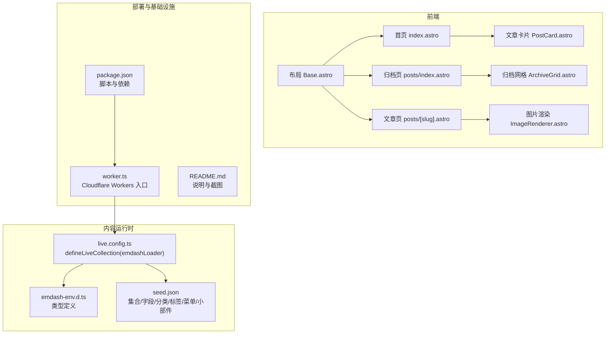
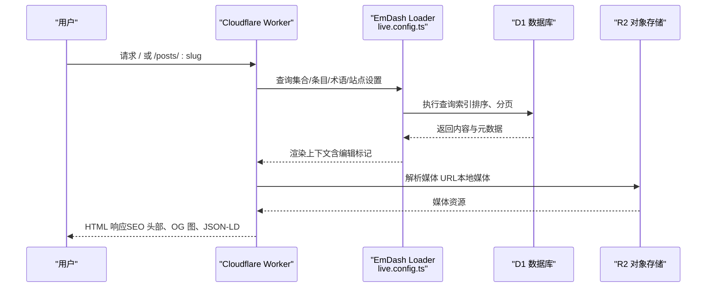
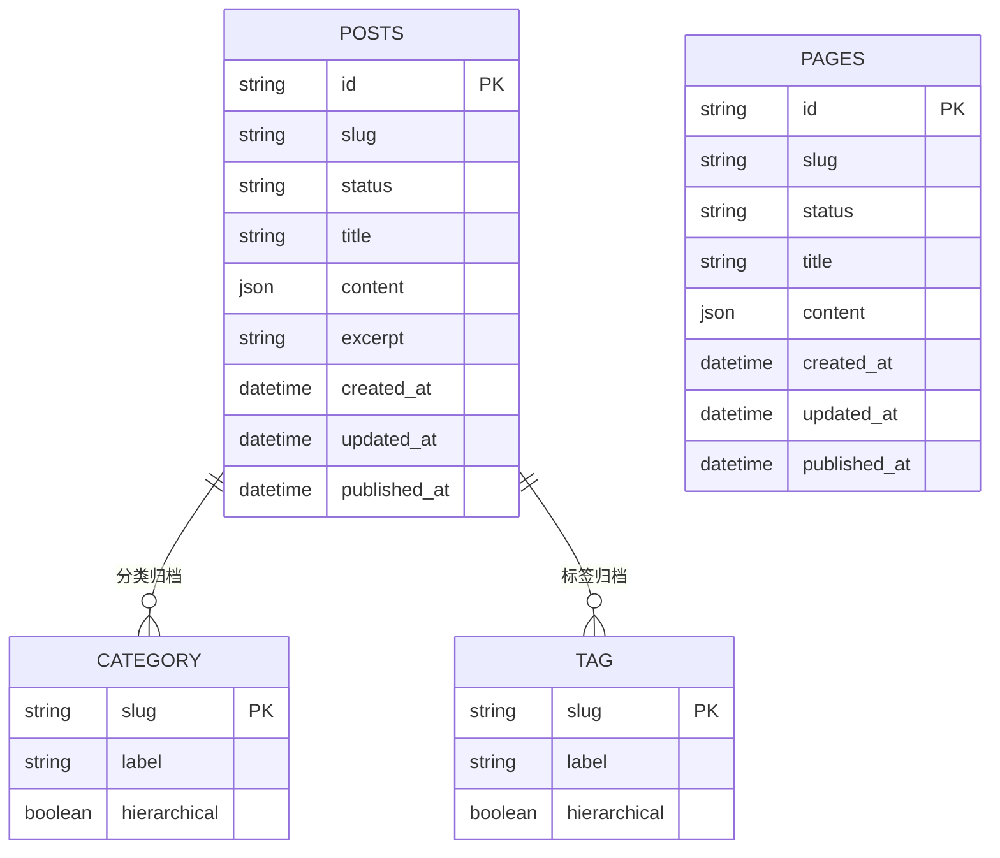
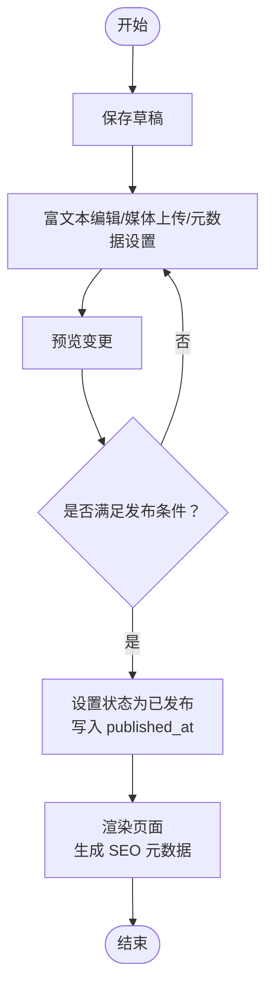
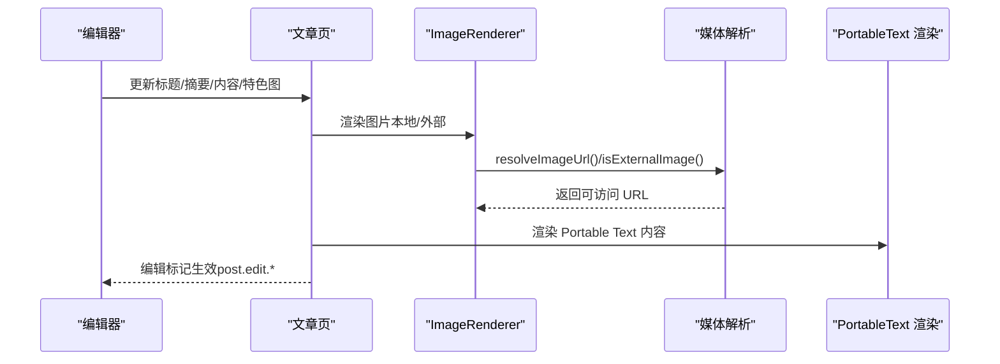
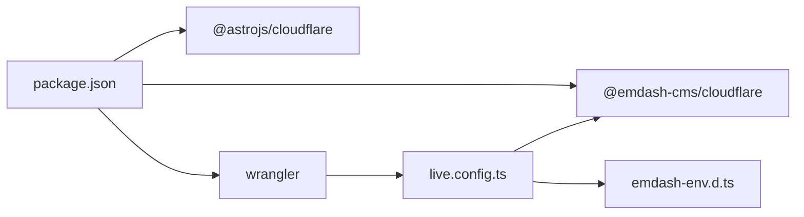

# 内容操作流程

<cite>
**本文引用的文件**
- [README.md](file://README.md)
- [package.json](file://package.json)
- [src/live.config.ts](file://src/live.config.ts)
- [src/worker.ts](file://src/worker.ts)
- [emdash-env.d.ts](file://emdash-env.d.ts)
- [seed/seed.json](file://seed/seed.json)
- [src/utils/constants.ts](file://src/utils/constants.ts)
- [src/utils/media.ts](file://src/utils/media.ts)
- [src/utils/date.ts](file://src/utils/date.ts)
- [src/utils/reading-time.ts](file://src/utils/reading-time.ts)
- [src/utils/site-identity.ts](file://src/utils/site-identity.ts)
- [src/layouts/Base.astro](file://src/layouts/Base.astro)
- [src/pages/index.astro](file://src/pages/index.astro)
- [src/pages/posts/[slug].astro](file://src/pages/posts/[slug].astro)
- [src/pages/posts/index.astro](file://src/pages/posts/index.astro)
- [src/components/PostCard.astro](file://src/components/PostCard.astro)
- [src/components/ArchiveGrid.astro](file://src/components/ArchiveGrid.astro)
- [src/components/ImageRenderer.astro](file://src/components/ImageRenderer.astro)
</cite>

## 目录
1. [简介](#简介)
2. [项目结构](#项目结构)
3. [核心组件](#核心组件)
4. [架构总览](#架构总览)
5. [详细组件分析](#详细组件分析)
6. [依赖关系分析](#依赖关系分析)
7. [性能考量](#性能考量)
8. [故障排查指南](#故障排查指南)
9. [结论](#结论)
10. [附录](#附录)

## 简介
本文件系统性阐述基于 EmDash 的内容操作流程与实现细节，覆盖从内容创建、编辑、预览、发布到版本与协作管理的全链路；同时说明富文本编辑、媒体上传与元数据设置的交互方式，以及批量操作、审核与权限控制、维护最佳实践等主题。该模板基于 Astro + Cloudflare Workers 部署，使用 D1 数据库与 R2 存储，集合了站点配置、分类标签、按需渲染与 SEO 元数据生成能力。

## 项目结构
- 运行时与部署：Cloudflare Workers（运行时）、D1（数据库）、R2（对象存储）
- 前端框架：Astro（静态生成 + 边缘部署），通过 @astrojs/cloudflare 适配 Workers
- 内容模型：通过 EmDash 定义的集合（posts/pages）与字段（标题、内容、摘要、特色图、作者署名等）
- 页面与组件：主页、文章详情页、归档页、组件化卡片与图片渲染器
- 工具函数：断点、媒体解析、日期格式化、阅读时长计算、站点标识解析

图表来源
- [src/layouts/Base.astro](file://src/layouts/Base.astro)
- [src/pages/index.astro](file://src/pages/index.astro)
- [src/pages/posts/[slug].astro](file://src/pages/posts/[slug].astro)
- [src/pages/posts/index.astro](file://src/pages/posts/index.astro)
- [src/components/PostCard.astro](file://src/components/PostCard.astro)
- [src/components/ArchiveGrid.astro](file://src/components/ArchiveGrid.astro)
- [src/components/ImageRenderer.astro](file://src/components/ImageRenderer.astro)
- [src/live.config.ts](file://src/live.config.ts)
- [emdash-env.d.ts](file://emdash-env.d.ts)
- [seed/seed.json](file://seed/seed.json)
- [src/worker.ts](file://src/worker.ts)
- [package.json](file://package.json)
- [README.md](file://README.md)

章节来源
- [README.md:1-68](file://README.md#L1-L68)
- [package.json:1-33](file://package.json#L1-L33)
- [src/live.config.ts:1-14](file://src/live.config.ts#L1-L14)
- [src/worker.ts:1-6](file://src/worker.ts#L1-L6)
- [emdash-env.d.ts:1-39](file://emdash-env.d.ts#L1-L39)
- [seed/seed.json:1-274](file://seed/seed.json#L1-L274)

## 核心组件
- 内容集合与实时加载
  - 通过 live.config.ts 定义 _emdash 集合，使用 emdashLoader 提供的运行时接口查询内容与术语，支持草稿、修订、搜索与 SEO 能力。
- 页面渲染与 SEO
  - Base.astro 统一注入 SEO 头部、站点信息、菜单与小部件区域，并在文章页生成 Open Graph 与 JSON-LD。
- 文章展示
  - 首页聚合精选与网格列表；文章详情页包含作者署名、阅读时长、标签、评论区与相关文章；归档页列出所有文章并带标签云。
- 媒体处理
  - ImageRenderer 统一处理本地与外部图片，resolveImageUrl 将媒体引用转换为可访问 URL；isExternalImage 判断来源。
- 工具函数
  - 断点常量、日期格式化、阅读时长计算、站点标识解析，用于页面布局与内容呈现。

章节来源
- [src/live.config.ts:1-14](file://src/live.config.ts#L1-L14)
- [src/layouts/Base.astro:1-800](file://src/layouts/Base.astro#L1-L800)
- [src/pages/index.astro:1-463](file://src/pages/index.astro#L1-L463)
- [src/pages/posts/[slug].astro:1-800](file://src/pages/posts/[slug].astro#L1-L800)
- [src/pages/posts/index.astro:1-269](file://src/pages/posts/index.astro#L1-L269)
- [src/components/ImageRenderer.astro:1-36](file://src/components/ImageRenderer.astro#L1-L36)
- [src/utils/media.ts:1-39](file://src/utils/media.ts#L1-L39)
- [src/utils/date.ts:1-18](file://src/utils/date.ts#L1-L18)
- [src/utils/reading-time.ts:1-67](file://src/utils/reading-time.ts#L1-L67)
- [src/utils/site-identity.ts:1-25](file://src/utils/site-identity.ts#L1-L25)

## 架构总览
EmDash 在本模板中以“内容即数据”的方式工作：站点通过 seed.json 定义集合与字段，运行时通过 live.config.ts 暴露集合查询接口；页面通过 Astro 组件调用 EmDash API 获取内容、术语与站点设置，最终在 Edge 上生成静态或半静态页面。

图表来源
- [src/live.config.ts:1-14](file://src/live.config.ts#L1-L14)
- [src/pages/index.astro:1-463](file://src/pages/index.astro#L1-L463)
- [src/pages/posts/[slug].astro:1-800](file://src/pages/posts/[slug].astro#L1-L800)
- [src/utils/media.ts:1-39](file://src/utils/media.ts#L1-L39)
- [src/worker.ts:1-6](file://src/worker.ts#L1-L6)

## 详细组件分析

### 内容集合与类型定义
- 集合定义
  - posts 支持草稿、修订、搜索与 SEO；字段包含标题、特色图、内容（Portable Text）、摘要等。
  - pages 支持草稿、修订、搜索；字段包含标题与内容。
- 类型约束
  - emdash-env.d.ts 明确定义了 Post 与 Page 的字段结构，确保编译期类型安全。
- 种子配置
  - seed.json 提供默认集合、分类（category 层级）、标签（非层级）、菜单、小部件与示例内容，便于快速启动。

图表来源
- [seed/seed.json:13-115](file://seed/seed.json#L13-L115)
- [emdash-env.d.ts:20-32](file://emdash-env.d.ts#L20-L32)

章节来源
- [seed/seed.json:13-115](file://seed/seed.json#L13-L115)
- [emdash-env.d.ts:20-32](file://emdash-env.d.ts#L20-L32)

### 内容创建与编辑流程（草稿、预览、发布）
- 草稿与修订
  - 集合声明 supports: ["drafts", "revisions"]，表明内容可在草稿态保存与多版本修订，运行时通过集合查询接口读取草稿与修订。
- 预览与编辑标记
  - 文章详情页在关键元素上挂载 post.edit.* 属性，用于编辑器定位与交互（如标题、摘要、特色图等字段）。
- 发布策略
  - 通过 status 字段控制可见性；首页与归档页按 published_at 排序，仅渲染已发布内容；SEO 元数据根据 published_at 与 updated_at 动态生成。

图表来源
- [seed/seed.json:18](file://seed/seed.json#L18)
- [seed/seed.json:50](file://seed/seed.json#L50)
- [src/pages/posts/[slug].astro:126-244](file://src/pages/posts/[slug].astro#L126-L244)

章节来源
- [seed/seed.json:18-50](file://seed/seed.json#L18-L50)
- [src/pages/posts/[slug].astro:126-244](file://src/pages/posts/[slug].astro#L126-L244)

### 富文本编辑器、媒体上传与元数据设置
- 富文本编辑
  - 内容字段采用 Portable Text，文章详情页通过 PortableText 组件渲染；编辑器在页面上通过 post.edit.* 标记进行交互。
- 媒体上传与解析
  - 特色图字段支持本地与外部来源；resolveImageUrl 统一解析为可访问 URL；ImageRenderer 根据来源选择  或 EmDashImage 组件。
- 元数据设置
  - 站点标题、副标题、图标、favicon 由站点设置解析；文章页生成 Open Graph 图像、canonical、robots 等 SEO 元数据。

图表来源
- [src/pages/posts/[slug].astro:126-244](file://src/pages/posts/[slug].astro#L126-L244)
- [src/components/ImageRenderer.astro:1-36](file://src/components/ImageRenderer.astro#L1-L36)
- [src/utils/media.ts:1-39](file://src/utils/media.ts#L1-L39)
- [src/layouts/Base.astro:16-74](file://src/layouts/Base.astro#L16-L74)

章节来源
- [src/pages/posts/[slug].astro:126-244](file://src/pages/posts/[slug].astro#L126-L244)
- [src/components/ImageRenderer.astro:1-36](file://src/components/ImageRenderer.astro#L1-L36)
- [src/utils/media.ts:1-39](file://src/utils/media.ts#L1-L39)
- [src/layouts/Base.astro:16-74](file://src/layouts/Base.astro#L16-L74)

### 批量操作与导入导出
- 批量导入
  - seed.json 中 content 字段提供初始内容示例，包含多个 posts 示例及 pages 示例，可作为批量导入的参考结构。
- 批量删除与状态更新
  - 通过集合查询接口与站点后台（/admin）进行批量操作（例如按集合批量删除、统一更新状态）。本模板未内建专用 CLI，建议结合 EmDash 后台或插件完成批量任务。
- 导出
  - 可通过集合查询结果导出为 JSON 结构，再结合 seed.json 的结构进行二次处理。

章节来源
- [seed/seed.json:275-584](file://seed/seed.json#L275-L584)

### 版本控制与协作编辑
- 草稿与修订
  - 集合声明 supports: ["drafts", "revisions"]，运行时可查询修订历史与当前草稿，支持多人协作下的并行编辑与合并。
- 协作编辑支持
  - bylines 字段支持多作者与来宾贡献者，配合角色标签（roleLabel）实现协作标注。

章节来源
- [seed/seed.json:18](file://seed/seed.json#L18)
- [seed/seed.json:50](file://seed/seed.json#L50)
- [seed/seed.json:116-128](file://seed/seed.json#L116-L128)
- [seed/seed.json:402-410](file://seed/seed.json#L402-L410)

### 审核流程与权限管理
- 角色与权限
  - 通过 bylines 与 roleLabel 实现作者身份与角色标注；站点登录态由 Astro.locals.user 控制（Base.astro 中判断）。
- 审批流程
  - 本模板未内置审批流；可通过集合状态字段与后台权限控制实现“草稿 → 待审 → 已发布”流程。

章节来源
- [src/layouts/Base.astro:76-78](file://src/layouts/Base.astro#L76-L78)
- [seed/seed.json:116-128](file://seed/seed.json#L116-L128)

### 内容维护最佳实践
- 备份
  - D1 数据库与 R2 存储均支持备份与恢复；建议定期导出集合数据与媒体清单。
- 性能监控
  - 使用 Astro 缓存提示（cacheHint）与边缘缓存策略；合理使用断点常量与懒加载组件。
- 安全防护
  - 通过站点设置与 SEO 元数据控制 robots 与 canonical；避免敏感信息泄露。

章节来源
- [src/pages/index.astro:28](file://src/pages/index.astro#L28)
- [src/pages/posts/[slug].astro:37](file://src/pages/posts/[slug].astro#L37)
- [src/utils/constants.ts:1-9](file://src/utils/constants.ts#L1-L9)

## 依赖关系分析
- 运行时依赖
  - @astrojs/cloudflare 提供 Workers 适配；@emdash-cms/cloudflare 提供运行时加载器与插件桥接。
- 开发与部署
  - Wrangler 用于部署；本地开发通过 astro dev；生产构建与部署通过脚本封装。
- 内容与页面
  - live.config.ts 与 emdash-env.d.ts 提供类型与加载器；各页面通过 EmDash API 查询内容与术语。

图表来源
- [package.json:17-32](file://package.json#L17-L32)
- [src/live.config.ts:8-13](file://src/live.config.ts#L8-L13)
- [src/worker.ts:1-6](file://src/worker.ts#L1-L6)

章节来源
- [package.json:17-32](file://package.json#L17-L32)
- [src/live.config.ts:8-13](file://src/live.config.ts#L8-L13)
- [src/worker.ts:1-6](file://src/worker.ts#L1-L6)

## 性能考量
- 查询优化
  - 在数据库层进行排序与限制（如按 published_at 降序、限制数量），减少客户端处理开销。
- 并行请求
  - 文章详情页对术语与相关文章采用 Promise.all 并行查询，降低往返延迟。
- 媒体与渲染
  - ImageRenderer 根据来源选择高效渲染路径；PortableText 渲染按块处理，避免大体积 DOM。

章节来源
- [src/pages/index.astro:19-32](file://src/pages/index.astro#L19-L32)
- [src/pages/posts/[slug].astro:88-104](file://src/pages/posts/[slug].astro#L88-L104)

## 故障排查指南
- 404 重定向
  - 当 slug 无效或条目不存在时，页面会重定向至 404，确保用户体验一致。
- 缓存提示
  - 首页与文章页设置 cacheHint，若启用缓存则写入缓存头，提升边缘命中率。
- 媒体解析失败
  - resolveImageUrl 会根据 provider 与 meta.storageKey 生成 URL；若为空则不渲染图片，避免错误占位。

章节来源
- [src/pages/index.astro:27-35](file://src/pages/index.astro#L27-L35)
- [src/pages/posts/[slug].astro:27-36](file://src/pages/posts/[slug].astro#L27-L36)
- [src/utils/media.ts:5-30](file://src/utils/media.ts#L5-L30)

## 结论
本模板以 EmDash 为核心，结合 Astro 与 Cloudflare Workers，提供了从内容创建、编辑、预览到发布的完整闭环。通过集合与字段的灵活配置、媒体与 SEO 的统一处理、以及草稿/修订与 bylines 的协作支持，能够满足中小型博客与知识库类站点的内容运营需求。建议在实际部署中结合后台权限与备份策略，持续优化查询与渲染性能。

## 附录
- 页面路由与功能映射
  - 首页：/，展示精选与网格文章
  - 文章详情：/posts/:slug，展示正文、作者、标签、评论与相关文章
  - 归档：/posts，展示全部文章列表
  - 登录态：Base.astro 中根据 Astro.locals.user 显示管理入口
- 开发与部署
  - 本地开发：pnpm dev
  - 生产构建与部署：pnpm build && pnpm deploy 或使用 Wrangler

章节来源
- [README.md:20-31](file://README.md#L20-L31)
- [package.json:10-16](file://package.json#L10-L16)
- [src/layouts/Base.astro:122-127](file://src/layouts/Base.astro#L122-L127)