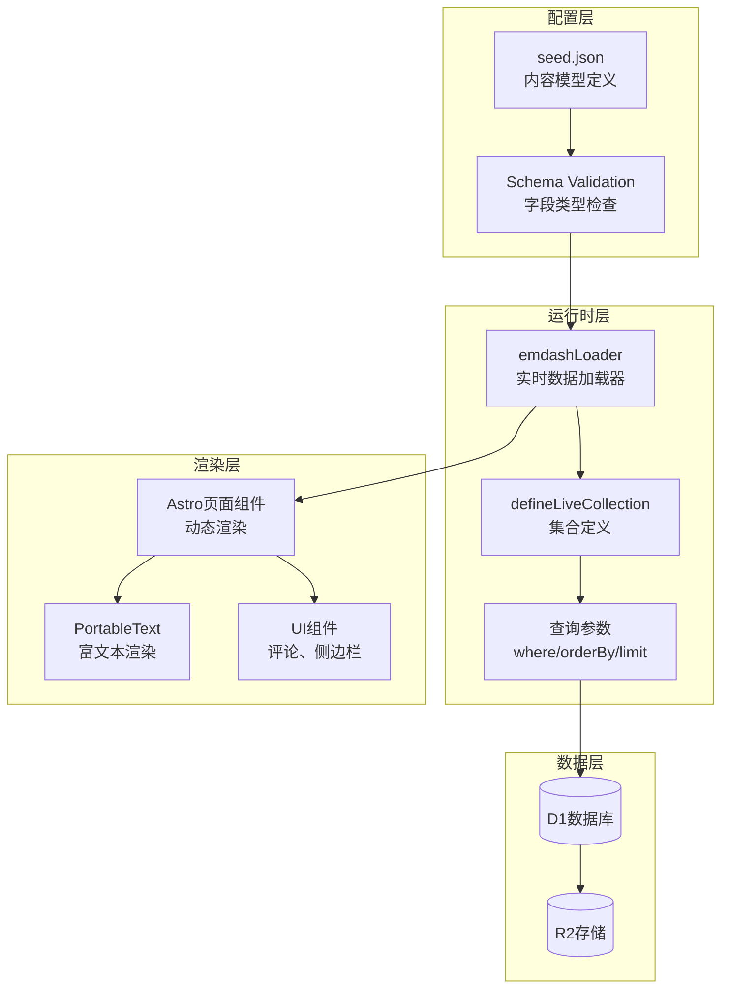
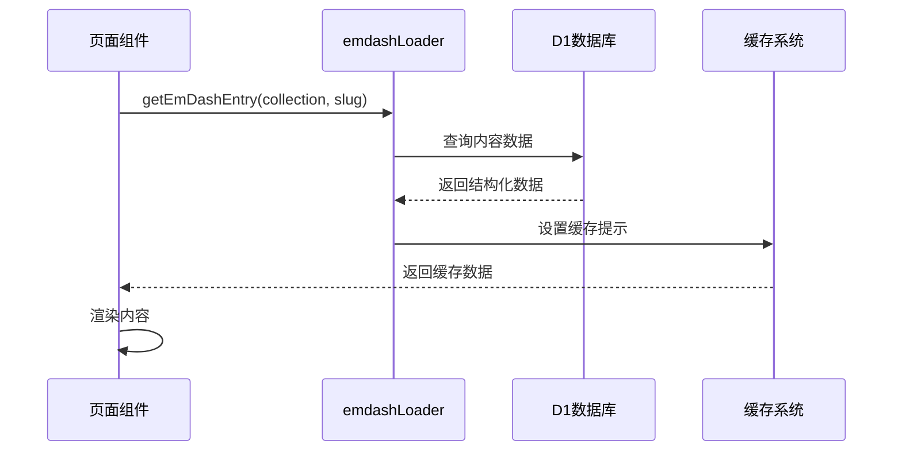
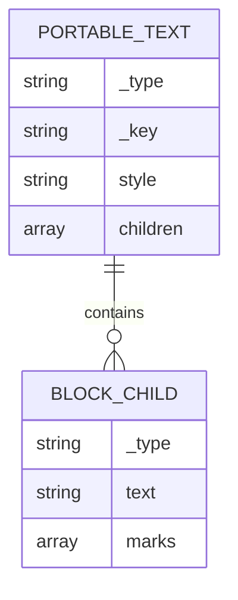
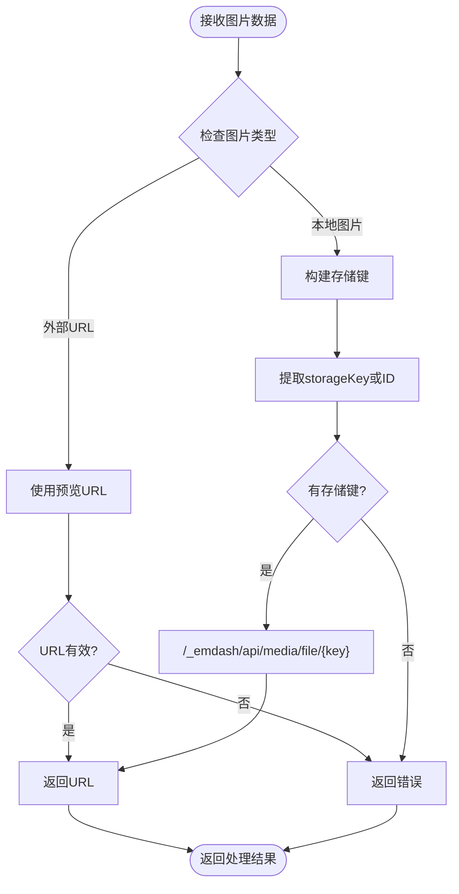
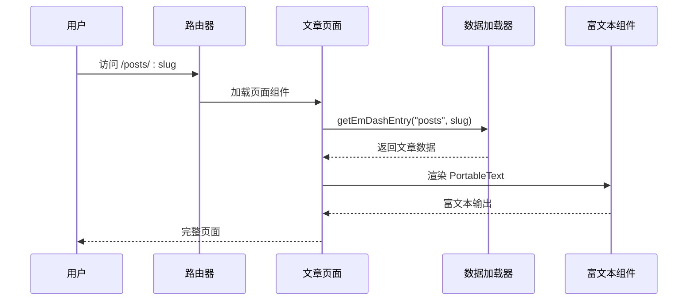

# 内容模型定义

<cite>
**本文档引用的文件**
- [seed/seed.json](file://seed/seed.json)
- [src/live.config.ts](file://src/live.config.ts)
- [src/pages/posts/[slug].astro](file://src/pages/posts/[slug].astro)
- [src/pages/pages/[slug].astro](file://src/pages/pages/[slug].astro)
- [src/pages/category/[slug].astro](file://src/pages/category/[slug].astro)
- [src/pages/tag/[slug].astro](file://src/pages/tag/[slug].astro)
- [src/utils/media.ts](file://src/utils/media.ts)
- [.agents/skills/building-emdash-site/references/schema-and-seed.md](file://.agents/skills/building-emdash-site/references/schema-and-seed.md)
- [.agents/skills/creating-plugins/references/portable-text-blocks.md](file://.agents/skills/creating-plugins/references/portable-text-blocks.md)
</cite>

## 目录
1. [简介](#简介)
2. [项目结构](#项目结构)
3. [核心内容类型](#核心内容类型)
4. [架构概览](#架构概览)
5. [详细组件分析](#详细组件分析)
6. [依赖关系分析](#依赖关系分析)
7. [性能考虑](#性能考虑)
8. [故障排除指南](#故障排除指南)
9. [结论](#结论)

## 简介

EmDash 是一个基于 Astro 的现代 CMS 平台，专注于提供灵活的内容模型定义和强大的富文本编辑能力。本文档深入解析 EmDash 的内容模型系统，包括种子文件配置、实时内容集合、以及 Portable Text 富文本格式的完整实现。

EmDash 的内容模型采用声明式配置，通过种子文件（seed.json）定义所有内容类型、字段结构、分类法系统和演示内容。系统支持实时内容加载、全文搜索、SEO 元数据管理等高级功能。

## 项目结构

EmDash 项目采用模块化架构，主要包含以下核心组件：

```mermaid
graph TB
subgraph "内容模型层"
Seed[seed/seed.json<br/>内容模型定义]
LiveConfig[src/live.config.ts<br/>实时集合配置]
end
subgraph "页面层"
Posts[posts/[slug].astro<br/>文章详情页]
Pages[pages/[slug].astro<br/>静态页面]
Category[category/[slug].astro<br/>分类归档]
Tag[tag/[slug].astro<br/>标签归档]
end
subgraph "工具层"
Media[src/utils/media.ts<br/>媒体处理]
Utils[其他工具函数]
end
subgraph "插件参考"
SchemaRef[schema-and-seed.md<br/>Schema参考]
PTRef[portable-text-blocks.md<br/>PT块参考]
end
Seed --> LiveConfig
LiveConfig --> Posts
LiveConfig --> Pages
LiveConfig --> Category
LiveConfig --> Tag
Media --> Posts
Media --> Pages
```

**图表来源**
- [seed/seed.json:1-20](file://seed/seed.json#L1-L20)
- [src/live.config.ts:1-14](file://src/live.config.ts#L1-L14)

**章节来源**
- [seed/seed.json:1-20](file://seed/seed.json#L1-L20)
- [src/live.config.ts:1-14](file://src/live.config.ts#L1-L14)

## 核心内容类型

### 文章（Posts）

文章是 EmDash 最重要的内容类型，具有完整的发布工作流和丰富的元数据支持。

#### 字段定义

| 字段名 | 类型 | 必填 | 搜索 | 描述 |
|--------|------|------|------|------|
| title | string | ✓ | ✓ | 文章标题 |
| featured_image | image | - | - | 封面图片 |
| content | portableText | - | ✓ | 富文本内容主体 |
| excerpt | text | - | - | 文章摘要 |

#### 支持特性

- 草稿/发布工作流
- 版本历史记录
- 全文搜索索引
- SEO 元数据管理
- 评论系统集成

**章节来源**
- [seed/seed.json:13-45](file://seed/seed.json#L13-L45)
- [src/pages/posts/[slug].astro:1-L120](file://src/pages/posts/[slug].astro#L1-L120)

### 页面（Pages）

静态页面用于展示不经常更新的内容，如关于页面、联系方式等。

#### 字段定义

| 字段名 | 类型 | 必填 | 搜索 | 描述 |
|--------|------|------|------|------|
| title | string | ✓ | ✓ | 页面标题 |
| content | portableText | - | ✓ | 富文本内容主体 |

#### 支持特性

- 草稿/发布工作流
- 版本历史记录
- 全文搜索索引

**章节来源**
- [seed/seed.json:46-66](file://seed/seed.json#L46-L66)
- [src/pages/pages/[slug].astro:1-L35](file://src/pages/pages/[slug].astro#L1-L35)

### 分类法系统

EmDash 提供两种分类法类型：层次化分类（Category）和平面标签（Tag）。

#### 分类（Category）

- 层次结构：支持父子关系
- 应用范围：仅限文章类型
- 预定义术语：开发、设计、笔记

#### 标签（Tag）

- 平面列表：无层级关系
- 应用范围：文章类型
- 预定义术语：网页开发、观点、工具、创意

**章节来源**
- [seed/seed.json:68-115](file://seed/seed.json#L68-L115)

## 架构概览

EmDash 的内容模型架构采用分层设计，确保了灵活性和可扩展性：



**图表来源**
- [src/live.config.ts:8-13](file://src/live.config.ts#L8-L13)
- [src/pages/posts/[slug].astro:31-L100](file://src/pages/posts/[slug].astro#L31-L100)

## 详细组件分析

### 实时内容集合配置

EmDash 使用 `defineLiveCollection` 和 `emdashLoader` 实现实时内容加载：

#### emdashLoader 配置



**图表来源**
- [src/live.config.ts:8-13](file://src/live.config.ts#L8-L13)
- [src/pages/posts/[slug].astro:31-L100](file://src/pages/posts/[slug].astro#L31-L100)

#### 查询参数详解

| 参数 | 类型 | 描述 | 示例 |
|------|------|------|------|
| where | object | 过滤条件 | `{ category: 'development' }` |
| orderBy | object | 排序规则 | `{ published_at: 'desc' }` |
| limit | number | 结果数量限制 | `4` |
| offset | number | 偏移量 | `0` |

**章节来源**
- [src/live.config.ts:8-13](file://src/live.config.ts#L8-L13)
- [src/pages/category/[slug].astro:18-L21](file://src/pages/category/[slug].astro#L18-L21)

### Portable Text 富文本格式

Portable Text 是 EmDash 的核心富文本格式，采用结构化 JSON 存储：

#### 基本结构



**图表来源**
- [seed/seed.json:327-400](file://seed/seed.json#L327-L400)

#### 块类型和样式

| 块类型 | 样式 | 描述 |
|--------|------|------|
| block | normal | 普通段落 |
| block | h1-h6 | 标题级别 |
| block | blockquote | 引用块 |
| span | - | 文本节点 |

#### 内联样式标记

| 标记 | 描述 | 示例 |
|------|------|------|
| strong | 粗体 | `{"marks": ["strong"]}` |
| em | 斜体 | `{"marks": ["em"]}` |
| link | 链接 | `{"marks": ["link"]}` |

**章节来源**
- [seed/seed.json:327-400](file://seed/seed.json#L327-L400)
- [.agents/skills/creating-plugins/references/portable-text-blocks.md:93-103](file://.agents/skills/creating-plugins/references/portable-text-blocks.md#L93-L103)

### 媒体处理系统

EmDash 提供统一的媒体处理接口，支持本地和外部图片：

#### 图片处理流程



**图表来源**
- [src/utils/media.ts:5-30](file://src/utils/media.ts#L5-L30)

**章节来源**
- [src/utils/media.ts:1-39](file://src/utils/media.ts#L1-L39)

### 页面路由和渲染

#### 文章详情页渲染流程



**图表来源**
- [src/pages/posts/[slug].astro:31-L100](file://src/pages/posts/[slug].astro#L31-L100)

**章节来源**
- [src/pages/posts/[slug].astro:1-L120](file://src/pages/posts/[slug].astro#L1-L120)

## 依赖关系分析

### 组件耦合度

```mermaid
graph LR
subgraph "高内聚模块"
Seed[seed.json<br/>内容模型]
LiveConfig[live.config.ts<br/>集合配置]
MediaUtils[media.ts<br/>媒体工具]
end
subgraph "低耦合页面"
PostsPage[posts/[slug].astro<br/>文章详情]
PagesPage[pages/[slug].astro<br/>静态页面]
CategoryPage[category/[slug].astro<br/>分类归档]
TagPage[tag/[slug].astro<br/>标签归档]
end
subgraph "插件系统"
SchemaRef[schema-and-seed.md<br/>Schema参考]
PTRef[portable-text-blocks.md<br/>PT块参考]
end
Seed --> LiveConfig
LiveConfig --> PostsPage
LiveConfig --> PagesPage
LiveConfig --> CategoryPage
LiveConfig --> TagPage
MediaUtils --> PostsPage
MediaUtils --> PagesPage
SchemaRef --> Seed
PTRef --> PostsPage
```

**图表来源**
- [seed/seed.json:1-20](file://seed/seed.json#L1-L20)
- [src/live.config.ts:1-14](file://src/live.config.ts#L1-L14)

### 外部依赖

- **Astro**: 页面框架和构建系统
- **Cloudflare Workers**: 运行时环境
- **D1**: 关系数据库服务
- **R2**: 对象存储服务

**章节来源**
- [seed/seed.json:1-20](file://seed/seed.json#L1-L20)
- [src/live.config.ts:1-14](file://src/live.config.ts#L1-L14)

## 性能考虑

### 查询优化策略

1. **并发查询**: 使用 `Promise.all` 同时获取多个数据源
2. **批量操作**: 使用 `getTermsForEntries` 批量获取标签信息
3. **缓存机制**: 利用 `cacheHint` 实现智能缓存
4. **懒加载**: 侧边栏组件按需加载

### 存储优化

- **媒体压缩**: 自动处理图片尺寸和格式
- **CDN 集成**: 通过 Cloudflare CDN 加速内容分发
- **边缘计算**: 在边缘节点执行内容渲染

## 故障排除指南

### 常见问题诊断

#### 种子文件验证错误

**症状**: 应用种子时出现验证错误
**可能原因**:
- 图片字段使用原始 URL 而非 `$media` 格式
- 引用字段使用原始 ID 而非 `$ref:id` 格式
- PortableText 不是数组或缺少 `_type` 字段

**解决方案**:
1. 检查种子文件中的媒体引用格式
2. 验证字段类型匹配
3. 确保 PortableText 结构完整

#### 实时数据加载失败

**症状**: 页面无法加载内容或显示空白
**可能原因**:
- emdashLoader 配置错误
- 数据库连接问题
- 缓存系统异常

**解决方案**:
1. 验证 `live.config.ts` 中的 loader 配置
2. 检查数据库连接状态
3. 清除缓存后重试

**章节来源**
- [.agents/skills/building-emdash-site/references/schema-and-seed.md:447-454](file://.agents/skills/building-emdash-site/references/schema-and-seed.md#L447-L454)

## 结论

EmDash 的内容模型系统展现了现代 CMS 的最佳实践，通过声明式配置实现了高度的灵活性和可扩展性。其核心优势包括：

1. **结构化配置**: 通过种子文件定义完整的内容模型
2. **实时渲染**: 基于 Astro 的静态生成和动态渲染结合
3. **富文本支持**: Portable Text 提供强大的内容编辑体验
4. **性能优化**: 多层缓存和并发查询提升用户体验
5. **扩展性**: 插件系统支持自定义内容块和功能扩展

该系统为内容创作者提供了直观的编辑界面，同时为开发者提供了清晰的扩展点和优化空间。通过合理利用内容模型配置，可以构建出既美观又实用的现代化网站。