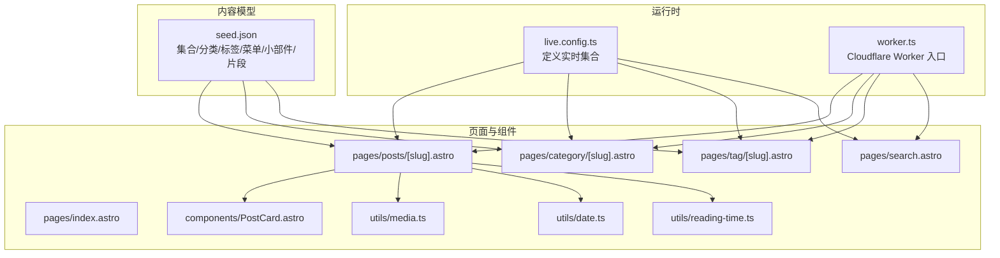
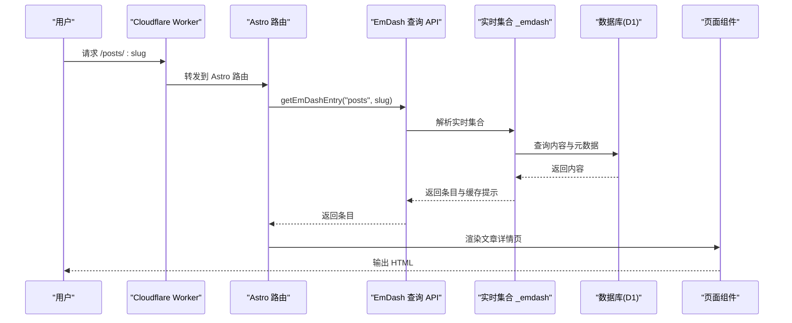
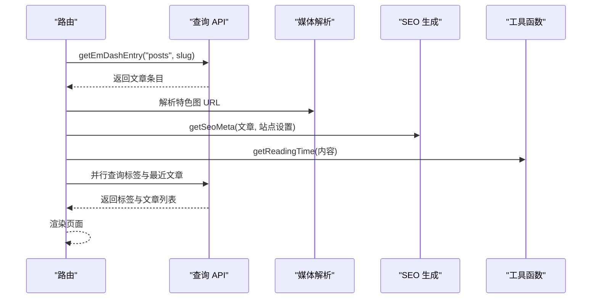
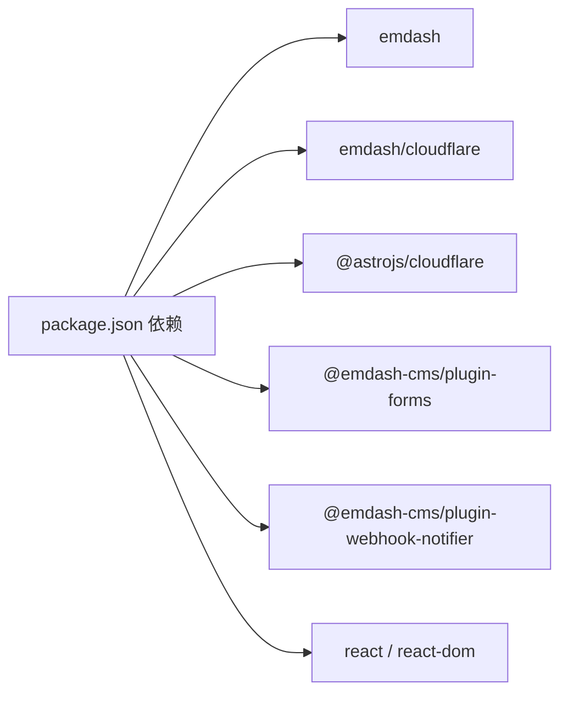

# 内容管理

<cite>
**本文引用的文件**
- [README.md](file://README.md)
- [package.json](file://package.json)
- [src/live.config.ts](file://src/live.config.ts)
- [src/worker.ts](file://src/worker.ts)
- [seed/seed.json](file://seed/seed.json)
- [src/utils/media.ts](file://src/utils/media.ts)
- [src/utils/constants.ts](file://src/utils/constants.ts)
- [src/utils/date.ts](file://src/utils/date.ts)
- [src/utils/reading-time.ts](file://src/utils/reading-time.ts)
- [src/pages/index.astro](file://src/pages/index.astro)
- [src/pages/posts/[slug].astro](file://src/pages/posts/[slug].astro)
- [src/pages/category/[slug].astro](file://src/pages/category/[slug].astro)
- [src/pages/tag/[slug].astro](file://src/pages/tag/[slug].astro)
- [src/pages/search.astro](file://src/pages/search.astro)
- [src/components/PostCard.astro](file://src/components/PostCard.astro)
</cite>

## 目录
1. [简介](#简介)
2. [项目结构](#项目结构)
3. [核心组件](#核心组件)
4. [架构总览](#架构总览)
5. [详细组件分析](#详细组件分析)
6. [依赖分析](#依赖分析)
7. [性能考量](#性能考量)
8. [故障排查指南](#故障排查指南)
9. [结论](#结论)
10. [附录](#附录)

## 简介
本文件面向内容编辑者与开发者，系统化阐述 EmDash CMS 在本模板中的使用方式与实现细节。内容覆盖：
- 内容模型定义（文章、页面、分类、标签）
- 实时内容集合与查询机制
- 文章、页面、分类、标签的管理与渲染流程
- Portable Text 内容结构、媒体处理与 SEO 优化
- 版本控制、草稿与批量操作的可用能力
- 开发者扩展接口与最佳实践

该站点基于 Astro 与 Cloudflare Workers 部署，采用 EmDash 运行时加载数据库内容，并通过 Astro 路由与组件进行渲染。

章节来源
- [README.md:1-68](file://README.md#L1-L68)

## 项目结构
项目采用 Astro + EmDash 的组合，核心组织如下：
- 运行时与内容加载：通过 live.config.ts 定义实时内容集合，使用 emdashLoader 加载数据库内容
- 页面路由：按内容类型与分类/标签归档提供路由
- 工具函数：媒体解析、日期格式化、阅读时长计算等
- 组件：文章卡片、图片渲染器等复用组件
- 种子数据：seed.json 定义内容模型、分类/标签、菜单、小部件区等

图表来源
- [src/live.config.ts:1-14](file://src/live.config.ts#L1-L14)
- [src/worker.ts:1-6](file://src/worker.ts#L1-L6)
- [seed/seed.json:1-939](file://seed/seed.json#L1-L939)
- [src/pages/posts/[slug].astro:1-980](file://src/pages/posts/[slug].astro#L1-L980)
- [src/pages/category/[slug].astro:1-93](file://src/pages/category/[slug].astro#L1-L93)
- [src/pages/tag/[slug].astro:1-95](file://src/pages/tag/[slug].astro#L1-L95)
- [src/pages/search.astro:1-183](file://src/pages/search.astro#L1-L183)
- [src/components/PostCard.astro:1-285](file://src/components/PostCard.astro#L1-L285)
- [src/utils/media.ts:1-39](file://src/utils/media.ts#L1-L39)
- [src/utils/date.ts:1-18](file://src/utils/date.ts#L1-L18)
- [src/utils/reading-time.ts:1-67](file://src/utils/reading-time.ts#L1-L67)

章节来源
- [src/live.config.ts:1-14](file://src/live.config.ts#L1-L14)
- [src/worker.ts:1-6](file://src/worker.ts#L1-L6)
- [seed/seed.json:1-939](file://seed/seed.json#L1-L939)

## 核心组件
- 实时内容集合
  - 通过 live.config.ts 定义名为 _emdash 的实时集合，使用 emdashLoader 从数据库加载内容，供 Astro 内容 API 查询
- 页面路由与渲染
  - 文章详情页：根据 slug 获取单条内容，生成 SEO 元信息，渲染 Portable Text，展示相关文章与评论
  - 分类/标签归档：按分类/标签筛选内容，批量查询标签，提升性能
  - 搜索页：使用全文检索 API 返回带高亮片段的结果
- 工具函数
  - 媒体解析：统一处理本地与外部图片 URL
  - 日期格式化：中文本地化显示
  - 阅读时长：基于 Portable Text 计算中英文混合阅读时长
- 组件
  - PostCard：文章卡片，支持缩略图、摘要、标签、作者等信息
  - ImageRenderer：图片渲染器，配合媒体解析使用

章节来源
- [src/live.config.ts:1-14](file://src/live.config.ts#L1-L14)
- [src/pages/posts/[slug].astro:1-980](file://src/pages/posts/[slug].astro#L1-L980)
- [src/pages/category/[slug].astro:1-93](file://src/pages/category/[slug].astro#L1-L93)
- [src/pages/tag/[slug].astro:1-95](file://src/pages/tag/[slug].astro#L1-L95)
- [src/pages/search.astro:1-183](file://src/pages/search.astro#L1-L183)
- [src/utils/media.ts:1-39](file://src/utils/media.ts#L1-L39)
- [src/utils/date.ts:1-18](file://src/utils/date.ts#L1-L18)
- [src/utils/reading-time.ts:1-67](file://src/utils/reading-time.ts#L1-L67)
- [src/components/PostCard.astro:1-285](file://src/components/PostCard.astro#L1-L285)

## 架构总览
EmDash CMS 在本模板中的运行链路：
- Cloudflare Worker 接收请求
- Astro 路由根据路径参数调用 EmDash 查询 API（如 getEmDashEntry、getEmDashCollection、search、getTerm 等）
- 实时集合 _emdash 通过 emdashLoader 从数据库加载内容
- 页面组件渲染内容，使用工具函数处理媒体、日期、阅读时长等
- SEO 元信息由 getSeoMeta 生成，结合站点设置与内容字段

图表来源
- [src/worker.ts:1-6](file://src/worker.ts#L1-L6)
- [src/pages/posts/[slug].astro:1-980](file://src/pages/posts/[slug].astro#L1-L980)
- [src/live.config.ts:1-14](file://src/live.config.ts#L1-L14)

## 详细组件分析

### 内容模型与种子数据（seed.json）
- 集合定义
  - posts：支持草稿、修订、搜索、SEO；字段包含标题、特色图、内容（Portable Text）、摘要
  - pages：支持草稿、修订、搜索；字段包含标题、内容（Portable Text）
- 分类与标签
  - 分类（category）：层级分类，应用于 posts
  - 标签（tag）：非层级，应用于 posts
- 其他
  - bylines：作者署名配置（编辑部、访客作者等）
  - menus：导航菜单项
  - widgetAreas：侧边栏/页脚等小部件区域
  - sections：主题片段（如订阅表单、作者简介）

章节来源
- [seed/seed.json:13-67](file://seed/seed.json#L13-L67)
- [seed/seed.json:68-115](file://seed/seed.json#L68-L115)
- [seed/seed.json:116-128](file://seed/seed.json#L116-L128)
- [seed/seed.json:129-151](file://seed/seed.json#L129-L151)
- [seed/seed.json:152-218](file://seed/seed.json#L152-L218)
- [seed/seed.json:219-274](file://seed/seed.json#L219-L274)

### 实时内容集合与查询（live.config.ts）
- 定义集合 _emdash，使用 emdashLoader 作为加载器
- 通过 Astro 内容 API 的 getEmDashEntry、getEmDashCollection、search、getTerm 等方法查询内容与分类/标签

章节来源
- [src/live.config.ts:1-14](file://src/live.config.ts#L1-L14)

### 文章详情页（posts/[slug].astro）
- 查询与校验
  - 使用 decodeSlug 处理参数，getEmDashEntry 获取文章，不存在则重定向 404
  - 设置缓存提示（cacheHint），启用缓存时写入
- 渲染与 SEO
  - 生成 SEO 元信息（标题、描述、OG 图等），默认 OG 图来自特色图
  - 作者信息、发布时间、阅读时长、标签、相关文章等
- 性能优化
  - 并行查询标签与最近文章，减少往返次数
  - 批量查询相关文章的标签，避免 N+1 查询

图表来源
- [src/pages/posts/[slug].astro:1-980](file://src/pages/posts/[slug].astro#L1-L980)
- [src/utils/media.ts:1-39](file://src/utils/media.ts#L1-L39)
- [src/utils/reading-time.ts:1-67](file://src/utils/reading-time.ts#L1-L67)

章节来源
- [src/pages/posts/[slug].astro:1-980](file://src/pages/posts/[slug].astro#L1-L980)
- [src/utils/media.ts:1-39](file://src/utils/media.ts#L1-L39)
- [src/utils/reading-time.ts:1-67](file://src/utils/reading-time.ts#L1-L67)

### 分类与标签归档（category/[slug].astro、tag/[slug].astro）
- 归档页逻辑
  - 通过 getTerm 获取分类/标签信息，不存在则 404
  - 使用 getEmDashCollection 按分类/标签筛选文章，按发布时间倒序
  - 批量查询每篇文章的标签，避免逐条查询
- 渲染
  - 展示分类/标签名称与文章数量，使用 ArchiveGrid 组件展示文章列表

章节来源
- [src/pages/category/[slug].astro:1-93](file://src/pages/category/[slug].astro#L1-L93)
- [src/pages/tag/[slug].astro:1-95](file://src/pages/tag/[slug].astro#L1-L95)

### 搜索页（search.astro）
- 使用 search API 进行全文检索（FTS），返回带高亮片段的结果
- 结果列表支持点击跳转至文章详情

章节来源
- [src/pages/search.astro:1-183](file://src/pages/search.astro#L1-L183)

### 组件与工具函数
- PostCard：用于文章列表与相关文章展示，支持作者、日期、阅读时长、标签等
- media.ts：统一解析媒体 URL，支持本地与外部图片
- date.ts：中文本地化日期格式化
- reading-time.ts：从 Portable Text 提取文本，计算中英文混合阅读时长

章节来源
- [src/components/PostCard.astro:1-285](file://src/components/PostCard.astro#L1-L285)
- [src/utils/media.ts:1-39](file://src/utils/media.ts#L1-L39)
- [src/utils/date.ts:1-18](file://src/utils/date.ts#L1-L18)
- [src/utils/reading-time.ts:1-67](file://src/utils/reading-time.ts#L1-L67)

## 依赖分析
- 运行时与部署
  - Cloudflare Workers（@astrojs/cloudflare）、D1 数据库、R2 存储
- 核心依赖
  - emdash、@emdash-cms/cloudflare、插件 forms/webhook notifier
- 开发与类型
  - Astro、React、Workers Types、Wrangler

图表来源
- [package.json:17-27](file://package.json#L17-L27)

章节来源
- [package.json:1-33](file://package.json#L1-33)

## 性能考量
- 并行查询
  - 文章详情页并行获取标签与最近文章，降低数据库往返成本
- 批量查询
  - 归档页对多篇文章一次性查询其标签，避免 N+1 查询
- 缓存提示
  - 使用 cacheHint 设置 Astro 缓存策略，提升响应速度
- 全文检索
  - 搜索页使用 FTS API，避免在前端加载全量内容进行匹配

章节来源
- [src/pages/posts/[slug].astro:84-109](file://src/pages/posts/[slug].astro#L84-L109)
- [src/pages/category/[slug].astro:25-36](file://src/pages/category/[slug].astro#L25-L36)
- [src/pages/tag/[slug].astro:25-35](file://src/pages/tag/[slug].astro#L25-L35)
- [src/pages/search.astro:9-15](file://src/pages/search.astro#L9-L15)

## 故障排查指南
- 404 页面
  - 当 slug 无效或内容不存在时，路由会重定向到 404
- 媒体 URL 为空
  - 若图片缺少 provider 或 storageKey，解析函数可能返回 undefined；请检查媒体字段是否正确
- 阅读时长异常
  - 确认 Portable Text 内容结构正确，包含 block 与 span 子节点
- SEO 元信息缺失
  - 确保 getSeoMeta 的输入包含必要字段（标题、描述、路径、默认 OG 图等）

章节来源
- [src/pages/posts/[slug].astro:25-37](file://src/pages/posts/[slug].astro#L25-L37)
- [src/utils/media.ts:5-30](file://src/utils/media.ts#L5-L30)
- [src/utils/reading-time.ts:34-59](file://src/utils/reading-time.ts#L34-L59)

## 结论
本模板以 EmDash 为核心，结合 Astro 与 Cloudflare Workers，提供了开箱即用的内容管理与渲染能力。通过实时内容集合、全文检索、并行与批量查询优化，以及完善的 SEO 支持，能够高效地构建高性能的静态/半静态博客站点。开发者可基于现有结构扩展内容模型、UI 组件与插件，内容编辑者可通过种子数据快速搭建内容体系。

## 附录

### 内容类型与字段说明（基于种子数据）
- posts
  - 字段：title（字符串，必填，可搜索）、featured_image（图片）、content（Portable Text，可搜索）、excerpt（文本）
  - 支持：草稿、修订、搜索、SEO
- pages
  - 字段：title（字符串，必填，可搜索）、content（Portable Text，可搜索）
  - 支持：草稿、修订、搜索

章节来源
- [seed/seed.json:13-67](file://seed/seed.json#L13-L67)

### 分类与标签
- 分类（category）：层级分类，应用于 posts
- 标签（tag）：非层级，应用于 posts

章节来源
- [seed/seed.json:68-115](file://seed/seed.json#L68-L115)

### Portable Text 最佳实践
- 结构建议
  - 使用 block 作为段落容器，children 中使用 span 表达文本
  - 合理使用标题、正文、引用、代码块等语义
- 性能与可读性
  - 控制块数量与嵌套深度，避免超大文档导致渲染与计算开销上升
  - 阅读时长计算已内置中英文混合处理，无需额外拆分

章节来源
- [seed/seed.json:327-400](file://seed/seed.json#L327-L400)
- [src/utils/reading-time.ts:34-59](file://src/utils/reading-time.ts#L34-L59)

### 媒体处理最佳实践
- 本地媒体
  - 使用 meta.storageKey 或 id 作为存储键，通过内部 API /_emdash/api/media/file/{key} 获取
- 外部媒体
  - 使用 provider: "external-url" 与 previewUrl，解析函数会直接返回该 URL
- 图片尺寸与可访问性
  - 建议提供 width/height 以避免布局抖动
  - 为图片提供 alt 文本

章节来源
- [src/utils/media.ts:5-30](file://src/utils/media.ts#L5-L30)
- [seed/seed.json:320-326](file://seed/seed.json#L320-L326)

### SEO 优化要点
- 标题与描述
  - 使用 getSeoMeta 自动生成，传入站点标题、URL、路径与默认 OG 图
- 结构化数据
  - 可结合文章的发布时间、修改时间等字段生成 article 类型的结构化数据
- 可索引性
  - 通过 robots 参数控制搜索引擎抓取行为

章节来源
- [src/pages/posts/[slug].astro:71-76](file://src/pages/posts/[slug].astro#L71-L76)

### 版本控制、草稿与批量操作
- 草稿与修订
  - posts 与 pages 集合声明支持 drafts 与 revisions，可在后台管理中使用
- 批量操作
  - 归档页与文章详情页展示了批量查询标签与相关文章的模式，便于扩展批量更新/导出等能力

章节来源
- [seed/seed.json:18-50](file://seed/seed.json#L18-L50)
- [src/pages/category/[slug].astro:25-36](file://src/pages/category/[slug].astro#L25-L36)
- [src/pages/tag/[slug].astro:25-35](file://src/pages/tag/[slug].astro#L25-L35)
- [src/pages/posts/[slug].astro:84-109](file://src/pages/posts/[slug].astro#L84-L109)

### 开发者扩展接口
- 实时集合
  - 在 live.config.ts 中定义集合与加载器
- 查询 API
  - getEmDashEntry、getEmDashCollection、search、getTerm、getEntryTerms、getTermsForEntries 等
- Worker 入口
  - 通过 src/worker.ts 导出 Cloudflare Worker 入口与插件桥接

章节来源
- [src/live.config.ts:1-14](file://src/live.config.ts#L1-L14)
- [src/worker.ts:1-6](file://src/worker.ts#L1-L6)