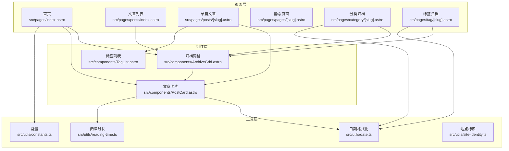
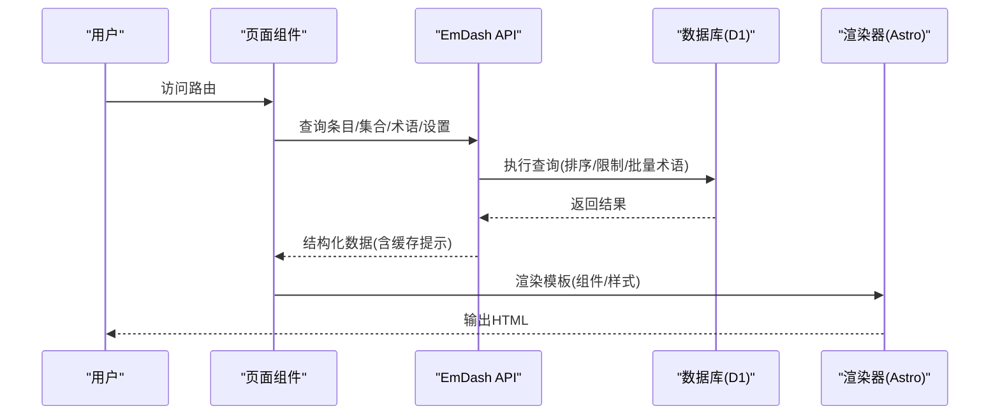
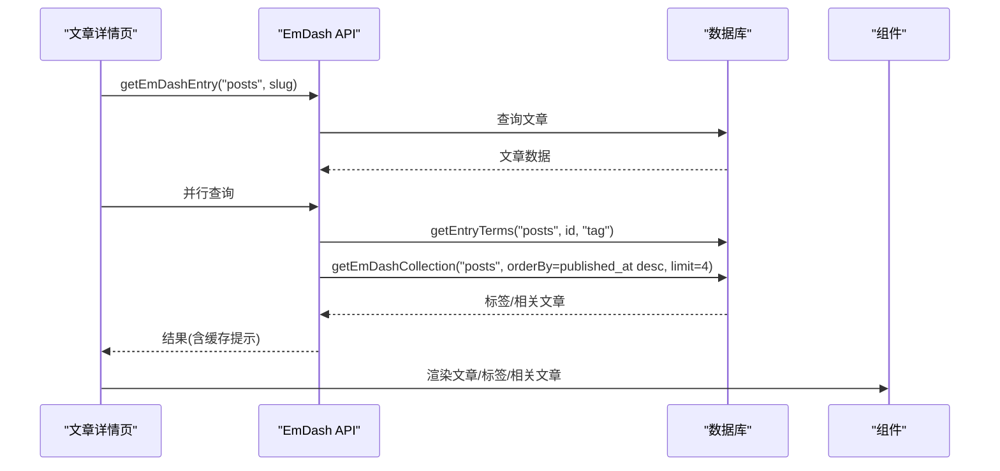
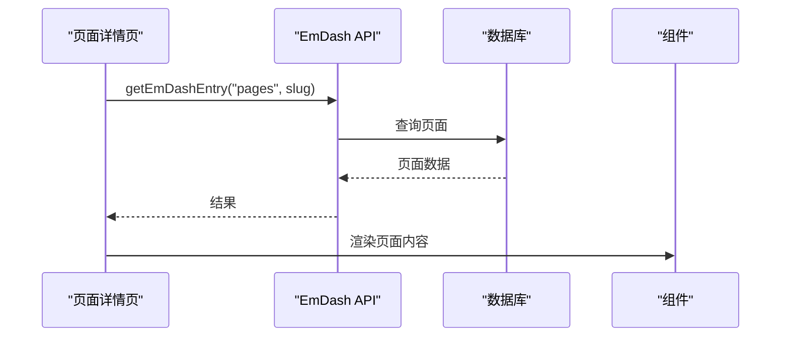
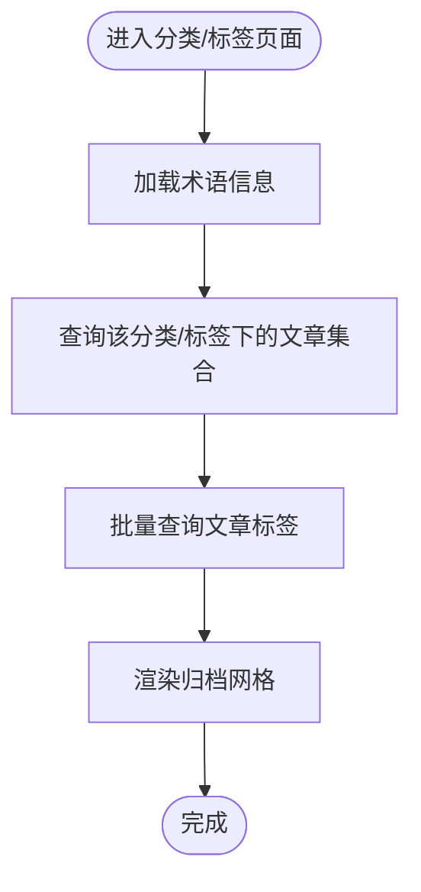
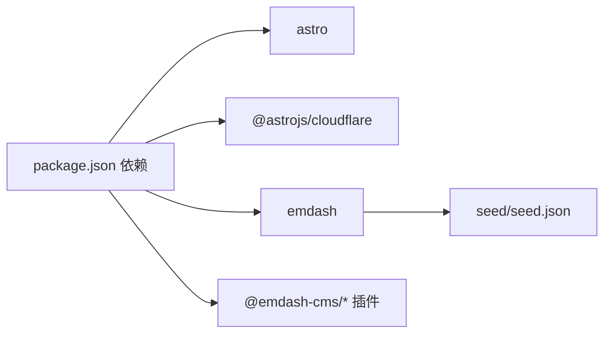

# 内容类型管理

<cite>
**本文档引用的文件**
- [README.md](file://README.md)
- [package.json](file://package.json)
- [src/pages/index.astro](file://src/pages/index.astro)
- [src/pages/posts/[slug].astro](file://src/pages/posts/[slug].astro)
- [src/pages/posts/index.astro](file://src/pages/posts/index.astro)
- [src/pages/pages/[slug].astro](file://src/pages/pages/[slug].astro)
- [src/pages/category/[slug].astro](file://src/pages/category/[slug].astro)
- [src/pages/tag/[slug].astro](file://src/pages/tag/[slug].astro)
- [src/components/ArchiveGrid.astro](file://src/components/ArchiveGrid.astro)
- [src/components/PostCard.astro](file://src/components/PostCard.astro)
- [src/components/TagList.astro](file://src/components/TagList.astro)
- [src/utils/constants.ts](file://src/utils/constants.ts)
- [src/utils/date.ts](file://src/utils/date.ts)
- [src/utils/reading-time.ts](file://src/utils/reading-time.ts)
- [src/utils/site-identity.ts](file://src/utils/site-identity.ts)
- [seed/seed.json](file://seed/seed.json)
</cite>

## 目录
1. [简介](#简介)
2. [项目结构](#项目结构)
3. [核心组件](#核心组件)
4. [架构总览](#架构总览)
5. [详细组件分析](#详细组件分析)
6. [依赖分析](#依赖分析)
7. [性能考虑](#性能考虑)
8. [故障排除指南](#故障排除指南)
9. [结论](#结论)
10. [附录](#附录)

## 简介
本文件系统性梳理该博客模板中的内容类型管理方案，覆盖文章（posts）、页面（pages）、分类（category）与标签（tag）四类核心内容类型。文档从路由配置、模板渲染、数据处理到内容创建与编辑、生命周期管理、扩展开发等方面进行深入解析，并提供查询优化、批量操作与相关推荐等实践建议。

## 项目结构
该站点基于 Astro 与 EmDash 运行时，采用按页面组织的路由结构，配合可复用组件与工具函数实现统一的数据访问与渲染逻辑。核心页面包括首页、文章列表、单篇文章、静态页面、分类归档与标签归档；通用组件用于归档网格、文章卡片与标签列表；工具模块负责日期格式化、阅读时长计算与站点标识解析。

**图表来源**
- [src/pages/index.astro:1-463](file://src/pages/index.astro#L1-L463)
- [src/pages/posts/index.astro:1-269](file://src/pages/posts/index.astro#L1-L269)
- [src/pages/posts/[slug].astro](file://src/pages/posts/[slug].astro#L1-L980)
- [src/pages/pages/[slug].astro](file://src/pages/pages/[slug].astro#L1-L109)
- [src/pages/category/[slug].astro](file://src/pages/category/[slug].astro#L1-L93)
- [src/pages/tag/[slug].astro](file://src/pages/tag/[slug].astro#L1-L95)
- [src/components/ArchiveGrid.astro:1-64](file://src/components/ArchiveGrid.astro#L1-L64)
- [src/components/PostCard.astro:1-285](file://src/components/PostCard.astro#L1-L285)
- [src/components/TagList.astro:1-46](file://src/components/TagList.astro#L1-L46)
- [src/utils/constants.ts:1-9](file://src/utils/constants.ts#L1-L9)
- [src/utils/date.ts:1-18](file://src/utils/date.ts#L1-L18)
- [src/utils/reading-time.ts:1-67](file://src/utils/reading-time.ts#L1-L67)
- [src/utils/site-identity.ts:1-25](file://src/utils/site-identity.ts#L1-L25)

**章节来源**
- [README.md:20-31](file://README.md#L20-L31)
- [package.json:1-33](file://package.json#L1-L33)

## 核心组件
- 文章集合与归档
  - 首页与文章列表通过统一的集合查询接口获取文章数据，并使用批量术语查询减少往返次数。
  - 归档网格组件负责在分类与标签页面渲染文章列表，支持响应式布局与标签展示。
- 单篇文章详情
  - 通过条目查询获取文章内容、SEO 元数据、阅读时长、作者信息与相关文章，采用并行查询提升性能。
- 静态页面
  - 页面类型不参与分类/标签体系，直接渲染 Portable Text 内容。
- 工具函数
  - 日期格式化：本地化输出中文日期字符串。
  - 阅读时长：支持中英文混合文本的字词统计与估算。
  - 常量：断点与分页数量等前端渲染参数。
  - 站点标识：解析站点标题、副标题与 Logo。

**章节来源**
- [src/pages/index.astro:1-463](file://src/pages/index.astro#L1-L463)
- [src/pages/posts/index.astro:1-269](file://src/pages/posts/index.astro#L1-L269)
- [src/pages/posts/[slug].astro](file://src/pages/posts/[slug].astro#L1-L980)
- [src/pages/pages/[slug].astro](file://src/pages/pages/[slug].astro#L1-L109)
- [src/pages/category/[slug].astro](file://src/pages/category/[slug].astro#L1-L93)
- [src/pages/tag/[slug].astro](file://src/pages/tag/[slug].astro#L1-L95)
- [src/components/ArchiveGrid.astro:1-64](file://src/components/ArchiveGrid.astro#L1-L64)
- [src/components/PostCard.astro:1-285](file://src/components/PostCard.astro#L1-L285)
- [src/utils/date.ts:1-18](file://src/utils/date.ts#L1-L18)
- [src/utils/reading-time.ts:1-67](file://src/utils/reading-time.ts#L1-L67)
- [src/utils/constants.ts:1-9](file://src/utils/constants.ts#L1-L9)
- [src/utils/site-identity.ts:1-25](file://src/utils/site-identity.ts#L1-L25)

## 架构总览
EmDash 提供统一的内容访问 API，页面通过这些 API 获取条目、集合、术语与站点设置，再交由 Astro 模板渲染。组件层负责复用展示逻辑，工具层提供日期、阅读时长等辅助能力。

**图表来源**
- [src/pages/index.astro:19-68](file://src/pages/index.astro#L19-L68)
- [src/pages/posts/index.astro:9-28](file://src/pages/posts/index.astro#L9-L28)
- [src/pages/posts/[slug].astro](file://src/pages/posts/[slug].astro#L31-L112)
- [src/pages/category/[slug].astro](file://src/pages/category/[slug].astro#L18-L36)
- [src/pages/tag/[slug].astro](file://src/pages/tag/[slug].astro#L18-L35)

## 详细组件分析

### 文章（posts）
- 路由与入口
  - 首页与文章列表：通过集合查询获取文章并按发布时间倒序排列，首页额外进行特色文章与网格文章的拆分。
  - 单篇文章：通过条目查询获取文章详情，同时并行获取标签与相关文章，使用批量术语查询减少往返。
- 模板渲染
  - 使用文章卡片组件渲染摘要、标签与作者信息；单篇详情页包含侧边栏目录、评论区与相关文章推荐。
- 数据处理
  - 阅读时长：从 Portable Text 中提取纯文本，分别统计英文单词与中日韩字符，按不同速率换算分钟数。
  - 日期格式化：使用本地化方法输出中文日期字符串。
- 关联查询
  - 批量术语查询：在首页、文章列表与归档页面，一次性查询多篇文章的标签，避免 N+1 查询。
  - 相关文章：基于当前文章的标签集合，筛选其他文章并取前若干条作为推荐。

**图表来源**
- [src/pages/posts/[slug].astro](file://src/pages/posts/[slug].astro#L84-L109)

**章节来源**
- [src/pages/index.astro:19-68](file://src/pages/index.astro#L19-L68)
- [src/pages/posts/index.astro:9-28](file://src/pages/posts/index.astro#L9-L28)
- [src/pages/posts/[slug].astro](file://src/pages/posts/[slug].astro#L1-L980)
- [src/utils/reading-time.ts:51-59](file://src/utils/reading-time.ts#L51-L59)
- [src/utils/date.ts:7-17](file://src/utils/date.ts#L7-L17)
- [src/components/PostCard.astro:1-285](file://src/components/PostCard.astro#L1-L285)

### 页面（pages）
- 路由与入口
  - 静态页面路由为 `/pages/:slug`，通过条目查询获取页面内容并渲染。
- 模板渲染
  - 直接渲染 Portable Text 内容，不涉及分类/标签或作者信息。
- 数据处理
  - 无需批量术语查询，渲染逻辑简洁。

**图表来源**
- [src/pages/pages/[slug].astro](file://src/pages/pages/[slug].astro#L12-L18)

**章节来源**
- [src/pages/pages/[slug].astro](file://src/pages/pages/[slug].astro#L1-L109)

### 分类（category）与标签（tag）
- 路由与入口
  - 分类归档：`/category/:slug`，根据术语 slug 查询该分类下的所有文章。
  - 标签归档：`/tag/:slug`，根据术语 slug 查询该标签下的所有文章。
- 模板渲染
  - 使用归档网格组件渲染文章列表，支持响应式布局与标签展示。
- 数据处理
  - 批量术语查询：一次性查询归档内所有文章的标签，避免逐条查询。
  - 日期格式化：用于显示文章发布日期。

**图表来源**
- [src/pages/category/[slug].astro](file://src/pages/category/[slug].astro#L18-L36)
- [src/pages/tag/[slug].astro](file://src/pages/tag/[slug].astro#L18-L35)

**章节来源**
- [src/pages/category/[slug].astro](file://src/pages/category/[slug].astro#L1-L93)
- [src/pages/tag/[slug].astro](file://src/pages/tag/[slug].astro#L1-L95)
- [src/components/ArchiveGrid.astro:1-64](file://src/components/ArchiveGrid.astro#L1-L64)
- [src/utils/date.ts:7-17](file://src/utils/date.ts#L7-L17)

### 组件与工具
- 归档网格（ArchiveGrid）
  - 接收文章数组与对应标签，渲染网格布局，支持空状态提示。
- 文章卡片（PostCard）
  - 展示标题、摘要、缩略图、日期、阅读时长与标签；支持作者头像与多作者提示。
- 标签列表（TagList）
  - 渲染标签云，每个标签链接到对应归档。
- 工具函数
  - 日期格式化：本地化输出中文日期。
  - 阅读时长：中英文混合文本的字词统计与估算。
  - 常量：断点与分页数量。
  - 站点标识：解析站点标题、副标题与 Logo。

**章节来源**
- [src/components/ArchiveGrid.astro:1-64](file://src/components/ArchiveGrid.astro#L1-L64)
- [src/components/PostCard.astro:1-285](file://src/components/PostCard.astro#L1-L285)
- [src/components/TagList.astro:1-46](file://src/components/TagList.astro#L1-L46)
- [src/utils/date.ts:1-18](file://src/utils/date.ts#L1-L18)
- [src/utils/reading-time.ts:1-67](file://src/utils/reading-time.ts#L1-L67)
- [src/utils/constants.ts:1-9](file://src/utils/constants.ts#L1-L9)
- [src/utils/site-identity.ts:1-25](file://src/utils/site-identity.ts#L1-L25)

## 依赖分析
- 运行时与框架
  - Astro 与 @astrojs/cloudflare 提供静态生成与 Cloudflare Workers 部署能力。
  - EmDash 提供内容访问 API、UI 组件与插件生态。
- 本地开发与部署
  - 通过 Wrangler 部署至 Cloudflare D1/R2。
- 内容模型与种子
  - 种子文件定义了 posts 与 pages 两类集合，以及 category 与 tag 两类术语体系，包含默认分类与标签、作者身份、菜单与挂件区域等。

**图表来源**
- [package.json:17-27](file://package.json#L17-L27)
- [seed/seed.json:13-115](file://seed/seed.json#L13-L115)

**章节来源**
- [package.json:1-33](file://package.json#L1-L33)
- [seed/seed.json:1-939](file://seed/seed.json#L1-L939)

## 性能考虑
- 查询优化
  - 数据库排序优先：在集合查询中使用数据库排序与限制，避免客户端全量扫描。
  - 批量术语查询：在首页、文章列表与归档页面使用批量术语查询，显著降低往返次数。
  - 并行查询：单篇文章详情页中，标签与相关文章查询采用并行执行，缩短首屏渲染时间。
- 缓存策略
  - 页面可通过缓存提示设置浏览器与边缘缓存，提升重复访问性能。
- 前端渲染优化
  - 响应式网格：归档网格与文章卡片在不同断点下自动调整列数，兼顾桌面与移动端体验。
  - 阅读时长与日期格式化：在客户端进行轻量计算与本地化，减少服务端负担。

**章节来源**
- [src/pages/index.astro:19-68](file://src/pages/index.astro#L19-L68)
- [src/pages/posts/index.astro:9-28](file://src/pages/posts/index.astro#L9-L28)
- [src/pages/posts/[slug].astro](file://src/pages/posts/[slug].astro#L84-L109)
- [src/components/ArchiveGrid.astro:42-62](file://src/components/ArchiveGrid.astro#L42-L62)
- [src/utils/reading-time.ts:51-59](file://src/utils/reading-time.ts#L51-L59)
- [src/utils/date.ts:7-17](file://src/utils/date.ts#L7-L17)

## 故障排除指南
- 404 处理
  - 当条目不存在或 slug 解码失败时，页面重定向至 404，确保用户体验一致。
- 缓存问题
  - 若启用缓存，需确保缓存提示正确设置，避免陈旧内容被缓存。
- 术语查询异常
  - 分类/标签归档页面若返回空集，检查术语 slug 是否正确且数据库中存在对应条目。
- 阅读时长显示异常
  - 确认 Portable Text 内容结构正确，避免非文本块导致统计偏差。

**章节来源**
- [src/pages/posts/[slug].astro](file://src/pages/posts/[slug].astro#L25-L35)
- [src/pages/pages/[slug].astro](file://src/pages/pages/[slug].astro#L8-L16)
- [src/pages/category/[slug].astro](file://src/pages/category/[slug].astro#L14-L16)
- [src/pages/tag/[slug].astro](file://src/pages/tag/[slug].astro#L14-L16)

## 结论
该模板以 EmDash 为核心，围绕文章、页面、分类与标签构建了清晰的内容类型管理体系。通过数据库排序、批量术语查询与并行请求等策略，有效提升了渲染性能与用户体验。组件化与工具函数的设计使得内容展示与数据处理高度解耦，便于扩展与维护。

## 附录

### 路由与页面映射
- 首页：`/`
- 全部文章：`/posts`
- 单篇文章：`/posts/:slug`
- 分类归档：`/category/:slug`
- 标签归档：`/tag/:slug`
- 静态页面：`/pages/:slug`
- 404：回退

**章节来源**
- [README.md:22-31](file://README.md#L22-L31)

### 内容类型与字段定义
- 文章（posts）
  - 字段：标题、特色图、内容（Portable Text）、摘要
  - 支持：草稿、修订、搜索、SEO
- 页面（pages）
  - 字段：标题、内容（Portable Text）
  - 支持：草稿、修订、搜索
- 术语（taxonomies）
  - 分类（category）：层级分类，应用于文章
  - 标签（tag）：非层级标签，应用于文章

**章节来源**
- [seed/seed.json:13-66](file://seed/seed.json#L13-L66)
- [seed/seed.json:68-115](file://seed/seed.json#L68-L115)

### 内容创建与编辑操作指南
- 创建新文章
  - 在后台新建文章，填写标题、内容与摘要，选择分类与标签，上传特色图。
- 发布流程
  - 保存为草稿或直接发布；发布后可通过集合查询在首页与文章列表中可见。
- 编辑与修订
  - 利用草稿与修订功能进行迭代，最终发布更新版本。
- 批量操作
  - 可通过集合查询与术语批量查询接口进行批量筛选与更新。

**章节来源**
- [seed/seed.json:13-66](file://seed/seed.json#L13-L66)
- [src/pages/index.astro:19-68](file://src/pages/index.astro#L19-L68)
- [src/pages/posts/index.astro:9-28](file://src/pages/posts/index.astro#L9-L28)

### 内容类型扩展开发指南
- 自定义字段
  - 在种子文件中为集合添加新字段，确保字段类型与业务需求匹配。
- 模板定制
  - 新增页面或修改现有页面模板，使用 EmDash API 获取数据并渲染。
- 查询优化
  - 优先在数据库层进行排序与限制，避免 N+1 查询；使用批量术语查询合并多次请求。
- 相关推荐
  - 基于标签交集或共同分类进行相关文章推荐，结合阅读时长与日期格式化提升展示质量。

**章节来源**
- [seed/seed.json:13-66](file://seed/seed.json#L13-L66)
- [src/pages/posts/[slug].astro](file://src/pages/posts/[slug].astro#L84-L109)
- [src/utils/reading-time.ts:51-59](file://src/utils/reading-time.ts#L51-L59)
- [src/utils/date.ts:7-17](file://src/utils/date.ts#L7-L17)