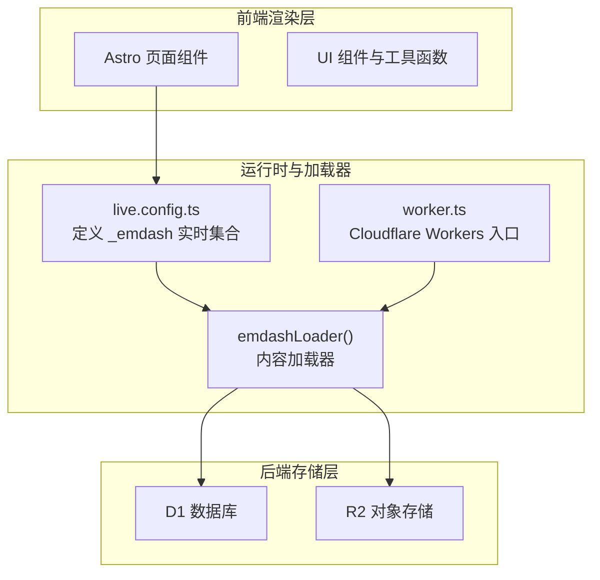
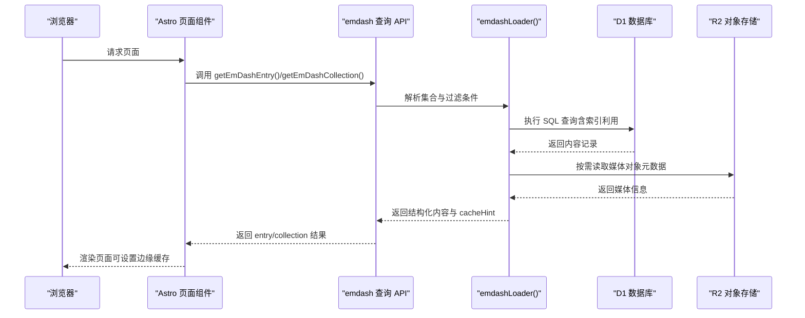
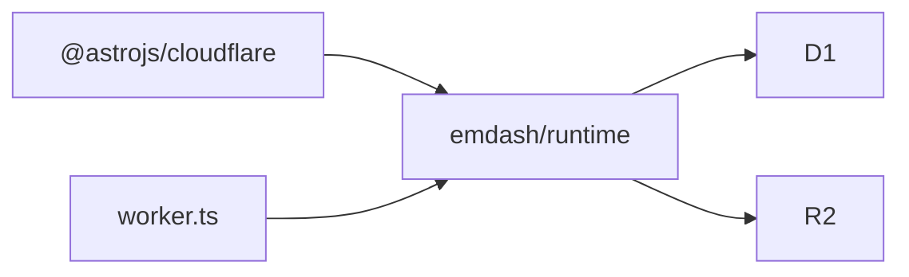

# 实时内容加载

<cite>
**本文引用的文件**
- [README.md](file://README.md)
- [package.json](file://package.json)
- [src/live.config.ts](file://src/live.config.ts)
- [src/worker.ts](file://src/worker.ts)
- [emdash-env.d.ts](file://emdash-env.d.ts)
- [worker-configuration.d.ts](file://worker-configuration.d.ts)
- [.agents/skills/building-emdash-site/references/querying-and-rendering.md](file://.agents/skills/building-emdash-site/references/querying-and-rendering.md)
- [.agents/skills/building-emdash-site/references/configuration.md](file://.agents/skills/building-emdash-site/references/configuration.md)
- [.agents/skills/building-emdash-site/SKILL.md](file://.agents/skills/building-emdash-site/SKILL.md)
- [src/pages/posts/[slug].astro](file://src/pages/posts/[slug].astro)
- [src/pages/posts/index.astro](file://src/pages/posts/index.astro)
- [src/pages/category/[slug].astro](file://src/pages/category/[slug].astro)
- [src/pages/tag/[slug].astro](file://src/pages/tag/[slug].astro)
</cite>

## 目录
1. [简介](#简介)
2. [项目结构](#项目结构)
3. [核心组件](#核心组件)
4. [架构总览](#架构总览)
5. [详细组件分析](#详细组件分析)
6. [依赖分析](#依赖分析)
7. [性能考虑](#性能考虑)
8. [故障排查指南](#故障排查指南)
9. [结论](#结论)
10. [附录](#附录)

## 简介
本文件系统性阐述 EmDash 在 Cloudflare Workers 上的实时内容加载机制，重点覆盖以下方面：
- emdashLoader 的工作机制与数据来源（D1 数据库、R2 存储）
- 内容查询 API：getEmDashCollection() 与 getEmDashEntry() 的参数、排序与过滤
- 实时同步与缓存策略：变更检测、增量更新与缓存失效
- 性能优化：查询优化、数据预加载、边缘缓存配置
- 错误处理与降级策略：稳定性与可靠性保障

## 项目结构
该模板基于 Astro 与 @astrojs/cloudflare 部署在 Cloudflare Workers，内容由 emdash runtime 提供实时查询能力，并通过 D1 与 R2 作为持久化存储。

图表来源
- [src/live.config.ts:1-14](file://src/live.config.ts#L1-L14)
- [src/worker.ts:1-6](file://src/worker.ts#L1-L6)
- [worker-configuration.d.ts:1-10](file://worker-configuration.d.ts#L1-L10)

章节来源
- [README.md:40-46](file://README.md#L40-L46)
- [package.json:17-27](file://package.json#L17-L27)
- [src/live.config.ts:1-14](file://src/live.config.ts#L1-L14)
- [src/worker.ts:1-6](file://src/worker.ts#L1-L6)
- [worker-configuration.d.ts:5-8](file://worker-configuration.d.ts#L5-L8)

## 核心组件
- 实时内容集合注册：通过 live.config.ts 将所有内容类型统一注册到单集合 _emdash，并使用 emdashLoader() 作为数据加载器。
- 查询 API：getEmDashCollection() 与 getEmDashEntry() 提供多条目与单条目查询，返回 entries、entry、cacheHint 等字段，支持分页游标、排序与过滤。
- 类型系统：emdash-env.d.ts 自动生成站点内容类型的 TypeScript 类型，确保开发期安全。
- 边缘运行时：worker.ts 暴露 Cloudflare Workers 入口与插件桥接，配合 D1/R2 环境变量进行内容读取与媒体访问。

章节来源
- [src/live.config.ts:1-14](file://src/live.config.ts#L1-L14)
- [.agents/skills/building-emdash-site/references/querying-and-rendering.md:7-47](file://.agents/skills/building-emdash-site/references/querying-and-rendering.md#L7-L47)
- [emdash-env.d.ts:1-39](file://emdash-env.d.ts#L1-L39)
- [src/worker.ts:1-6](file://src/worker.ts#L1-L6)
- [worker-configuration.d.ts:5-8](file://worker-configuration.d.ts#L5-L8)

## 架构总览
EmDash 在 Cloudflare Workers 中的实时内容加载路径如下：

图表来源
- [src/pages/posts/[slug].astro:31](file://src/pages/posts/[slug].astro#L31)
- [src/pages/posts/index.astro:9-13](file://src/pages/posts/index.astro#L9-L13)
- [worker-configuration.d.ts:5-8](file://worker-configuration.d.ts#L5-L8)

## 详细组件分析

### emdashLoader 工作机制
- 集合注册：通过 defineLiveCollection({ loader: emdashLoader() }) 将所有内容类型统一接入 _emdash 集合，查询时按集合名筛选。
- 数据来源：Loader 从 D1 读取内容记录，结合 R2 获取媒体资源元信息；在 Cloudflare Workers 环境下，通过 Env.MEDIA 与 Env.DB 访问。
- 缓存提示：Loader 返回的 cacheHint 可用于 Astro.cache.set() 设置边缘缓存策略，提升命中率与响应速度。

章节来源
- [src/live.config.ts:8-13](file://src/live.config.ts#L8-L13)
- [worker-configuration.d.ts:5-8](file://worker-configuration.d.ts#L5-L8)
- [src/pages/posts/[slug].astro:37](file://src/pages/posts/[slug].astro#L37)

### 查询 API：getEmDashCollection() 与 getEmDashEntry()
- getEmDashCollection(collection, options)
  - 支持参数：status、limit、cursor、orderBy、where、locale
  - 排序：默认按 created_at 降序，可在 orderBy 中指定 published_at 等字段
  - 过滤：where 支持字段值或分类法术语匹配；数组形式表示 OR 条件
  - 返回：entries、nextCursor（用于分页）、error、cacheHint
- getEmDashEntry(collection, slug)
  - 支持参数：slug、preview（预览模式）
  - 返回：entry、error、isPreview、cacheHint

章节来源
- [.agents/skills/building-emdash-site/references/querying-and-rendering.md:7-47](file://.agents/skills/building-emdash-site/references/querying-and-rendering.md#L7-L47)
- [.agents/skills/building-emdash-site/SKILL.md:72-116](file://.agents/skills/building-emdash-site/SKILL.md#L72-L116)

### 内容查询示例与最佳实践
- 单文章页：使用 getEmDashEntry() 获取文章主体，同时并发请求标签与相关文章，减少往返次数。
- 文章列表：在数据库侧按 published_at 降序排序，避免客户端全表扫描。
- 分类/标签归档：通过 where 过滤分类或标签，再批量获取标签映射，降低查询轮次。

章节来源
- [src/pages/posts/[slug].astro:84-L109](file://src/pages/posts/[slug].astro#L84-L109)
- [src/pages/posts/index.astro:7-28](file://src/pages/posts/index.astro#L7-L28)
- [src/pages/category/[slug].astro:18-L36](file://src/pages/category/[slug].astro#L18-L36)
- [src/pages/tag/[slug].astro:18-L35](file://src/pages/tag/[slug].astro#L18-L35)

### 实时同步与缓存策略
- 变更检测：内容状态变化（如发布/取消发布）会触发 Loader 重新拉取最新记录。
- 增量更新：通过 nextCursor 实现键集分页，仅拉取新增或变更的数据片段。
- 缓存失效：根据 cacheHint 设置边缘缓存策略；当内容更新时，应确保缓存头正确失效以保证一致性。

章节来源
- [.agents/skills/building-emdash-site/references/querying-and-rendering.md:9-24](file://.agents/skills/building-emdash-site/references/querying-and-rendering.md#L9-L24)
- [src/pages/posts/[slug].astro:37](file://src/pages/posts/[slug].astro#L37)
- [src/pages/posts/index.astro:13](file://src/pages/posts/index.astro#L13)
- [src/pages/category/[slug].astro:23](file://src/pages/category/[slug].astro#L23)
- [src/pages/tag/[slug].astro:23](file://src/pages/tag/[slug].astro#L23)

### 数据模型与类型系统
- emdash-env.d.ts 定义了站点内容类型（如 posts、pages），包含 id、slug、status、title、content、excerpt、bylines、时间戳等字段。
- 通过 declare module "emdash" 的接口扩展，确保查询结果与 UI 组件消费的数据结构一致。

章节来源
- [emdash-env.d.ts:8-39](file://emdash-env.d.ts#L8-L39)
- [.agents/skills/building-emdash-site/references/configuration.md:140-173](file://.agents/skills/building-emdash-site/references/configuration.md#L140-L173)

## 依赖分析
- 运行时与框架
  - @astrojs/cloudflare：为 Astro 提供 Cloudflare Workers 适配
  - emdash/runtime：提供内容加载器与查询 API
  - @emdash-cms/cloudflare：Cloudflare 环境下的插件与沙箱能力
- 存储依赖
  - D1：关系型数据库，承载内容与元数据
  - R2：对象存储，承载媒体文件与二进制资源

图表来源
- [package.json:17-27](file://package.json#L17-L27)
- [src/worker.ts:1-6](file://src/worker.ts#L1-L6)
- [worker-configuration.d.ts:5-8](file://worker-configuration.d.ts#L5-L8)

章节来源
- [package.json:17-27](file://package.json#L17-L27)
- [src/worker.ts:1-6](file://src/worker.ts#L1-L6)
- [worker-configuration.d.ts:5-8](file://worker-configuration.d.ts#L5-L8)

## 性能考虑
- 查询优化
  - 在数据库侧排序与过滤，避免客户端全量扫描
  - 使用 where 的数组 OR 条件合并多个分类/标签查询
- 并发与批处理
  - 并发请求独立数据源（如标签与相关文章），减少总等待时间
  - 使用 getTermsForEntries 批量获取多条目的分类法映射
- 边缘缓存
  - 利用 cacheHint 设置 Astro.cache，提升静态/半静态内容的边缘命中率
  - 对高频访问的列表页与详情页启用合适的缓存策略
- 数据预加载
  - 在列表页预取必要字段（如 bylines、excerpt、publishedAt），减少二次查询

章节来源
- [src/pages/posts/[slug].astro:84-L109](file://src/pages/posts/[slug].astro#L84-L109)
- [src/pages/posts/index.astro:7-28](file://src/pages/posts/index.astro#L7-L28)
- [src/pages/category/[slug].astro:18-L36](file://src/pages/category/[slug].astro#L18-L36)
- [src/pages/tag/[slug].astro:18-L35](file://src/pages/tag/[slug].astro#L18-L35)

## 故障排查指南
- 404 处理
  - 当 getEmDashEntry() 未找到内容时，应重定向至 404 页面
- 环境变量与存储
  - 确认 Worker 环境中存在 MEDIA 与 DB 句柄，否则 Loader 无法读取 R2 与 D1
- 缓存问题
  - 若边缘缓存导致内容不更新，检查 cacheHint 与缓存头设置；必要时主动失效
- 查询异常
  - 使用返回的 error 字段定位问题；对 orderBy/where 参数进行最小复现验证

章节来源
- [src/pages/posts/[slug].astro:33-L35](file://src/pages/posts/[slug].astro#L33-L35)
- [worker-configuration.d.ts:5-8](file://worker-configuration.d.ts#L5-L8)

## 结论
EmDash 在 Cloudflare Workers 上通过 emdashLoader() 将内容查询与渲染解耦，结合 D1/R2 实现高性能、低延迟的内容加载。借助 Astro 的边缘缓存与并发查询策略，可显著提升用户体验。遵循本文的查询规范、缓存策略与故障排查方法，可确保内容加载的稳定性与可靠性。

## 附录
- 开发与部署
  - 本地开发与部署命令见根目录 README
- CLI 与草稿发布
  - CLI 默认自动发布，支持草稿与调度发布流程

章节来源
- [README.md:47-68](file://README.md#L47-L68)
- [.agents/skills/emdash-cli/SKILL.md:121-246](file://.agents/skills/emdash-cli/SKILL.md#L121-L246)