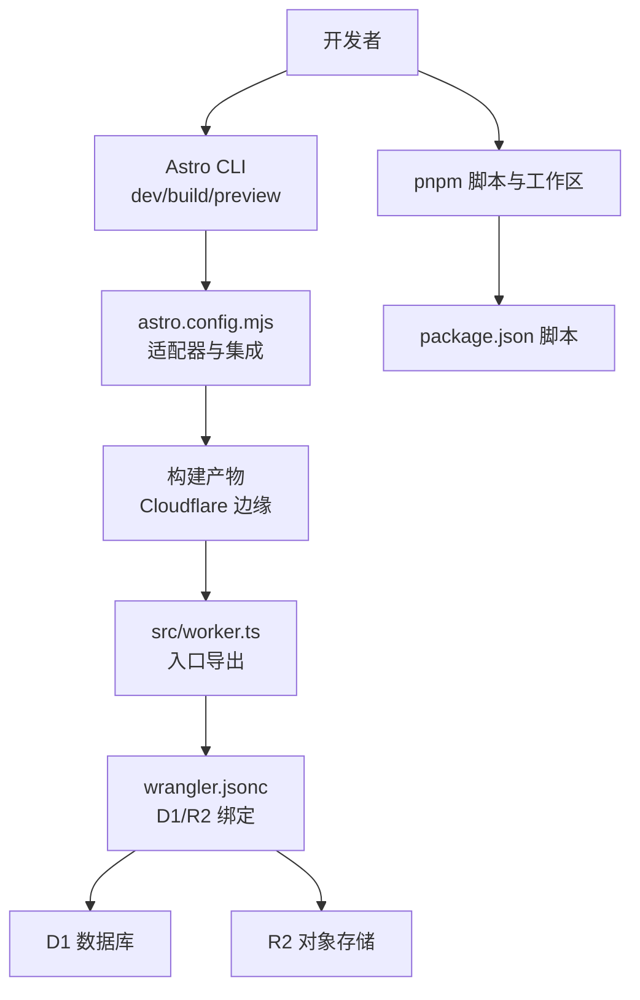
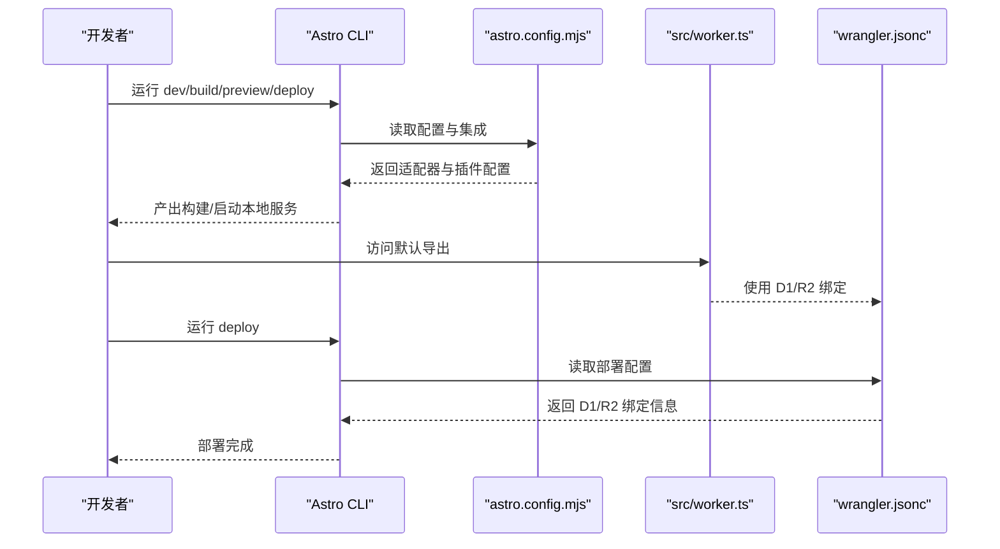
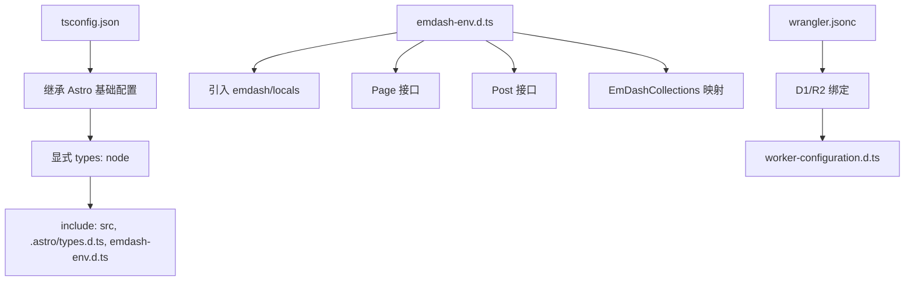
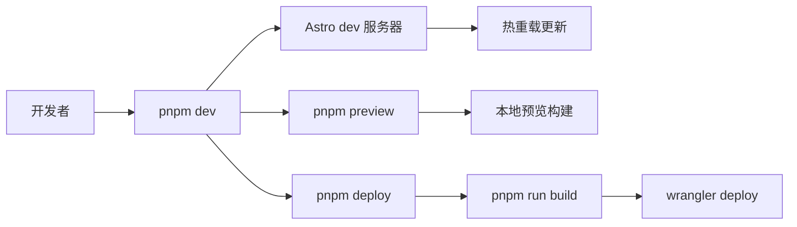
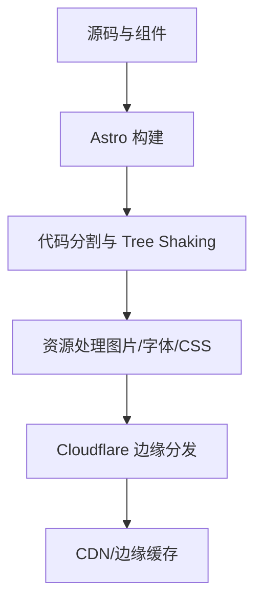
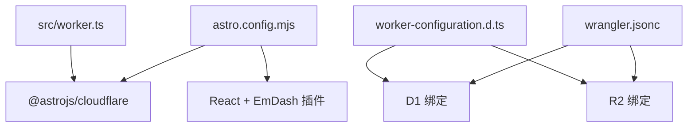

# 开发工具

<cite>
**本文引用的文件**
- [package.json](file://package.json)
- [astro.config.mjs](file://astro.config.mjs)
- [tsconfig.json](file://tsconfig.json)
- [emdash-env.d.ts](file://emdash-env.d.ts)
- [worker-configuration.d.ts](file://worker-configuration.d.ts)
- [wrangler.jsonc](file://wrangler.jsonc)
- [src/live.config.ts](file://src/live.config.ts)
- [src/worker.ts](file://src/worker.ts)
- [README.md](file://README.md)
- [pnpm-workspace.yaml](file://pnpm-workspace.yaml)
- [src/pages/index.astro](file://src/pages/index.astro)
- [src/components/layout/ThemeScript.astro](file://src/components/layout/ThemeScript.astro)
- [src/utils/constants.ts](file://src/utils/constants.ts)
- [src/styles/theme.css](file://src/styles/theme.css)
</cite>

## 目录
1. [简介](#简介)
2. [项目结构](#项目结构)
3. [核心组件](#核心组件)
4. [架构总览](#架构总览)
5. [详细组件分析](#详细组件分析)
6. [依赖关系分析](#依赖关系分析)
7. [性能考量](#性能考量)
8. [故障排查指南](#故障排查指南)
9. [结论](#结论)
10. [附录](#附录)

## 简介
本文件面向 EmDash 博客模板（Cloudflare）的开发者与维护者，系统性梳理开发工具链、配置体系与运行机制，重点解释以下内容：
- TypeScript 配置与类型定义：包括基础 tsconfig、EmDash 本地类型扩展（emdash-env.d.ts）以及 Cloudflare Workers 类型（worker-configuration.d.ts）的作用与边界。
- 开发工具链：Astro CLI、pnpm 工作区与包管理策略、热重载与预览机制。
- 开发环境配置：IDE 推荐设置、调试要点、代码格式化与类型检查。
- 构建与优化：产物输出、代码分割、Tree Shaking、资源内联与缓存策略。
- 测试与自动化：类型检查、部署脚本与 Wrangler 配置联动。
- 效率与协作：开发效率技巧、版本控制与代码审查建议。

## 项目结构
该仓库采用 Astro + Cloudflare Workers 的全栈静态生成与边缘部署方案，前端在 Astro 中通过 @astrojs/cloudflare 适配器输出服务端渲染或边缘函数；后端逻辑由 Cloudflare Workers 承载，数据库使用 D1，对象存储使用 R2。

图表来源
- [astro.config.mjs:1-45](file://astro.config.mjs#L1-L45)
- [src/worker.ts:1-6](file://src/worker.ts#L1-L6)
- [wrangler.jsonc:1-20](file://wrangler.jsonc#L1-L20)
- [package.json:10-16](file://package.json#L10-L16)
- [pnpm-workspace.yaml:1-17](file://pnpm-workspace.yaml#L1-L17)

章节来源
- [README.md:47-61](file://README.md#L47-L61)
- [package.json:10-16](file://package.json#L10-L16)
- [pnpm-workspace.yaml:1-17](file://pnpm-workspace.yaml#L1-L17)

## 核心组件
- Astro 配置与集成
  - 输出模式为 server，适配 Cloudflare 适配器，启用 React 集成与 EmDash 集成，并配置字体提供方。
  - 关闭开发工具栏，减少生产无关开销。
- 类型系统
  - 基础 tsconfig 继承自 astro/tsconfigs/base，显式引入 node 类型，确保 Node 环境类型可用。
  - emdash-env.d.ts 提供 EmDash 内容集合与字段的强类型定义，覆盖 pages、posts 等集合。
  - worker-configuration.d.ts 由 Wrangler 自动生成，提供 Cloudflare Workers 运行时类型与绑定接口（如 D1、R2）。
- 部署与运行
  - src/worker.ts 导出 @astrojs/cloudflare 的服务器入口，作为 Cloudflare Workers 的默认导出。
  - wrangler.jsonc 定义项目名称、兼容日期、兼容标志、D1/R2 绑定等。
- 开发脚本
  - package.json 提供 dev、build、preview、deploy、typecheck 等常用命令。
  - README.md 提供本地开发与部署步骤指引。

章节来源
- [astro.config.mjs:9-44](file://astro.config.mjs#L9-L44)
- [tsconfig.json:1-8](file://tsconfig.json#L1-L8)
- [emdash-env.d.ts:1-39](file://emdash-env.d.ts#L1-L39)
- [worker-configuration.d.ts:1-12044](file://worker-configuration.d.ts#L1-L12044)
- [src/worker.ts:1-6](file://src/worker.ts#L1-L6)
- [wrangler.jsonc:1-20](file://wrangler.jsonc#L1-L20)
- [package.json:10-16](file://package.json#L10-L16)
- [README.md:47-61](file://README.md#L47-L61)

## 架构总览
下图展示从开发到部署的关键路径：Astro 构建、Cloudflare 适配器、Workers 入口与 Wrangler 配置之间的关系。

图表来源
- [astro.config.mjs:1-45](file://astro.config.mjs#L1-L45)
- [src/worker.ts:1-6](file://src/worker.ts#L1-L6)
- [wrangler.jsonc:1-20](file://wrangler.jsonc#L1-L20)
- [package.json:14](file://package.json#L14)

## 详细组件分析

### TypeScript 配置与类型定义
- 基础配置（tsconfig.json）
  - 继承 Astro 基础 tsconfig，显式包含 node 类型，确保在项目中可使用 Node 环境类型。
  - include 列表包含 src 源码、Astro 临时类型文件与 emdash-env.d.ts，确保类型声明被编译器识别。
- EmDash 本地类型（emdash-env.d.ts）
  - 通过三斜线指令引入 emdash/locals 类型，为站点内容集合提供强类型支持。
  - 定义 Page、Post 接口及 EmDashCollections 映射，使 pages、posts 等集合具备字段约束与自动补全。
- Workers 运行时类型（worker-configuration.d.ts）
  - 由 Wrangler 自动生成，声明 Cloudflare 环境中的全局类型与绑定（如 Env、D1、R2），用于在 Workers 代码中获得类型安全的访问。
  - 同时包含大量 Web/Workers 标准类型与接口，确保 fetch、scheduled、queue 等事件处理具备类型保障。

图表来源
- [tsconfig.json:1-8](file://tsconfig.json#L1-L8)
- [emdash-env.d.ts:1-39](file://emdash-env.d.ts#L1-L39)
- [worker-configuration.d.ts:1-12044](file://worker-configuration.d.ts#L1-L12044)
- [wrangler.jsonc:7-18](file://wrangler.jsonc#L7-L18)

章节来源
- [tsconfig.json:1-8](file://tsconfig.json#L1-L8)
- [emdash-env.d.ts:1-39](file://emdash-env.d.ts#L1-L39)
- [worker-configuration.d.ts:1-12044](file://worker-configuration.d.ts#L1-L12044)
- [wrangler.jsonc:1-20](file://wrangler.jsonc#L1-L20)

### 开发工具链与热重载
- Astro CLI
  - 提供 dev（开发服务器）、build（构建）、preview（本地预览）、deploy（部署）等命令。
  - 结合 astro.config.mjs 的 server 输出与 Cloudflare 适配器，实现边缘环境下的热重载与预览。
- pnpm 包管理与工作区
  - pnpm-workspace.yaml 控制允许构建的二进制（如 esbuild、workerd），限制其他构建依赖以提升安全性与稳定性。
  - 通过最小发布年龄、排除策略与外源依赖限制，降低供应链风险。
- 热重载机制
  - 在 Astro dev 模式下，浏览器与本地服务之间保持长连接，页面变更后自动刷新，配合 Cloudflare 适配器与 React 集成，保证开发体验流畅。

图表来源
- [package.json:10-16](file://package.json#L10-L16)
- [pnpm-workspace.yaml:1-17](file://pnpm-workspace.yaml#L1-L17)
- [README.md:47-61](file://README.md#L47-L61)

章节来源
- [package.json:10-16](file://package.json#L10-L16)
- [pnpm-workspace.yaml:1-17](file://pnpm-workspace.yaml#L1-L17)
- [README.md:47-61](file://README.md#L47-L61)

### 开发环境配置指南
- IDE 设置建议
  - 启用 TypeScript/JavaScript 语言服务，确保 tsconfig.json 与类型声明生效。
  - 在编辑器中打开“显示隐藏文件”，以便看到 .astro/types.d.ts 与 emdash-env.d.ts。
  - 对于 Cloudflare Workers 开发，建议安装相关插件以获得更好的语法高亮与类型提示。
- 调试工具
  - 使用 Astro dev 服务器进行交互式调试，结合浏览器开发者工具观察网络与控制台。
  - 对于 Workers 侧逻辑，可通过 Wrangler 的本地开发模式（local）进行联调。
- 代码格式化与类型检查
  - 使用 pnpm run typecheck 进行类型检查，确保类型安全贯穿开发周期。
  - 配合编辑器的保存时格式化与 ESLint/Prettier 规则，统一风格。

章节来源
- [package.json:15](file://package.json#L15)
- [tsconfig.json:1-8](file://tsconfig.json#L1-L8)
- [README.md:47-61](file://README.md#L47-L61)

### 构建过程与优化策略
- 构建输出
  - astro.config.mjs 将 output 设为 server，结合 @astrojs/cloudflare 适配器，构建可在 Cloudflare 边缘运行的服务端渲染或边缘函数。
- 代码分割与 Tree Shaking
  - Astro 默认按路由与组件进行代码分割，结合打包器的死代码消除，减少首屏体积。
  - 在组件层面避免不必要的全局样式与第三方库导入，有助于进一步瘦身。
- 资源内联与缓存
  - 图片与媒体资源通过 R2 存储，按需加载；主题与字体变量在 CSS 中集中管理，减少重复请求。
  - Astro 支持响应式图片与样式，合理利用以提升加载性能。
- 缓存策略
  - 页面可通过 Astro.cache.set(cacheHint) 设置缓存提示，结合 CDN 与边缘缓存提升访问速度。

图表来源
- [astro.config.mjs:10-15](file://astro.config.mjs#L10-L15)
- [src/pages/index.astro:28](file://src/pages/index.astro#L28)

章节来源
- [astro.config.mjs:9-44](file://astro.config.mjs#L9-L44)
- [src/pages/index.astro:19-28](file://src/pages/index.astro#L19-L28)

### 测试策略与自动化流程
- 类型检查
  - 通过 pnpm run typecheck 执行类型检查，确保类型定义与实际使用一致。
- 部署自动化
  - pnpm deploy 联动 astro build 与 wrangler deploy，一键完成构建与部署。
- 内容与主题
  - 主题变量集中在 src/styles/theme.css，便于快速调整视觉风格。
  - 主题切换脚本在 src/components/layout/ThemeScript.astro 中实现，避免首次绘制闪烁。

章节来源
- [package.json:15](file://package.json#L15)
- [package.json:14](file://package.json#L14)
- [src/styles/theme.css:1-109](file://src/styles/theme.css#L1-L109)
- [src/components/layout/ThemeScript.astro:1-84](file://src/components/layout/ThemeScript.astro#L1-L84)

### 开发效率提升技巧与最佳实践
- 组件复用与结构化
  - 将通用布局与 UI 组件拆分为独立模块，减少重复代码。
  - 使用常量文件（如 src/utils/constants.ts）集中管理断点与分页数量，便于统一调整。
- 主题定制
  - 通过 src/styles/theme.css 的变量覆盖快速定制主题，无需修改底层样式文件。
- 内容加载优化
  - 在首页等关键页面使用批量查询与标签聚合，减少 N+1 查询，提升渲染性能。
- 热重载与预览
  - 在开发阶段充分利用 Astro dev 的热重载能力，结合小步提交与本地预览，缩短反馈周期。

章节来源
- [src/utils/constants.ts:1-9](file://src/utils/constants.ts#L1-L9)
- [src/styles/theme.css:17-108](file://src/styles/theme.css#L17-L108)
- [src/pages/index.astro:19-48](file://src/pages/index.astro#L19-L48)

### 团队协作：版本控制与代码审查
- 版本控制
  - 使用 Git 进行版本管理，遵循分支策略（如主干保护、功能分支）与提交规范。
- 代码审查
  - 引入 Pull Request 流程，要求至少一名审阅者批准；审查重点包括类型安全、性能影响与可维护性。
- 供应链安全
  - pnpm-workspace.yaml 中对新版本发布冷却时间、排除策略与外源依赖限制，降低供应链风险。

章节来源
- [pnpm-workspace.yaml:1-17](file://pnpm-workspace.yaml#L1-L17)

## 依赖关系分析
- 组件耦合与职责
  - astro.config.mjs 作为配置中枢，集中管理适配器、集成与字体配置。
  - src/worker.ts 仅负责导出 Cloudflare 入口，职责单一，耦合度低。
  - wrangler.jsonc 提供 D1/R2 绑定，与 worker-configuration.d.ts 的类型声明形成闭环。
- 外部依赖
  - @astrojs/cloudflare、@astrojs/react、emdash 及其插件构成前端与内容生态的核心依赖。
  - @cloudflare/workers-types 与 wrangler 为 Workers 开发提供类型与部署支持。

图表来源
- [astro.config.mjs:1-45](file://astro.config.mjs#L1-L45)
- [src/worker.ts:1-6](file://src/worker.ts#L1-L6)
- [wrangler.jsonc:1-20](file://wrangler.jsonc#L1-L20)
- [worker-configuration.d.ts:1-12044](file://worker-configuration.d.ts#L1-L12044)

章节来源
- [astro.config.mjs:1-45](file://astro.config.mjs#L1-L45)
- [src/worker.ts:1-6](file://src/worker.ts#L1-L6)
- [wrangler.jsonc:1-20](file://wrangler.jsonc#L1-L20)
- [worker-configuration.d.ts:1-12044](file://worker-configuration.d.ts#L1-L12044)

## 性能考量
- 代码分割与懒加载
  - Astro 默认按路由与组件进行分割，结合 React 集成，减少初始包体。
- Tree Shaking
  - 通过打包器的死代码消除，移除未使用的导出，降低体积。
- 资源优化
  - 图片与媒体资源走 R2，结合响应式图片与样式，减少带宽占用。
- 缓存与边缘分发
  - 利用 Cloudflare 的边缘缓存与 CDN，加速静态资源与动态内容的分发。

## 故障排查指南
- 类型错误
  - 使用 pnpm run typecheck 定位类型问题，优先检查 emdash-env.d.ts 与 worker-configuration.d.ts 的一致性。
- 构建失败
  - 检查 astro.config.mjs 的集成与适配器配置，确认 @astrojs/cloudflare 与 React 插件版本兼容。
- 部署异常
  - 校验 wrangler.jsonc 的 D1/R2 绑定是否正确，确认绑定名称与环境变量一致。
- 热重载无效
  - 确认 pnpm dev 正常运行，检查浏览器控制台是否有错误；必要时重启本地服务。

章节来源
- [package.json:15](file://package.json#L15)
- [astro.config.mjs:9-44](file://astro.config.mjs#L9-L44)
- [wrangler.jsonc:1-20](file://wrangler.jsonc#L1-L20)

## 结论
本项目以 Astro 为核心，结合 Cloudflare Workers 实现高性能、低延迟的博客站点。通过合理的 TypeScript 类型体系、严格的 pnpm 工作区策略与清晰的构建/部署流程，既保证了开发效率，也确保了运行时的稳定性与可维护性。建议在日常开发中持续关注类型安全、资源优化与边缘缓存策略，并配合完善的代码审查流程，保障团队协作质量。

## 附录
- 快速开始
  - 安装依赖与启动开发服务器：参考 README.md 的本地开发步骤。
- 常用命令
  - 开发：pnpm dev
  - 构建：pnpm build
  - 预览：pnpm preview
  - 部署：pnpm deploy
  - 类型检查：pnpm run typecheck

章节来源
- [README.md:47-61](file://README.md#L47-L61)
- [package.json:10-16](file://package.json#L10-L16)