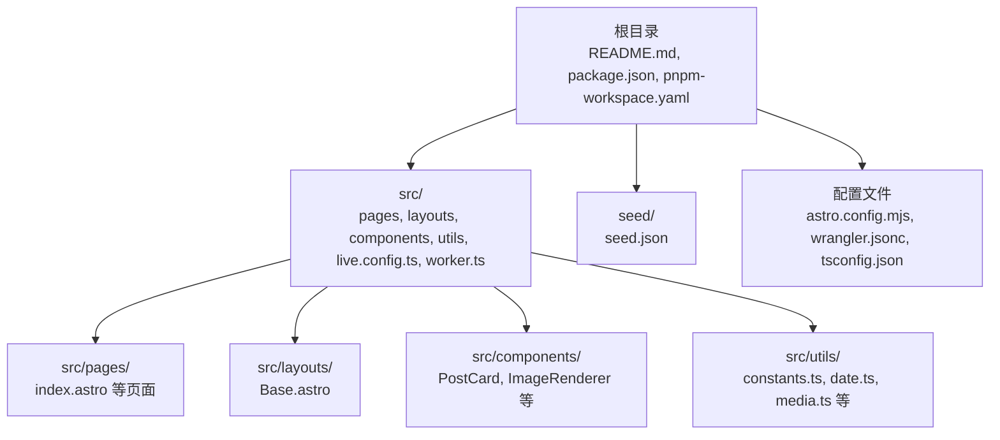
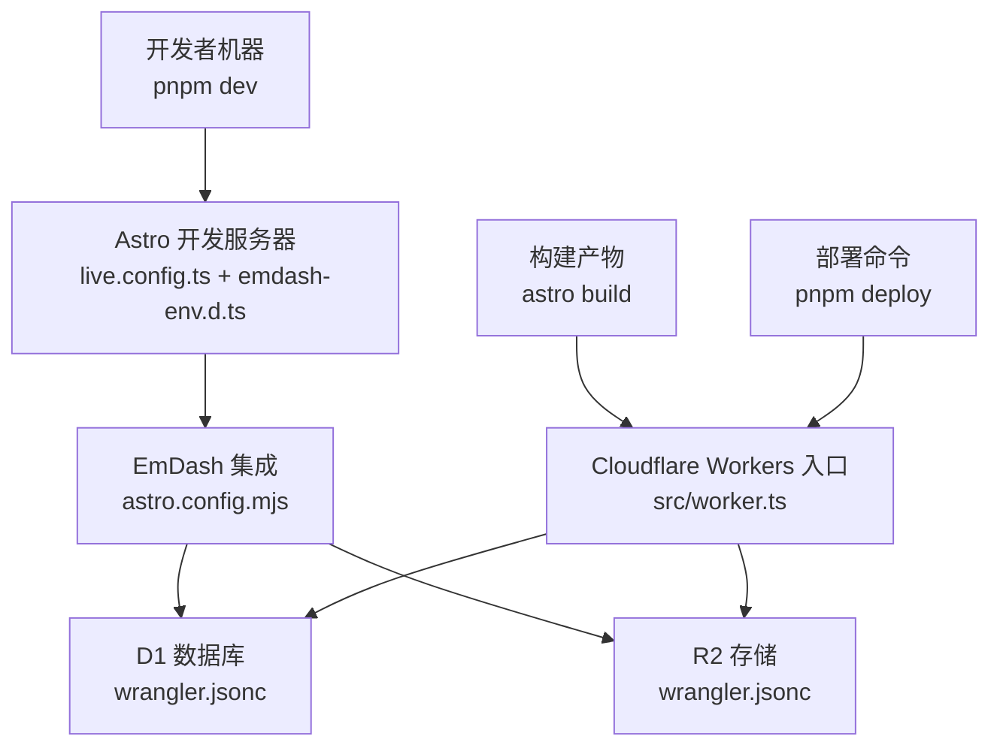
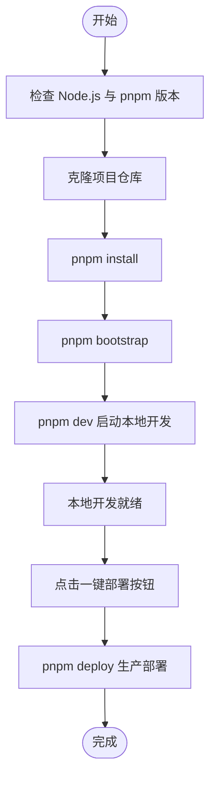
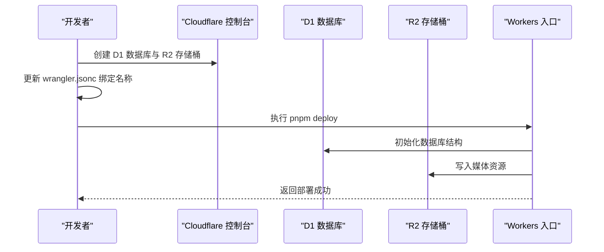
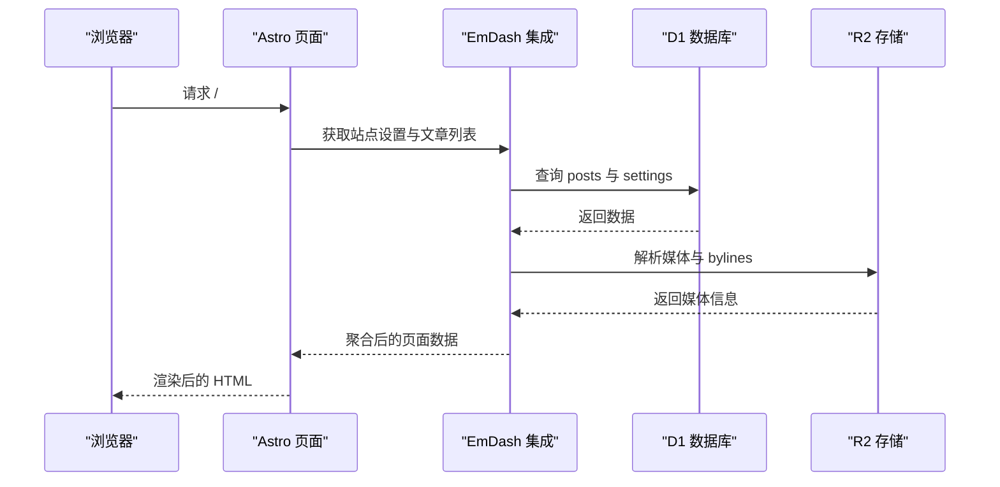
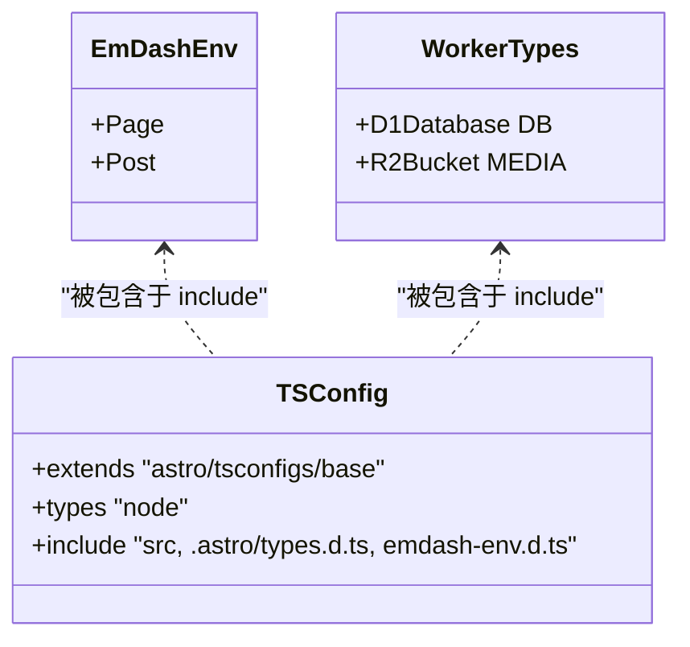
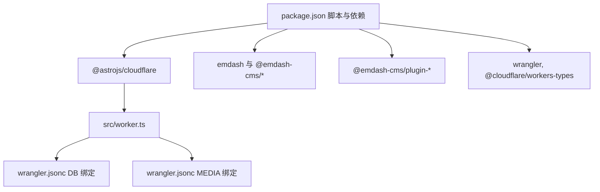

# 快速开始

<cite>
**本文引用的文件**
- [README.md](file://README.md)
- [package.json](file://package.json)
- [pnpm-workspace.yaml](file://pnpm-workspace.yaml)
- [wrangler.jsonc](file://wrangler.jsonc)
- [astro.config.mjs](file://astro.config.mjs)
- [emdash-env.d.ts](file://emdash-env.d.ts)
- [worker-configuration.d.ts](file://worker-configuration.d.ts)
- [src/live.config.ts](file://src/live.config.ts)
- [src/worker.ts](file://src/worker.ts)
- [tsconfig.json](file://tsconfig.json)
- [seed/seed.json](file://seed/seed.json)
- [src/pages/index.astro](file://src/pages/index.astro)
</cite>

## 目录
1. [简介](#简介)
2. [项目结构](#项目结构)
3. [核心组件](#核心组件)
4. [架构总览](#架构总览)
5. [详细组件分析](#详细组件分析)
6. [依赖关系分析](#依赖关系分析)
7. [性能考虑](#性能考虑)
8. [故障排查指南](#故障排查指南)
9. [结论](#结论)
10. [附录](#附录)

## 简介
本指南面向希望快速搭建与运行 EmDash 博客模板的用户，覆盖从环境准备到本地开发、Cloudflare 账户准备、一键部署按钮使用以及生产部署的完整流程。文档同时提供常见环境配置问题与解决方案，帮助不同技术背景的用户顺利上线博客。

## 项目结构
该仓库是一个基于 Astro 的博客模板，采用 Cloudflare Workers 运行时，并通过 D1 数据库与 R2 存储实现全托管部署。核心目录与文件如下：
- 根目录：项目元信息、脚本与工作区配置
- src：前端页面、布局、组件与运行时配置
- seed：初始站点数据与内容结构定义
- 配置文件：Astro、Wrangler、TypeScript、工作区策略等

图表来源
- [README.md:1-68](file://README.md#L1-L68)
- [package.json:1-33](file://package.json#L1-L33)
- [pnpm-workspace.yaml:1-17](file://pnpm-workspace.yaml#L1-L17)
- [astro.config.mjs:1-45](file://astro.config.mjs#L1-L45)
- [wrangler.jsonc:1-20](file://wrangler.jsonc#L1-L20)
- [seed/seed.json:1-800](file://seed/seed.json#L1-L800)

章节来源
- [README.md:1-68](file://README.md#L1-L68)
- [package.json:1-33](file://package.json#L1-L33)
- [pnpm-workspace.yaml:1-17](file://pnpm-workspace.yaml#L1-L17)
- [astro.config.mjs:1-45](file://astro.config.mjs#L1-L45)
- [wrangler.jsonc:1-20](file://wrangler.jsonc#L1-L20)
- [seed/seed.json:1-800](file://seed/seed.json#L1-L800)

## 核心组件
- Astro 配置：定义输出模式、Cloudflare 适配器、图片优化、字体提供方与 EmDash 集成插件。
- Wrangler 配置：定义 Worker 名称、入口文件、兼容日期、D1 与 R2 绑定。
- EmDash 类型与集合：在 TypeScript 中声明站点集合类型与实时内容加载器。
- 页面与组件：首页聚合展示、文章卡片、图片渲染与工具函数。
- 工作区策略：限制构建依赖与供应链安全策略。

章节来源
- [astro.config.mjs:1-45](file://astro.config.mjs#L1-L45)
- [wrangler.jsonc:1-20](file://wrangler.jsonc#L1-L20)
- [emdash-env.d.ts:1-39](file://emdash-env.d.ts#L1-L39)
- [src/live.config.ts:1-14](file://src/live.config.ts#L1-L14)
- [src/pages/index.astro:1-463](file://src/pages/index.astro#L1-L463)
- [pnpm-workspace.yaml:1-17](file://pnpm-workspace.yaml#L1-L17)

## 架构总览
EmDash 博客模板采用“静态生成 + 边缘运行时”的架构：
- 开发阶段：Astro 在本地启动，结合 EmDash 实时内容加载器提供开发体验。
- 构建阶段：Astro 生成静态资源；Cloudflare Workers 作为运行时入口。
- 数据层：D1 提供结构化数据存储，R2 提供媒体存储。
- 插件生态：表单与 Webhook 通知等插件通过沙箱运行。

图表来源
- [astro.config.mjs:1-45](file://astro.config.mjs#L1-L45)
- [wrangler.jsonc:1-20](file://wrangler.jsonc#L1-L20)
- [src/worker.ts:1-6](file://src/worker.ts#L1-L6)
- [src/live.config.ts:1-14](file://src/live.config.ts#L1-L14)
- [emdash-env.d.ts:1-39](file://emdash-env.d.ts#L1-L39)

## 详细组件分析

### 安装与本地开发流程
- 准备 Node.js 环境：确保已安装 Node.js 与 pnpm。
- 克隆项目后，执行依赖安装与初始化引导，随后启动本地开发服务器。
- 一键部署按钮可直接在 Cloudflare 控制台中完成项目初始化与部署。

图表来源
- [README.md:47-61](file://README.md#L47-L61)
- [package.json:10-16](file://package.json#L10-L16)

章节来源
- [README.md:47-61](file://README.md#L47-L61)
- [package.json:10-16](file://package.json#L10-L16)

### Cloudflare 账户与部署准备
- 在 Cloudflare 控制台创建 D1 数据库与 R2 存储桶，并确保名称与绑定一致。
- 配置 Wrangler 以匹配数据库与存储桶的绑定名称。
- 使用一键部署按钮或手动执行部署命令完成上线。

图表来源
- [wrangler.jsonc:1-20](file://wrangler.jsonc#L1-L20)
- [package.json:14](file://package.json#L14)

章节来源
- [wrangler.jsonc:1-20](file://wrangler.jsonc#L1-L20)
- [package.json:14](file://package.json#L14)

### 首页渲染与内容加载
- 首页通过批量查询获取站点设置与文章列表，按需裁剪展示数量。
- 使用标签与作者信息进行聚合展示，避免 N+1 查询。
- 图片渲染与阅读时长计算由工具函数与组件配合完成。

图表来源
- [src/pages/index.astro:1-463](file://src/pages/index.astro#L1-L463)
- [astro.config.mjs:16-26](file://astro.config.mjs#L16-L26)

章节来源
- [src/pages/index.astro:1-463](file://src/pages/index.astro#L1-L463)
- [astro.config.mjs:16-26](file://astro.config.mjs#L16-L26)

### TypeScript 与运行时类型
- TypeScript 配置扩展 Astro 基础配置，并引入 Node 类型。
- EmDash 类型声明定义了页面与文章集合的字段结构。
- Worker 类型通过 Wrangler 生成，声明 D1 与 R2 绑定。

图表来源
- [emdash-env.d.ts:1-39](file://emdash-env.d.ts#L1-L39)
- [worker-configuration.d.ts:1-10](file://worker-configuration.d.ts#L1-L10)
- [tsconfig.json:1-8](file://tsconfig.json#L1-L8)

章节来源
- [emdash-env.d.ts:1-39](file://emdash-env.d.ts#L1-L39)
- [worker-configuration.d.ts:1-10](file://worker-configuration.d.ts#L1-L10)
- [tsconfig.json:1-8](file://tsconfig.json#L1-L8)

## 依赖关系分析
- 包管理：使用 pnpm 工作区，限制部分构建依赖以提升安全性与一致性。
- 运行时：Cloudflare Workers + @astrojs/cloudflare 适配器。
- 数据与存储：D1 与 R2 通过绑定在运行时访问。
- 插件：EmDash 插件生态通过沙箱运行，保证安全与隔离。

图表来源
- [package.json:10-32](file://package.json#L10-L32)
- [pnpm-workspace.yaml:1-17](file://pnpm-workspace.yaml#L1-L17)
- [wrangler.jsonc:1-20](file://wrangler.jsonc#L1-L20)
- [src/worker.ts:1-6](file://src/worker.ts#L1-L6)

章节来源
- [package.json:10-32](file://package.json#L10-L32)
- [pnpm-workspace.yaml:1-17](file://pnpm-workspace.yaml#L1-L17)
- [wrangler.jsonc:1-20](file://wrangler.jsonc#L1-L20)
- [src/worker.ts:1-6](file://src/worker.ts#L1-L6)

## 性能考虑
- 首屏性能：首页仅加载必要文章与媒体，避免一次性拉取全部数据。
- 缓存提示：根据查询结果设置缓存提示，减少重复请求。
- 图片优化：启用 Astro 图片优化与响应式样式，降低带宽占用。
- 字体加载：通过 Google Fonts 提供可配置字体变量，兼顾可读性与加载速度。

章节来源
- [src/pages/index.astro:19-28](file://src/pages/index.astro#L19-L28)
- [astro.config.mjs:12-15](file://astro.config.mjs#L12-L15)
- [astro.config.mjs:27-42](file://astro.config.mjs#L27-L42)

## 故障排查指南
- 本地开发无法启动
  - 检查 Node.js 与 pnpm 版本是否满足要求。
  - 确认依赖安装与初始化引导步骤已完成。
  - 参考：[README.md:47-53](file://README.md#L47-L53)，[package.json:10-16](file://package.json#L10-L16)

- 数据库或存储未连接
  - 确认 D1 数据库与 R2 存储桶已在 Cloudflare 控制台创建。
  - 检查 wrangler.jsonc 中的绑定名称与实际资源名称一致。
  - 参考：[wrangler.jsonc:7-18](file://wrangler.jsonc#L7-L18)

- 部署失败
  - 使用一键部署按钮或执行 pnpm deploy。
  - 若手动部署，请确认 Wrangler 配置正确且凭据有效。
  - 参考：[README.md:55-61](file://README.md#L55-L61)，[package.json:14](file://package.json#L14)

- TypeScript 类型错误
  - 确保 tsconfig.json 正确包含 emdash-env.d.ts 与生成的类型文件。
  - 参考：[tsconfig.json:1-8](file://tsconfig.json#L1-L8)，[emdash-env.d.ts:1-39](file://emdash-env.d.ts#L1-L39)

- 首页内容为空
  - 检查种子数据是否已导入，或在后台创建首篇内容。
  - 参考：[seed/seed.json:1-800](file://seed/seed.json#L1-L800)，[src/pages/index.astro:72-79](file://src/pages/index.astro#L72-L79)

## 结论
通过本指南，您可以在本地快速完成环境准备、依赖安装、初始化引导与本地开发启动，并在 Cloudflare 上完成数据库与存储的准备及一键部署。遇到问题时，可依据故障排查指南逐项核对配置与依赖，确保博客系统稳定运行。

## 附录
- 一键部署按钮：点击即可在 Cloudflare 控制台中自动初始化并部署项目。
- 页面路由概览：首页、文章列表、单篇文章、分类归档、标签归档、搜索与静态页面等。
- 项目特性：特色文章头图、文章归档、分类与标签、全文搜索、RSS、SEO 元数据与 JSON-LD、深色/浅色主题、表单插件与 Webhook 通知等。

章节来源
- [README.md:5-68](file://README.md#L5-L68)