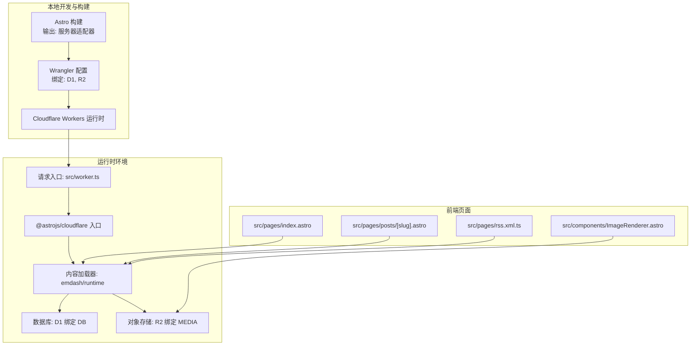
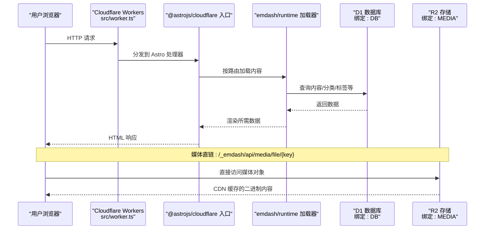
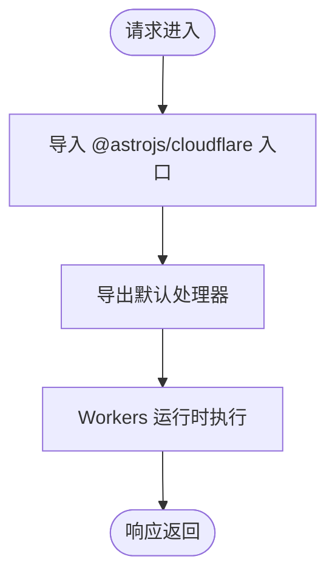
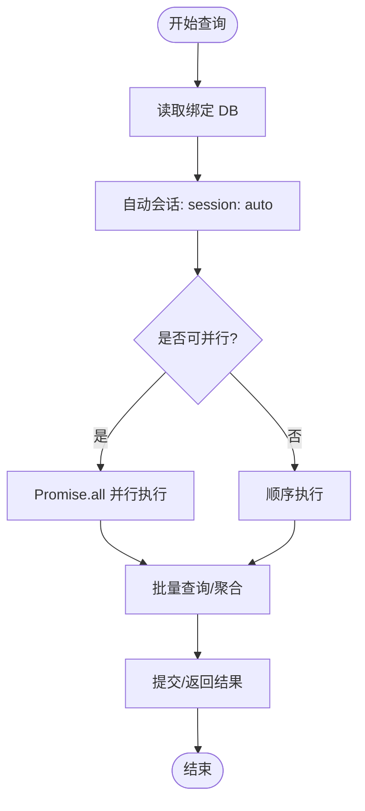
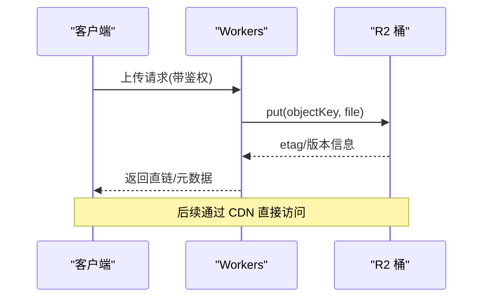
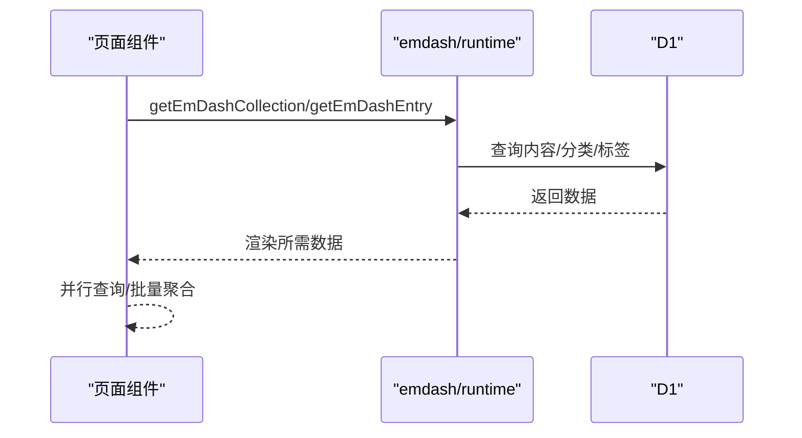
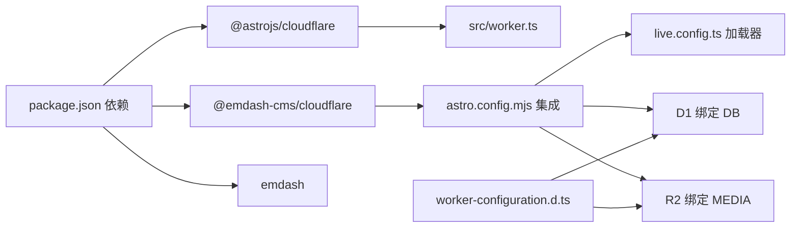

# Cloudflare 运行时架构

<cite>
**本文引用的文件**
- [wrangler.jsonc](file://wrangler.jsonc)
- [worker.ts](file://src/worker.ts)
- [astro.config.mjs](file://astro.config.mjs)
- [live.config.ts](file://src/live.config.ts)
- [media.ts](file://src/utils/media.ts)
- [index.astro](file://src/pages/index.astro)
- [posts/[slug].astro](file://src/pages/posts/[slug].astro)
- [rss.xml.ts](file://src/pages/rss.xml.ts)
- [ImageRenderer.astro](file://src/components/ImageRenderer.astro)
- [worker-configuration.d.ts](file://worker-configuration.d.ts)
- [emdash-env.d.ts](file://emdash-env.d.ts)
- [package.json](file://package.json)
- [pnpm-workspace.yaml](file://pnpm-workspace.yaml)
- [seed.json](file://seed/seed.json)
</cite>

## 目录
1. [简介](#简介)
2. [项目结构](#项目结构)
3. [核心组件](#核心组件)
4. [架构总览](#架构总览)
5. [详细组件分析](#详细组件分析)
6. [依赖关系分析](#依赖关系分析)
7. [性能考量](#性能考量)
8. [故障排查指南](#故障排查指南)
9. [结论](#结论)
10. [附录](#附录)

## 简介
本文件面向 EmDash 在 Cloudflare Workers 上的运行时架构，系统性阐述以下主题：
- 部署架构与运行时环境配置（Workers、Wrangler、兼容性标志）
- D1 数据库绑定与连接会话模型、查询优化与事务处理建议
- R2 对象存储集成（文件上传、CDN 缓存与安全策略）
- 边缘计算优势与限制（冷启动、内存管理）
- 负载均衡、故障转移与监控告警机制
- 性能调优与成本优化策略

## 项目结构
EmDash 使用 Astro 作为静态生成与服务端渲染框架，并通过 @astrojs/cloudflare 适配器在 Cloudflare Workers 上运行。核心运行时入口由 @astrojs/cloudflare 提供，项目通过 Wrangler 将构建产物部署到 Cloudflare 平台。

图表来源
- [astro.config.mjs](file://astro.config.mjs)
- [wrangler.jsonc](file://wrangler.jsonc)
- [worker.ts](file://src/worker.ts)
- [index.astro](file://src/pages/index.astro)
- [posts/[slug].astro](file://src/pages/posts/[slug].astro)
- [rss.xml.ts](file://src/pages/rss.xml.ts)
- [ImageRenderer.astro](file://src/components/ImageRenderer.astro)

章节来源
- [astro.config.mjs](file://astro.config.mjs)
- [wrangler.jsonc](file://wrangler.jsonc)
- [worker.ts](file://src/worker.ts)

## 核心组件
- 运行时入口与适配器
  - 入口导出由 @astrojs/cloudflare 提供的服务器入口，统一处理请求生命周期。
  - 通过 compatibility_flags 开启 nodejs_compat，以支持部分 Node 生态能力。
- 数据库与存储绑定
  - D1 绑定名为 DB，R2 绑定名为 MEDIA，分别用于内容数据与媒体资源。
- 内容加载与渲染
  - live.config.ts 定义实时内容集合，使用 emdash/runtime 加载器从 D1 获取内容。
- 媒体解析与直链
  - media.ts 提供本地媒体键到 CDN 直链的映射；外部图片直接使用预览 URL。
- 页面与组件
  - 首页与文章详情页并发查询内容、标签与相关文章，减少往返时间。
  - RSS 输出缓存控制，降低重复请求压力。

章节来源
- [worker.ts](file://src/worker.ts)
- [astro.config.mjs](file://astro.config.mjs)
- [live.config.ts](file://src/live.config.ts)
- [media.ts](file://src/utils/media.ts)
- [index.astro](file://src/pages/index.astro)
- [posts/[slug].astro](file://src/pages/posts/[slug].astro)
- [rss.xml.ts](file://src/pages/rss.xml.ts)
- [ImageRenderer.astro](file://src/components/ImageRenderer.astro)

## 架构总览
下图展示请求从浏览器到 Workers、再到 D1/R2 的整体流程，以及页面渲染与媒体直链访问的关键路径。

图表来源
- [worker.ts](file://src/worker.ts)
- [astro.config.mjs](file://astro.config.mjs)
- [live.config.ts](file://src/live.config.ts)
- [media.ts](file://src/utils/media.ts)

## 详细组件分析

### 运行时入口与适配器
- 入口导出由 @astrojs/cloudflare 提供的服务器入口，确保请求在 Workers 环境中正确分发。
- compatibility_flags 包含 nodejs_compat，有助于兼容部分 Node 工具链或库。
- package.json 中的 deploy 脚本串联构建与部署流程。

图表来源
- [worker.ts](file://src/worker.ts)
- [package.json](file://package.json)

章节来源
- [worker.ts](file://src/worker.ts)
- [package.json](file://package.json)

### D1 数据库绑定与连接会话
- 绑定与名称：wrangler.jsonc 中定义了 D1 数据库绑定 DB，数据库名为 emdash。
- 类型声明：worker-configuration.d.ts 明确 Env 接口中包含 DB: D1Database。
- 连接会话模型：astro.config.mjs 通过 emdash 集成传入 d1({ binding: "DB", session: "auto" })，表明采用自动会话模式。
- 查询优化实践：
  - 首页与文章详情页广泛使用 Promise.all 并行查询，减少往返时间。
  - 文章详情页对标签与相关文章进行批量查询，避免 N+1 查询。
- 事务处理建议：
  - 对于需要强一致性的写操作，可在 Workers 或插件沙箱中使用事务封装，确保原子性与一致性。
  - 利用事务批处理减少网络往返与锁竞争。

图表来源
- [wrangler.jsonc](file://wrangler.jsonc)
- [worker-configuration.d.ts](file://worker-configuration.d.ts)
- [astro.config.mjs](file://astro.config.mjs)
- [index.astro](file://src/pages/index.astro)
- [posts/[slug].astro](file://src/pages/posts/[slug].astro)

章节来源
- [wrangler.jsonc](file://wrangler.jsonc)
- [worker-configuration.d.ts](file://worker-configuration.d.ts)
- [astro.config.mjs](file://astro.config.mjs)
- [index.astro](file://src/pages/index.astro)
- [posts/[slug].astro](file://src/pages/posts/[slug].astro)

### R2 对象存储集成
- 绑定与名称：wrangler.jsonc 中定义了 R2 存储绑定 MEDIA，桶名为 emdash。
- 类型声明：worker-configuration.d.ts 明确 Env 掤含 MEDIA: R2Bucket。
- 媒体直链与解析：
  - media.ts 将本地媒体的 storageKey 解析为 CDN 直链前缀，外部图片使用预览 URL。
  - ImageRenderer.astro 根据图片类型选择原生 img 或 EmDashImage 组件。
- CDN 缓存与安全策略：
  - 建议在 R2 桶上启用对象级缓存策略（如 Cache-Control），并结合 Cloudflare Workers 规则实现条件缓存。
  - 通过访问控制（如签名 URL、IP 白名单）限制直链访问，保护敏感资源。
- 文件上传流程（概念示意）：

图表来源
- [wrangler.jsonc](file://wrangler.jsonc)
- [worker-configuration.d.ts](file://worker-configuration.d.ts)
- [media.ts](file://src/utils/media.ts)
- [ImageRenderer.astro](file://src/components/ImageRenderer.astro)

章节来源
- [wrangler.jsonc](file://wrangler.jsonc)
- [worker-configuration.d.ts](file://worker-configuration.d.ts)
- [media.ts](file://src/utils/media.ts)
- [ImageRenderer.astro](file://src/components/ImageRenderer.astro)

### 页面渲染与内容加载
- 实时内容集合：live.config.ts 使用 emdash/runtime 加载器，按需从 D1 获取内容。
- 首页与文章页：
  - 首页并行获取文章列表与站点设置，减少首屏等待。
  - 文章页并行获取标签与相关文章，再进行二次批量标签查询，提升性能。
- RSS 输出：限制数量、设置缓存头，降低重复生成开销。

图表来源
- [live.config.ts](file://src/live.config.ts)
- [index.astro](file://src/pages/index.astro)
- [posts/[slug].astro](file://src/pages/posts/[slug].astro)
- [rss.xml.ts](file://src/pages/rss.xml.ts)

章节来源
- [live.config.ts](file://src/live.config.ts)
- [index.astro](file://src/pages/index.astro)
- [posts/[slug].astro](file://src/pages/posts/[slug].astro)
- [rss.xml.ts](file://src/pages/rss.xml.ts)

### 边缘计算优势与限制
- 优势
  - 低延迟：就近边缘节点，显著缩短首字节时间。
  - 无冷启动：静态资源由 CDN 直接分发，无需函数实例化。
  - 无 SSR 开销：静态 HTML 可直接由边缘缓存提供。
- 局限
  - 内存与执行时间限制：单次请求内存与 CPU 时间受限。
  - 冷启动：动态请求（首次命中或长时间未使用的 Worker）仍存在冷启动成本。
  - I/O 串行化：D1/R2 交互需遵循 Workers 的 I/O 模型，避免阻塞。

章节来源
- [seed.json](file://seed/seed.json)

### 负载均衡、故障转移与监控告警
- 负载均衡与故障转移
  - 通过 Cloudflare 全球任播网络自动分发流量，多区域冗余。
  - Workers 自身具备高可用特性，配合 R2 的全球复制可进一步增强可用性。
- 监控与告警
  - 建议启用 Cloudflare Logs、Workers Analytics 与自定义指标，关注请求时延、错误率与资源使用。
  - 对关键路径（D1 查询、R2 读取）埋点，结合日志与追踪进行问题定位。

章节来源
- [wrangler.jsonc](file://wrangler.jsonc)

## 依赖关系分析
- 构建与运行
  - Astro 通过 @astrojs/cloudflare 适配器输出服务器端代码。
  - @emdash-cms/cloudflare 提供 D1/R2 集成与插件生态。
- 类型与环境
  - worker-configuration.d.ts 为运行时注入 Env 类型，确保 DB/MEDIA 绑定可用。
  - emdash-env.d.ts 定义内容模型接口，便于类型安全的渲染与查询。

图表来源
- [package.json](file://package.json)
- [worker.ts](file://src/worker.ts)
- [astro.config.mjs](file://astro.config.mjs)
- [live.config.ts](file://src/live.config.ts)
- [worker-configuration.d.ts](file://worker-configuration.d.ts)

章节来源
- [package.json](file://package.json)
- [worker-configuration.d.ts](file://worker-configuration.d.ts)
- [astro.config.mjs](file://astro.config.mjs)
- [live.config.ts](file://src/live.config.ts)

## 性能考量
- 查询优化
  - 并行查询：首页与文章页广泛使用 Promise.all，减少往返时间。
  - 批量查询：文章详情页对相关文章标签进行批量查询，避免多次单条查询。
- 缓存策略
  - RSS 设置 Cache-Control，降低重复生成与传输成本。
  - 媒体直链利用 CDN 缓存，减少 R2 延迟与带宽消耗。
- 冷启动优化
  - 静态资源尽量走 CDN，动态请求可通过预热或长驻实例策略降低冷启动影响。
- 内存与执行时间
  - 控制单次请求的数据量与复杂度，避免超时与 OOM。
  - 对大对象读取采用流式处理或分块传输。

章节来源
- [index.astro](file://src/pages/index.astro)
- [posts/[slug].astro](file://src/pages/posts/[slug].astro)
- [rss.xml.ts](file://src/pages/rss.xml.ts)
- [media.ts](file://src/utils/media.ts)

## 故障排查指南
- 数据库连接与查询
  - 确认 D1 绑定名称与数据库名一致，检查 session 配置是否符合预期。
  - 对高频查询建立索引，避免全表扫描；对复杂查询拆分为多个简单查询。
- 媒体直链与权限
  - 检查 storageKey 是否正确映射至 CDN 直链；外部图片直接使用预览 URL。
  - 对敏感资源启用访问控制与签名 URL，防止未授权访问。
- 日志与追踪
  - 启用 Workers 日志与 Cloudflare Logs，定位慢查询与异常请求。
  - 对关键路径埋点，记录耗时与错误码，辅助性能优化与故障恢复。

章节来源
- [wrangler.jsonc](file://wrangler.jsonc)
- [worker-configuration.d.ts](file://worker-configuration.d.ts)
- [media.ts](file://src/utils/media.ts)

## 结论
EmDash 在 Cloudflare Workers 上的运行时架构充分利用了边缘计算的低延迟与 CDN 缓存优势，通过并行查询与批量处理优化数据库访问，借助 R2 与直链实现高效媒体分发。结合合理的缓存策略、访问控制与监控告警，可在保证性能的同时提升可用性与安全性。对于需要强一致性的写操作，建议在事务层面进行封装与批处理，进一步提升可靠性。

## 附录
- 关键配置与类型
  - D1/R2 绑定与名称：参见 wrangler.jsonc。
  - 运行时 Env 类型：参见 worker-configuration.d.ts。
  - 内容模型类型：参见 emdash-env.d.ts。
- 运行与部署
  - 入口与适配器：参见 worker.ts。
  - 集成与插件：参见 astro.config.mjs。
  - 实时内容加载：参见 live.config.ts。
- 页面与组件
  - 首页与文章页：参见 index.astro、posts/[slug].astro。
  - RSS 输出：参见 rss.xml.ts。
  - 媒体解析与渲染：参见 media.ts、ImageRenderer.astro。