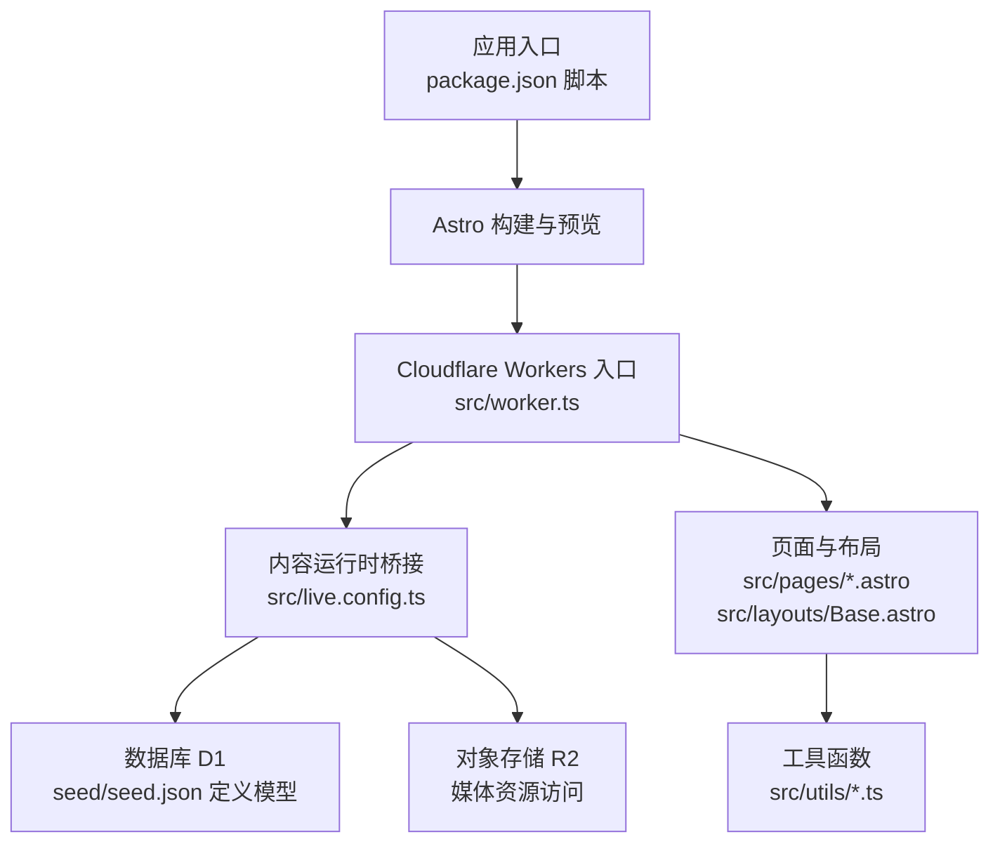
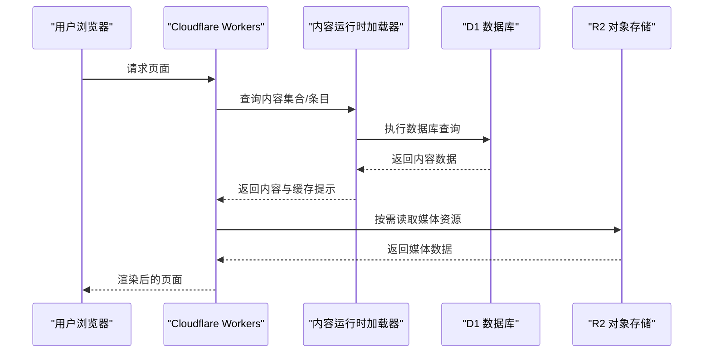
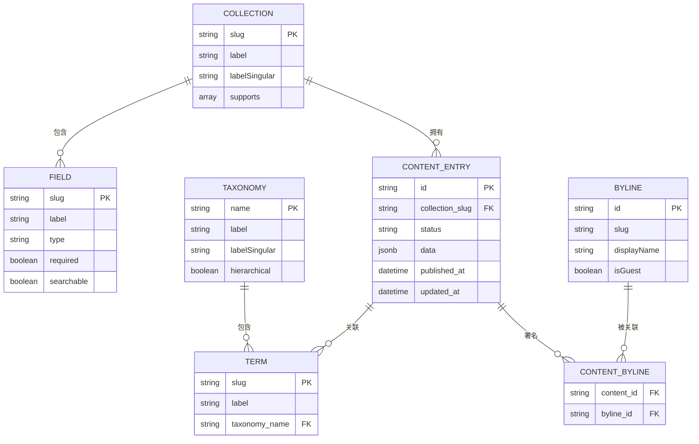
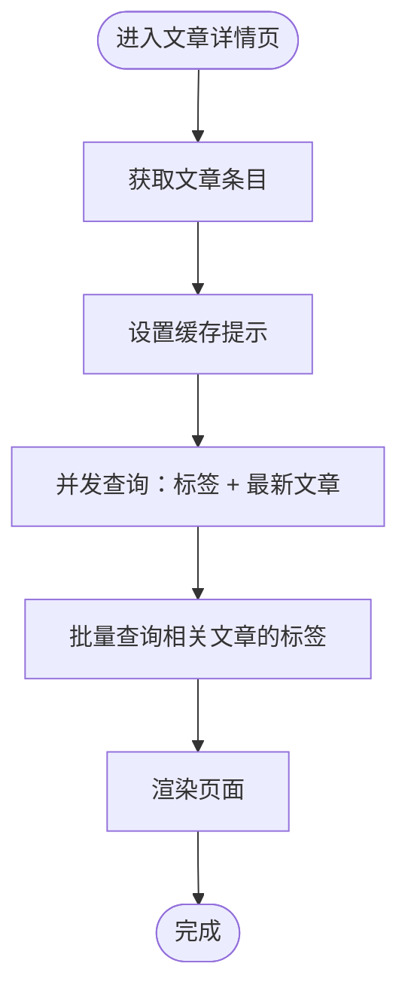
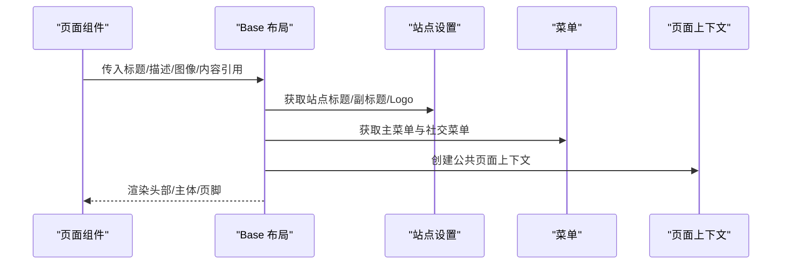
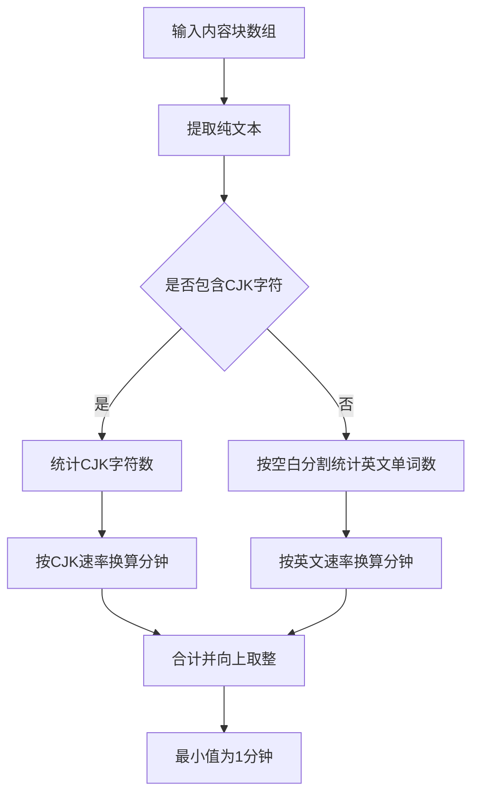
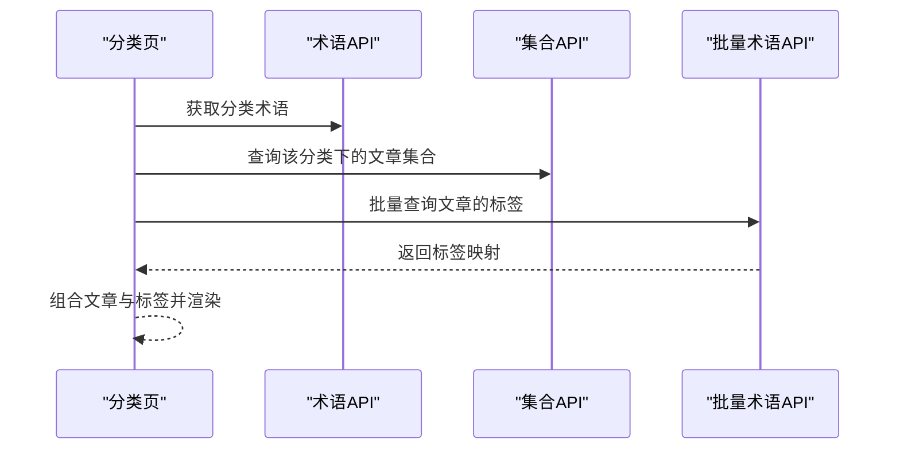
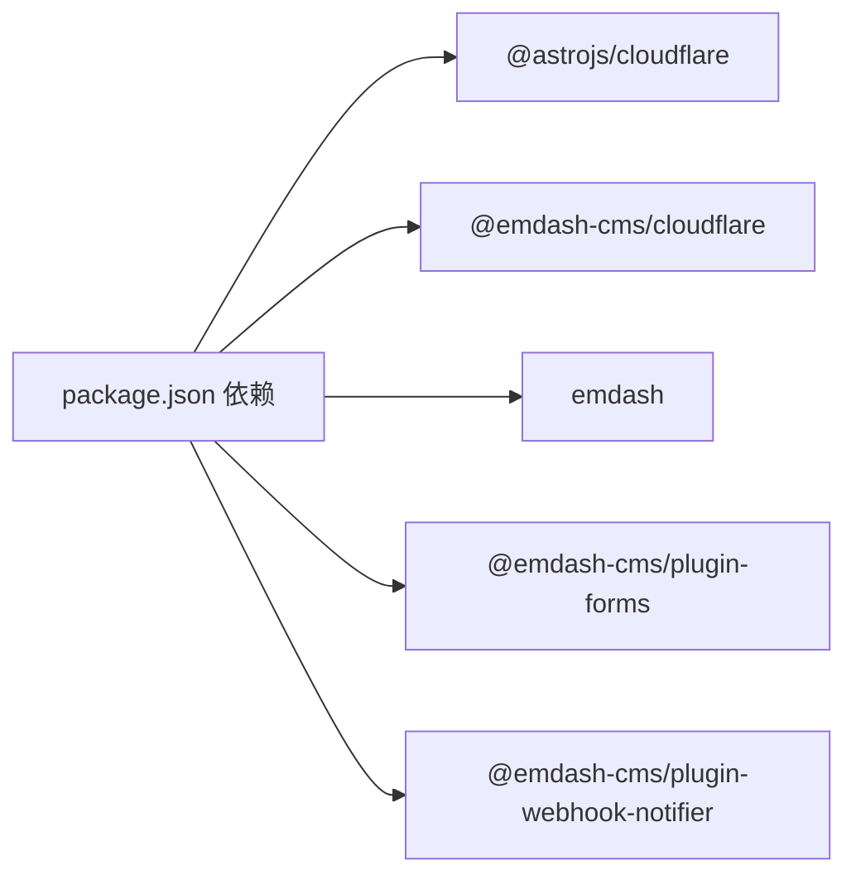

# 内容管理系统架构

<cite>
**本文引用的文件**
- [README.md](file://README.md)
- [package.json](file://package.json)
- [src/live.config.ts](file://src/live.config.ts)
- [src/worker.ts](file://src/worker.ts)
- [seed/seed.json](file://seed/seed.json)
- [src/utils/constants.ts](file://src/utils/constants.ts)
- [src/utils/date.ts](file://src/utils/date.ts)
- [src/utils/media.ts](file://src/utils/media.ts)
- [src/utils/reading-time.ts](file://src/utils/reading-time.ts)
- [src/utils/site-identity.ts](file://src/utils/site-identity.ts)
- [src/pages/posts/[slug].astro](file://src/pages/posts/[slug].astro)
- [src/pages/category/[slug].astro](file://src/pages/category/[slug].astro)
- [src/layouts/Base.astro](file://src/layouts/Base.astro)
- [src/components/layout/ThemeScript.astro](file://src/components/layout/ThemeScript.astro)
</cite>

## 目录
1. [简介](#简介)
2. [项目结构](#项目结构)
3. [核心组件](#核心组件)
4. [架构总览](#架构总览)
5. [详细组件分析](#详细组件分析)
6. [依赖分析](#依赖分析)
7. [性能考虑](#性能考虑)
8. [故障排查指南](#故障排查指南)
9. [结论](#结论)
10. [附录](#附录)

## 简介
本文件面向 EmDash CMS 在 Cloudflare Workers 上的部署与使用，聚焦“实时内容集合”（Live Content Collections）的设计理念与实现机制，系统性阐述数据模型、查询优化与缓存策略；详解内容模型（文章、页面、分类、标签）的结构与关系映射；解释插件体系（标准插件与原生插件）的差异；梳理内容版本控制、发布流程与权限管理；给出数据验证规则、业务逻辑与错误处理策略，并提供内容管理最佳实践与性能优化建议。

## 项目结构
该模板采用 Astro + Cloudflare Workers 部署，结合 EmDash 运行时提供的实时内容集合能力，实现基于 D1 数据库与 R2 存储的高性能静态生成与动态渲染混合模式。

图表来源
- [package.json:10-16](file://package.json#L10-L16)
- [src/worker.ts:1-6](file://src/worker.ts#L1-L6)
- [src/live.config.ts:8-13](file://src/live.config.ts#L8-L13)
- [seed/seed.json:13-115](file://seed/seed.json#L13-L115)

章节来源
- [README.md:40-68](file://README.md#L40-L68)
- [package.json:10-16](file://package.json#L10-L16)
- [src/worker.ts:1-6](file://src/worker.ts#L1-L6)
- [src/live.config.ts:8-13](file://src/live.config.ts#L8-L13)
- [seed/seed.json:13-115](file://seed/seed.json#L13-L115)

## 核心组件
- 实时内容集合定义：通过内容运行时加载器在 Astro 中注册统一的 _emdash 集合，用于查询所有内容类型。
- 页面与布局：Base 布局负责站点级 SEO、菜单、页脚与主题切换；各页面通过 EmDash API 获取内容、术语与 SEO 元信息。
- 工具模块：日期格式化、媒体解析、阅读时长计算、站点标识解析等，支撑内容渲染与用户体验。
- 插件与沙箱：Cloudflare 沙箱桥接导出，支持标准插件与原生插件在 Worker 环境中协作。

章节来源
- [src/live.config.ts:8-13](file://src/live.config.ts#L8-L13)
- [src/layouts/Base.astro:16-78](file://src/layouts/Base.astro#L16-L78)
- [src/utils/date.ts:7-17](file://src/utils/date.ts#L7-L17)
- [src/utils/media.ts:5-30](file://src/utils/media.ts#L5-L30)
- [src/utils/reading-time.ts:51-59](file://src/utils/reading-time.ts#L51-L59)
- [src/utils/site-identity.ts:18-24](file://src/utils/site-identity.ts#L18-L24)
- [src/worker.ts:3-3](file://src/worker.ts#L3-L3)

## 架构总览
EmDash 在本项目中的工作流如下：Astro 在构建时或运行时调用 EmDash API，通过内容运行时加载器从 D1 查询内容，结合 R2 提供的媒体访问接口，最终渲染为静态或半静态页面。Cloudflare Workers 提供边缘执行环境，配合缓存头与并发查询优化，提升响应速度。

图表来源
- [src/live.config.ts:8-13](file://src/live.config.ts#L8-L13)
- [src/pages/posts/[slug].astro:31-37](file://src/pages/posts/[slug].astro#L31-L37)
- [src/worker.ts:1-6](file://src/worker.ts#L1-L6)

## 详细组件分析

### 实时内容集合与数据模型
- 集合与字段：通过 seed 定义集合（如 posts、pages），每个集合声明支持的功能（草稿、修订、全文检索、SEO）、字段类型（字符串、图片、可移植文本等）与可搜索属性。
- 分类与标签：通过 taxonomies 定义分类与标签，指定层级关系、归属集合与术语项，形成内容与术语的一对多/多对多映射。
- 作者署名：bylines 支持编辑部与访客作者，允许附加角色标签与头像媒体 ID。
- 小节与挂件区：sections 与 widgetAreas 提供主题级可复用内容块与侧边栏/页脚挂件区域。

图表来源
- [seed/seed.json:13-66](file://seed/seed.json#L13-L66)
- [seed/seed.json:68-115](file://seed/seed.json#L68-L115)
- [seed/seed.json:116-128](file://seed/seed.json#L116-L128)
- [seed/seed.json:275-584](file://seed/seed.json#L275-L584)

章节来源
- [seed/seed.json:13-115](file://seed/seed.json#L13-L115)
- [seed/seed.json:275-584](file://seed/seed.json#L275-L584)

### 查询优化与缓存策略
- 并发查询：在文章详情页，术语与相关文章通过 Promise.all 并发获取，减少远程数据库往返时间。
- 批量术语查询：使用批量接口一次性获取多个条目的术语，避免 N+1 查询。
- 缓存提示：页面在获取到内容后设置缓存提示，交由运行时决定缓存策略。
- 边缘缓存：Cloudflare Workers 在边缘节点缓存响应，降低冷启动与重复请求成本。

图表来源
- [src/pages/posts/[slug].astro:84-109](file://src/pages/posts/[slug].astro#L84-L109)
- [src/pages/posts/[slug].astro:37-37](file://src/pages/posts/[slug].astro#L37-L37)

章节来源
- [src/pages/posts/[slug].astro:84-109](file://src/pages/posts/[slug].astro#L84-L109)
- [src/pages/posts/[slug].astro:37-37](file://src/pages/posts/[slug].astro#L37-L37)

### 页面与布局（Base）
- SEO 与元信息：通过站点设置与内容生成 SEO 元信息，传递给 EmDashHead 渲染。
- 导航与菜单：读取种子中定义的主菜单与社交菜单，渲染站点头部导航与页脚链接。
- 页面上下文：为插件贡献内容提供公共页面上下文，区分内容页与自定义页。
- 主题切换：内联脚本在首次绘制前应用主题，避免闪烁；支持系统/亮/暗三种模式。

图表来源
- [src/layouts/Base.astro:31-74](file://src/layouts/Base.astro#L31-L74)
- [src/utils/site-identity.ts:18-24](file://src/utils/site-identity.ts#L18-L24)

章节来源
- [src/layouts/Base.astro:31-74](file://src/layouts/Base.astro#L31-L74)
- [src/components/layout/ThemeScript.astro:5-17](file://src/components/layout/ThemeScript.astro#L5-L17)

### 媒体与阅读时长
- 媒体解析：根据 provider 类型选择外部 URL 或本地存储键，拼接 R2 文件访问路径。
- 阅读时长：按英文与中日韩字符分别估算字词数，综合得出分钟数，确保跨语言体验一致。

图表来源
- [src/utils/reading-time.ts:34-59](file://src/utils/reading-time.ts#L34-L59)

章节来源
- [src/utils/media.ts:5-30](file://src/utils/media.ts#L5-L30)
- [src/utils/reading-time.ts:34-59](file://src/utils/reading-time.ts#L34-L59)

### 分类归档页
- 术语查询：先获取分类术语，再以分类 slug 过滤文章集合。
- 批量术语：对当前页文章批量查询标签，避免逐条查询带来的网络开销。
- 结果渲染：将文章与标签组合后交给归档网格组件展示。

图表来源
- [src/pages/category/[slug].astro:12-36](file://src/pages/category/[slug].astro#L12-L36)

章节来源
- [src/pages/category/[slug].astro:12-36](file://src/pages/category/[slug].astro#L12-L36)

### 插件系统（标准插件与原生插件）
- 标准插件：通过包形式引入（如表单插件、Webhook 通知插件），在 Astro 中作为 UI 组件与 API 路由参与渲染与交互。
- 原生插件（Cloudflare 沙箱）：通过 Worker 桥接导出，可在边缘环境中直接调用，具备更低延迟与更强扩展性。
- 协同机制：标准插件与原生插件共享内容运行时 API，统一的数据模型与查询接口保证一致性。

章节来源
- [package.json:21-22](file://package.json#L21-L22)
- [src/worker.ts:3-3](file://src/worker.ts#L3-L3)

### 版本控制、发布流程与权限管理
- 版本控制与修订：集合支持 revisions 字段，表明内容具备修订能力，便于追踪变更历史。
- 发布状态：内容条目包含状态字段与发布时间戳，页面渲染时依据状态过滤可见内容。
- 权限管理：站点通过运行时上下文判断登录状态，从而显示后台入口链接，实现基础的访问控制。

章节来源
- [seed/seed.json:18-18](file://seed/seed.json#L18-L18)
- [seed/seed.json:316-316](file://seed/seed.json#L316-L316)
- [src/layouts/Base.astro:76-78](file://src/layouts/Base.astro#L76-L78)

### 数据验证规则与业务逻辑
- 必填字段：集合字段可声明 required，确保关键字段不为空。
- 可搜索字段：标记 searchable 的字段纳入全文检索索引，提升搜索体验。
- 术语约束：分类与标签的层级与归属集合在种子中定义，避免非法关系。
- 业务规则：阅读时长计算、媒体解析、日期格式化等均在工具层实现，保障渲染一致性。

章节来源
- [seed/seed.json:20-43](file://seed/seed.json#L20-L43)
- [seed/seed.json:90-114](file://seed/seed.json#L90-L114)
- [src/utils/reading-time.ts:23-29](file://src/utils/reading-time.ts#L23-L29)
- [src/utils/media.ts:5-30](file://src/utils/media.ts#L5-L30)
- [src/utils/date.ts:7-17](file://src/utils/date.ts#L7-L17)

### 错误处理策略
- 参数解码：对 slug 进行解码，失败则重定向至 404。
- 条目不存在：当查询不到条目时，统一跳转 404，避免空渲染。
- 缓存启用：若运行时缓存可用，则应用缓存提示，提升性能与稳定性。

章节来源
- [src/pages/posts/[slug].astro:25-35](file://src/pages/posts/[slug].astro#L25-L35)
- [src/pages/category/[slug].astro:11-16](file://src/pages/category/[slug].astro#L11-L16)
- [src/pages/posts/[slug].astro:37-37](file://src/pages/posts/[slug].astro#L37-L37)

## 依赖分析
- 运行时依赖：@astrojs/cloudflare、@emdash-cms/cloudflare、emdash、React 生态。
- 开发依赖：Wrangler、Cloudflare Workers 类型。
- 插件生态：表单插件、Webhook 通知插件等。

图表来源
- [package.json:17-26](file://package.json#L17-L26)

章节来源
- [package.json:17-26](file://package.json#L17-L26)

## 性能考虑
- 并发与批处理：在文章详情页并行获取标签与最新文章，批量查询相关文章的标签，显著降低 RTT。
- 边缘缓存：利用运行时缓存提示与 Cloudflare 边缘缓存，减少重复请求与数据库压力。
- 媒体直链：本地媒体通过 R2 直接访问，避免中间层处理开销。
- 主题无闪烁：内联脚本在首绘前应用主题，减少不必要的重排与闪烁。
- 阅读时长预估：跨语言统一的阅读时长算法，避免额外网络请求。

章节来源
- [src/pages/posts/[slug].astro:84-109](file://src/pages/posts/[slug].astro#L84-L109)
- [src/components/layout/ThemeScript.astro:5-17](file://src/components/layout/ThemeScript.astro#L5-L17)
- [src/utils/reading-time.ts:51-59](file://src/utils/reading-time.ts#L51-L59)

## 故障排查指南
- 404 页面：slug 解码失败或条目不存在时会重定向到 404，检查路由参数与内容状态。
- 缓存异常：确认运行时缓存开关与缓存提示是否正确设置。
- 媒体无法加载：核对媒体 provider 与存储键，确保 R2 资源存在且可访问。
- 主题切换无效：检查 Cookie 设置与系统偏好，确认内联脚本已执行。

章节来源
- [src/pages/posts/[slug].astro:25-35](file://src/pages/posts/[slug].astro#L25-L35)
- [src/pages/posts/[slug].astro:37-37](file://src/pages/posts/[slug].astro#L37-L37)
- [src/utils/media.ts:5-30](file://src/utils/media.ts#L5-L30)
- [src/components/layout/ThemeScript.astro:26-52](file://src/components/layout/ThemeScript.astro#L26-L52)

## 结论
本项目以 EmDash 的实时内容集合为核心，结合 Cloudflare Workers 的边缘执行能力，实现了高性能、可扩展的内容管理与渲染方案。通过种子驱动的数据模型、并发与批处理查询优化、边缘缓存与媒体直链，以及插件化的扩展机制，满足从个人博客到企业站点的多样化需求。建议在实际项目中持续关注查询性能、缓存命中率与媒体资源治理，以获得更佳的用户体验与维护效率。

## 附录
- 页面路由概览：首页、文章列表、文章详情、分类归档、标签归档、搜索、静态页面、404。
- 基础设施：运行时 Cloudflare Workers，数据库 D1，存储 R2，框架 Astro + @astrojs/cloudflare。

章节来源
- [README.md:20-31](file://README.md#L20-L31)
- [README.md:40-46](file://README.md#L40-L46)