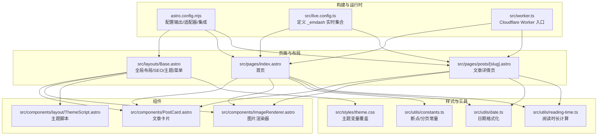
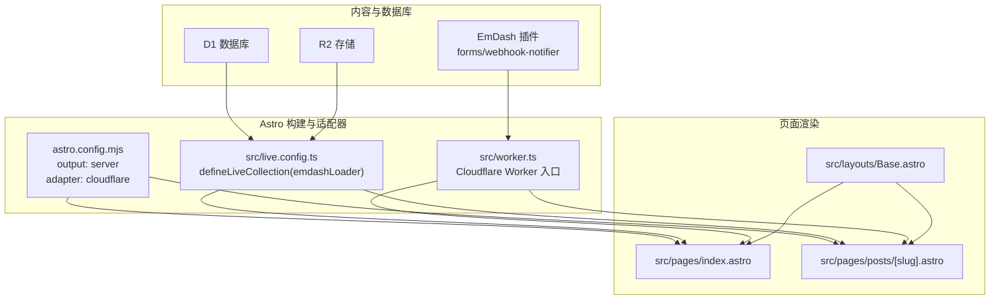
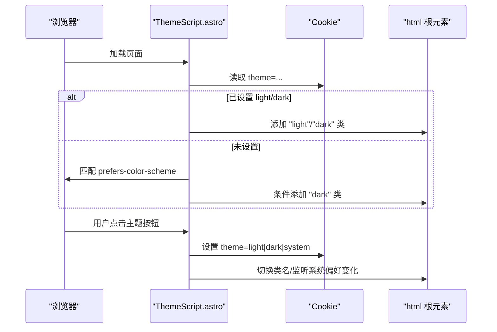
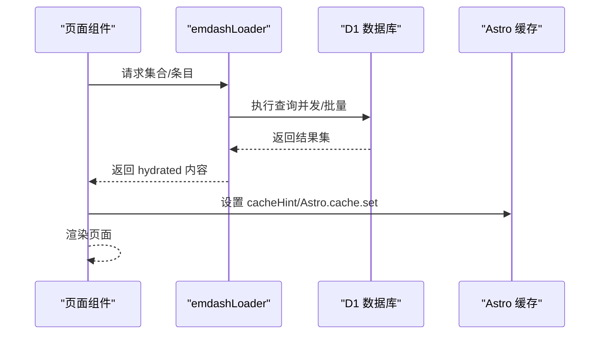
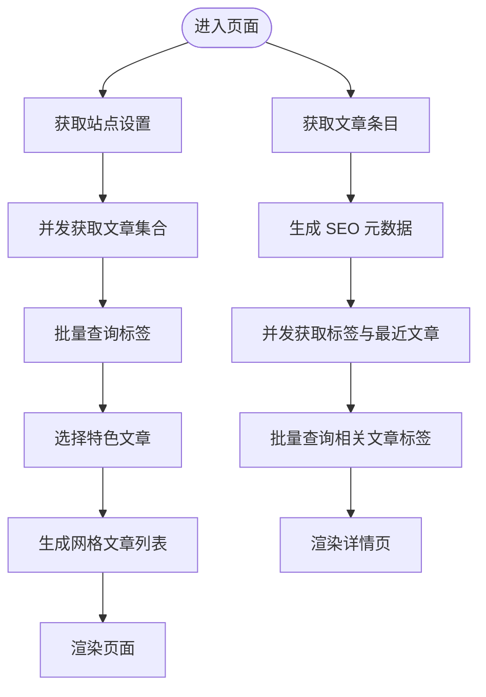
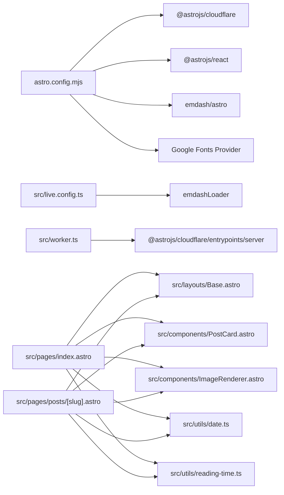

# 前端架构

<cite>
**本文引用的文件**
- [README.md](file://README.md)
- [astro.config.mjs](file://astro.config.mjs)
- [src/live.config.ts](file://src/live.config.ts)
- [src/worker.ts](file://src/worker.ts)
- [package.json](file://package.json)
- [src/layouts/Base.astro](file://src/layouts/Base.astro)
- [src/components/layout/ThemeScript.astro](file://src/components/layout/ThemeScript.astro)
- [src/styles/theme.css](file://src/styles/theme.css)
- [src/utils/constants.ts](file://src/utils/constants.ts)
- [src/pages/index.astro](file://src/pages/index.astro)
- [src/components/PostCard.astro](file://src/components/PostCard.astro)
- [src/components/ImageRenderer.astro](file://src/components/ImageRenderer.astro)
- [src/pages/posts/[slug].astro](file://src/pages/posts/[slug].astro)
- [src/utils/date.ts](file://src/utils/date.ts)
- [src/utils/reading-time.ts](file://src/utils/reading-time.ts)
</cite>

## 目录
1. [简介](#简介)
2. [项目结构](#项目结构)
3. [核心组件](#核心组件)
4. [架构总览](#架构总览)
5. [详细组件分析](#详细组件分析)
6. [依赖关系分析](#依赖关系分析)
7. [性能考量](#性能考量)
8. [故障排查指南](#故障排查指南)
9. [结论](#结论)
10. [附录](#附录)

## 简介
本项目是一个基于 EmDash 内容管理系统的博客模板，采用 Astro 框架与 Cloudflare Workers 运行时进行部署。其前端架构以 Astro 的服务端渲染（SSR）模式为核心，结合 EmDash 提供的运行时加载器（emdashLoader）实现“实时内容”与“静态构建”的混合能力，既保证了首屏性能与 SEO 友好性，又支持在 Workers 上动态查询数据库与存储资源。

该架构的关键特性包括：
- 基于 Astro 的 SSR/SSG 混合模式：在 Cloudflare Workers 上通过 SSR 渲染页面，同时利用 Astro 的构建与缓存机制提升性能。
- 组件化布局系统：统一的 Base 布局负责 SEO、主题、菜单、页脚等通用结构；页面组件按路由组织，复用可组合的卡片与媒体组件。
- 主题系统与样式管理：通过 CSS 变量与层（layer）机制实现明暗主题与可定制主题变量，配合内联 ThemeScript 防止主题闪烁。
- 实时内容加载：通过 emdashLoader 定义的_live 集合，在 Astro 构建期或运行时从数据库动态拉取内容，实现“所见即所得”的内容更新。
- 性能优化：并发查询、批量标签查询、缓存提示、图片懒加载与响应式布局，兼顾体验与性能。

章节来源
- [README.md:1-68](file://README.md#L1-L68)

## 项目结构
项目采用按功能域分层的组织方式：
- src/layouts：全局布局 Base.astro，承载站点头部、导航、页脚与主题切换逻辑。
- src/pages：页面级路由组件，如首页、文章详情、分类/标签归档、搜索、RSS 等。
- src/components：可复用 UI 组件，如 PostCard、ImageRenderer、ThemeScript 等。
- src/styles：主题样式入口 theme.css，与 Base.astro 中的全局样式共同构成样式体系。
- src/utils：工具模块，如日期格式化、阅读时长计算、断点常量等。
- astro.config.mjs：Astro 构建配置，定义输出模式、适配器、集成与字体配置。
- src/live.config.ts：定义 _emdash 实时内容集合，绑定 emdashLoader。
- src/worker.ts：Cloudflare Worker 入口，桥接 Astro SSR 与 EmDash 插件沙箱。
- package.json：脚本与依赖声明，包含 Astro、@astrojs/cloudflare、EmDash 生态插件。

图表来源
- [astro.config.mjs:1-45](file://astro.config.mjs#L1-L45)
- [src/live.config.ts:1-14](file://src/live.config.ts#L1-L14)
- [src/worker.ts:1-6](file://src/worker.ts#L1-L6)
- [src/layouts/Base.astro:1-968](file://src/layouts/Base.astro#L1-L968)
- [src/pages/index.astro:1-463](file://src/pages/index.astro#L1-L463)
- [src/pages/posts/[slug].astro:1-980](file://src/pages/posts/[slug].astro#L1-L980)
- [src/components/PostCard.astro:1-285](file://src/components/PostCard.astro#L1-L285)
- [src/components/ImageRenderer.astro:1-36](file://src/components/ImageRenderer.astro#L1-L36)
- [src/components/layout/ThemeScript.astro:1-84](file://src/components/layout/ThemeScript.astro#L1-L84)
- [src/styles/theme.css:1-109](file://src/styles/theme.css#L1-L109)
- [src/utils/constants.ts:1-9](file://src/utils/constants.ts#L1-L9)
- [src/utils/date.ts:1-18](file://src/utils/date.ts#L1-L18)
- [src/utils/reading-time.ts:1-67](file://src/utils/reading-time.ts#L1-L67)

章节来源
- [astro.config.mjs:1-45](file://astro.config.mjs#L1-L45)
- [src/live.config.ts:1-14](file://src/live.config.ts#L1-L14)
- [src/worker.ts:1-6](file://src/worker.ts#L1-L6)
- [src/layouts/Base.astro:1-968](file://src/layouts/Base.astro#L1-L968)
- [src/pages/index.astro:1-463](file://src/pages/index.astro#L1-L463)
- [src/pages/posts/[slug].astro:1-980](file://src/pages/posts/[slug].astro#L1-L980)
- [src/components/PostCard.astro:1-285](file://src/components/PostCard.astro#L1-L285)
- [src/components/ImageRenderer.astro:1-36](file://src/components/ImageRenderer.astro#L1-L36)
- [src/components/layout/ThemeScript.astro:1-84](file://src/components/layout/ThemeScript.astro#L1-L84)
- [src/styles/theme.css:1-109](file://src/styles/theme.css#L1-L109)
- [src/utils/constants.ts:1-9](file://src/utils/constants.ts#L1-L9)
- [src/utils/date.ts:1-18](file://src/utils/date.ts#L1-L18)
- [src/utils/reading-time.ts:1-67](file://src/utils/reading-time.ts#L1-L67)

## 核心组件
- 布局系统
  - Base.astro：提供站点头部（含 SEO、字体、主题脚本）、导航、搜索、页脚与小部件区域，并通过 createPublicPageContext 注入页面上下文，支持插件贡献与安全渲染。
  - ThemeScript.astro：内联脚本在首次绘制前应用主题，避免闪烁；提供明/暗/系统三种主题切换与持久化 Cookie。
- 页面组件
  - index.astro：首页聚合展示，包含特色文章与文章网格，使用并发查询与批量标签查询减少往返次数。
  - posts/[slug].astro：文章详情页，三栏布局（元信息/主内容/侧边栏），内置目录生成与评论区。
- 可复用组件
  - PostCard.astro：文章卡片，支持头像、标签、摘要、阅读时长等字段。
  - ImageRenderer.astro：根据媒体来源选择外部直连或 EmDash 图片组件渲染。
- 工具与样式
  - theme.css：主题变量覆盖入口，所有默认变量均位于 Base.astro 的 @layer base，确保自定义变量优先级。
  - date.ts、reading-time.ts：日期格式化与阅读时长计算，支持中英文与 CJK 字符。
  - constants.ts：断点与每页数量常量，用于响应式与分页控制。

章节来源
- [src/layouts/Base.astro:1-968](file://src/layouts/Base.astro#L1-L968)
- [src/components/layout/ThemeScript.astro:1-84](file://src/components/layout/ThemeScript.astro#L1-L84)
- [src/pages/index.astro:1-463](file://src/pages/index.astro#L1-L463)
- [src/pages/posts/[slug].astro:1-980](file://src/pages/posts/[slug].astro#L1-L980)
- [src/components/PostCard.astro:1-285](file://src/components/PostCard.astro#L1-L285)
- [src/components/ImageRenderer.astro:1-36](file://src/components/ImageRenderer.astro#L1-L36)
- [src/styles/theme.css:1-109](file://src/styles/theme.css#L1-L109)
- [src/utils/date.ts:1-18](file://src/utils/date.ts#L1-L18)
- [src/utils/reading-time.ts:1-67](file://src/utils/reading-time.ts#L1-L67)
- [src/utils/constants.ts:1-9](file://src/utils/constants.ts#L1-L9)

## 架构总览
EmDash 前端采用 Astro SSR + Cloudflare Workers 的运行时架构：
- 输出模式：服务端渲染（SSR），由 @astrojs/cloudflare 适配器在 Workers 上执行。
- 数据加载：通过 emdashLoader 定义的 _emdash 实时集合，在页面渲染阶段从 D1 数据库与 R2 存储中拉取内容。
- 插件生态：启用 forms 与 webhook notifier 插件，并通过沙箱 runner 在 Workers 上安全执行。
- 图片与字体：使用 Astro 图像优化与 Google Fonts 提供者，开启响应式样式与约束布局。
- 开发与部署：本地开发使用 astro dev，构建后通过 Wrangler 部署到 Cloudflare。

图表来源
- [astro.config.mjs:1-45](file://astro.config.mjs#L1-L45)
- [src/live.config.ts:1-14](file://src/live.config.ts#L1-L14)
- [src/worker.ts:1-6](file://src/worker.ts#L1-L6)
- [src/pages/index.astro:1-463](file://src/pages/index.astro#L1-L463)
- [src/pages/posts/[slug].astro:1-980](file://src/pages/posts/[slug].astro#L1-L980)
- [src/layouts/Base.astro:1-968](file://src/layouts/Base.astro#L1-L968)

章节来源
- [astro.config.mjs:1-45](file://astro.config.mjs#L1-L45)
- [src/live.config.ts:1-14](file://src/live.config.ts#L1-L14)
- [src/worker.ts:1-6](file://src/worker.ts#L1-L6)
- [README.md:40-68](file://README.md#L40-L68)

## 详细组件分析

### 布局系统与主题机制
- Base.astro 负责：
  - 获取站点设置、菜单、页面集合与公共页面上下文，注入 SEO、Open Graph 与 JSON-LD。
  - 渲染导航、搜索、页脚与小部件区域。
  - 引入主题脚本与样式，建立 CSS 变量与层（layer）体系。
- ThemeScript.astro 负责：
  - 在首次绘制前从 Cookie 或系统偏好应用主题类名，防止闪烁。
  - 提供按钮切换明/暗/系统主题，并持久化 Cookie。
- theme.css 作为覆盖入口，所有变量默认位于 @layer base，确保用户自定义始终生效。

图表来源
- [src/components/layout/ThemeScript.astro:1-84](file://src/components/layout/ThemeScript.astro#L1-L84)
- [src/layouts/Base.astro:1-968](file://src/layouts/Base.astro#L1-L968)
- [src/styles/theme.css:1-109](file://src/styles/theme.css#L1-L109)

章节来源
- [src/layouts/Base.astro:1-968](file://src/layouts/Base.astro#L1-L968)
- [src/components/layout/ThemeScript.astro:1-84](file://src/components/layout/ThemeScript.astro#L1-L84)
- [src/styles/theme.css:1-109](file://src/styles/theme.css#L1-L109)

### 实时内容加载机制（emdashLoader）
- live.config.ts 定义 _emdash 实时集合，绑定 emdashLoader，使页面可在构建期或运行时从数据库动态取数。
- 页面通过 getEmDashCollection/getEmDashEntry 等 API 并发拉取内容，结合 cacheHint 与 Astro.cache.set 提升缓存命中率。
- 文章详情页对标签与相关文章采用批量查询，避免 N+1 查询问题。

图表来源
- [src/live.config.ts:1-14](file://src/live.config.ts#L1-L14)
- [src/pages/index.astro:1-463](file://src/pages/index.astro#L1-L463)
- [src/pages/posts/[slug].astro:1-980](file://src/pages/posts/[slug].astro#L1-L980)

章节来源
- [src/live.config.ts:1-14](file://src/live.config.ts#L1-L14)
- [src/pages/index.astro:1-463](file://src/pages/index.astro#L1-L463)
- [src/pages/posts/[slug].astro:1-980](file://src/pages/posts/[slug].astro#L1-L980)

### 首页与文章详情的数据流
- 首页（index.astro）：
  - 并发获取站点设置与文章集合，限制返回数量，裁剪“查看更多”逻辑。
  - 批量查询标签，避免逐条查询带来的网络开销。
  - 选择特色文章与网格文章，传递阅读时长、标签与作者信息给 PostCard。
- 文章详情（posts/[slug].astro）：
  - 解码 slug，获取条目与 SEO 元数据，生成 Open Graph 图片 URL。
  - 并发获取标签与最近文章，批量查询相关文章标签，生成“继续阅读”区块。
  - 三栏布局（元信息/主内容/侧边栏），目录由客户端脚本生成并高亮当前节。

图表来源
- [src/pages/index.astro:1-463](file://src/pages/index.astro#L1-L463)
- [src/pages/posts/[slug].astro:1-980](file://src/pages/posts/[slug].astro#L1-L980)
- [src/utils/reading-time.ts:1-67](file://src/utils/reading-time.ts#L1-L67)
- [src/utils/date.ts:1-18](file://src/utils/date.ts#L1-L18)

章节来源
- [src/pages/index.astro:1-463](file://src/pages/index.astro#L1-L463)
- [src/pages/posts/[slug].astro:1-980](file://src/pages/posts/[slug].astro#L1-L980)
- [src/utils/reading-time.ts:1-67](file://src/utils/reading-time.ts#L1-L67)
- [src/utils/date.ts:1-18](file://src/utils/date.ts#L1-L18)

### 组件 API 规范与最佳实践
- PostCard.astro
  - 输入属性：标题、摘要、封面图、链接、日期、阅读时长、标签、作者。
  - 最佳实践：优先传入 bylines 与标签数组，以便渲染完整信息；封面图为空时显示占位。
- ImageRenderer.astro
  - 输入属性：媒体值、替代文本、尺寸与类名。
  - 最佳实践：区分外部直链与本地存储，自动选择  或 EmDash 图片组件，确保响应式与懒加载。
- Base.astro
  - 页面上下文：通过 createPublicPageContext 注入 SEO、文章元数据与站点信息。
  - 最佳实践：在内容页传递 content 参数，便于插件贡献与安全渲染。
- 主题与样式
  - 使用 theme.css 覆盖变量，避免使用复杂选择器；CSS 变量命名遵循语义化前缀。
  - 在 Base.astro 中使用 @layer base 确保默认样式优先级，自定义变量覆盖不受影响。

章节来源
- [src/components/PostCard.astro:1-285](file://src/components/PostCard.astro#L1-L285)
- [src/components/ImageRenderer.astro:1-36](file://src/components/ImageRenderer.astro#L1-L36)
- [src/layouts/Base.astro:1-968](file://src/layouts/Base.astro#L1-L968)
- [src/styles/theme.css:1-109](file://src/styles/theme.css#L1-L109)

## 依赖关系分析
- Astro 配置与运行时
  - astro.config.mjs 启用 @astrojs/cloudflare 适配器与 React 集成，配置字体与图像优化。
  - src/worker.ts 将 Astro SSR 入口导出为 Cloudflare Worker 处理器。
- 内容加载与插件
  - src/live.config.ts 定义 _emdash 实时集合，绑定 emdashLoader。
  - package.json 声明 @emdash-cms/cloudflare、plugin-forms、plugin-webhook-notifier 等依赖。
- 页面与组件
  - Base.astro 依赖 EmDash UI 组件与工具函数；页面组件依赖 Base 与可复用组件。
  - utils 模块被页面与组件共享，提供日期与阅读时长计算。

图表来源
- [astro.config.mjs:1-45](file://astro.config.mjs#L1-L45)
- [src/live.config.ts:1-14](file://src/live.config.ts#L1-L14)
- [src/worker.ts:1-6](file://src/worker.ts#L1-L6)
- [src/pages/index.astro:1-463](file://src/pages/index.astro#L1-L463)
- [src/pages/posts/[slug].astro:1-980](file://src/pages/posts/[slug].astro#L1-L980)
- [src/layouts/Base.astro:1-968](file://src/layouts/Base.astro#L1-L968)
- [src/components/PostCard.astro:1-285](file://src/components/PostCard.astro#L1-L285)
- [src/components/ImageRenderer.astro:1-36](file://src/components/ImageRenderer.astro#L1-L36)
- [src/utils/date.ts:1-18](file://src/utils/date.ts#L1-L18)
- [src/utils/reading-time.ts:1-67](file://src/utils/reading-time.ts#L1-L67)

章节来源
- [astro.config.mjs:1-45](file://astro.config.mjs#L1-L45)
- [package.json:1-33](file://package.json#L1-L33)
- [src/live.config.ts:1-14](file://src/live.config.ts#L1-L14)
- [src/worker.ts:1-6](file://src/worker.ts#L1-L6)
- [src/pages/index.astro:1-463](file://src/pages/index.astro#L1-L463)
- [src/pages/posts/[slug].astro:1-980](file://src/pages/posts/[slug].astro#L1-L980)
- [src/layouts/Base.astro:1-968](file://src/layouts/Base.astro#L1-L968)
- [src/components/PostCard.astro:1-285](file://src/components/PostCard.astro#L1-L285)
- [src/components/ImageRenderer.astro:1-36](file://src/components/ImageRenderer.astro#L1-L36)
- [src/utils/date.ts:1-18](file://src/utils/date.ts#L1-L18)
- [src/utils/reading-time.ts:1-67](file://src/utils/reading-time.ts#L1-L67)

## 性能考量
- 并发与批量查询
  - 首页与详情页广泛使用 Promise.all 并发获取数据，减少等待时间。
  - 批量查询标签（getTermsForEntries）避免 N+1 查询，显著降低数据库往返。
- 缓存与构建
  - 页面通过 cacheHint 与 Astro.cache.set 提示缓存，结合 Cloudflare Workers 的边缘缓存提升重复访问速度。
- 图片与字体
  - 启用 Astro 图像优化与响应式样式，合理设置尺寸与布局，避免布局偏移。
  - 使用 Google Fonts 提供者预加载关键字体变量，提升可访问性与性能。
- 响应式与交互
  - 使用 CSS 变量与 clamp 实现流式排版，结合断点常量（constants.ts）优化移动端体验。
  - 目录生成与滚动高亮仅在客户端执行，避免阻塞首屏渲染。

章节来源
- [src/pages/index.astro:1-463](file://src/pages/index.astro#L1-L463)
- [src/pages/posts/[slug].astro:1-980](file://src/pages/posts/[slug].astro#L1-L980)
- [astro.config.mjs:12-15](file://astro.config.mjs#L12-L15)
- [src/utils/constants.ts:1-9](file://src/utils/constants.ts#L1-L9)

## 故障排查指南
- 404 页面
  - 文章详情页在 slug 无效或条目不存在时重定向至 404，检查参数解码与路由匹配。
- 主题闪烁
  - 确认 ThemeScript.astro 是否正确在 <head> 内联执行，且 Cookie 与系统偏好设置正确。
- 图片不显示
  - 检查 ImageRenderer.astro 的媒体来源判断与 URL 解析逻辑，确认外部直链与本地存储路径。
- SEO 与 Open Graph
  - 确认 Base.astro 中 createPublicPageContext 与 getSeoMeta 的调用顺序与参数完整性。
- 插件与沙箱
  - 若表单或 Webhook 功能异常，检查 @emdash-cms/plugin-forms 与 sandboxed 配置是否正确加载。

章节来源
- [src/pages/posts/[slug].astro:25-35](file://src/pages/posts/[slug].astro#L25-L35)
- [src/components/layout/ThemeScript.astro:1-84](file://src/components/layout/ThemeScript.astro#L1-L84)
- [src/components/ImageRenderer.astro:1-36](file://src/components/ImageRenderer.astro#L1-L36)
- [src/layouts/Base.astro:61-74](file://src/layouts/Base.astro#L61-L74)
- [astro.config.mjs:16-26](file://astro.config.mjs#L16-L26)

## 结论
本项目通过 Astro SSR 与 EmDash 实时加载器的结合，实现了高性能、可扩展且易于维护的前端架构。布局与组件分离清晰，主题系统与样式管理灵活可控，数据流采用并发与批量策略优化性能。配合 Cloudflare Workers 的边缘部署，整体具备优秀的首屏速度、SEO 表现与可维护性。

## 附录
- 部署与开发
  - 本地开发：安装依赖后执行 dev 脚本启动 Astro 开发服务器。
  - 部署：构建后通过 Wrangler 部署到 Cloudflare Workers。
- 页面路由概览
  - 首页、文章列表、文章详情、分类归档、标签归档、搜索、静态页面与 404 页面。

章节来源
- [README.md:47-68](file://README.md#L47-L68)
- [package.json:10-16](file://package.json#L10-L16)