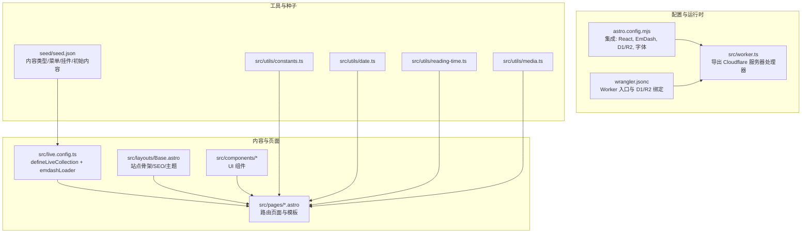
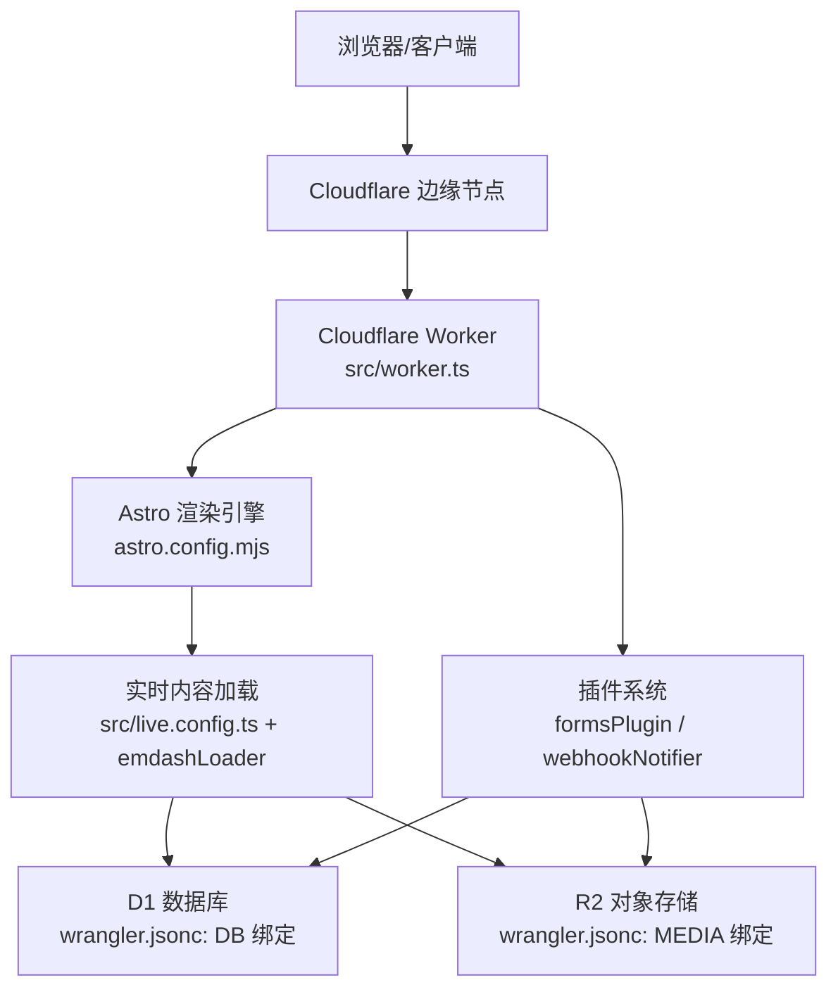
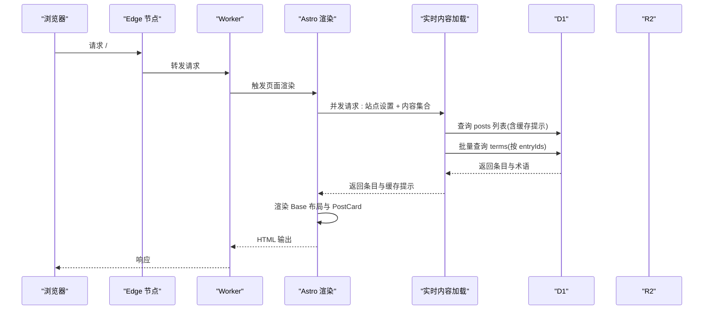
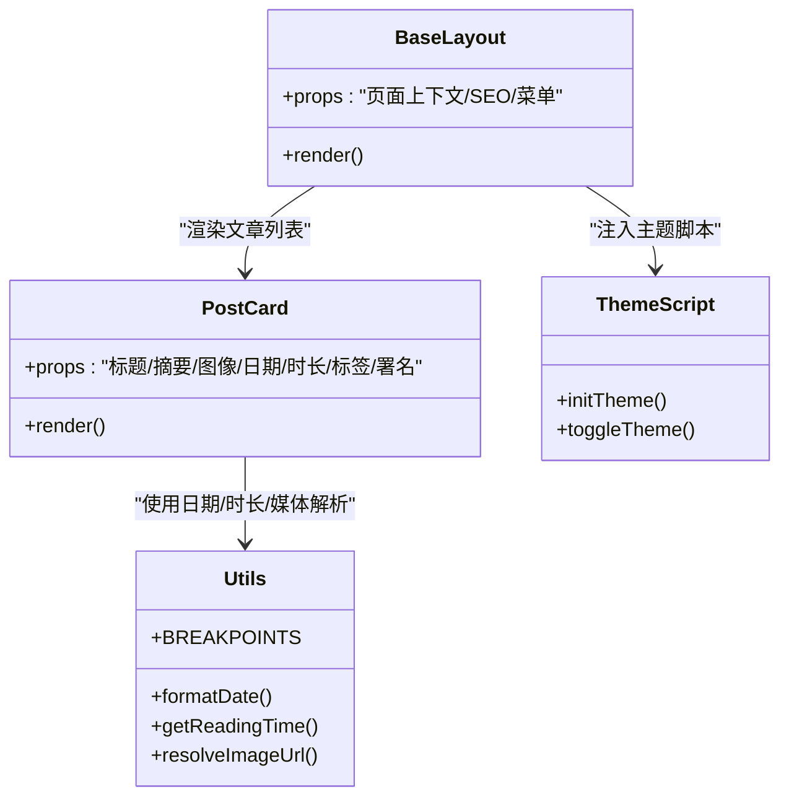
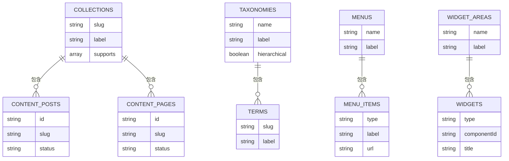
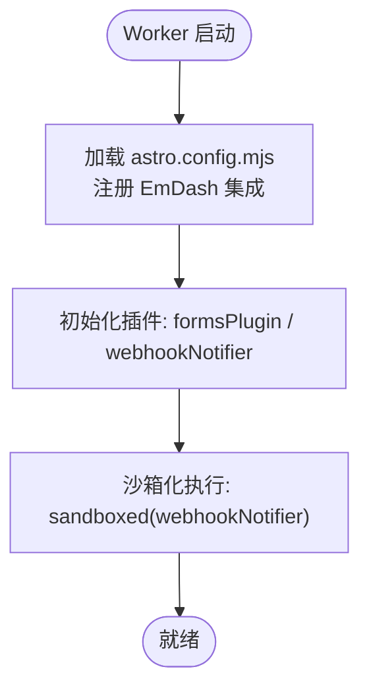
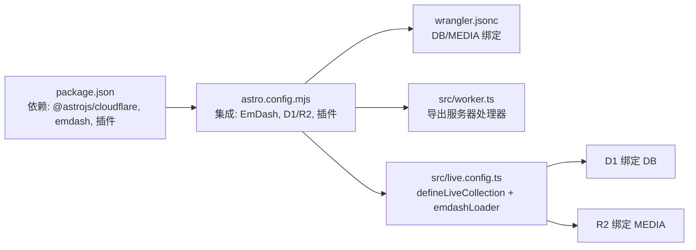
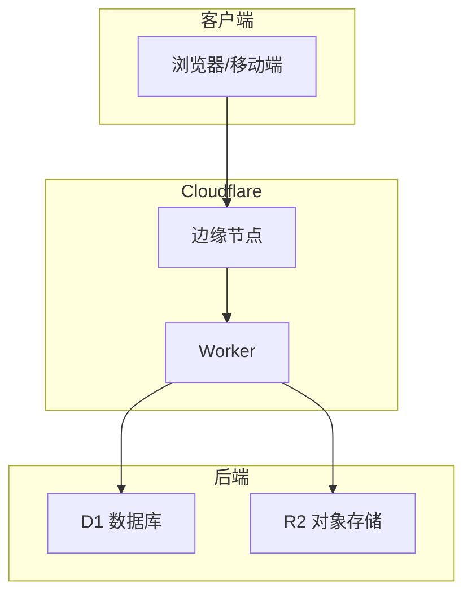

# 技术架构

<cite>
**本文引用的文件**
- [README.md](file://README.md)
- [package.json](file://package.json)
- [astro.config.mjs](file://astro.config.mjs)
- [wrangler.jsonc](file://wrangler.jsonc)
- [src/worker.ts](file://src/worker.ts)
- [src/live.config.ts](file://src/live.config.ts)
- [src/pages/index.astro](file://src/pages/index.astro)
- [src/layouts/Base.astro](file://src/layouts/Base.astro)
- [src/components/PostCard.astro](file://src/components/PostCard.astro)
- [src/components/layout/ThemeScript.astro](file://src/components/layout/ThemeScript.astro)
- [src/utils/constants.ts](file://src/utils/constants.ts)
- [src/utils/date.ts](file://src/utils/date.ts)
- [src/utils/reading-time.ts](file://src/utils/reading-time.ts)
- [src/utils/media.ts](file://src/utils/media.ts)
- [seed/seed.json](file://seed/seed.json)
</cite>

## 目录
1. [引言](#引言)
2. [项目结构](#项目结构)
3. [核心组件](#核心组件)
4. [架构总览](#架构总览)
5. [详细组件分析](#详细组件分析)
6. [依赖关系分析](#依赖关系分析)
7. [性能考量](#性能考量)
8. [故障排查指南](#故障排查指南)
9. [结论](#结论)
10. [附录](#附录)

## 引言
本技术架构文档面向 EmDash 博客模板（Cloudflare 版本），聚焦于基于 Astro 框架的静态站点生成与 Cloudflare Workers 运行时的集成；详述 EmDash CMS 的内容管理系统架构、实时内容加载机制与数据流设计；阐述 D1 数据库与 R2 对象存储的集成方案；解释组件化架构模式、插件系统设计与响应式布局实现；并提供系统边界图、组件交互图与数据流向图，讨论技术决策、权衡与约束，并给出基础设施要求、可扩展性考虑与部署拓扑，以及安全、监控与灾难恢复等横切关注点。

## 项目结构
该仓库采用以功能域与页面为中心的组织方式：
- 配置层：astro.config.mjs 定义 Astro 构建输出、Cloudflare 适配器、图片优化、字体与 EmDash 集成；wrangler.jsonc 定义 Worker 入口、兼容性标志与 D1/R2 绑定。
- 运行时入口：src/worker.ts 将 @astrojs/cloudflare 的 server 入口导出为 Worker 处理器。
- 内容与页面：src/pages 下定义路由页面（主页、文章归档、分类/标签归档、搜索、静态页、404）；src/layouts/Base.astro 提供站点骨架与 SEO/主题注入；src/components 提供可复用 UI 组件（如 PostCard、ImageRenderer、ThemeScript）。
- 工具与常量：src/utils 提供断点、日期格式化、阅读时长计算、媒体解析等通用逻辑。
- 实时内容集合：src/live.config.ts 定义 _emdash 实时集合，通过 emdashLoader 从数据库加载内容。
- 种子数据：seed/seed.json 描述内容类型、分类/标签、菜单、挂件区、小部件与初始内容，驱动站点初始化与演示。

图表来源
- [astro.config.mjs:1-45](file://astro.config.mjs#L1-L45)
- [wrangler.jsonc:1-20](file://wrangler.jsonc#L1-L20)
- [src/worker.ts:1-6](file://src/worker.ts#L1-L6)
- [src/live.config.ts:1-14](file://src/live.config.ts#L1-L14)
- [src/pages/index.astro:1-463](file://src/pages/index.astro#L1-L463)
- [src/layouts/Base.astro:1-968](file://src/layouts/Base.astro#L1-L968)
- [src/utils/constants.ts:1-9](file://src/utils/constants.ts#L1-L9)
- [src/utils/date.ts:1-18](file://src/utils/date.ts#L1-L18)
- [src/utils/reading-time.ts:1-67](file://src/utils/reading-time.ts#L1-L67)
- [src/utils/media.ts:1-39](file://src/utils/media.ts#L1-L39)
- [seed/seed.json:1-939](file://seed/seed.json#L1-L939)

章节来源
- [README.md:1-68](file://README.md#L1-L68)
- [astro.config.mjs:1-45](file://astro.config.mjs#L1-L45)
- [wrangler.jsonc:1-20](file://wrangler.jsonc#L1-L20)
- [src/worker.ts:1-6](file://src/worker.ts#L1-L6)
- [src/live.config.ts:1-14](file://src/live.config.ts#L1-L14)
- [seed/seed.json:1-939](file://seed/seed.json#L1-L939)

## 核心组件
- Astro 与 Cloudflare 集成
  - 使用 @astrojs/cloudflare 适配器，输出类型为 server，配合 Wrangler 在 Cloudflare Workers 上运行。
  - 图片优化启用响应式样式，字体通过 Google Fonts 提供并映射到 CSS 变量。
- EmDash CMS 集成
  - 通过 emdash({ database: d1(...), storage: r2(...), plugins: [...], sandboxed: [...] }) 注入数据库、存储、插件与沙箱策略。
  - 实时内容集合通过 defineLiveCollection + emdashLoader 从 D1 加载，支持按集合查询、术语聚合与缓存提示。
- 数据与存储
  - D1 绑定 DB，R2 绑定 MEDIA，分别用于内容与媒体资源访问。
- 插件系统
  - formsPlugin 与 webhookNotifier 作为插件与沙箱化执行项，支持表单与 Webhook 通知能力。
- 响应式布局与主题
  - 基于 CSS 变量的主题系统，支持明/暗/系统主题切换；断点常量控制移动端与平板布局。
- 主题脚本
  - ThemeScript 在首屏前应用主题，避免闪烁，支持 Cookie 存储与系统偏好监听。

章节来源
- [astro.config.mjs:1-45](file://astro.config.mjs#L1-L45)
- [src/live.config.ts:1-14](file://src/live.config.ts#L1-L14)
- [src/utils/constants.ts:1-9](file://src/utils/constants.ts#L1-L9)
- [src/components/layout/ThemeScript.astro:1-84](file://src/components/layout/ThemeScript.astro#L1-L84)

## 架构总览
EmDash 博客模板在 Cloudflare Workers 上以 Astro 生成的静态内容为基础，结合 EmDash 的实时内容加载与插件生态，形成“静态基座 + 动态内容”的混合架构。D1 提供结构化内容与元数据，R2 提供媒体对象存储，Worker 入口负责请求处理与内容渲染。

图表来源
- [src/worker.ts:1-6](file://src/worker.ts#L1-L6)
- [astro.config.mjs:1-45](file://astro.config.mjs#L1-L45)
- [src/live.config.ts:1-14](file://src/live.config.ts#L1-L14)
- [wrangler.jsonc:1-20](file://wrangler.jsonc#L1-L20)

## 详细组件分析

### 页面渲染与实时内容加载流程
- 路由页面（如首页）并发拉取站点设置与内容集合，利用 getEmDashCollection 获取条目与缓存提示，随后进行分页与标签聚合，最终渲染到 Base 布局。
- 通过 getTermsForEntries 批量获取多条目的标签，避免 N+1 查询；使用 Astro.cache.set 应用缓存提示，提升边缘命中率。

图表来源
- [src/pages/index.astro:19-65](file://src/pages/index.astro#L19-L65)
- [src/layouts/Base.astro:16-78](file://src/layouts/Base.astro#L16-L78)
- [src/live.config.ts:11-13](file://src/live.config.ts#L11-L13)

章节来源
- [src/pages/index.astro:19-65](file://src/pages/index.astro#L19-L65)
- [src/layouts/Base.astro:16-78](file://src/layouts/Base.astro#L16-L78)
- [src/live.config.ts:11-13](file://src/live.config.ts#L11-L13)

### 组件化架构与响应式布局
- 组件职责清晰：PostCard 负责文章卡片展示；ThemeScript 负责主题切换与防闪烁；Base 提供站点骨架、SEO 注入与挂件区。
- 响应式断点来自 constants.ts，页面与组件样式根据断点调整网格与排版。
- 阅读时长与日期格式化通过工具函数复用，减少重复逻辑。

图表来源
- [src/layouts/Base.astro:16-78](file://src/layouts/Base.astro#L16-L78)
- [src/components/PostCard.astro:1-285](file://src/components/PostCard.astro#L1-L285)
- [src/components/layout/ThemeScript.astro:1-84](file://src/components/layout/ThemeScript.astro#L1-L84)
- [src/utils/constants.ts:1-9](file://src/utils/constants.ts#L1-L9)
- [src/utils/date.ts:1-18](file://src/utils/date.ts#L1-L18)
- [src/utils/reading-time.ts:1-67](file://src/utils/reading-time.ts#L1-L67)
- [src/utils/media.ts:1-39](file://src/utils/media.ts#L1-L39)

章节来源
- [src/components/PostCard.astro:1-285](file://src/components/PostCard.astro#L1-L285)
- [src/components/layout/ThemeScript.astro:1-84](file://src/components/layout/ThemeScript.astro#L1-L84)
- [src/utils/constants.ts:1-9](file://src/utils/constants.ts#L1-L9)
- [src/utils/date.ts:1-18](file://src/utils/date.ts#L1-L18)
- [src/utils/reading-time.ts:1-67](file://src/utils/reading-time.ts#L1-L67)
- [src/utils/media.ts:1-39](file://src/utils/media.ts#L1-L39)

### 数据模型与种子
- 种子文件 seed.json 定义了 posts/pages 内容集合、分类/标签、菜单、挂件区、小部件与初始内容，驱动站点初始化与演示。
- 通过 EmDash 的内容类型与字段定义，支持富文本、图像、摘要、SEO 等特性。

图表来源
- [seed/seed.json:13-67](file://seed/seed.json#L13-L67)
- [seed/seed.json:68-115](file://seed/seed.json#L68-L115)
- [seed/seed.json:129-151](file://seed/seed.json#L129-L151)
- [seed/seed.json:152-218](file://seed/seed.json#L152-L218)
- [seed/seed.json:275-311](file://seed/seed.json#L275-L311)
- [seed/seed.json:312-584](file://seed/seed.json#L312-L584)

章节来源
- [seed/seed.json:13-67](file://seed/seed.json#L13-L67)
- [seed/seed.json:68-115](file://seed/seed.json#L68-L115)
- [seed/seed.json:129-151](file://seed/seed.json#L129-L151)
- [seed/seed.json:152-218](file://seed/seed.json#L152-L218)
- [seed/seed.json:275-311](file://seed/seed.json#L275-L311)
- [seed/seed.json:312-584](file://seed/seed.json#L312-L584)

### 插件系统与沙箱执行
- formsPlugin 与 webhookNotifier 作为插件集成到 EmDash 配置中，前者提供表单能力，后者提供 Webhook 通知。
- sandboxed 选项将特定插件置于沙箱中执行，限制其对运行时的访问范围，提升安全性。

图表来源
- [astro.config.mjs:16-26](file://astro.config.mjs#L16-L26)

章节来源
- [astro.config.mjs:16-26](file://astro.config.mjs#L16-L26)

## 依赖关系分析
- 运行时与适配器
  - @astrojs/cloudflare 提供 Cloudflare 适配器与服务器入口；src/worker.ts 导出该入口。
  - wrangler.jsonc 定义 compatibility_date/flags、D1/R2 绑定名称与 Worker 入口路径。
- 内容与数据库
  - EmDash 集成通过 d1({ binding: "DB" }) 与 r2({ binding: "MEDIA" }) 注入数据库与存储。
  - 实时内容集合通过 emdashLoader 从 D1 读取，术语查询批量化以降低查询次数。
- 插件与沙箱
  - formsPlugin 与 webhookNotifier 作为插件；sandboxed 指定沙箱执行项，sandboxRunner 提供沙箱运行器。

图表来源
- [package.json:17-32](file://package.json#L17-L32)
- [astro.config.mjs:16-26](file://astro.config.mjs#L16-L26)
- [wrangler.jsonc:7-18](file://wrangler.jsonc#L7-L18)
- [src/worker.ts:1-6](file://src/worker.ts#L1-L6)
- [src/live.config.ts:11-13](file://src/live.config.ts#L11-L13)

章节来源
- [package.json:17-32](file://package.json#L17-L32)
- [astro.config.mjs:16-26](file://astro.config.mjs#L16-L26)
- [wrangler.jsonc:7-18](file://wrangler.jsonc#L7-L18)
- [src/worker.ts:1-6](file://src/worker.ts#L1-L6)
- [src/live.config.ts:11-13](file://src/live.config.ts#L11-L13)

## 性能考量
- 静态优先与边缘缓存
  - Astro 输出 server，结合 Cloudflare 边缘节点就近分发；页面通过 Astro.cache.set 设置缓存提示，提升命中率。
- 查询优化
  - getTermsForEntries 批量获取标签，避免 N+1；首页仅拉取必要数量并在服务端截断，减少前端负载。
- 图像与字体
  - 图片优化开启响应式样式；字体通过 Google Fonts 提供并映射到 CSS 变量，减少 FOIT/FOFT。
- 主题切换
  - ThemeScript 在首屏前应用主题，避免闪烁；主题状态持久化至 Cookie，减少重绘成本。

章节来源
- [src/pages/index.astro:19-65](file://src/pages/index.astro#L19-L65)
- [astro.config.mjs:12-15](file://astro.config.mjs#L12-L15)
- [src/components/layout/ThemeScript.astro:1-17](file://src/components/layout/ThemeScript.astro#L1-L17)

## 故障排查指南
- 内容加载异常
  - 检查 D1 绑定是否正确（DB），确认种子数据是否已迁移；验证实时集合加载器是否生效。
- 媒体资源无法显示
  - 检查 R2 绑定（MEDIA）与媒体键值；确认 resolveImageUrl 与外部图像判断逻辑。
- 插件行为异常
  - 确认 formsPlugin/webhookNotifier 是否正确注册；若涉及沙箱执行，检查 sandboxed 配置与权限。
- 主题切换无效
  - 检查 Cookie 设置与系统偏好监听逻辑；确认 ThemeScript 注入顺序与样式覆盖。

章节来源
- [wrangler.jsonc:7-18](file://wrangler.jsonc#L7-L18)
- [src/live.config.ts:11-13](file://src/live.config.ts#L11-L13)
- [src/utils/media.ts:5-30](file://src/utils/media.ts#L5-L30)
- [src/components/layout/ThemeScript.astro:26-83](file://src/components/layout/ThemeScript.astro#L26-L83)

## 结论
本架构以 Astro 与 Cloudflare Workers 为运行基座，结合 EmDash 的实时内容加载与插件体系，实现了高性能、可扩展且易于维护的博客系统。通过 D1/R2 的一体化数据与存储方案、组件化与响应式设计，以及合理的缓存与查询策略，满足现代静态站点对速度与体验的要求。同时，沙箱化插件与明确的系统边界为安全与可运维性提供了保障。

## 附录

### 系统边界与部署拓扑
- 边界
  - 客户端：浏览器/移动设备
  - 边缘：Cloudflare 边缘节点
  - 运行时：Cloudflare Worker（Astro 渲染 + EmDash 集成）
  - 数据：D1（内容/元数据）、R2（媒体）
  - 插件：formsPlugin、webhookNotifier（沙箱化）
- 拓扑
  - 客户端 → 边缘 → Worker → Astro 渲染 → 实时内容加载 → D1/R2
  - 插件通过沙箱运行，受限访问 D1/R2

图表来源
- [src/worker.ts:1-6](file://src/worker.ts#L1-L6)
- [wrangler.jsonc:7-18](file://wrangler.jsonc#L7-L18)

### 技术决策与权衡
- 选择 Cloudflare Workers 与 Astro Server 输出：兼顾静态站点的极致性能与动态内容的灵活性。
- D1/R2 一体化：简化数据与媒体的统一管理，降低跨服务复杂度。
- 插件沙箱化：在开放生态与安全之间取得平衡。
- 响应式断点与主题系统：在多设备上保持一致体验与可维护性。

### 基础设施要求与可扩展性
- 基础设施
  - Node.js 与 pnpm 环境；Wrangler CLI；Cloudflare 账户与 D1/R2 资源。
- 可扩展性
  - 通过 EmDash Marketplace 扩展插件；按需增加 Worker 绑定与数据库索引；利用 Cloudflare 边缘缓存提升全局性能。

### 安全、监控与灾难恢复
- 安全
  - 插件沙箱化；最小权限原则；Cookie 安全属性（Secure、SameSite）；输入校验与内容过滤。
- 监控
  - 利用 Cloudflare Analytics 与日志；监控 D1 查询延迟与 R2 访问指标；页面缓存命中率。
- 灾难恢复
  - D1 自动备份；R2 多区域可用性；Worker 快速回滚与版本化发布。