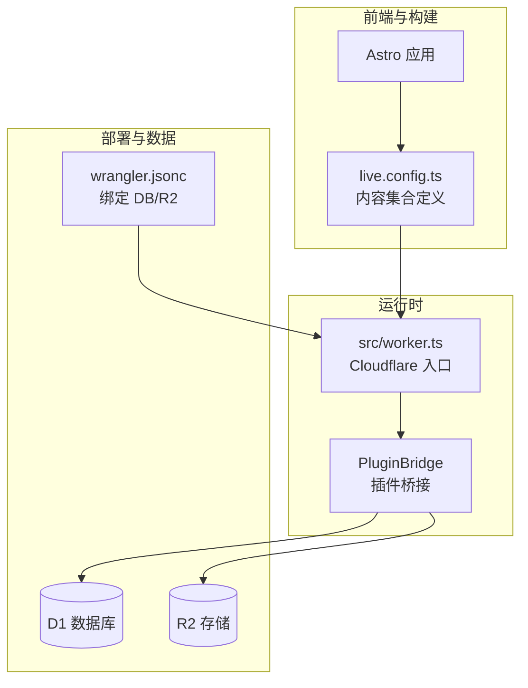
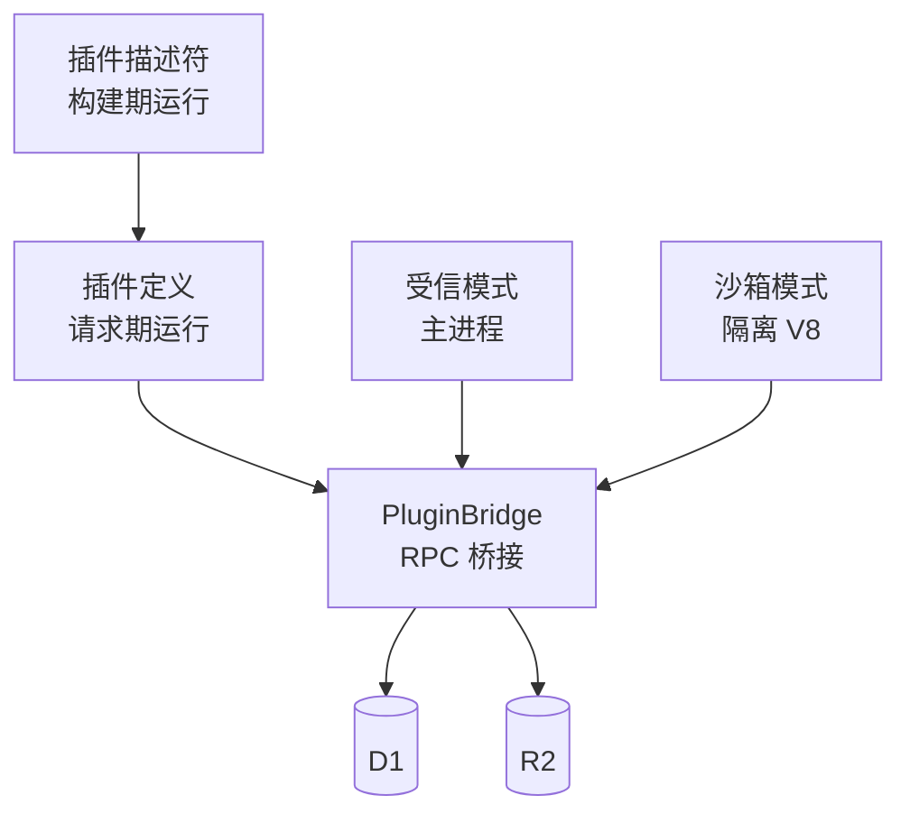
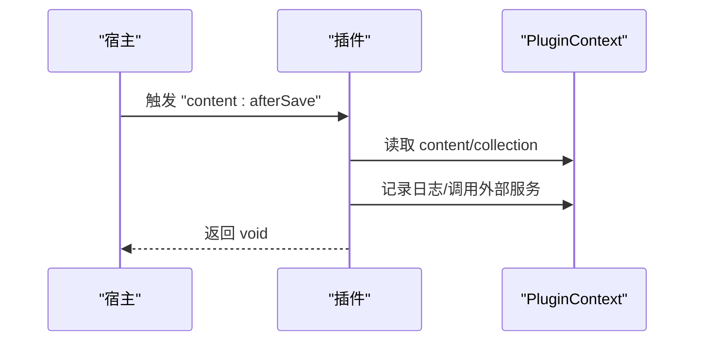
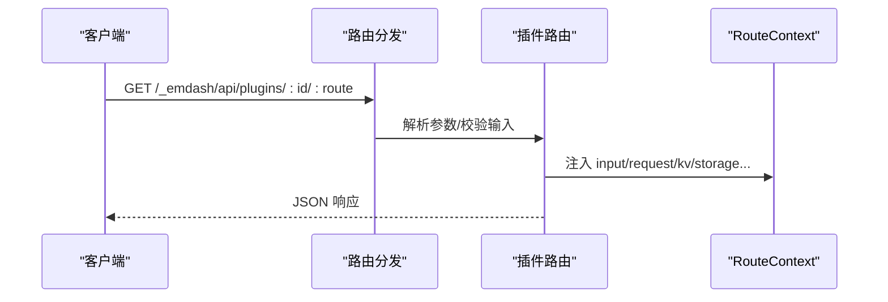
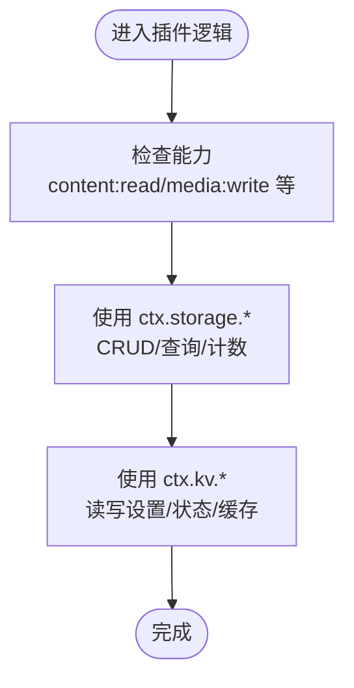
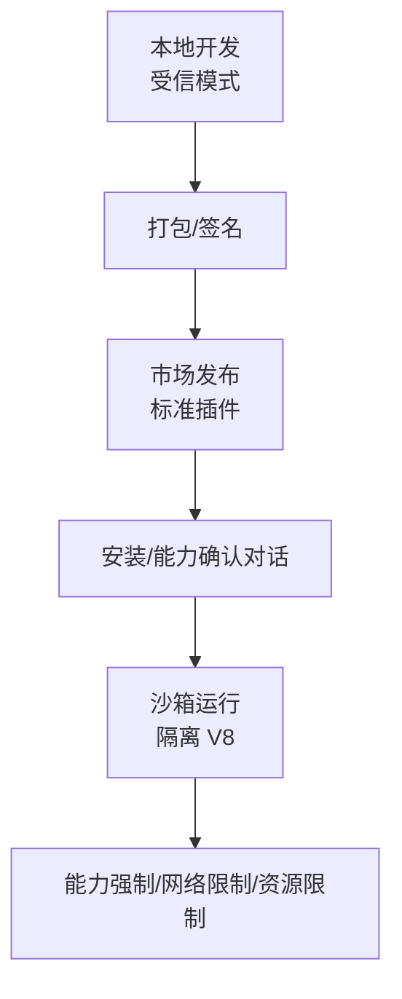
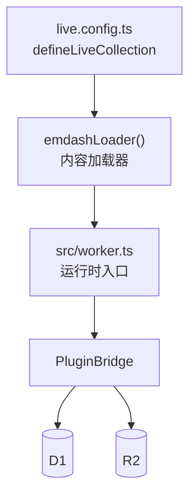
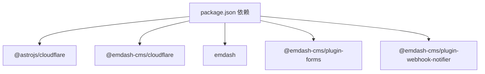

# 插件系统架构

<cite>
**本文引用的文件**
- [README.md](file://README.md)
- [package.json](file://package.json)
- [src/live.config.ts](file://src/live.config.ts)
- [src/worker.ts](file://src/worker.ts)
- [wrangler.jsonc](file://wrangler.jsonc)
- [emdash-env.d.ts](file://emdash-env.d.ts)
- [worker-configuration.d.ts](file://worker-configuration.d.ts)
- [.agents/skills/creating-plugins/SKILL.md](file://.agents/skills/creating-plugins/SKILL.md)
- [.agents/skills/creating-plugins/references/hooks.md](file://.agents/skills/creating-plugins/references/hooks.md)
- [.agents/skills/creating-plugins/references/api-routes.md](file://.agents/skills/creating-plugins/references/api-routes.md)
- [.agents/skills/creating-plugins/references/storage.md](file://.agents/skills/creating-plugins/references/storage.md)
- [.agents/skills/creating-plugins/references/block-kit.md](file://.agents/skills/creating-plugins/references/block-kit.md)
</cite>

## 目录
1. [简介](#简介)
2. [项目结构](#项目结构)
3. [核心组件](#核心组件)
4. [架构总览](#架构总览)
5. [详细组件分析](#详细组件分析)
6. [依赖关系分析](#依赖关系分析)
7. [性能考量](#性能考量)
8. [故障排查指南](#故障排查指南)
9. [结论](#结论)
10. [附录](#附录)

## 简介
本文件系统性梳理 EmDash 插件系统的设计理念、架构模式与运行机制，覆盖标准插件与原生插件的差异、生命周期与事件系统、钩子（hooks）机制、与核心系统的集成方式（API 访问、数据库与存储）、沙箱与安全隔离策略，并提供开发规范、接口文档与最佳实践，以及调试、测试与发布流程。

## 项目结构
该仓库是一个基于 Astro + Cloudflare Workers 的博客模板，同时内置了插件系统的参考实现与文档。关键结构如下：
- 运行时入口：Cloudflare Workers 入口导出插件桥接能力，用于在隔离环境中执行插件。
- 内容集合：通过 live 集合加载数据库内容，供插件在渲染与数据访问中使用。
- 插件生态：通过包依赖引入 forms 与 webhook notifier 等插件；插件开发参考位于 .agents/skills/creating-plugins。
- 部署配置：Wrangler 将 D1 与 R2 绑定到运行环境，作为插件可访问的数据层。

**图表来源**
- [src/worker.ts:1-6](file://src/worker.ts#L1-L6)
- [src/live.config.ts:1-14](file://src/live.config.ts#L1-L14)
- [wrangler.jsonc:1-20](file://wrangler.jsonc#L1-L20)

**章节来源**
- [README.md:1-68](file://README.md#L1-L68)
- [package.json:1-33](file://package.json#L1-L33)
- [src/worker.ts:1-6](file://src/worker.ts#L1-L6)
- [src/live.config.ts:1-14](file://src/live.config.ts#L1-L14)
- [wrangler.jsonc:1-20](file://wrangler.jsonc#L1-L20)

## 核心组件
- 插件类型与格式
  - 标准插件：统一的 definePlugin 定义，支持 hooks 与 routes，可在受信与沙箱两种模式下运行，适合市场发布与跨平台部署。
  - 原生插件：直接在宿主进程内运行，支持 React 管理端、Portable Text 块类型与站点侧渲染组件，但不支持沙箱与市场发布。
- 执行模式
  - 受信（Trusted）：在主进程中运行，能力以声明为准（非强制），适合第一方或已审查的 npm 包。
  - 沙箱（Sandboxed）：在 Cloudflare Workers 的隔离 V8 中运行，能力强制校验，网络受限，资源与内存有限制。
- 插件上下文（PluginContext）
  - 提供 storage、kv、log、content、media、http、users、cron、email 等能力，按需注入。
- 能力与权限
  - 通过描述符声明能力（如 content:read、media:write、network:request 等），沙箱模式下由 RPC 桥强制执行。
- 存储与设置
  - Storage：声明式文档集合，自动建模，带索引与查询能力。
  - KV：键值存储，适合设置、状态与缓存。
  - Settings Schema：自动生成管理端设置表单。

**章节来源**
- [.agents/skills/creating-plugins/SKILL.md:10-460](file://.agents/skills/creating-plugins/SKILL.md#L10-L460)
- [.agents/skills/creating-plugins/references/hooks.md:1-441](file://.agents/skills/creating-plugins/references/hooks.md#L1-L441)
- [.agents/skills/creating-plugins/references/storage.md:1-265](file://.agents/skills/creating-plugins/references/storage.md#L1-L265)

## 架构总览
EmDash 插件系统采用“统一定义、双模式执行”的架构：
- 描述符（Descriptor）在构建期运行，负责声明元数据、能力、存储与入口定位。
- 插件定义（definePlugin）在请求期运行，接收 PluginContext 并处理事件与路由。
- 受信模式下，插件与宿主共享进程，能力以声明为准；沙箱模式下，插件在隔离环境中运行，能力与网络等均受强制约束。
- 插件通过 PluginBridge 与运行时交互，访问 D1/R2 等资源。

**图表来源**
- [.agents/skills/creating-plugins/SKILL.md:23-88](file://.agents/skills/creating-plugins/SKILL.md#L23-L88)
- [src/worker.ts:1-6](file://src/worker.ts#L1-L6)
- [wrangler.jsonc:1-20](file://wrangler.jsonc#L1-L20)

## 详细组件分析

### 生命周期与事件系统（Hooks）
- 生命周期钩子：plugin:install、plugin:activate、plugin:deactivate、plugin:uninstall
- 内容钩子：content:beforeSave、content:afterSave、content:beforeDelete、content:afterDelete、content:afterPublish、content:afterUnpublish
- 媒体钩子：media:beforeUpload、media:afterUpload
- 邮件钩子：email:beforeSend、email:deliver（独占）、email:afterSend
- 计划任务：cron，配合 ctx.cron.schedule 在激活时注册
- 页面钩子：page:metadata（受信与沙箱均可）、page:fragments（仅受信）

钩子支持优先级、超时、依赖与错误策略，确保可控的执行顺序与容错。

**图表来源**
- [.agents/skills/creating-plugins/references/hooks.md:37-190](file://.agents/skills/creating-plugins/references/hooks.md#L37-L190)

**章节来源**
- [.agents/skills/creating-plugins/references/hooks.md:1-441](file://.agents/skills/creating-plugins/references/hooks.md#L1-L441)

### API 路由系统
- 路由暴露于固定路径前缀，支持 GET/POST/PUT/DELETE 等方法，输入可通过 Zod 校验，返回 JSON。
- 支持分页、条件查询、批量操作与外部 API 代理（需 network:request 能力与 allowedHosts）。
- 管理端可通过 usePluginAPI 调用，外部也可直接 curl 访问。

**图表来源**
- [.agents/skills/creating-plugins/references/api-routes.md:1-266](file://.agents/skills/creating-plugins/references/api-routes.md#L1-L266)

**章节来源**
- [.agents/skills/creating-plugins/references/api-routes.md:1-266](file://.agents/skills/creating-plugins/references/api-routes.md#L1-L266)

### 存储、KV 与设置
- Storage：声明式集合，自动建模，支持索引、查询、计数、分页与批量操作。
- KV：键值存储，建议使用 settings:/state:/cache: 前缀约定。
- Settings Schema：自动生成管理端设置表单，便于用户配置。

**图表来源**
- [.agents/skills/creating-plugins/references/storage.md:1-265](file://.agents/skills/creating-plugins/references/storage.md#L1-L265)

**章节来源**
- [.agents/skills/creating-plugins/references/storage.md:1-265](file://.agents/skills/creating-plugins/references/storage.md#L1-L265)

### 沙箱机制与安全隔离
- 沙箱在 Cloudflare Workers 的隔离 V8 中运行，每个插件一个 isolate。
- 能力强制：未声明的能力在运行时不可用；网络默认被阻止，必须通过 ctx.http.fetch 并受 allowedHosts 限制。
- 资源限制：CPU 时间、并发子请求、墙钟时间与内存上限。
- 不可用能力：Node.js API（无 fs/path 等）。
- 管理端 UI：沙箱插件使用 Block Kit（JSON 声明式 UI），不直接在浏览器运行插件代码。

**图表来源**
- [.agents/skills/creating-plugins/SKILL.md:115-177](file://.agents/skills/creating-plugins/SKILL.md#L115-L177)

**章节来源**
- [.agents/skills/creating-plugins/SKILL.md:115-177](file://.agents/skills/creating-plugins/SKILL.md#L115-L177)

### 原生插件与标准插件对比
- 原生插件：支持 React 管理端、PT 块与站点侧渲染组件；仅能在 plugins: [] 中运行，不支持沙箱与市场发布。
- 标准插件：默认推荐，支持 hooks/routes，可发布至市场，跨平台运行，受信/沙箱皆可。

**章节来源**
- [.agents/skills/creating-plugins/SKILL.md:10-22](file://.agents/skills/creating-plugins/SKILL.md#L10-L22)

### 插件与核心系统的集成
- 内容加载：通过 live.config.ts 定义 _emdash 集合，使用 emdashLoader 加载数据库内容。
- 数据库与存储：通过 Wrangler 绑定 D1 与 R2，插件通过 PluginBridge 访问。
- 运行时入口：src/worker.ts 导出 PluginBridge，作为沙箱与宿主交互的桥梁。

**图表来源**
- [src/live.config.ts:1-14](file://src/live.config.ts#L1-L14)
- [src/worker.ts:1-6](file://src/worker.ts#L1-L6)
- [wrangler.jsonc:1-20](file://wrangler.jsonc#L1-L20)

**章节来源**
- [src/live.config.ts:1-14](file://src/live.config.ts#L1-L14)
- [src/worker.ts:1-6](file://src/worker.ts#L1-L6)
- [wrangler.jsonc:1-20](file://wrangler.jsonc#L1-L20)

## 依赖关系分析
- 运行时依赖
  - @astrojs/cloudflare：Cloudflare Workers 入口与运行时适配。
  - @emdash-cms/cloudflare：提供沙箱与桥接能力。
  - emdash：核心运行时与内容加载器。
- 插件依赖
  - @emdash-cms/plugin-forms、@emdash-cms/plugin-webhook-notifier：示例插件，展示 hooks 与 routes 的使用。
- 开发与部署
  - wrangler：绑定 D1/R2，配置兼容日期与 flags。
  - pnpm：工作区与脚本。

**图表来源**
- [package.json:17-27](file://package.json#L17-L27)

**章节来源**
- [package.json:1-33](file://package.json#L1-L33)

## 性能考量
- 沙箱资源限制：CPU 50ms、最多 10 次子请求、30 秒墙钟时间、约 128MB 内存，避免长时间阻塞与过度 IO。
- 网络访问：统一通过 ctx.http.fetch，减少直连带来的不可控开销。
- 存储查询：合理设计索引，避免全表扫描；分页与批量操作降低单次负载。
- 钩子执行：利用优先级与依赖控制执行顺序，避免相互阻塞；对非关键操作使用 continue 错误策略。

[本节为通用指导，无需特定文件引用]

## 故障排查指南
- 能力缺失
  - 现象：调用 ctx.content/media/http/users/email 抛出未授权或不可用。
  - 处理：在插件描述符中正确声明所需能力，并在沙箱模式下配置 allowedHosts。
- 网络失败
  - 现象：直接 fetch 报错或超时。
  - 处理：改用 ctx.http.fetch，并在 allowedHosts 中添加目标域名。
- 存储查询异常
  - 现象：按未索引字段查询抛错。
  - 处理：在 definePlugin 的 storage 中添加相应索引。
- 钩子未触发
  - 现象：插件未响应事件。
  - 处理：检查钩子名称、优先级、依赖与错误策略；确认插件已启用且未被其他钩子取消。
- 调试与日志
  - 使用 ctx.log 输出结构化日志，结合浏览器开发者工具与 Cloudflare 日志查看器定位问题。

**章节来源**
- [.agents/skills/creating-plugins/SKILL.md:179-221](file://.agents/skills/creating-plugins/SKILL.md#L179-L221)
- [.agents/skills/creating-plugins/references/hooks.md:412-418](file://.agents/skills/creating-plugins/references/hooks.md#L412-L418)
- [.agents/skills/creating-plugins/references/storage.md:62-96](file://.agents/skills/creating-plugins/references/storage.md#L62-L96)

## 结论
EmDash 插件系统通过“统一定义、双模式执行”实现了灵活性与安全性之间的平衡：标准插件兼顾易用性与可移植性，原生插件满足深度定制需求。借助明确的生命周期与钩子体系、严格的沙箱与能力模型、完善的存储与设置机制，插件可以在受信与沙箱模式下稳定运行，并通过市场进行一键安装与升级。遵循本文的开发规范与最佳实践，可显著提升插件质量与维护效率。

[本节为总结，无需特定文件引用]

## 附录

### 开发规范与最佳实践
- 描述符与实现分离：构建期只做声明，运行期只做逻辑。
- 能力最小化：仅声明必要能力，避免过度授权。
- 输入校验：使用 Zod 对路由输入进行严格校验。
- 错误处理：区分关键与非关键操作，合理设置 errorPolicy。
- 索引设计：根据查询模式设计索引，避免全表扫描。
- 网络访问：统一通过 ctx.http.fetch，避免直连。
- 沙箱兼容：避免使用 Node.js 内置模块，使用 Web API。

**章节来源**
- [.agents/skills/creating-plugins/SKILL.md:447-460](file://.agents/skills/creating-plugins/SKILL.md#L447-L460)
- [.agents/skills/creating-plugins/references/api-routes.md:91-141](file://.agents/skills/creating-plugins/references/api-routes.md#L91-L141)
- [.agents/skills/creating-plugins/references/storage.md:120-128](file://.agents/skills/creating-plugins/references/storage.md#L120-L128)

### API 接口文档（摘要）
- 路由前缀：/_emdash/api/plugins/{pluginId}/{routeName}
- 方法：GET/POST/PUT/DELETE（全部方法均支持）
- 输入：Zod 校验（POST/PUT/PATCH 从 body，GET/DELETE 从查询参数）
- 返回：任意 JSON 可序列化值
- 错误：抛出错误或返回自定义 Response

**章节来源**
- [.agents/skills/creating-plugins/references/api-routes.md:67-158](file://.agents/skills/creating-plugins/references/api-routes.md#L67-L158)

### 调试、测试与发布流程
- 调试
  - 本地开发使用受信模式，便于快速迭代与断点调试。
  - 使用 ctx.log 输出结构化日志，结合浏览器与 Cloudflare 日志查看器。
- 测试
  - 单元测试：对纯函数与工具函数进行测试。
  - 集成测试：通过模拟请求与上下文验证钩子与路由行为。
- 发布
  - 标准插件可打包为 .tar.gz 并发布至市场，包含清单、后端与可选的管理端 UI。
  - 原生插件仅能通过源码集成，无法沙箱化与市场发布。

**章节来源**
- [.agents/skills/creating-plugins/SKILL.md:222-232](file://.agents/skills/creating-plugins/SKILL.md#L222-L232)
- [.agents/skills/creating-plugins/references/publishing.md:1-38](file://.agents/skills/creating-plugins/references/publishing.md#L1-L38)