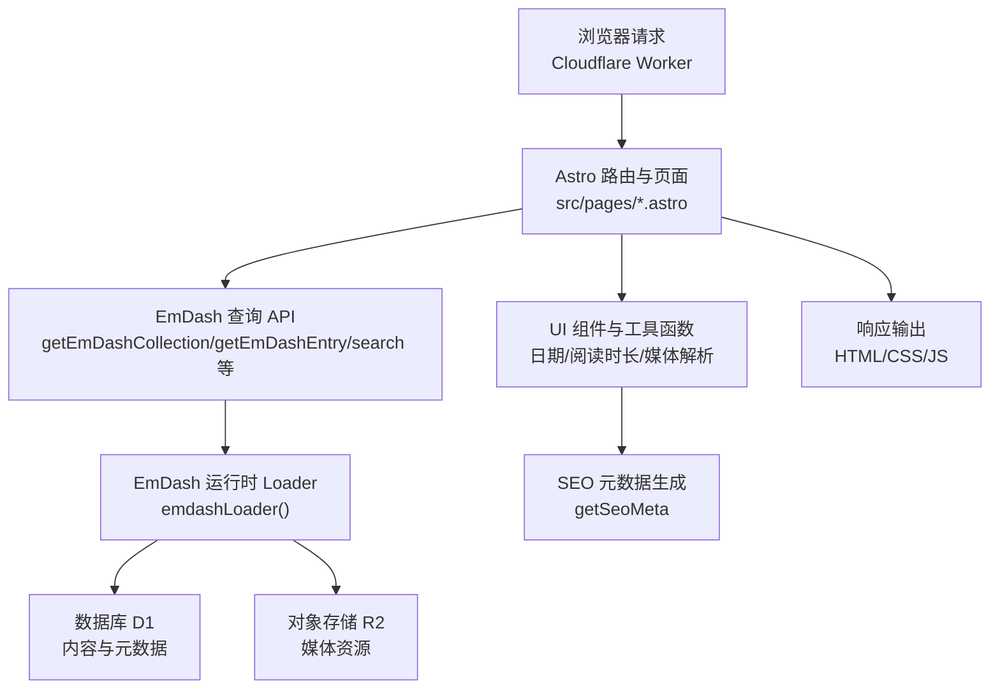
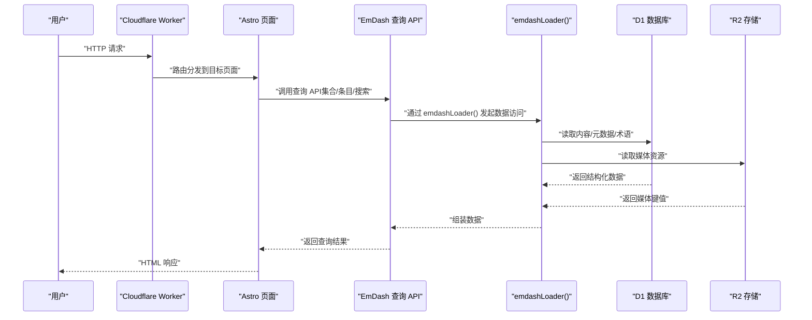
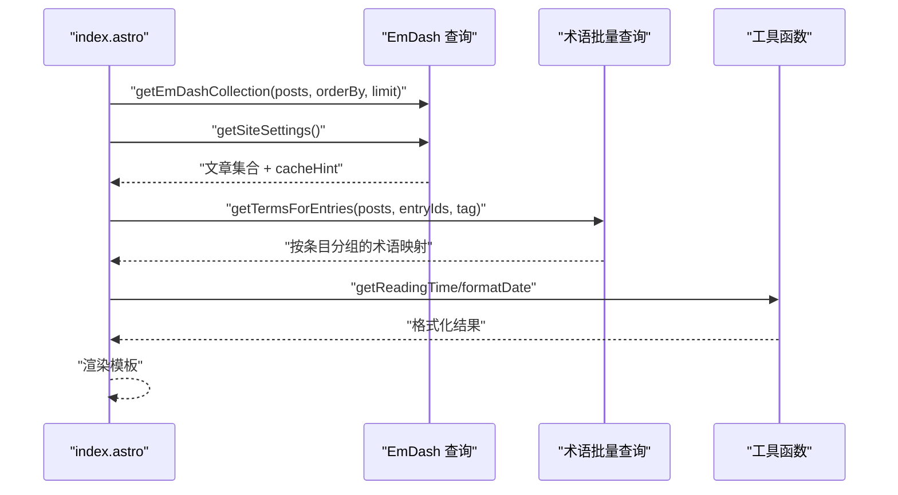
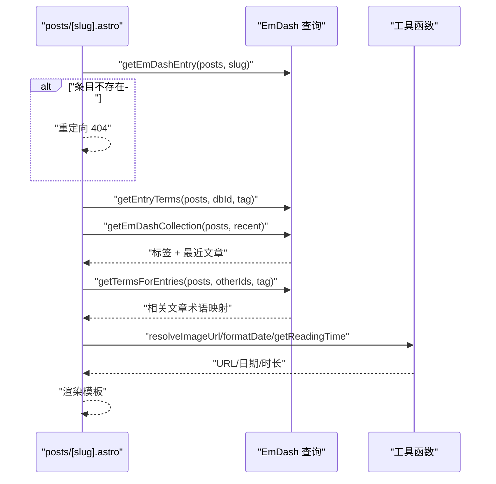
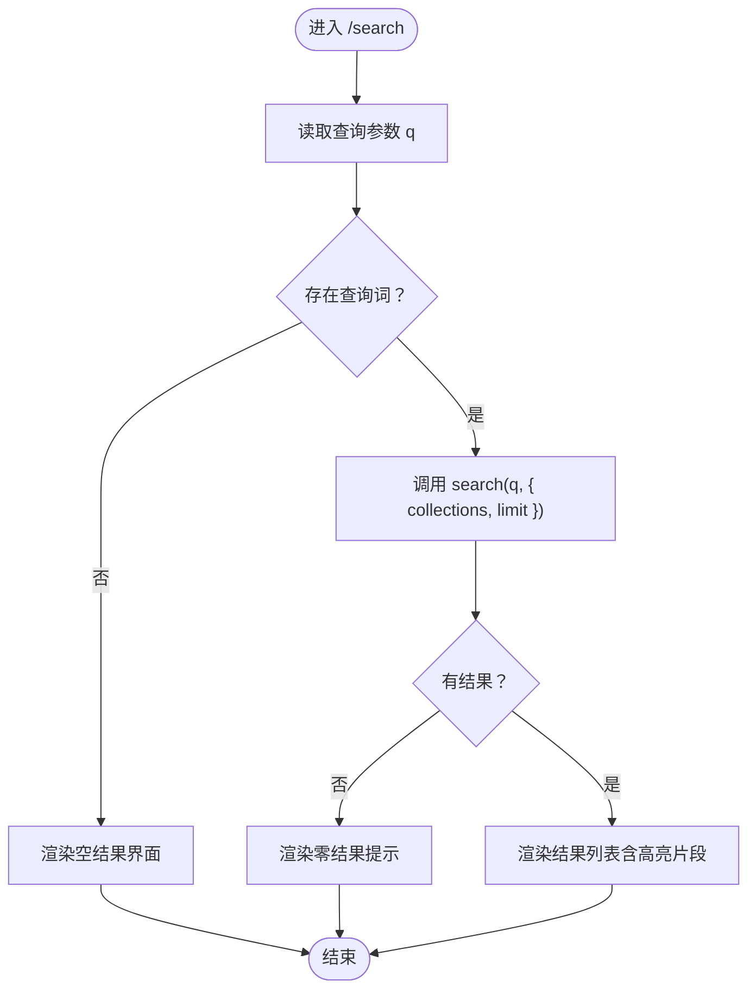
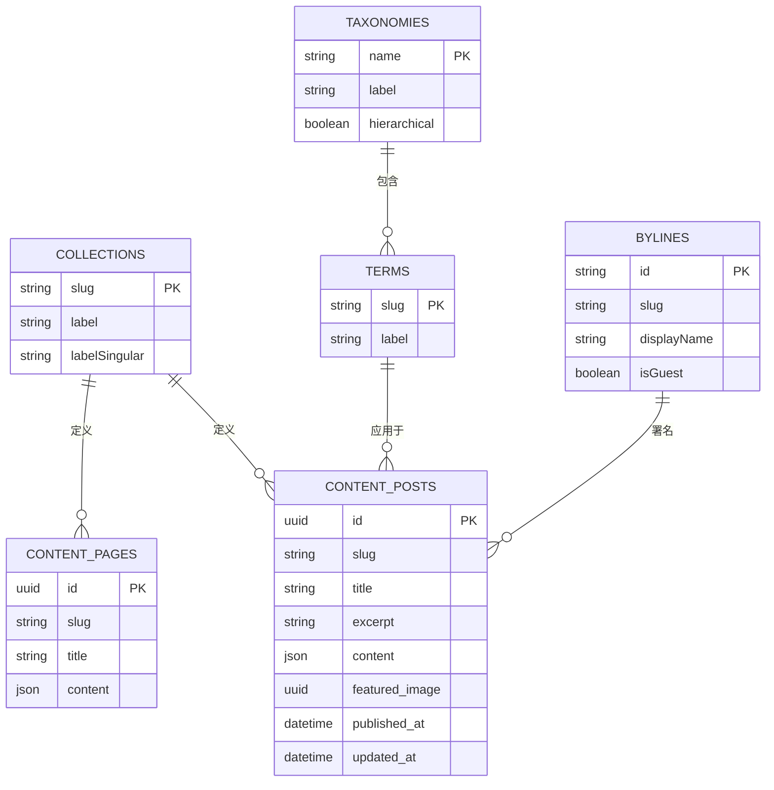
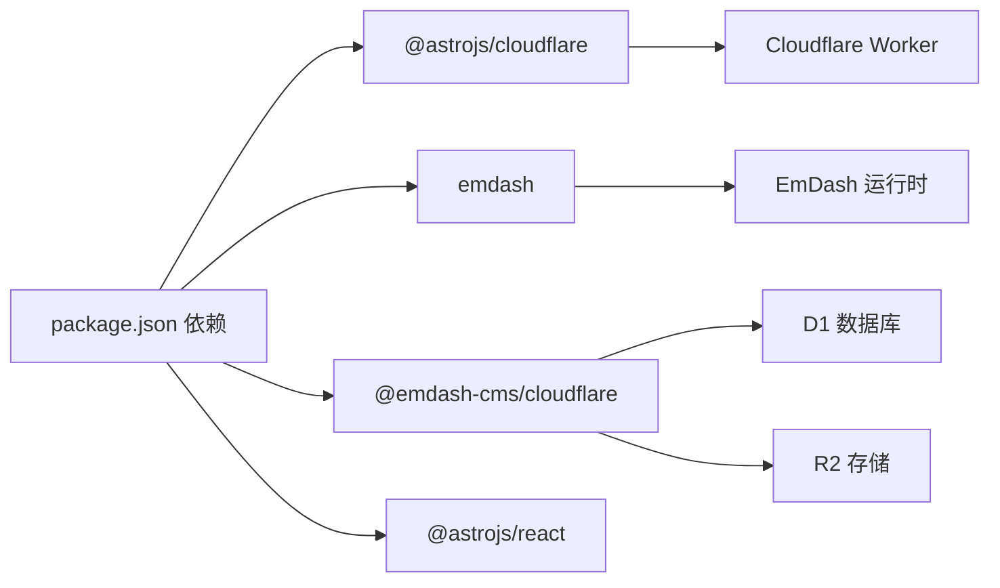

# 数据流设计

<cite>
**本文引用的文件**
- [README.md](file://README.md)
- [astro.config.mjs](file://astro.config.mjs)
- [src/live.config.ts](file://src/live.config.ts)
- [src/worker.ts](file://src/worker.ts)
- [package.json](file://package.json)
- [src/pages/index.astro](file://src/pages/index.astro)
- [src/pages/posts/[slug].astro](file://src/pages/posts/[slug].astro)
- [src/pages/search.astro](file://src/pages/search.astro)
- [src/pages/pages/[slug].astro](file://src/pages/pages/[slug].astro)
- [src/utils/constants.ts](file://src/utils/constants.ts)
- [src/utils/date.ts](file://src/utils/date.ts)
- [src/utils/reading-time.ts](file://src/utils/reading-time.ts)
- [src/utils/media.ts](file://src/utils/media.ts)
- [src/utils/site-identity.ts](file://src/utils/site-identity.ts)
- [seed/seed.json](file://seed/seed.json)
</cite>

## 目录
1. [简介](#简介)
2. [项目结构](#项目结构)
3. [核心组件](#核心组件)
4. [架构总览](#架构总览)
5. [详细组件分析](#详细组件分析)
6. [依赖分析](#依赖分析)
7. [性能考量](#性能考量)
8. [故障排查指南](#故障排查指南)
9. [结论](#结论)
10. [附录](#附录)

## 简介
本文件面向 EmDash 在 Cloudflare Workers 上的博客模板，系统性梳理从用户请求到最终响应的完整数据流，重点覆盖以下方面：
- 请求路由与页面渲染路径
- 内容查询与渲染过程（集合查询、条目查询、术语批量查询）
- 实时数据加载机制与缓存策略（emdashLoader、cacheHint）
- 数据模型关系与依赖（内容类型、分类/标签、作者署名、站点设置）
- 数据验证、转换与序列化（日期格式化、阅读时长计算、媒体 URL 解析）
- 错误处理、降级策略与监控指标建议
- 数据流优化建议与性能基准测试方法

## 项目结构
该模板基于 Astro 与 EmDash 运行时，采用服务端渲染（SSR）输出至 Cloudflare Workers。核心结构要点：
- 配置层：astro.config.mjs 注入 EmDash 集成、数据库（D1）、存储（R2）、插件与沙箱运行器
- 内容层：通过 live.config.ts 定义 _emdash 实时集合，使用 emdashLoader 提供统一数据加载入口
- 页面层：各页面在 Astro SSR 中调用 EmDash 查询 API 获取数据并渲染
- 工具层：日期、阅读时长、媒体解析、站点身份等工具函数
- 种子数据：seed.json 定义内容类型、分类/标签、菜单、挂件区等元数据

图表来源
- [astro.config.mjs:16-26](file://astro.config.mjs#L16-L26)
- [src/live.config.ts:8-13](file://src/live.config.ts#L8-L13)
- [src/worker.ts:1-6](file://src/worker.ts#L1-L6)

章节来源
- [README.md:40-68](file://README.md#L40-L68)
- [astro.config.mjs:1-45](file://astro.config.mjs#L1-L45)
- [src/live.config.ts:1-14](file://src/live.config.ts#L1-L14)
- [src/worker.ts:1-6](file://src/worker.ts#L1-L6)

## 核心组件
- EmDash 集成与适配器
  - 在 astro.config.mjs 中启用 @astrojs/cloudflare 适配器，并注入 EmDash 集成，配置 D1 数据库绑定、R2 存储绑定、插件与沙箱运行器
- 实时内容集合
  - live.config.ts 定义 _emdash 实时集合，使用 emdashLoader() 作为统一数据加载器
- 页面查询与渲染
  - index.astro 使用 getEmDashCollection 并发获取站点设置与文章集合，批量获取标签术语，计算阅读时长与日期格式化
  - posts/[slug].astro 使用 getEmDashEntry 获取单篇文章，同时并发获取标签与相关文章，批量获取相关文章的标签术语
  - search.astro 使用 search API 执行全文检索（FTS），避免全量拉取与客户端过滤
  - pages/[slug].astro 使用 getEmDashEntry 渲染静态页面
- 工具函数
  - 日期格式化、阅读时长计算、媒体 URL 解析、站点身份解析

章节来源
- [astro.config.mjs:16-26](file://astro.config.mjs#L16-L26)
- [src/live.config.ts:8-13](file://src/live.config.ts#L8-L13)
- [src/pages/index.astro:19-65](file://src/pages/index.astro#L19-L65)
- [src/pages/posts/[slug].astro:31-109](file://src/pages/posts/[slug].astro#L31-L109)
- [src/pages/search.astro:4-15](file://src/pages/search.astro#L4-L15)
- [src/pages/pages/[slug].astro:12-18](file://src/pages/pages/[slug].astro#L12-L18)
- [src/utils/date.ts:7-17](file://src/utils/date.ts#L7-L17)
- [src/utils/reading-time.ts:51-59](file://src/utils/reading-time.ts#L51-L59)
- [src/utils/media.ts:5-30](file://src/utils/media.ts#L5-L30)
- [src/utils/site-identity.ts:18-24](file://src/utils/site-identity.ts#L18-L24)

## 架构总览
EmDash 在 Cloudflare Workers 上的数据流由“请求—查询—渲染—响应”闭环构成。请求进入 Worker 后，Astro 路由匹配到具体页面，页面在 SSR 阶段调用 EmDash 查询 API；EmDash 运行时通过 emdashLoader() 访问 D1 与 R2，返回结构化数据；页面将数据与 UI 组件结合，生成最终 HTML 响应。

图表来源
- [src/worker.ts:1-6](file://src/worker.ts#L1-L6)
- [src/live.config.ts:8-13](file://src/live.config.ts#L8-L13)
- [src/pages/index.astro:19-28](file://src/pages/index.astro#L19-L28)
- [src/pages/posts/[slug].astro:31-37](file://src/pages/posts/[slug].astro#L31-L37)
- [src/pages/search.astro:13-15](file://src/pages/search.astro#L13-L15)

## 详细组件分析

### 首页数据流（index.astro）
- 查询策略
  - 并发获取文章集合与站点设置，限制集合大小以减少前端切片开销
  - 使用 getTermsForEntries 对精选文章与网格文章进行批量术语查询，避免 N+1
  - 通过 cacheHint 设置 Astro 缓存提示
- 渲染策略
  - 选择首张带特色图的文章作为英雄位，其余文章组成网格
  - 计算阅读时长与格式化日期，注入 SEO 元信息
- 性能要点
  - 后端裁剪集合长度，前端仅做必要切片
  - 批量术语查询降低数据库往返次数

图表来源
- [src/pages/index.astro:19-65](file://src/pages/index.astro#L19-L65)
- [src/utils/reading-time.ts:51-59](file://src/utils/reading-time.ts#L51-L59)
- [src/utils/date.ts:7-17](file://src/utils/date.ts#L7-L17)

章节来源
- [src/pages/index.astro:19-65](file://src/pages/index.astro#L19-L65)
- [src/utils/constants.ts:7-9](file://src/utils/constants.ts#L7-L9)
- [src/utils/reading-time.ts:51-59](file://src/utils/reading-time.ts#L51-L59)
- [src/utils/date.ts:7-17](file://src/utils/date.ts#L7-L17)

### 文章详情页数据流（posts/[slug].astro）
- 查询策略
  - 通过 getEmDashEntry 按 slug 获取文章条目，失败时重定向 404
  - 并发获取文章标签与若干最近文章，再对相关文章批量查询标签术语
  - 通过 cacheHint 设置 Astro 缓存提示
- 渲染策略
  - 生成 SEO 元信息（标题、描述、OG 图），解析特色图片 URL
  - 渲染作者署名、发布时间、阅读时长与标签云
  - 渲染相关内容区块，使用批量术语映射
- 性能要点
  - 并发查询减少 RTT，批量术语查询避免逐条查询

图表来源
- [src/pages/posts/[slug].astro:31-109](file://src/pages/posts/[slug].astro#L31-L109)
- [src/utils/media.ts:5-30](file://src/utils/media.ts#L5-L30)
- [src/utils/date.ts:7-17](file://src/utils/date.ts#L7-L17)
- [src/utils/reading-time.ts:51-59](file://src/utils/reading-time.ts#L51-L59)

章节来源
- [src/pages/posts/[slug].astro:31-109](file://src/pages/posts/[slug].astro#L31-L109)
- [src/utils/media.ts:5-30](file://src/utils/media.ts#L5-L30)
- [src/utils/date.ts:7-17](file://src/utils/date.ts#L7-L17)
- [src/utils/reading-time.ts:51-59](file://src/utils/reading-time.ts#L51-L59)

### 搜索页数据流（search.astro）
- 查询策略
  - 使用 search API 执行全文检索（FTS），限定集合与数量，避免全量拉取
  - 无查询词时返回空结果
- 渲染策略
  - 展示搜索表单、结果摘要与高亮片段
- 性能要点
  - FTS 在数据库侧完成分词、排序与截断，远优于前端全量扫描

图表来源
- [src/pages/search.astro:4-15](file://src/pages/search.astro#L4-L15)

章节来源
- [src/pages/search.astro:4-15](file://src/pages/search.astro#L4-L15)

### 静态页面数据流（pages/[slug].astro）
- 查询策略
  - 通过 getEmDashEntry 获取页面条目，失败时重定向 404
  - 设置 cacheHint 以启用缓存
- 渲染策略
  - 使用 PortableText 渲染内容，注入基础布局与 SEO 元信息

章节来源
- [src/pages/pages/[slug].astro:12-18](file://src/pages/pages/[slug].astro#L12-L18)

### 实时数据加载与缓存（emdashLoader 与 cacheHint）
- emdashLoader
  - live.config.ts 将 _emdash 实时集合与 emdashLoader() 绑定，统一承载内容查询与媒体解析
- cacheHint
  - 多个页面在获取数据后调用 Astro.cache.set(cacheHint)，利用 Worker 边缘缓存提升重复请求性能
- 数据访问
  - astro.config.mjs 中通过 d1/r2 绑定，使 emdashLoader 可直接访问数据库与存储

章节来源
- [src/live.config.ts:8-13](file://src/live.config.ts#L8-L13)
- [src/pages/index.astro:28](file://src/pages/index.astro#L28)
- [src/pages/posts/[slug].astro:37](file://src/pages/posts/[slug].astro#L37)
- [src/pages/pages/[slug].astro:18](file://src/pages/pages/[slug].astro#L18)
- [astro.config.mjs:18-20](file://astro.config.mjs#L18-L20)

### 数据模型关系与依赖
- 内容类型
  - posts：支持草稿、修订、搜索、SEO，字段包含标题、特色图、正文（PortableText）、摘要
  - pages：支持草稿、修订、搜索，字段包含标题、正文（PortableText）
- 分类与标签
  - 分类（category）与标签（tag）均为非层级术语，分别作用于 posts
  - 术语通过 getEntryTerms 与 getTermsForEntries 获取，支持批量查询
- 作者署名（bylines）
  - 支持编辑团队与访客贡献者，可关联头像媒体 ID
- 站点设置
  - 包含站点标题、标语、LOGO、Favicon 等，用于页面标题与 SEO 元信息
- 种子数据
  - seed.json 定义了默认内容类型、术语、菜单、挂件区与示例内容，便于快速启动

图表来源
- [seed/seed.json:13-66](file://seed/seed.json#L13-L66)
- [seed/seed.json:68-115](file://seed/seed.json#L68-L115)
- [seed/seed.json:116-128](file://seed/seed.json#L116-L128)

章节来源
- [seed/seed.json:13-128](file://seed/seed.json#L13-L128)

### 数据验证、转换与序列化
- 日期格式化
  - formatDate 接收日期，返回中文本地化字符串
- 阅读时长
  - extractText 从 PortableText 提取纯文本，区分英文单词与中日韩字符，计算分钟数并取最小 1 分钟
- 媒体 URL
  - resolveImageUrl 支持外部与本地媒体，优先使用 storageKey 或条目 ID 构造 R2 文件访问路径
- 站点身份
  - resolveBlogSiteIdentity 返回站点标题、副标题与 LOGO URL，提供默认值

章节来源
- [src/utils/date.ts:7-17](file://src/utils/date.ts#L7-L17)
- [src/utils/reading-time.ts:34-59](file://src/utils/reading-time.ts#L34-L59)
- [src/utils/media.ts:5-30](file://src/utils/media.ts#L5-L30)
- [src/utils/site-identity.ts:18-24](file://src/utils/site-identity.ts#L18-L24)

### 错误处理、降级策略与监控指标
- 错误处理
  - 文章与页面条目不存在时重定向 404
  - 搜索无查询词时返回空结果
- 降级策略
  - 无文章时显示空状态与引导链接
  - 无标签或作者信息时安全回退为空数组
- 监控指标建议
  - 请求延迟（TTFB、渲染耗时）
  - 数据库查询次数与平均耗时
  - 缓存命中率（cacheHint 生效情况）
  - 媒体请求成功率与延迟
  - 搜索命中率与平均返回条数

章节来源
- [src/pages/posts/[slug].astro:33-35](file://src/pages/posts/[slug].astro#L33-L35)
- [src/pages/pages/[slug].astro:14-16](file://src/pages/pages/[slug].astro#L14-L16)
- [src/pages/search.astro:38-45](file://src/pages/search.astro#L38-L45)
- [src/pages/index.astro:72-80](file://src/pages/index.astro#L72-L80)

## 依赖分析
- 运行时与适配器
  - @astrojs/cloudflare：将 Astro 输出为 Cloudflare Worker
  - @emdash-cms/cloudflare：提供 D1/R2 绑定、沙箱运行器与插件生态
- 应用依赖
  - emdash：提供查询 API（getEmDashCollection、getEmDashEntry、search、getTermsForEntries 等）
  - @astrojs/react：React 集成（如需）
- 开发与部署
  - wrangler：Cloudflare Workers 部署 CLI

图表来源
- [package.json:17-27](file://package.json#L17-L27)
- [astro.config.mjs:1-45](file://astro.config.mjs#L1-L45)

章节来源
- [package.json:17-27](file://package.json#L17-L27)
- [astro.config.mjs:1-45](file://astro.config.mjs#L1-L45)

## 性能考量
- 查询优化
  - 后端裁剪集合长度，减少前端切片成本
  - 批量术语查询替代逐条查询，显著降低数据库往返
  - 并发查询（Promise.all）减少总等待时间
- 搜索优化
  - 使用 FTS 在数据库侧完成分词、排序与截断，避免全量拉取
- 缓存策略
  - 利用 cacheHint 与边缘缓存提升重复请求性能
- 媒体与渲染
  - 使用 resolveImageUrl 统一媒体访问，结合 R2 CDN 加速
  - PortableText 渲染按需执行，避免不必要的 DOM 操作

## 故障排查指南
- 404 重定向
  - 检查 slug 是否有效，确认条目是否存在且已发布
- 查询异常
  - 核对 D1 绑定名称与会话配置，确保 emdashLoader 可访问数据库
- 媒体无法加载
  - 确认 R2 绑定名称与文件 key 正确，检查媒体 provider 类型（本地/外部）
- 缓存不生效
  - 确认页面设置了 cacheHint，且 Worker 环境支持边缘缓存

章节来源
- [src/pages/posts/[slug].astro:27-35](file://src/pages/posts/[slug].astro#L27-L35)
- [src/pages/pages/[slug].astro:8-16](file://src/pages/pages/[slug].astro#L8-L16)
- [astro.config.mjs:18-20](file://astro.config.mjs#L18-L20)
- [src/utils/media.ts:5-30](file://src/utils/media.ts#L5-L30)

## 结论
本模板通过 EmDash 运行时与 Cloudflare Workers 的组合，实现了高效、可扩展的内容数据流。其关键优势在于：
- 明确的查询与渲染分离，页面仅负责编排数据与 UI
- 批量与并发查询策略，显著降低数据库负载
- 基于 FTS 的搜索能力，保障大规模内容的可用性
- 边缘缓存与媒体 CDN 的配合，提升整体性能与稳定性

## 附录
- 路由与页面
  - 首页、文章列表、文章详情、分类归档、标签归档、搜索、静态页面、404
- 部署与开发
  - 本地开发与部署命令见 README

章节来源
- [README.md:20-31](file://README.md#L20-L31)
- [README.md:47-61](file://README.md#L47-L61)