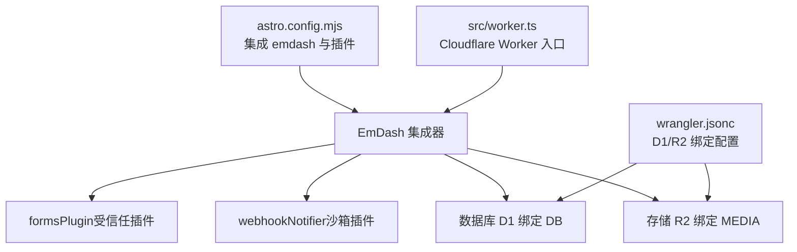
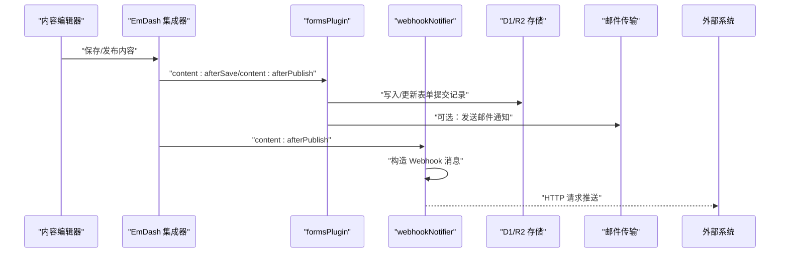
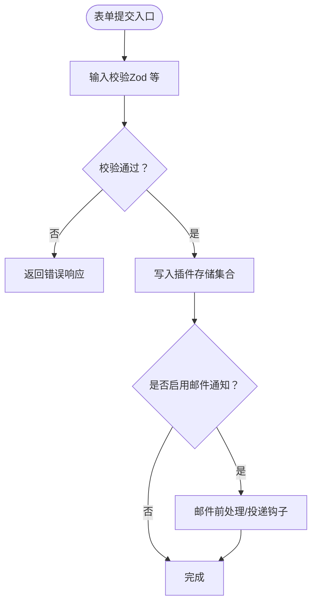
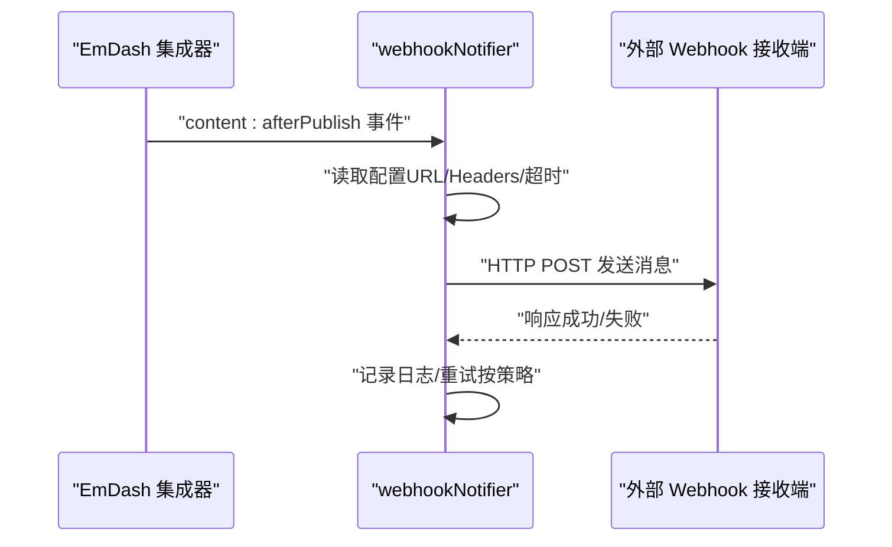
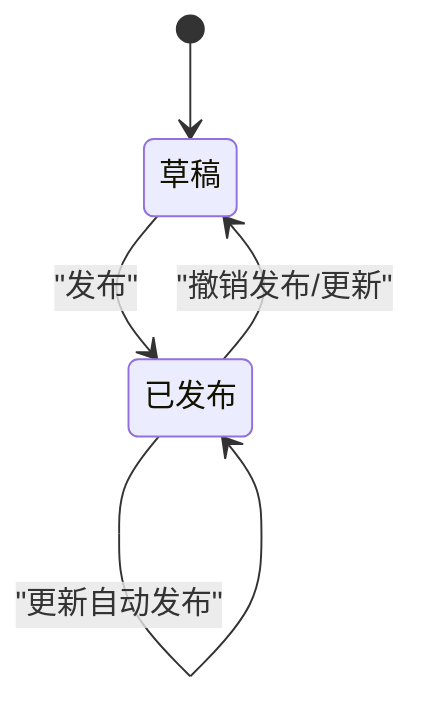
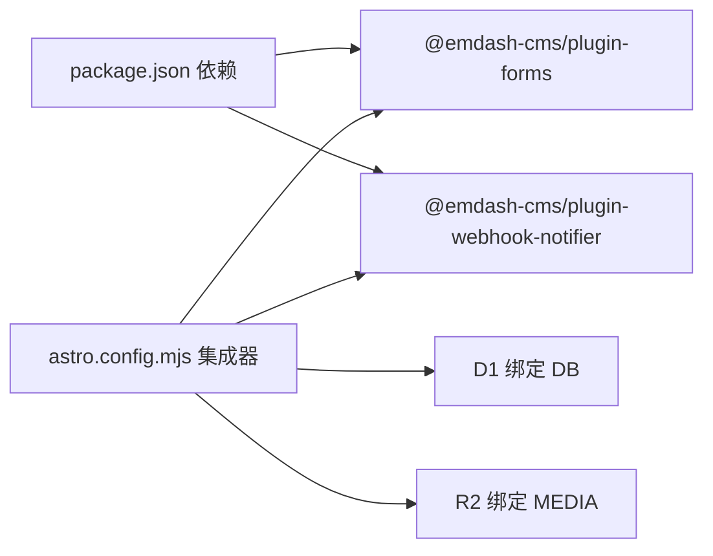

# 内置插件详解

<cite>
**本文引用的文件**
- [astro.config.mjs](file://astro.config.mjs)
- [package.json](file://package.json)
- [README.md](file://README.md)
- [src/worker.ts](file://src/worker.ts)
- [src/live.config.ts](file://src/live.config.ts)
- [wrangler.jsonc](file://wrangler.jsonc)
- [.agents/skills/creating-plugins/references/hooks.md](file://.agents/skills/creating-plugins/references/hooks.md)
- [.agents/skills/creating-plugins/references/storage.md](file://.agents/skills/creating-plugins/references/storage.md)
- [.agents/skills/creating-plugins/references/api-routes.md](file://.agents/skills/creating-plugins/references/api-routes.md)
- [.agents/skills/creating-plugins/references/block-kit.md](file://.agents/skills/creating-plugins/references/block-kit.md)
- [.agents/skills/emdash-cli/EDITING-FLOW.md](file://.agents/skills/emdash-cli/EDITING-FLOW.md)
- [.agents/skills/emdash-cli/SKILL.md](file://.agents/skills/emdash-cli/SKILL.md)
</cite>

## 目录
1. [简介](#简介)
2. [项目结构](#项目结构)
3. [核心组件](#核心组件)
4. [架构总览](#架构总览)
5. [详细组件分析](#详细组件分析)
6. [依赖关系分析](#依赖关系分析)
7. [性能考量](#性能考量)
8. [故障排查指南](#故障排查指南)
9. [结论](#结论)
10. [附录](#附录)

## 简介
本文件面向开发者，系统性解析 EmDash 博客模板中的内置插件：formsPlugin（表单插件）与 webhookNotifier（Webhook 通知器）。文档从架构与运行机制入手，逐步深入到表单定义、数据收集与处理流程（含字段校验、邮件通知、数据存储），以及 Webhook 的配置、事件触发与消息格式。同时提供发布流程插件的使用指南（内容状态管理与发布策略），并覆盖内置插件的配置选项、自定义方法与扩展能力，帮助读者在实际场景中快速集成与落地。

## 项目结构
该模板基于 Astro + Cloudflare Workers + D1/R2，通过 EmDash 集成内置插件 formsPlugin 与 webhookNotifier。插件通过 emdash 集成器挂载，其中 formsPlugin 以“受信任插件”方式注册，webhookNotifier 则以“沙箱插件”方式运行，由沙箱执行器统一调度。

**图表来源**
- [astro.config.mjs:16-26](file://astro.config.mjs#L16-L26)
- [src/worker.ts:1-6](file://src/worker.ts#L1-L6)
- [wrangler.jsonc:7-18](file://wrangler.jsonc#L7-L18)

**章节来源**
- [astro.config.mjs:16-26](file://astro.config.mjs#L16-L26)
- [src/worker.ts:1-6](file://src/worker.ts#L1-L6)
- [wrangler.jsonc:7-18](file://wrangler.jsonc#L7-L18)

## 核心组件
- formsPlugin（表单插件）
  - 职责：提供表单定义、提交收集、字段校验、数据持久化与可选的邮件通知能力；通过插件路由暴露查询接口，支持分页游标与索引查询。
  - 运行模式：作为受信任插件注册，直接访问 emdash 提供的存储与 KV 能力。
- webhookNotifier（Webhook 通知器）
  - 职责：在内容发布等生命周期事件发生时，向外部系统推送标准化的 Webhook 消息；以沙箱插件形式运行，由沙箱执行器统一调度。
  - 运行模式：通过沙箱路由与钩子事件协作，按配置触发消息发送。

**章节来源**
- [astro.config.mjs:18-25](file://astro.config.mjs#L18-L25)
- [package.json:21-22](file://package.json#L21-L22)

## 架构总览
下图展示插件在运行时的整体交互：内容编辑器触发保存/发布事件，插件通过钩子捕获并执行相应逻辑；formsPlugin 将表单提交写入存储并可选地发送邮件；webhookNotifier 在发布事件后向外部系统推送消息。

**图表来源**
- [astro.config.mjs:18-25](file://astro.config.mjs#L18-L25)
- [.agents/skills/creating-plugins/references/hooks.md:166-177](file://.agents/skills/creating-plugins/references/hooks.md#L166-L177)
- [.agents/skills/creating-plugins/references/hooks.md:255-283](file://.agents/skills/creating-plugins/references/hooks.md#L255-L283)

## 详细组件分析

### formsPlugin 表单插件
- 插件注册与能力
  - 在集成器中以受信任插件方式注册，可直接访问存储与 KV，适合进行数据持久化与业务逻辑处理。
- 表单定义与字段校验
  - 基于 Block Kit 或插件声明的字段定义，结合输入校验（如 Zod）对提交数据进行约束，确保数据质量。
- 数据收集与处理流程
  - 提交进入插件路由后，先进行输入校验，再写入插件专属存储集合；可选地在保存后触发邮件通知。
- 邮件通知
  - 可通过“邮件前处理”钩子修改或取消邮件发送，或在“邮件投递”钩子中对接具体传输实现（如第三方邮件服务）。
- 数据存储
  - 使用插件存储集合进行增删改查，支持批量操作与索引查询；结合游标实现分页。

**图表来源**
- [.agents/skills/creating-plugins/references/api-routes.md:91-111](file://.agents/skills/creating-plugins/references/api-routes.md#L91-L111)
- [.agents/skills/creating-plugins/references/storage.md:38-60](file://.agents/skills/creating-plugins/references/storage.md#L38-L60)
- [.agents/skills/creating-plugins/references/hooks.md:234-253](file://.agents/skills/creating-plugins/references/hooks.md#L234-L253)

**章节来源**
- [astro.config.mjs:21](file://astro.config.mjs#L21)
- [.agents/skills/creating-plugins/references/api-routes.md:9-64](file://.agents/skills/creating-plugins/references/api-routes.md#L9-L64)
- [.agents/skills/creating-plugins/references/storage.md:11-36](file://.agents/skills/creating-plugins/references/storage.md#L11-L36)
- [.agents/skills/creating-plugins/references/hooks.md:234-253](file://.agents/skills/creating-plugins/references/hooks.md#L234-L253)

### webhookNotifier Webhook 通知器
- 插件注册与运行模式
  - 以沙箱插件方式注册，通过沙箱执行器统一调度；适合对外部系统进行不可信的 HTTP 推送。
- Webhook 配置
  - 通过插件设置界面（Block Kit）配置目标 URL、请求头、超时与重试策略等；支持条件触发（如仅在发布时）。
- 事件触发
  - 订阅内容发布事件，在 content:afterPublish 钩子中触发 Webhook 推送。
- 消息格式
  - 通常包含事件类型、时间戳、受影响内容的标识与摘要信息；可根据需要扩展为完整内容快照或链接。

**图表来源**
- [astro.config.mjs:22-23](file://astro.config.mjs#L22-L23)
- [.agents/skills/creating-plugins/references/hooks.md:166-177](file://.agents/skills/creating-plugins/references/hooks.md#L166-L177)

**章节来源**
- [astro.config.mjs:22-23](file://astro.config.mjs#L22-L23)
- [.agents/skills/creating-plugins/references/hooks.md:166-177](file://.agents/skills/creating-plugins/references/hooks.md#L166-L177)

### 发布流程插件使用指南
- 内容状态管理
  - 支持草稿与已发布两种状态；更新时采用乐观并发控制（_rev 令牌），避免覆盖他人变更。
  - CLI 默认在创建/更新后自动发布，保证“读-写一致性”；也可显式保留草稿。
- 发布策略
  - 可在编辑器中直接发布，或通过 CLI 手动发布/撤销发布/定时发布。
  - 发布后可触发 webhookNotifier 推送消息，或触发 formsPlugin 的邮件通知。

**图表来源**
- [.agents/skills/emdash-cli/EDITING-FLOW.md:85-96](file://.agents/skills/emdash-cli/EDITING-FLOW.md#L85-L96)
- [.agents/skills/emdash-cli/SKILL.md:121-152](file://.agents/skills/emdash-cli/SKILL.md#L121-L152)

**章节来源**
- [.agents/skills/emdash-cli/EDITING-FLOW.md:85-96](file://.agents/skills/emdash-cli/EDITING-FLOW.md#L85-L96)
- [.agents/skills/emdash-cli/SKILL.md:121-152](file://.agents/skills/emdash-cli/SKILL.md#L121-L152)

## 依赖关系分析
- 依赖项
  - @emdash-cms/plugin-forms：提供表单能力与存储集合。
  - @emdash-cms/plugin-webhook-notifier：提供 Webhook 通知能力。
- 运行时绑定
  - D1 绑定 DB，R2 绑定 MEDIA，用于内容与媒体资源的持久化。
- 集成器配置
  - formsPlugin 以受信任插件注册，webhookNotifier 以沙箱插件注册，统一由 emdash 集成器管理。

**图表来源**
- [package.json:21-22](file://package.json#L21-L22)
- [astro.config.mjs:18-25](file://astro.config.mjs#L18-L25)
- [wrangler.jsonc:7-18](file://wrangler.jsonc#L7-L18)

**章节来源**
- [package.json:21-22](file://package.json#L21-L22)
- [astro.config.mjs:18-25](file://astro.config.mjs#L18-L25)
- [wrangler.jsonc:7-18](file://wrangler.jsonc#L7-L18)

## 性能考量
- 存储与查询
  - 为高频查询字段建立索引，合理使用复合索引与游标分页，降低查询成本。
- 邮件与 Webhook
  - 对外调用应设置合理的超时与重试策略，避免阻塞主流程；必要时将耗时任务异步化。
- 并发与冲突
  - 使用 _rev 令牌进行乐观并发控制，减少锁竞争；对高冲突场景考虑退避重试。

## 故障排查指南
- 插件未生效
  - 确认插件已在 astro.config.mjs 中正确注册（受信任或沙箱）。
- 表单提交失败
  - 检查输入校验规则与路由返回值；确认插件存储集合存在且索引配置正确。
- 邮件未送达
  - 检查“邮件前处理/投递”钩子是否被正确注册与执行；核对传输凭据与网络白名单。
- Webhook 推送异常
  - 检查目标 URL、请求头与超时设置；关注沙箱执行器日志与重试策略。
- 发布冲突
  - 遵循 _rev 令牌机制，先读取再更新；若出现 409 冲突，重新获取最新版本后再提交。

**章节来源**
- [.agents/skills/creating-plugins/references/hooks.md:419-441](file://.agents/skills/creating-plugins/references/hooks.md#L419-L441)
- [.agents/skills/emdash-cli/EDITING-FLOW.md:140-149](file://.agents/skills/emdash-cli/EDITING-FLOW.md#L140-L149)

## 结论
本模板通过 formsPlugin 与 webhookNotifier 实现了“表单收集 + 发布通知”的典型内容运营闭环。formsPlugin 提供完善的表单定义、校验与存储能力，webhookNotifier 则以沙箱方式安全可靠地连接外部系统。配合 EmDash 的发布流程与并发控制，开发者可以快速构建可扩展、可观测、可维护的内容平台。

## 附录
- 快速参考
  - 插件钩子清单与触发时机参见钩子参考文档。
  - 存储集合与索引设计遵循插件存储参考。
  - API 路由与输入校验遵循 API 路由参考。
  - 沙箱插件的设置界面采用 Block Kit，便于非技术用户配置。

**章节来源**
- [.agents/skills/creating-plugins/references/hooks.md:1-441](file://.agents/skills/creating-plugins/references/hooks.md#L1-L441)
- [.agents/skills/creating-plugins/references/storage.md:1-255](file://.agents/skills/creating-plugins/references/storage.md#L1-L255)
- [.agents/skills/creating-plugins/references/api-routes.md:1-126](file://.agents/skills/creating-plugins/references/api-routes.md#L1-L126)
- [.agents/skills/creating-plugins/references/block-kit.md:1-385](file://.agents/skills/creating-plugins/references/block-kit.md#L1-L385)