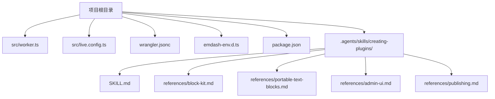
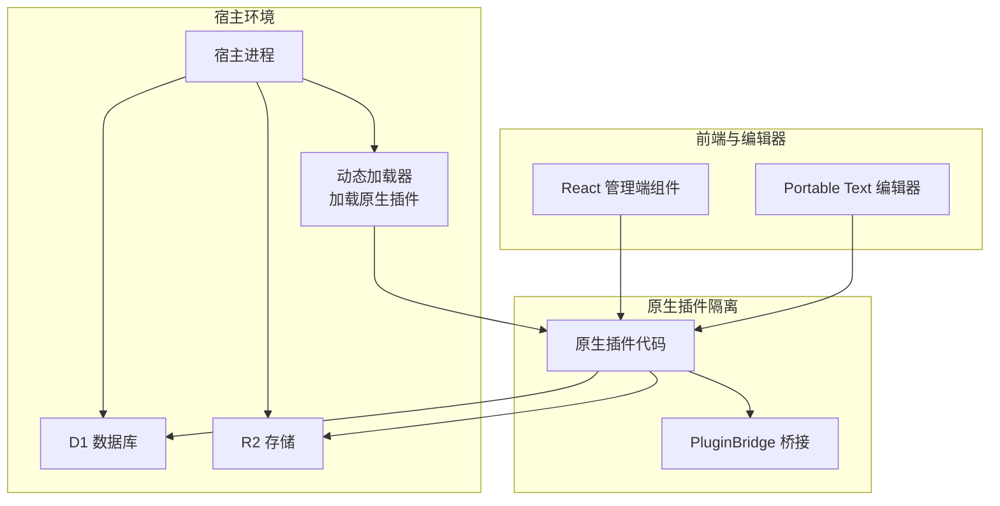
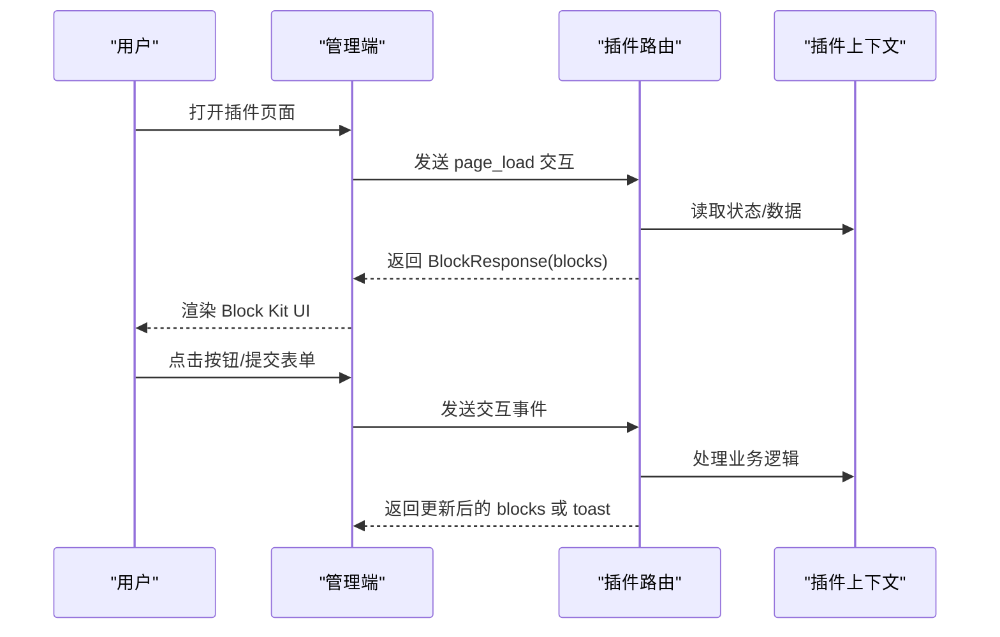
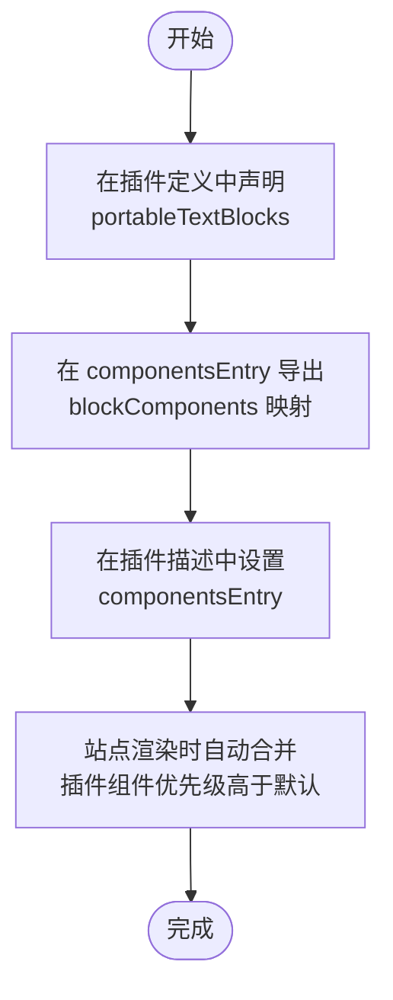
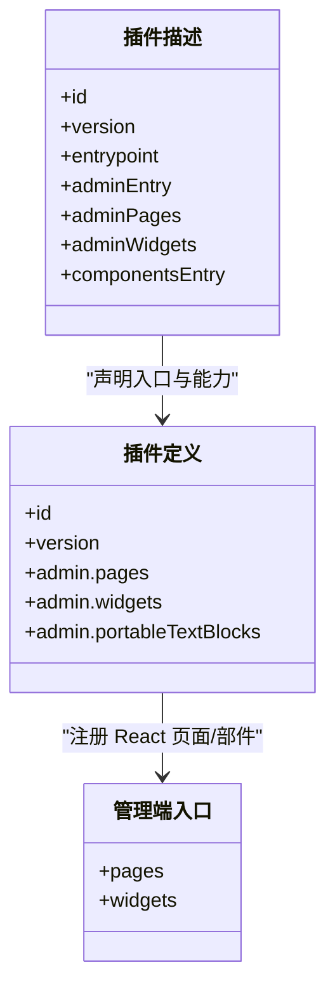
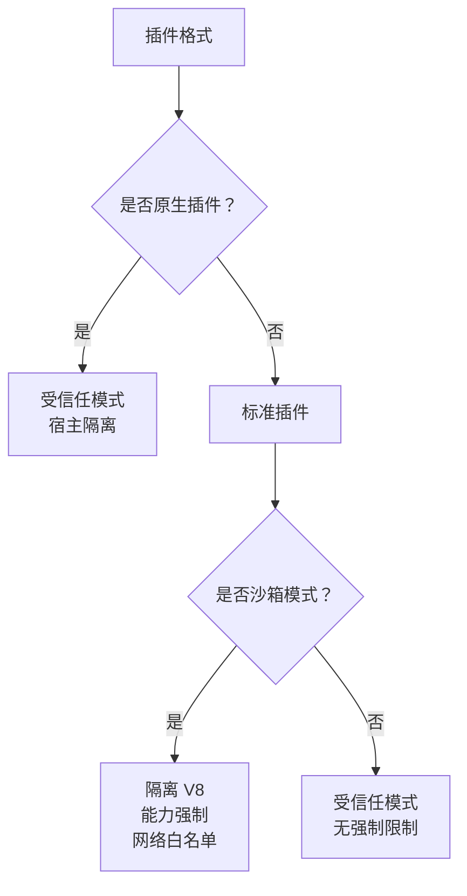
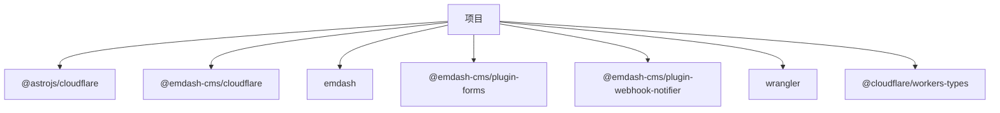

# 原生插件开发

<cite>
**本文档引用的文件**
- [README.md](file://README.md)
- [package.json](file://package.json)
- [src/live.config.ts](file://src/live.config.ts)
- [src/worker.ts](file://src/worker.ts)
- [wrangler.jsonc](file://wrangler.jsonc)
- [.mcp.json](file://.mcp.json)
- [emdash-env.d.ts](file://emdash-env.d.ts)
- [worker-configuration.d.ts](file://worker-configuration.d.ts)
- [tsconfig.json](file://tsconfig.json)
- [seed/seed.json](file://seed/seed.json)
- [.agents/skills/creating-plugins/SKILL.md](file://.agents/skills/creating-plugins/SKILL.md)
- [.agents/skills/creating-plugins/references/block-kit.md](file://.agents/skills/creating-plugins/references/block-kit.md)
- [.agents/skills/creating-plugins/references/portable-text-blocks.md](file://.agents/skills/creating-plugins/references/portable-text-blocks.md)
- [.agents/skills/creating-plugins/references/admin-ui.md](file://.agents/skills/creating-plugins/references/admin-ui.md)
- [.agents/skills/creating-plugins/references/publishing.md](file://.agents/skills/creating-plugins/references/publishing.md)
</cite>

## 目录
1. [简介](#简介)
2. [项目结构](#项目结构)
3. [核心组件](#核心组件)
4. [架构总览](#架构总览)
5. [详细组件分析](#详细组件分析)
6. [依赖关系分析](#依赖关系分析)
7. [性能考虑](#性能考虑)
8. [故障排除指南](#故障排除指南)
9. [结论](#结论)
10. [附录](#附录)

## 简介
本指南面向希望在 EmDash 生态中开发“原生插件”的工程师。原生插件与标准插件的主要区别在于：
- 运行环境：原生插件始终在宿主隔离环境中运行，无法进入沙箱；标准插件可选择在受信任模式或沙箱模式运行。
- 能力范围：原生插件支持 React 管理端组件、直接数据库访问（通过宿主上下文）、以及站点侧的 Portable Text Blocks 渲染组件。
- 部署与市场：原生插件不能发布到市场或启用沙箱模式，仅能以受信任方式安装于宿主。

本指南将系统讲解原生插件的差异点、Block Kit 与 Portable Text Blocks 的开发方法、沙箱运行机制与安全边界、打包与发布流程、调试与开发环境配置，并提供完整示例与最佳实践。

## 项目结构
该仓库是一个基于 Astro + EmDash 的博客模板，使用 Cloudflare Workers + D1 + R2 进行部署。与原生插件开发相关的关键文件如下：
- 插件运行入口与宿主隔离导出：src/worker.ts
- Live 内容集合配置：src/live.config.ts
- Wrangler 配置（绑定 D1/R2）：wrangler.jsonc
- 类型声明（PortableText、页面/文章类型等）：emdash-env.d.ts
- 项目脚本与依赖：package.json
- 插件技能与参考文档：.agents/skills/creating-plugins/*

**图表来源**
- [src/worker.ts:1-6](file://src/worker.ts#L1-L6)
- [src/live.config.ts:1-14](file://src/live.config.ts#L1-L14)
- [wrangler.jsonc:1-20](file://wrangler.jsonc#L1-L20)
- [emdash-env.d.ts:1-39](file://emdash-env.d.ts#L1-L39)
- [package.json:1-33](file://package.json#L1-L33)
- [.agents/skills/creating-plugins/SKILL.md:1-460](file://.agents/skills/creating-plugins/SKILL.md#L1-L460)

**章节来源**
- [README.md:1-68](file://README.md#L1-L68)
- [package.json:1-33](file://package.json#L1-L33)
- [src/live.config.ts:1-14](file://src/live.config.ts#L1-L14)
- [src/worker.ts:1-6](file://src/worker.ts#L1-L6)
- [wrangler.jsonc:1-20](file://wrangler.jsonc#L1-L20)
- [emdash-env.d.ts:1-39](file://emdash-env.d.ts#L1-L39)
- [.agents/skills/creating-plugins/SKILL.md:1-460](file://.agents/skills/creating-plugins/SKILL.md#L1-L460)

## 核心组件
- 插件运行时桥接与宿主隔离导出
  - 在 worker 入口导出 PluginBridge，用于宿主隔离与插件之间的通信。
- Live 内容集合
  - 使用 emdashLoader 定义 _emdash 集合，统一查询数据库内容。
- Wrangler 环境绑定
  - 将 D1 数据库与 R2 存储绑定到环境变量，供插件在宿主上下文中访问。
- 类型与内容模型
  - 通过 emdash-env.d.ts 提供 Page/Post 与 PortableTextBlock 类型，确保编辑器与渲染层一致。

**章节来源**
- [src/worker.ts:1-6](file://src/worker.ts#L1-L6)
- [src/live.config.ts:1-14](file://src/live.config.ts#L1-L14)
- [wrangler.jsonc:1-20](file://wrangler.jsonc#L1-L20)
- [emdash-env.d.ts:1-39](file://emdash-env.d.ts#L1-L39)

## 架构总览
下图展示了原生插件在宿主隔离中的运行位置与数据流：

**图表来源**
- [src/worker.ts:1-6](file://src/worker.ts#L1-L6)
- [wrangler.jsonc:1-20](file://wrangler.jsonc#L1-L20)
- [.agents/skills/creating-plugins/SKILL.md:115-149](file://.agents/skills/creating-plugins/SKILL.md#L115-L149)

## 详细组件分析

### 原生插件与标准插件的差异
- 运行模式
  - 标准插件：可在受信任模式（宿主内进程）或沙箱模式（Cloudflare 动态 Worker Loader）运行。
  - 原生插件：只能在受信任模式（宿主隔离），无法进入沙箱。
- 能力与 UI
  - 标准插件：沙箱模式下使用 Block Kit 管理端 UI；原生插件可使用 React 管理端组件。
  - 原生插件：支持直接数据库访问（通过宿主上下文）、站点侧 Portable Text Blocks 渲染组件。
- 发布与市场
  - 标准插件：可发布至市场，支持一键安装。
  - 原生插件：不可发布至市场，仅能本地安装。

**章节来源**
- [.agents/skills/creating-plugins/SKILL.md:10-22](file://.agents/skills/creating-plugins/SKILL.md#L10-L22)
- [.agents/skills/creating-plugins/SKILL.md:115-149](file://.agents/skills/creating-plugins/SKILL.md#L115-L149)

### Block Kit 开发方法
Block Kit 是沙箱插件的声明式 UI（受信任插件可用 React）。其工作流为：页面加载 -> 返回 BlockResponse -> 渲染 -> 用户交互 -> 回调处理。

- 关键要点
  - 管理端路由返回 blocks 数组，支持 header、section、table、form、chart 等多种块类型。
  - 表单字段支持条件显示、确认对话框、Toast 反馈。
  - 与插件上下文交互时，遵循 action_id 与 block_id 的约定。

**图表来源**
- [.agents/skills/creating-plugins/references/block-kit.md:1-51](file://.agents/skills/creating-plugins/references/block-kit.md#L1-L51)

**章节来源**
- [.agents/skills/creating-plugins/references/block-kit.md:1-416](file://.agents/skills/creating-plugins/references/block-kit.md#L1-L416)

### Portable Text Blocks 开发方法
原生插件支持在站点侧渲染自定义块类型，需要：
- 在插件定义中声明 admin.portableTextBlocks，包含类型、标签、图标、占位符与字段。
- 在 componentsEntry 中导出 blockComponents，映射块类型到 Astro 组件。
- 在插件描述中设置 componentsEntry，使 EmDash 自动合并组件。

**图表来源**
- [.agents/skills/creating-plugins/references/portable-text-blocks.md:1-252](file://.agents/skills/creating-plugins/references/portable-text-blocks.md#L1-L252)

**章节来源**
- [.agents/skills/creating-plugins/references/portable-text-blocks.md:1-252](file://.agents/skills/creating-plugins/references/portable-text-blocks.md#L1-L252)

### React 管理端组件集成
原生插件可通过 React 组件扩展管理端页面与仪表盘部件：
- 在 src/admin.tsx 中导出 pages 与 widgets。
- 在插件定义中设置 admin.entry、admin.pages、admin.widgets。
- 描述中设置 adminEntry、adminPages、adminWidgets。
- 使用 usePluginAPI() 调用插件路由。

**图表来源**
- [.agents/skills/creating-plugins/references/admin-ui.md:1-192](file://.agents/skills/creating-plugins/references/admin-ui.md#L1-L192)
- [.agents/skills/creating-plugins/references/portable-text-blocks.md:146-161](file://.agents/skills/creating-plugins/references/portable-text-blocks.md#L146-L161)

**章节来源**
- [.agents/skills/creating-plugins/references/admin-ui.md:1-192](file://.agents/skills/creating-plugins/references/admin-ui.md#L1-L192)

### 沙箱运行机制与安全边界
- 受信任模式（原生插件）
  - 运行在宿主隔离中，拥有完整的数据库与存储访问能力。
  - 不受沙箱资源限制与网络白名单约束。
- 沙箱模式（标准插件）
  - 运行在 Cloudflare 动态 Worker Loader 的隔离 V8 中，受限于能力清单与网络白名单。
  - 网络请求需通过 ctx.http.fetch 并受 allowedHosts 限制。
  - 仅能访问自身 KV 与存储集合，能力由能力清单强制执行。

**图表来源**
- [.agents/skills/creating-plugins/SKILL.md:115-149](file://.agents/skills/creating-plugins/SKILL.md#L115-L149)

**章节来源**
- [.agents/skills/creating-plugins/SKILL.md:115-149](file://.agents/skills/creating-plugins/SKILL.md#L115-L149)

### 打包、部署与版本管理
- 打包
  - 标准插件可打包为 .tar.gz，包含 manifest.json、backend.js、admin.js 等。
  - 原生插件不参与市场打包，仅在宿主中安装。
- 部署
  - 项目使用 Wrangler 部署到 Cloudflare Workers，绑定 D1 与 R2。
- 版本管理
  - 市场发布要求语义化版本递增，不可覆盖已存在版本。

**章节来源**
- [.agents/skills/creating-plugins/references/publishing.md:1-83](file://.agents/skills/creating-plugins/references/publishing.md#L1-L83)
- [package.json:1-33](file://package.json#L1-L33)
- [wrangler.jsonc:1-20](file://wrangler.jsonc#L1-L20)

### 调试工具与开发环境配置
- 开发脚本
  - 使用 pnpm 脚本进行本地开发与预览。
- 类型与环境
  - tsconfig 启用 node 类型，生成 worker-configuration.d.ts 与 emdash-env.d.ts。
- MCP 服务器
  - .mcp.json 指定文档服务地址，便于获取官方参考。
- Live 内容
  - live.config.ts 使用 emdashLoader 加载内容集合，便于在开发中联调插件与内容。

**章节来源**
- [README.md:47-61](file://README.md#L47-L61)
- [tsconfig.json:1-8](file://tsconfig.json#L1-L8)
- [worker-configuration.d.ts:1-12044](file://worker-configuration.d.ts#L1-L12044)
- [emdash-env.d.ts:1-39](file://emdash-env.d.ts#L1-L39)
- [.mcp.json:1-9](file://.mcp.json#L1-L9)
- [src/live.config.ts:1-14](file://src/live.config.ts#L1-L14)

### 完整示例与最佳实践
- 示例参考
  - 创建插件：参考技能文档中的最小标准插件示例与完整示例。
  - Block Kit：参考 Block Kit 参考文档中的块与元素语法。
  - Portable Text Blocks：参考 Portable Text Blocks 参考文档中的声明与渲染。
  - 管理端：参考 Admin UI 参考文档中的页面与部件。
- 最佳实践
  - 原生插件优先使用 React 管理端组件与站点侧 Astro 组件，获得更好的开发体验。
  - 严格区分受信任与沙箱模式的能力清单，避免在原生插件中使用沙箱特性。
  - 对外暴露的路由与 UI 使用 Block Kit（沙箱）或 React（原生）保持一致性。

**章节来源**
- [.agents/skills/creating-plugins/SKILL.md:44-460](file://.agents/skills/creating-plugins/SKILL.md#L44-L460)
- [.agents/skills/creating-plugins/references/block-kit.md:1-416](file://.agents/skills/creating-plugins/references/block-kit.md#L1-L416)
- [.agents/skills/creating-plugins/references/portable-text-blocks.md:1-252](file://.agents/skills/creating-plugins/references/portable-text-blocks.md#L1-L252)
- [.agents/skills/creating-plugins/references/admin-ui.md:1-192](file://.agents/skills/creating-plugins/references/admin-ui.md#L1-L192)

## 依赖关系分析
- 运行时依赖
  - @astrojs/cloudflare、@emdash-cms/cloudflare、emdash 等提供运行时与插件框架能力。
- 开发依赖
  - wrangler、@cloudflare/workers-types 提供 Cloudflare Workers 类型与部署工具。
- 插件生态
  - 已安装 forms 与 webhook-notifier 插件，展示标准插件的集成方式。

**图表来源**
- [package.json:17-32](file://package.json#L17-L32)

**章节来源**
- [package.json:1-33](file://package.json#L1-L33)

## 性能考虑
- 原生插件在宿主隔离中运行，无沙箱资源限制，适合需要高性能与直接访问数据库的场景。
- Block Kit 与 React 管理端组件应避免不必要的重渲染，合理使用缓存与分页。
- Portable Text Blocks 渲染组件应尽量轻量，避免复杂计算与阻塞渲染。

## 故障排除指南
- 插件未生效
  - 确认插件已在宿主中安装（原生插件不支持沙箱安装）。
  - 检查插件描述中的 id、version、entrypoint 是否正确。
- 数据库访问失败
  - 确认 D1 绑定名称与 wrangler.jsonc 中一致。
  - 检查插件上下文是否具备相应能力（原生插件通常具备完整访问权限）。
- 管理端组件不显示
  - 确认 admin.tsx 导出的 pages/widgets 键名与插件定义一致。
  - 确认插件描述中的 adminEntry、adminPages、adminWidgets 正确配置。
- Block Kit 表单异常
  - 检查 action_id 与 block_id 是否唯一且规范。
  - 确保表单字段的 condition 与初始值配置正确。

**章节来源**
- [.agents/skills/creating-plugins/SKILL.md:115-149](file://.agents/skills/creating-plugins/SKILL.md#L115-L149)
- [wrangler.jsonc:1-20](file://wrangler.jsonc#L1-L20)
- [.agents/skills/creating-plugins/references/admin-ui.md:1-192](file://.agents/skills/creating-plugins/references/admin-ui.md#L1-L192)
- [.agents/skills/creating-plugins/references/block-kit.md:1-416](file://.agents/skills/creating-plugins/references/block-kit.md#L1-L416)

## 结论
原生插件为需要 React 管理端、直接数据库访问与站点侧 Portable Text Blocks 渲染的高级场景提供了强大能力。与标准插件相比，原生插件在灵活性与性能上更胜一筹，但失去了沙箱的安全边界与市场的便捷安装。开发者应根据具体需求选择合适的插件格式，并遵循本文档提供的开发、调试与发布流程，确保插件在宿主环境中稳定运行。

## 附录
- 快速检查清单
  - 插件描述：id、version、entrypoint、adminEntry、componentsEntry（如适用）。
  - 插件定义：admin.pages、admin.widgets、admin.portableTextBlocks（如适用）。
  - 管理端：pages 与 widgets 的导出与注册一致。
  - 数据库：D1/R2 绑定与访问权限正确。
  - Block Kit：blocks 与表单字段命名规范、交互处理完善。
  - 打包与发布：原生插件无需打包至市场，按宿主安装流程部署。