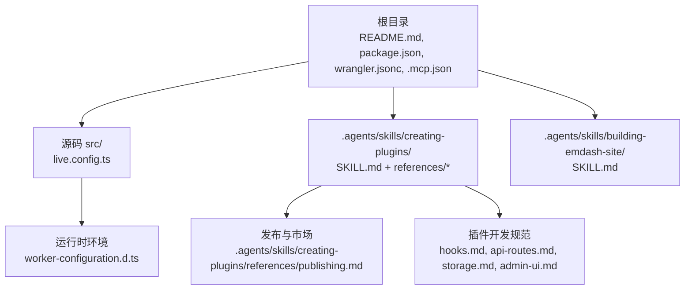
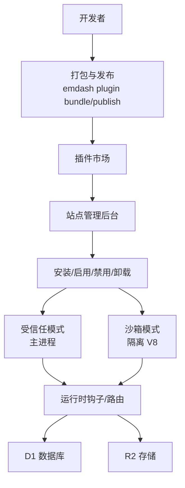
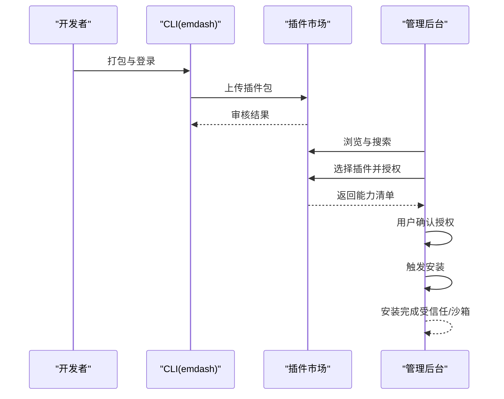
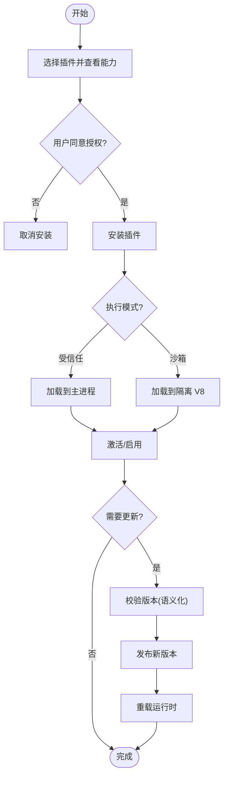
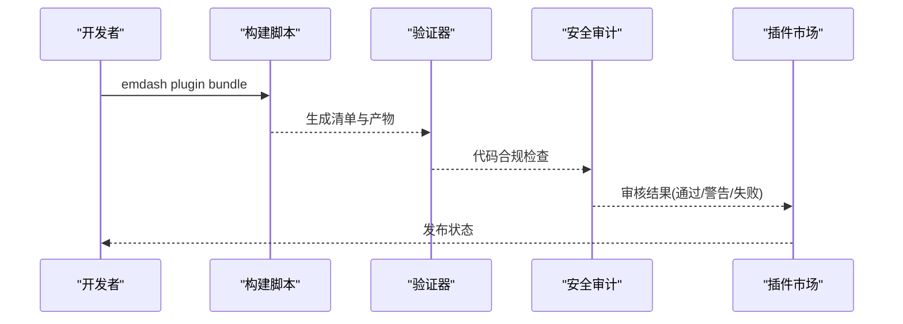
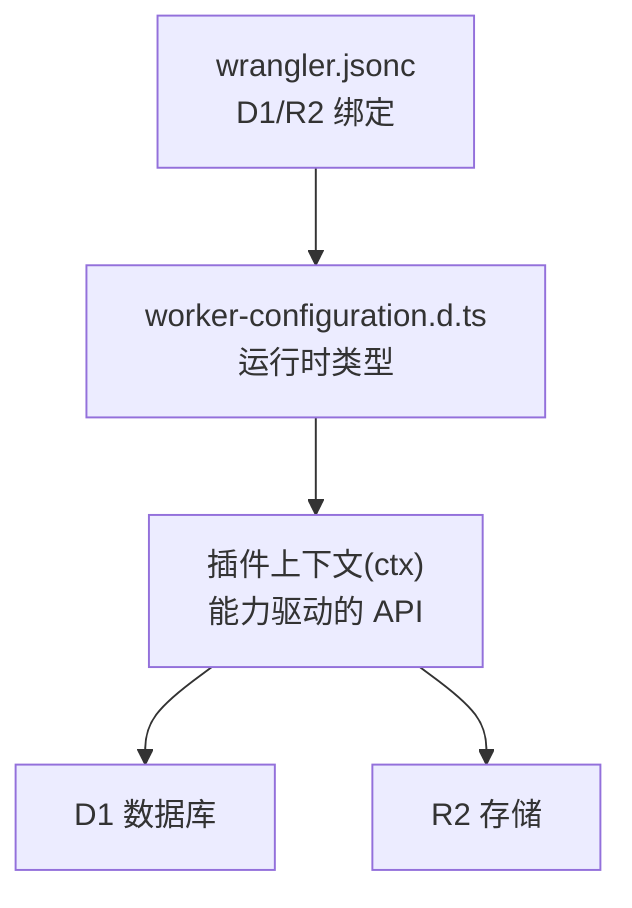

# 插件市场集成

<cite>
**本文档引用的文件**
- [README.md](file://README.md)
- [package.json](file://package.json)
- [AGENTS.md](file://AGENTS.md)
- [.mcp.json](file://.mcp.json)
- [src/live.config.ts](file://src/live.config.ts)
- [wrangler.jsonc](file://wrangler.jsonc)
- [worker-configuration.d.ts](file://worker-configuration.d.ts)
- [.agents/skills/creating-plugins/SKILL.md](file://.agents/skills/creating-plugins/SKILL.md)
- [.agents/skills/creating-plugins/references/publishing.md](file://.agents/skills/creating-plugins/references/publishing.md)
- [.agents/skills/creating-plugins/references/admin-ui.md](file://.agents/skills/creating-plugins/references/admin-ui.md)
- [.agents/skills/creating-plugins/references/api-routes.md](file://.agents/skills/creating-plugins/references/api-routes.md)
- [.agents/skills/creating-plugins/references/hooks.md](file://.agents/skills/creating-plugins/references/hooks.md)
- [.agents/skills/creating-plugins/references/storage.md](file://.agents/skills/creating-plugins/references/storage.md)
- [.agents/skills/building-emdash-site/SKILL.md](file://.agents/skills/building-emdash-site/SKILL.md)
</cite>

## 目录
1. [简介](#简介)
2. [项目结构](#项目结构)
3. [核心组件](#核心组件)
4. [架构总览](#架构总览)
5. [详细组件分析](#详细组件分析)
6. [依赖关系分析](#依赖关系分析)
7. [性能考量](#性能考量)
8. [故障排除指南](#故障排除指南)
9. [结论](#结论)
10. [附录](#附录)

## 简介
本文件面向需要在 EmDash 生态中实现“插件市场集成”的开发者与运营人员，系统阐述插件市场的配置与使用、插件发现机制、安装/更新/卸载流程（含依赖与版本冲突处理）、发布与审核流程、许可证与定价策略、收益分配机制、质量评估与用户评价体系、以及生态建设与社区参与建议。文档基于仓库中的技能文档与参考手册进行归纳总结，并结合实际代码文件（如包配置、运行时环境、插件开发规范）给出可操作的实施路径。

## 项目结构
该仓库包含一个基于 Astro 的 EmDash 博客模板，集成了插件能力与市场发布工具链。关键结构如下：
- 根目录包含项目元信息与部署配置：README、package.json、wrangler.jsonc、.mcp.json 等
- 源码位于 src/，其中 live.config.ts 注册了 EmDash 内容加载器
- 插件开发与发布指南位于 .agents/skills/creating-plugins/ 及其 references 子目录
- 站点构建与插件使用指南位于 .agents/skills/building-emdash-site/

**图表来源**
- [README.md:1-68](file://README.md#L1-L68)
- [package.json:1-33](file://package.json#L1-L33)
- [src/live.config.ts:1-14](file://src/live.config.ts#L1-L14)
- [wrangler.jsonc:1-20](file://wrangler.jsonc#L1-L20)
- [worker-configuration.d.ts:1-12044](file://worker-configuration.d.ts#L1-L12044)
- [.agents/skills/creating-plugins/SKILL.md:1-460](file://.agents/skills/creating-plugins/SKILL.md#L1-L460)
- [.agents/skills/creating-plugins/references/publishing.md:1-83](file://.agents/skills/creating-plugins/references/publishing.md#L1-L83)
- [.agents/skills/creating-plugins/references/hooks.md:1-441](file://.agents/skills/creating-plugins/references/hooks.md#L1-L441)
- [.agents/skills/creating-plugins/references/api-routes.md:1-266](file://.agents/skills/creating-plugins/references/api-routes.md#L1-L266)
- [.agents/skills/creating-plugins/references/storage.md:1-265](file://.agents/skills/creating-plugins/references/storage.md#L1-L265)
- [.agents/skills/building-emdash-site/SKILL.md:1-147](file://.agents/skills/building-emdash-site/SKILL.md#L1-L147)

**章节来源**
- [README.md:1-68](file://README.md#L1-L68)
- [package.json:1-33](file://package.json#L1-L33)
- [src/live.config.ts:1-14](file://src/live.config.ts#L1-L14)
- [wrangler.jsonc:1-20](file://wrangler.jsonc#L1-L20)
- [worker-configuration.d.ts:1-12044](file://worker-configuration.d.ts#L1-L12044)
- [.agents/skills/building-emdash-site/SKILL.md:118-137](file://.agents/skills/building-emdash-site/SKILL.md#L118-L137)

## 核心组件
- 插件描述符与运行时定义：插件由“描述符工厂”（构建期）与“插件定义”（运行期）两部分组成，分别在不同上下文执行，确保安全与一致性。
- 执行模式：受信任（trusted）与沙箱（sandboxed）两种模式，前者在主进程中运行，后者在隔离 V8 中运行，具备能力约束与网络限制。
- 能力与权限：通过声明式能力控制 API 访问范围，如内容读写、媒体读写、网络请求、用户读取、邮件发送等。
- 市场发布：标准格式插件支持打包为 .tar.gz，包含清单、后端与管理界面代码、图标与截图等，经验证与安全审计后上架。
- 运行时环境：Cloudflare Workers 上通过 D1 与 R2 绑定数据库与存储；本地开发支持 Node.js 平台。

**章节来源**
- [.agents/skills/creating-plugins/SKILL.md:23-88](file://.agents/skills/creating-plugins/SKILL.md#L23-L88)
- [.agents/skills/creating-plugins/SKILL.md:115-149](file://.agents/skills/creating-plugins/SKILL.md#L115-L149)
- [.agents/skills/creating-plugins/SKILL.md:179-221](file://.agents/skills/creating-plugins/SKILL.md#L179-L221)
- [.agents/skills/creating-plugins/references/publishing.md:1-83](file://.agents/skills/creating-plugins/references/publishing.md#L1-L83)
- [wrangler.jsonc:1-20](file://wrangler.jsonc#L1-L20)
- [worker-configuration.d.ts:1-12044](file://worker-configuration.d.ts#L1-L12044)

## 架构总览
下图展示插件市场集成的关键交互：开发者在本地或 CI 中打包插件，上传至市场；站点管理员在后台触发安装，系统根据能力与权限进行校验与部署；运行时插件在受信任或沙箱模式下响应钩子与路由。

**图表来源**
- [.agents/skills/creating-plugins/references/publishing.md:40-54](file://.agents/skills/creating-plugins/references/publishing.md#L40-L54)
- [.agents/skills/creating-plugins/SKILL.md:115-149](file://.agents/skills/creating-plugins/SKILL.md#L115-L149)
- [wrangler.jsonc:7-18](file://wrangler.jsonc#L7-L18)

## 详细组件分析

### 插件市场配置与发现机制
- 市场服务地址：通过 MCP 配置文件指向文档服务器，便于在编辑器中自动发现与查询文档。
- 插件注册：站点通过 astro.config.mjs 引入插件描述符，支持在受信任或沙箱模式下注册。
- 插件发现：标准插件可通过市场一键安装，安装时弹出能力授权对话框，用户确认后方可生效。

**图表来源**
- [.agents/skills/creating-plugins/references/publishing.md:40-54](file://.agents/skills/creating-plugins/references/publishing.md#L40-L54)
- [.agents/skills/creating-plugins/SKILL.md:222-233](file://.agents/skills/creating-plugins/SKILL.md#L222-L233)
- [.mcp.json:1-9](file://.mcp.json#L1-L9)

**章节来源**
- [.mcp.json:1-9](file://.mcp.json#L1-L9)
- [.agents/skills/creating-plugins/SKILL.md:95-114](file://.agents/skills/creating-plugins/SKILL.md#L95-L114)
- [.agents/skills/creating-plugins/SKILL.md:222-233](file://.agents/skills/creating-plugins/SKILL.md#L222-L233)

### 插件安装、更新与卸载流程
- 安装：从市场选择插件，显示能力授权；确认后安装到站点，按模式（受信任/沙箱）加载。
- 更新：遵循语义化版本，新版本不得低于现有版本；重复发布同一版本会被拒绝。
- 卸载：可选择是否删除插件数据；生命周期钩子提供清理入口。

**图表来源**
- [.agents/skills/creating-plugins/SKILL.md:39-94](file://.agents/skills/creating-plugins/SKILL.md#L39-L94)
- [.agents/skills/creating-plugins/references/publishing.md:78-83](file://.agents/skills/creating-plugins/references/publishing.md#L78-L83)

**章节来源**
- [.agents/skills/creating-plugins/SKILL.md:39-94](file://.agents/skills/creating-plugins/SKILL.md#L39-L94)
- [.agents/skills/creating-plugins/references/publishing.md:78-83](file://.agents/skills/creating-plugins/references/publishing.md#L78-L83)

### 依赖管理与版本冲突处理
- 插件间依赖：钩子配置支持声明依赖其他插件 ID，保证执行顺序。
- 版本策略：严格遵循语义化版本，禁止回退或覆盖已存在版本。
- 冲突处理：当多个插件对同一事件进行处理时，优先级与依赖关系决定执行顺序；错误策略可选择“中止”或“继续”。

**章节来源**
- [.agents/skills/creating-plugins/references/hooks.md:11-35](file://.agents/skills/creating-plugins/references/hooks.md#L11-L35)
- [.agents/skills/creating-plugins/references/publishing.md:78-83](file://.agents/skills/creating-plugins/references/publishing.md#L78-L83)

### 插件开发者发布指南
- 包结构与导出：标准格式需包含“.”（描述符）与“./sandbox”（运行时定义）导出；必要时包含“./admin”（原生格式）。
- 清单与打包：manifest.json 由运行时提取；后端与管理界面代码自包含；支持 README、图标与截图。
- 构建与发布：先打包检查（大小、Node 内置限制、特性兼容性），再上传；首次发布需 GitHub 授权。
- 安全审计：自动检测数据外泄、凭证收集、混淆代码、资源滥用与可疑网络行为。

**图表来源**
- [.agents/skills/creating-plugins/references/publishing.md:18-54](file://.agents/skills/creating-plugins/references/publishing.md#L18-L54)
- [.agents/skills/creating-plugins/references/publishing.md:66-77](file://.agents/skills/creating-plugins/references/publishing.md#L66-L77)

**章节来源**
- [.agents/skills/creating-plugins/references/publishing.md:1-83](file://.agents/skills/creating-plugins/references/publishing.md#L1-L83)

### 插件生态与社区参与
- 开发生态：提供钩子、存储、设置、管理界面、API 路由与 Portable Text 块类型等扩展点。
- 社区协作：通过文档 MCP 服务器统一知识入口，编辑器自动发现；鼓励贡献示例与最佳实践。

**章节来源**
- [.agents/skills/building-emdash-site/SKILL.md:118-137](file://.agents/skills/building-emdash-site/SKILL.md#L118-L137)
- [.mcp.json:1-9](file://.mcp.json#L1-L9)

## 依赖关系分析
- 运行时绑定：Cloudflare Workers 通过 wrangler.jsonc 将 D1 与 R2 绑定到环境变量，供插件运行时访问。
- 插件上下文：插件通过 ctx 获取能力范围内的 API（内容、媒体、KV、存储、日志、HTTP、用户、计划任务、邮件等）。
- 环境类型：worker-configuration.d.ts 提供运行时类型定义，确保在 Cloudflare Workers 环境下的类型安全。

**图表来源**
- [wrangler.jsonc:7-18](file://wrangler.jsonc#L7-L18)
- [worker-configuration.d.ts:1-12044](file://worker-configuration.d.ts#L1-L12044)

**章节来源**
- [wrangler.jsonc:1-20](file://wrangler.jsonc#L1-L20)
- [worker-configuration.d.ts:1-12044](file://worker-configuration.d.ts#L1-L12044)

## 性能考量
- 沙箱限制：CPU 时间、并发子请求、墙钟时间与内存上限，避免资源滥用。
- 网络访问：默认阻断直连，需通过 ctx.http.fetch 并限定 allowedHosts。
- 存储隔离：KV 与存储集合按插件作用域隔离，减少竞争与冲突。
- 查询索引：存储查询需建立索引，避免全表扫描导致延迟。

**章节来源**
- [.agents/skills/creating-plugins/SKILL.md:115-149](file://.agents/skills/creating-plugins/SKILL.md#L115-L149)
- [.agents/skills/creating-plugins/references/storage.md:62-111](file://.agents/skills/creating-plugins/references/storage.md#L62-L111)

## 故障排除指南
- 安装失败：检查能力授权是否被用户拒绝；确认插件版本高于当前版本；核对包大小与 Node 内置限制。
- 运行异常：在沙箱模式下排查 allowedHosts 与网络访问；检查钩子优先级与依赖顺序；查看日志输出定位问题。
- 数据不一致：确认存储索引设计与查询条件匹配；核对 KV 键命名前缀与默认值处理。

**章节来源**
- [.agents/skills/creating-plugins/references/publishing.md:56-77](file://.agents/skills/creating-plugins/references/publishing.md#L56-L77)
- [.agents/skills/creating-plugins/references/hooks.md:406-418](file://.agents/skills/creating-plugins/references/hooks.md#L406-L418)
- [.agents/skills/creating-plugins/references/storage.md:172-184](file://.agents/skills/creating-plugins/references/storage.md#L172-L184)

## 结论
本文件基于仓库中的技能与参考文档，系统梳理了 EmDash 插件市场的配置、插件生命周期管理、发布与审核流程、运行时能力与安全约束，并提供了生态建设与社区参与建议。按照本文档的实施路径，团队可以高效地在站点中集成与运营插件市场，同时保障安全性与可维护性。

## 附录
- 关键术语
  - 描述符：构建期使用的插件元数据与导出配置
  - 插件定义：运行期的钩子与路由逻辑
  - 受信任模式：主进程内运行，能力为文档性
  - 沙箱模式：隔离 V8 运行，能力与网络受限
  - 能力：声明式权限，控制 ctx 可用 API
  - 清单：manifest.json，描述插件元信息与导出
- 相关文件路径
  - 插件开发与发布：.agents/skills/creating-plugins/SKILL.md 与 references/*
  - 站点构建与插件使用：.agents/skills/building-emdash-site/SKILL.md
  - 运行时与部署：wrangler.jsonc、worker-configuration.d.ts
  - 文档服务：.mcp.json