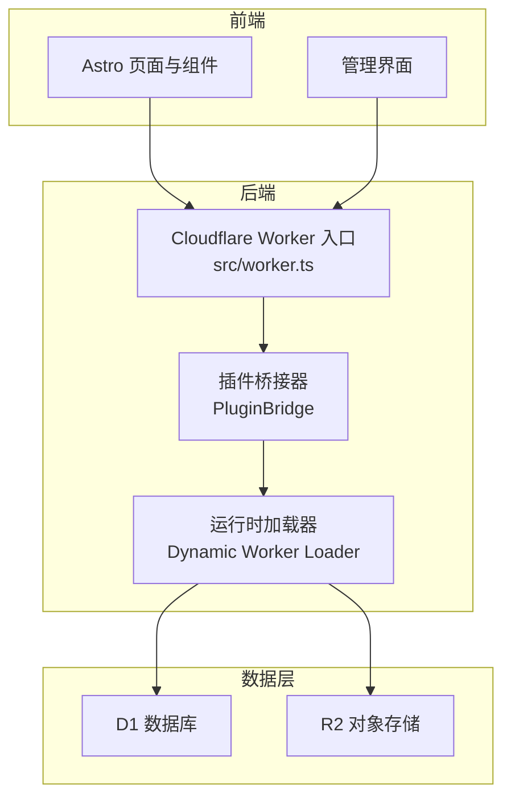
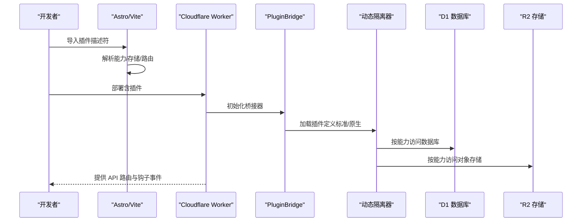
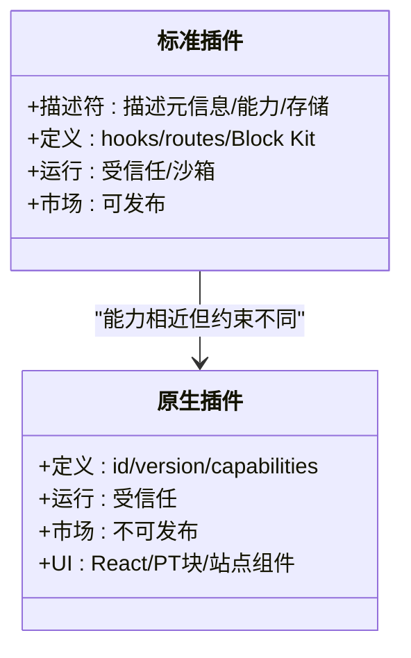
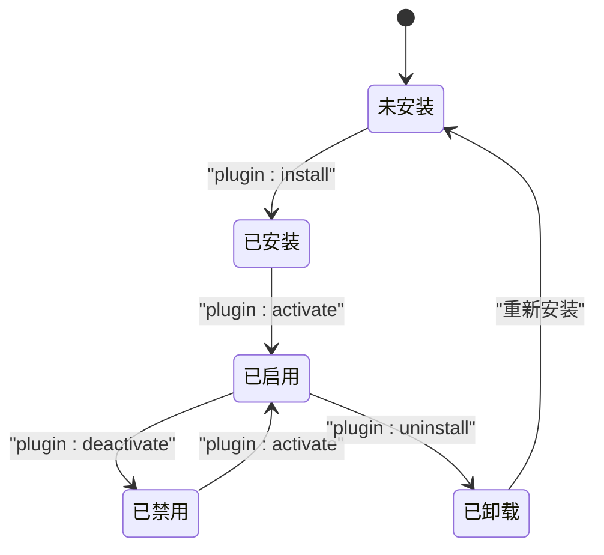
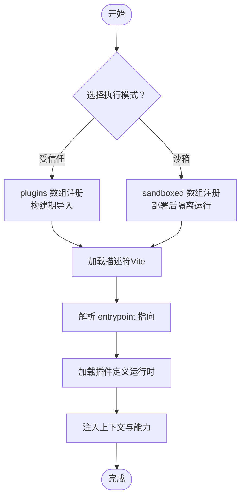
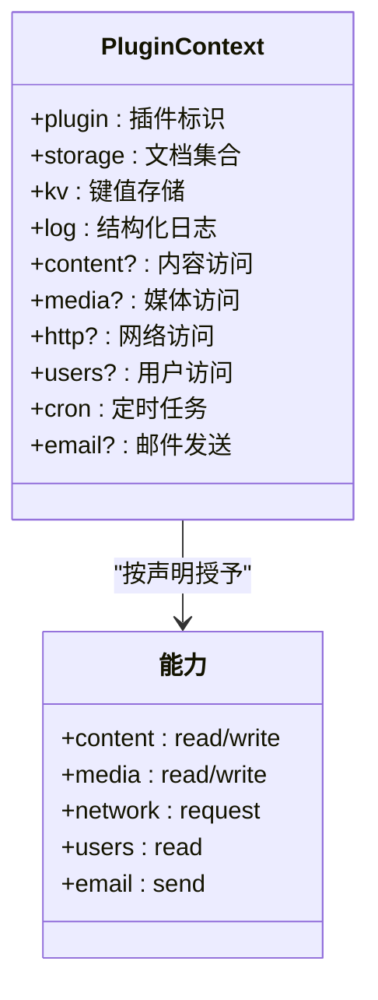
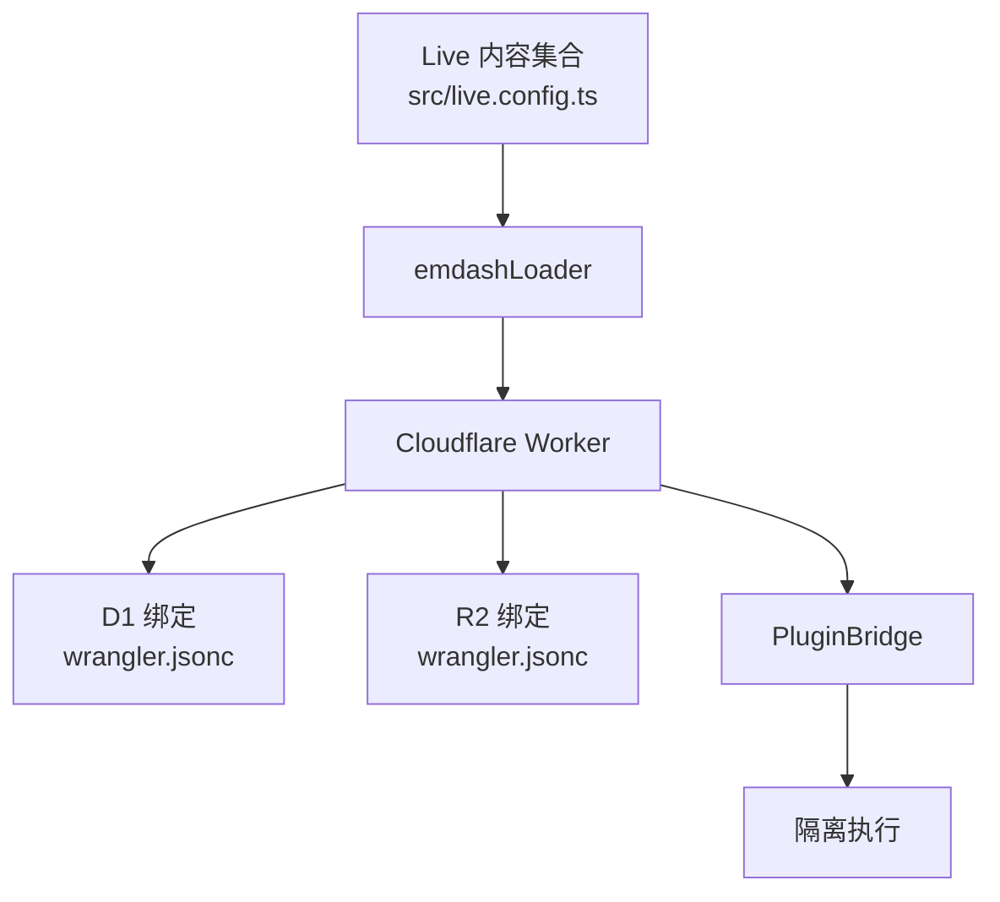
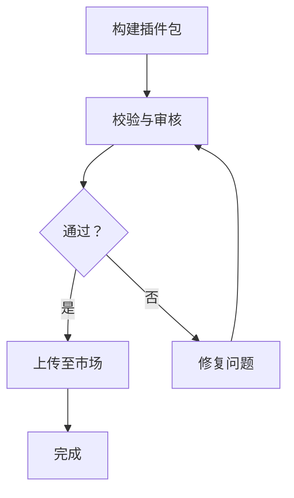
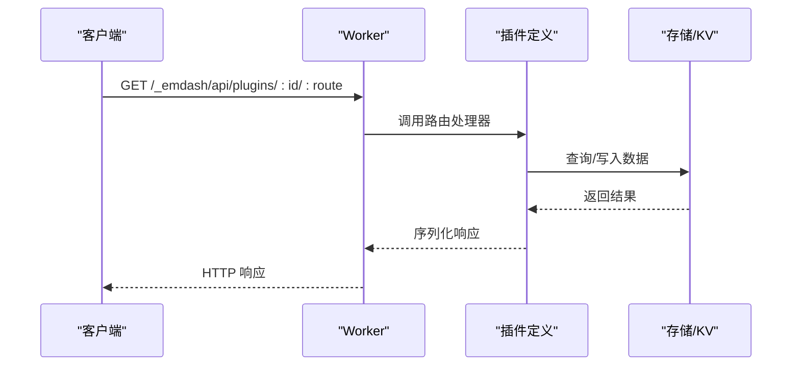
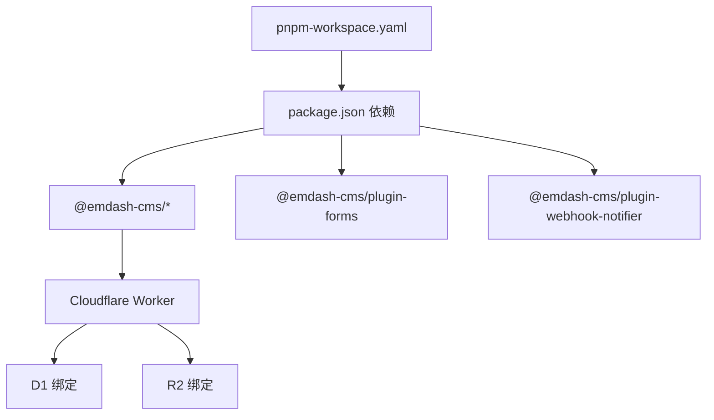

# 插件架构设计

<cite>
**本文档引用的文件**
- [README.md](file://README.md)
- [package.json](file://package.json)
- [src/live.config.ts](file://src/live.config.ts)
- [src/worker.ts](file://src/worker.ts)
- [worker-configuration.d.ts](file://worker-configuration.d.ts)
- [wrangler.jsonc](file://wrangler.jsonc)
- [seed/seed.json](file://seed/seed.json)
- [pnpm-workspace.yaml](file://pnpm-workspace.yaml)
- [.agents/skills/creating-plugins/SKILL.md](file://.agents/skills/creating-plugins/SKILL.md)
- [.agents/skills/creating-plugins/references/hooks.md](file://.agents/skills/creating-plugins/references/hooks.md)
- [.agents/skills/creating-plugins/references/storage.md](file://.agents/skills/creating-plugins/references/storage.md)
- [.agents/skills/creating-plugins/references/api-routes.md](file://.agents/skills/creating-plugins/references/api-routes.md)
- [.agents/skills/creating-plugins/references/admin-ui.md](file://.agents/skills/creating-plugins/references/admin-ui.md)
- [.agents/skills/creating-plugins/references/block-kit.md](file://.agents/skills/creating-plugins/references/block-kit.md)
- [.agents/skills/creating-plugins/references/publishing.md](file://.agents/skills/creating-plugins/references/publishing.md)
- [.agents/skills/building-emdash-site/SKILL.md](file://.agents/skills/building-emdash-site/SKILL.md)
</cite>

## 目录
1. [简介](#简介)
2. [项目结构](#项目结构)
3. [核心组件](#核心组件)
4. [架构总览](#架构总览)
5. [详细组件分析](#详细组件分析)
6. [依赖关系分析](#依赖关系分析)
7. [性能考虑](#性能考虑)
8. [故障排除指南](#故障排除指南)
9. [结论](#结论)
10. [附录](#附录)

## 简介
本文件系统性阐述 EmDash 插件架构的设计理念与实现细节，覆盖标准插件与原生插件的差异、插件生命周期与注册机制、依赖注入与能力模型、与 EmDash CMS 核心系统的集成（数据库绑定、存储接口、沙箱运行机制）、插件配置选项（plugins 与 sandboxed 数组）以及插件市场与版本管理策略。面向开发者提供可操作的扩展指导与最佳实践。

## 项目结构
该模板基于 Astro + Cloudflare Workers 的部署形态，使用 D1 数据库与 R2 存储，并通过 Wrangler 进行本地开发与部署。插件系统通过 Astro 集成在构建期与运行期协同工作，支持两种执行模式：受信任（trusted）与沙箱（sandboxed）。标准插件可在两种模式下运行，原生插件仅能在受信任模式中运行。

图表来源
- [src/worker.ts:1-6](file://src/worker.ts#L1-L6)
- [wrangler.jsonc:1-20](file://wrangler.jsonc#L1-L20)
- [worker-configuration.d.ts:5-10](file://worker-configuration.d.ts#L5-L10)

章节来源
- [README.md:40-46](file://README.md#L40-L46)
- [wrangler.jsonc:1-20](file://wrangler.jsonc#L1-L20)
- [src/worker.ts:1-6](file://src/worker.ts#L1-L6)

## 核心组件
- 插件描述符（Descriptor）：在构建期由 Vite 加载，声明插件元信息、能力、存储定义等，不包含运行逻辑。
- 插件定义（Definition）：在请求时运行，包含 hooks、routes 等逻辑，通过统一入口暴露给运行时。
- 运行时桥接器（PluginBridge）：在 Cloudflare Worker 中导出，用于沙箱隔离与 RPC 调用。
- 数据绑定（D1/R2）：通过 Wrangler 配置绑定到运行时环境，供插件按能力访问。
- Live 内容集合：通过 emdashLoader 在 Astro 中定义实时内容集合，驱动站点渲染与查询。

章节来源
- [.agents/skills/creating-plugins/SKILL.md:23-28](file://.agents/skills/creating-plugins/SKILL.md#L23-L28)
- [src/live.config.ts:1-14](file://src/live.config.ts#L1-L14)
- [src/worker.ts:1-6](file://src/worker.ts#L1-L6)
- [wrangler.jsonc:7-18](file://wrangler.jsonc#L7-L18)

## 架构总览
EmDash 插件系统采用“描述符 + 定义”的双阶段设计：
- 构建期：Astro/Vite 加载插件描述符，解析能力与存储定义，生成类型与清单。
- 运行期：根据部署目标选择执行模式（trusted 或 sandboxed），加载插件定义并通过上下文注入可用能力。

图表来源
- [.agents/skills/creating-plugins/SKILL.md:115-149](file://.agents/skills/creating-plugins/SKILL.md#L115-L149)
- [src/worker.ts:1-6](file://src/worker.ts#L1-L6)
- [wrangler.jsonc:7-18](file://wrangler.jsonc#L7-L18)

## 详细组件分析

### 标准插件与原生插件
- 标准插件（Standard）
  - 使用 definePlugin 定义 hooks 与 routes，支持 Block Kit 管理界面。
  - 可发布至插件市场，在安装时进行能力授权。
  - 支持在受信任与沙箱两种模式下运行。
- 原生插件（Native）
  - 通过 createPlugin/definePlugin 同时声明 id/version/capabilities，且必须在 plugins 数组中注册。
  - 支持 React 管理界面、自定义 Portable Text 块、站点侧渲染组件。
  - 仅能在受信任模式运行，不可沙箱化或上架市场。

图表来源
- [.agents/skills/creating-plugins/SKILL.md:10-22](file://.agents/skills/creating-plugins/SKILL.md#L10-L22)

章节来源
- [.agents/skills/creating-plugins/SKILL.md:10-22](file://.agents/skills/creating-plugins/SKILL.md#L10-L22)

### 生命周期管理
插件生命周期钩子覆盖安装、激活、停用、卸载四个阶段，分别在首次安装、启用、禁用、移除时触发。卸载时可选择是否删除数据。

图表来源
- [.agents/skills/creating-plugins/references/hooks.md:39-93](file://.agents/skills/creating-plugins/references/hooks.md#L39-L93)

章节来源
- [.agents/skills/creating-plugins/references/hooks.md:39-93](file://.agents/skills/creating-plugins/references/hooks.md#L39-L93)

### 注册机制与配置数组
- plugins 数组：在 astro.config.mjs 中注册受信任插件，构建期加载并在进程中运行。
- sandboxed 数组：在相同位置注册沙箱插件，部署后在隔离环境中运行。
- 描述符中的 entrypoint 指向插件定义模块；标准插件的 entrypoint 通常指向 ./sandbox 导出。

图表来源
- [.agents/skills/creating-plugins/SKILL.md:95-114](file://.agents/skills/creating-plugins/SKILL.md#L95-L114)

章节来源
- [.agents/skills/creating-plugins/SKILL.md:95-114](file://.agents/skills/creating-plugins/SKILL.md#L95-L114)

### 依赖注入与能力模型
- 上下文（PluginContext）：包含插件标识、存储、KV、日志、内容、媒体、HTTP、用户、定时任务、邮件等。
- 能力（Capabilities）：声明插件所需权限，如 content:read/write、media:read/write、network:request、users:read、email:send 等。
- 运行时限制：沙箱模式下能力强制执行，网络受限、无 Node.js API、资源配额严格。

图表来源
- [.agents/skills/creating-plugins/SKILL.md:410-427](file://.agents/skills/creating-plugins/SKILL.md#L410-L427)
- [.agents/skills/creating-plugins/SKILL.md:179-221](file://.agents/skills/creating-plugins/SKILL.md#L179-L221)

章节来源
- [.agents/skills/creating-plugins/SKILL.md:179-221](file://.agents/skills/creating-plugins/SKILL.md#L179-L221)
- [.agents/skills/creating-plugins/SKILL.md:410-427](file://.agents/skills/creating-plugins/SKILL.md#L410-L427)

### 与 CMS 核心系统的集成
- Live 内容集合：通过 emdashLoader 在 Astro 中定义 _emdash 集合，驱动实时内容查询与渲染。
- 数据库绑定：D1 通过 Wrangler 绑定到运行时环境，插件按能力访问。
- 存储接口：KV 与存储集合自动按插件作用域隔离，无需迁移。
- 沙箱运行：Cloudflare Worker 的 Dynamic Worker Loader 提供隔离执行环境，标准插件可在沙箱中运行。

图表来源
- [src/live.config.ts:1-14](file://src/live.config.ts#L1-L14)
- [wrangler.jsonc:7-18](file://wrangler.jsonc#L7-L18)
- [src/worker.ts:1-6](file://src/worker.ts#L1-L6)

章节来源
- [src/live.config.ts:1-14](file://src/live.config.ts#L1-L14)
- [wrangler.jsonc:7-18](file://wrangler.jsonc#L7-L18)
- [src/worker.ts:1-6](file://src/worker.ts#L1-L6)

### 插件市场与版本管理
- 发布格式：标准插件打包为 .tar.gz，包含 manifest.json、backend.js、admin.js 等。
- 包导出：通过 package.json exports 指定主入口、沙箱入口与管理界面入口。
- 审核与限制：大小限制、禁止 Node.js 内置、图标尺寸与截图数量校验、安全审计。
- 版本要求：语义化版本递增、不可覆盖已存在版本、首次发布自动注册插件 ID。

图表来源
- [.agents/skills/creating-plugins/references/publishing.md:40-83](file://.agents/skills/creating-plugins/references/publishing.md#L40-L83)

章节来源
- [.agents/skills/creating-plugins/references/publishing.md:1-83](file://.agents/skills/creating-plugins/references/publishing.md#L1-L83)

### API 路由与存储接口
- API 路由：以 /_emdash/api/plugins/<plugin-id>/<route-name> 暴露 REST 接口，支持输入验证与分页。
- 存储接口：插件声明存储集合，自动创建索引；支持 CRUD 与批量操作；KV 用于状态与设置。
- 管理界面：Block Kit（沙箱）或 React（原生）页面与仪表盘组件。

图表来源
- [.agents/skills/creating-plugins/references/api-routes.md:1-65](file://.agents/skills/creating-plugins/references/api-routes.md#L1-L65)
- [.agents/skills/creating-plugins/references/storage.md:1-60](file://.agents/skills/creating-plugins/references/storage.md#L1-L60)
- [.agents/skills/creating-plugins/references/block-kit.md:1-51](file://.agents/skills/creating-plugins/references/block-kit.md#L1-L51)

章节来源
- [.agents/skills/creating-plugins/references/api-routes.md:1-65](file://.agents/skills/creating-plugins/references/api-routes.md#L1-L65)
- [.agents/skills/creating-plugins/references/storage.md:1-60](file://.agents/skills/creating-plugins/references/storage.md#L1-L60)
- [.agents/skills/creating-plugins/references/admin-ui.md:1-45](file://.agents/skills/creating-plugins/references/admin-ui.md#L1-L45)
- [.agents/skills/creating-plugins/references/block-kit.md:1-51](file://.agents/skills/creating-plugins/references/block-kit.md#L1-L51)

## 依赖关系分析
- 插件生态：package.json 声明 @emdash-cms/cloudflare、@emdash-cms/plugin-forms、@emdash-cms/plugin-webhook-notifier 等依赖，体现标准插件生态。
- 运行时绑定：wrangler.jsonc 将 D1 与 R2 绑定到运行时环境，供插件按能力访问。
- 开发工具链：pnpm-workspace.yaml 控制构建与供应链安全策略，确保依赖版本稳定与安全。

图表来源
- [package.json:17-27](file://package.json#L17-L27)
- [wrangler.jsonc:7-18](file://wrangler.jsonc#L7-L18)
- [pnpm-workspace.yaml:1-16](file://pnpm-workspace.yaml#L1-L16)

章节来源
- [package.json:17-27](file://package.json#L17-L27)
- [wrangler.jsonc:7-18](file://wrangler.jsonc#L7-L18)
- [pnpm-workspace.yaml:1-16](file://pnpm-workspace.yaml#L1-L16)

## 性能考虑
- 沙箱资源限制：CPU 50ms、最多 10 次子请求、30 秒墙钟时间、约 128MB 内存，避免长时间阻塞。
- 网络访问：默认阻止直连，需通过 ctx.http.fetch 并配置 allowedHosts。
- 存储访问：KV 与存储集合按插件作用域隔离，避免跨插件冲突。
- 钩子优先级与超时：可通过 hooks 配置项设置优先级、超时与依赖顺序，提升并发与稳定性。

## 故障排除指南
- 插件未生效：检查是否正确导入描述符、entrypoint 是否指向正确的导出、是否在 plugins 或 sandboxed 数组中注册。
- 能力不足：确认描述符中 capabilities 与 allowedHosts 是否正确声明，沙箱模式下会强制执行。
- 数据访问异常：核对存储集合索引与查询条件，确保字段类型与索引匹配。
- 网络请求失败：在沙箱模式下使用 ctx.http.fetch 并配置允许的主机列表。
- 市场发布失败：检查包大小、Node.js 内置导入、图标与截图规格，遵循语义化版本规则。

章节来源
- [.agents/skills/creating-plugins/references/publishing.md:56-83](file://.agents/skills/creating-plugins/references/publishing.md#L56-L83)
- [.agents/skills/creating-plugins/SKILL.md:115-149](file://.agents/skills/creating-plugins/SKILL.md#L115-L149)

## 结论
EmDash 插件架构通过“描述符 + 定义”的双阶段设计，结合受信任与沙箱两种执行模式，实现了灵活性与安全性的平衡。标准插件覆盖大多数场景，原生插件提供更丰富的 UI 与渲染能力。通过能力模型与运行时限制，插件在保证功能强大的同时，也具备可控的安全边界。配合插件市场与版本管理策略，开发者可以快速扩展与分发插件生态。

## 附录
- 开发者最佳实践
  - 优先使用标准插件，保持代码在两种模式下兼容。
  - 明确声明能力与 allowedHosts，避免不必要的权限与网络风险。
  - 利用 KV 与存储集合进行状态与数据管理，避免直接读写全局资源。
  - 通过 Block Kit 或 React 构建管理界面，确保良好的用户体验。
  - 在沙箱模式下避免使用 Node.js 内置 API，使用 Web API 替代。
  - 遵循插件市场发布规范，确保包体积与安全性符合要求。