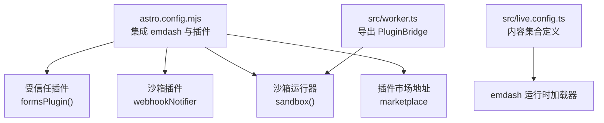
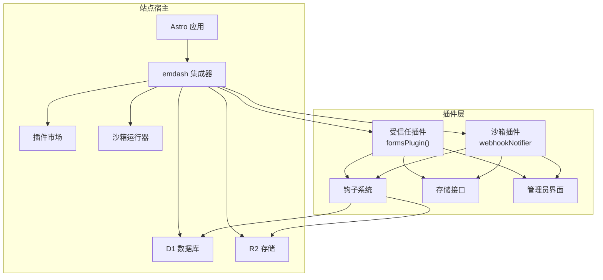
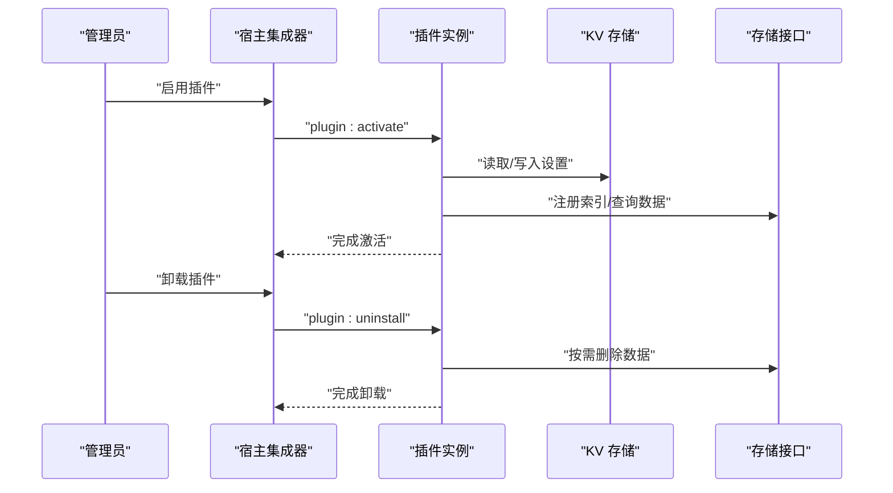
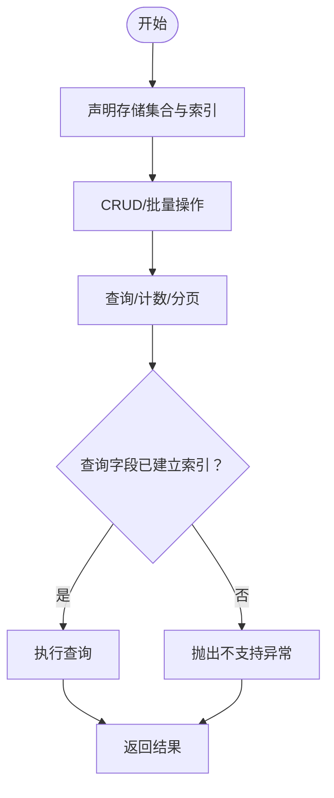
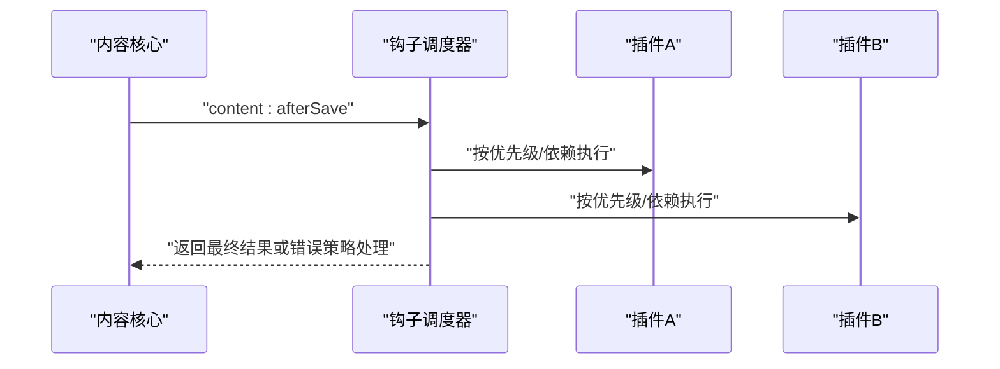
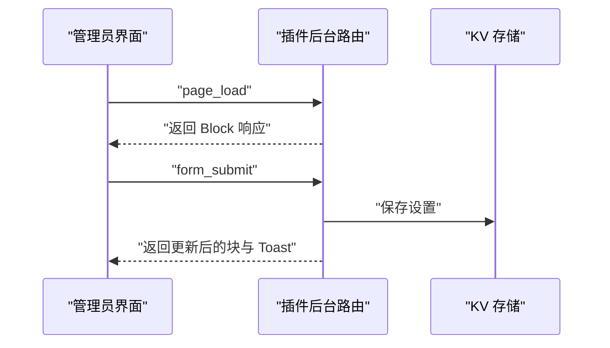
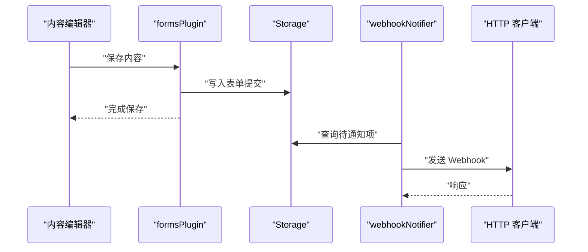
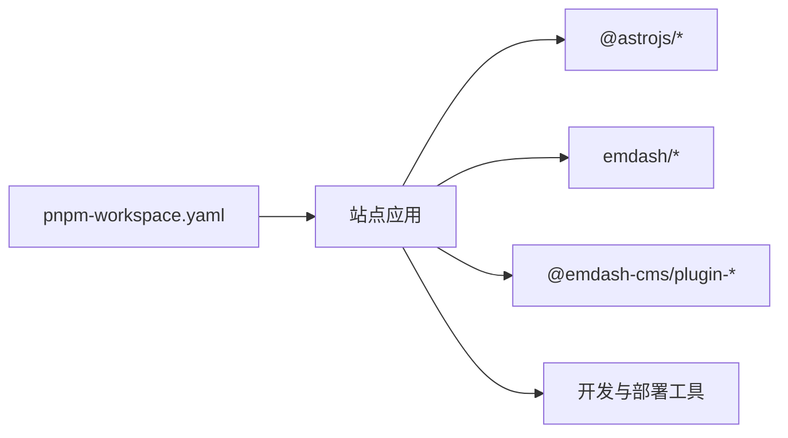

# 插件系统

<cite>
**本文引用的文件**
- [README.md](file://README.md)
- [package.json](file://package.json)
- [astro.config.mjs](file://astro.config.mjs)
- [src/live.config.ts](file://src/live.config.ts)
- [src/worker.ts](file://src/worker.ts)
- [pnpm-workspace.yaml](file://pnpm-workspace.yaml)
- [.agents/skills/creating-plugins/SKILL.md](file://.agents/skills/creating-plugins/SKILL.md)
- [.agents/skills/creating-plugins/references/hooks.md](file://.agents/skills/creating-plugins/references/hooks.md)
- [.agents/skills/creating-plugins/references/storage.md](file://.agents/skills/creating-plugins/references/storage.md)
- [.agents/skills/creating-plugins/references/admin-ui.md](file://.agents/skills/creating-plugins/references/admin-ui.md)
- [.agents/skills/creating-plugins/references/block-kit.md](file://.agents/skills/creating-plugins/references/block-kit.md)
- [.agents/skills/creating-plugins/references/publishing.md](file://.agents/skills/creating-plugins/references/publishing.md)
- [.agents/skills/building-emdash-site/SKILL.md](file://.agents/skills/building-emdash-site/SKILL.md)
</cite>

## 目录
1. [简介](#简介)
2. [项目结构](#项目结构)
3. [核心组件](#核心组件)
4. [架构总览](#架构总览)
5. [详细组件分析](#详细组件分析)
6. [依赖分析](#依赖分析)
7. [性能考虑](#性能考虑)
8. [故障排查指南](#故障排查指南)
9. [结论](#结论)
10. [附录](#附录)

## 简介
本文件面向 EmDash 插件系统的开发者与维护者，系统化阐述插件架构设计、扩展机制与运行时模型，覆盖标准（受信任）插件与沙箱（非受信任）插件的差异；详解插件生命周期、注册机制与依赖注入；提供从 API 路由、存储接口、钩子系统到管理员界面集成的完整开发指南；解释 formsPlugin 与 webhookNotifier 等内置插件的实现思路；并涵盖插件市场集成、版本管理与兼容性策略，以及测试、调试与性能优化的最佳实践与发布维护指导。

## 项目结构
该仓库是一个基于 Astro 的 EmDash 博客模板，部署于 Cloudflare Workers，使用 D1 数据库与 R2 存储。插件系统通过 Astro 集成器在构建期或运行期加载，并支持两类插件模式：受信任（trusted）与沙箱（sandboxed）。项目中已内建 formsPlugin 与 webhookNotifier 两个插件，并通过配置启用沙箱运行器与插件市场地址。

**图表来源**
- [astro.config.mjs:16-26](file://astro.config.mjs#L16-L26)
- [src/live.config.ts:8-13](file://src/live.config.ts#L8-L13)
- [src/worker.ts:1-6](file://src/worker.ts#L1-L6)

**章节来源**
- [astro.config.mjs:1-45](file://astro.config.mjs#L1-L45)
- [src/live.config.ts:1-14](file://src/live.config.ts#L1-L14)
- [src/worker.ts:1-6](file://src/worker.ts#L1-L6)

## 核心组件
- 插件宿主与集成器
  - emdash 集成器负责数据库（D1）、存储（R2）、插件列表、沙箱运行器与插件市场的装配。
  - 受信任插件以函数调用方式注入，直接参与构建与运行。
  - 沙箱插件通过 marketplace 与 sandbox 运行器动态加载，具备更强的安全隔离。
- 内置插件
  - formsPlugin：提供表单收集与存储能力，声明存储集合并在钩子中触发业务逻辑。
  - webhookNotifier：作为沙箱插件，通过受控网络访问与钩子事件驱动发送 Webhook。
- 运行时与内容加载
  - live.config.ts 使用 emdashLoader 定义实时内容集合，使站点页面可按需查询与渲染内容。
  - worker.ts 导出 PluginBridge，为沙箱插件提供与宿主通信的桥接能力。

**章节来源**
- [astro.config.mjs:16-26](file://astro.config.mjs#L16-L26)
- [package.json:21-22](file://package.json#L21-L22)
- [src/live.config.ts:8-13](file://src/live.config.ts#L8-L13)
- [src/worker.ts:1-6](file://src/worker.ts#L1-L6)

## 架构总览
下图展示插件系统在站点中的整体交互：宿主集成器装配数据库、存储、插件与沙箱运行器；受信任插件直接参与构建；沙箱插件通过 marketplace 下载并由 sandbox 运行器执行；钩子系统贯穿内容生命周期；管理员界面通过插件入口扩展功能。

**图表来源**
- [astro.config.mjs:16-26](file://astro.config.mjs#L16-L26)
- [src/worker.ts:1-6](file://src/worker.ts#L1-L6)

## 详细组件分析

### 受信任插件与沙箱插件对比
- 运行环境
  - 受信任插件在主进程中运行，能力无强制限制，适合第一方或经审查的 npm 包。
  - 沙箱插件在隔离的 V8 isolate 中运行，具备资源上限、受限网络与能力声明等安全约束。
- 安装方式
  - 受信任插件通过修改 astro.config.mjs 并重新部署安装。
  - 沙箱插件通过管理员界面从插件市场一键安装。
- 能力与数据访问
  - 受信任插件的能力声明为文档性说明，实际权限取决于宿主信任度。
  - 沙箱插件的能力由宿主在运行时通过 RPC 桥接强制约束。
- 平台与最佳场景
  - 受信任插件适用于全平台与需要强能力的场景。
  - 沙箱插件仅在 Cloudflare Workers 上可用，适合第三方扩展与市场分发。

**章节来源**
- [.agents/skills/creating-plugins/SKILL.md:119-136](file://.agents/skills/creating-plugins/SKILL.md#L119-L136)

### 生命周期与注册机制
- 生命周期钩子
  - plugin:install：首次安装时运行，用于初始化默认设置与数据。
  - plugin:activate：启用插件时运行，常用于注册计划任务、监听器或缓存预热。
  - plugin:deactivate：禁用插件时运行，清理临时状态或断开连接。
  - plugin:uninstall：移除插件时运行，根据是否删除数据决定清理范围。
- 注册与依赖注入
  - 在 definePlugin 中声明 hooks、storage、admin 等元信息，宿主在激活阶段解析并注入上下文（如 ctx.kv、ctx.storage、ctx.cron、ctx.http 等）。
  - 依赖顺序可通过 dependencies 数组与 priority 控制，errorPolicy 支持“中止”或“继续”。

**图表来源**
- [.agents/skills/creating-plugins/references/hooks.md:39-93](file://.agents/skills/creating-plugins/references/hooks.md#L39-L93)

**章节来源**
- [.agents/skills/creating-plugins/references/hooks.md:37-93](file://.agents/skills/creating-plugins/references/hooks.md#L37-L93)

### 存储接口与数据模型
- 存储机制
  - Storage：面向插件的文档集合，自动建模与索引，支持 CRUD、批量操作、查询、计数与分页。
  - KV：键值对存储，适合设置、状态与缓存，支持前缀列举。
  - 设置模式：通过 admin.settingsSchema 自动生成配置表单，减少样板代码。
- 索引设计与查询
  - 仅对已声明索引字段进行过滤与排序；复合索引支持首字段过滤+次字段排序。
  - 提供类型安全的集合访问，便于在钩子与路由处理器中使用。

**图表来源**
- [.agents/skills/creating-plugins/references/storage.md:11-157](file://.agents/skills/creating-plugins/references/storage.md#L11-L157)

**章节来源**
- [.agents/skills/creating-plugins/references/storage.md:11-184](file://.agents/skills/creating-plugins/references/storage.md#L11-L184)

### 钩子系统与事件驱动
- 钩子类型
  - 内容钩子：content:beforeSave、content:afterSave、content:beforeDelete、content:afterDelete、content:afterPublish、content:afterUnpublish。
  - 媒体钩子：media:beforeUpload、media:afterUpload。
  - 邮件钩子：email:beforeSend、email:deliver（独占）、email:afterSend。
  - 计划任务：cron，配合 ctx.cron.schedule 在激活时注册。
  - 页面钩子：page:metadata、page:fragments（受信任插件）。
- 执行顺序与错误策略
  - 优先级越低越早执行；dependencies 强制顺序；errorPolicy 支持“中止/继续”。

**图表来源**
- [.agents/skills/creating-plugins/references/hooks.md:406-439](file://.agents/skills/creating-plugins/references/hooks.md#L406-L439)

**章节来源**
- [.agents/skills/creating-plugins/references/hooks.md:406-439](file://.agents/skills/creating-plugins/references/hooks.md#L406-L439)

### 管理员界面集成
- 入口与页面
  - 通过 admin.entry 指向 React 组件入口，定义 pages 与 widgets，挂载于 /_emdash/admin/plugins/<plugin-id>/...
- API 调用
  - usePluginAPI 自动拼接插件 ID 前缀，简化前端与后端路由交互。
- Block Kit（沙箱插件）
  - 沙箱插件使用 Block Kit 渲染设置页，通过 admin 路由的交互协议实现页面加载、表单提交与反馈提示。

**图表来源**
- [.agents/skills/creating-plugins/references/block-kit.md:18-51](file://.agents/skills/creating-plugins/references/block-kit.md#L18-L51)

**章节来源**
- [.agents/skills/creating-plugins/references/admin-ui.md:1-192](file://.agents/skills/creating-plugins/references/admin-ui.md#L1-L192)
- [.agents/skills/creating-plugins/references/block-kit.md:18-51](file://.agents/skills/creating-plugins/references/block-kit.md#L18-L51)

### formsPlugin 与 webhookNotifier 实现要点
- formsPlugin
  - 作为受信任插件，通过 definePlugin 声明存储集合（如 submissions、forms），在 content 钩子中记录表单提交，结合 admin.settingsSchema 或自定义页面提供配置与报表。
- webhookNotifier
  - 作为沙箱插件，声明 email:deliver 独占钩子与所需网络主机白名单，在激活时注册计划任务或监听内容事件，通过 ctx.http 发送 Webhook 请求。

**图表来源**
- [.agents/skills/creating-plugins/references/hooks.md:255-283](file://.agents/skills/creating-plugins/references/hooks.md#L255-L283)
- [package.json:21-22](file://package.json#L21-L22)

**章节来源**
- [package.json:21-22](file://package.json#L21-L22)
- [.agents/skills/creating-plugins/references/hooks.md:255-283](file://.agents/skills/creating-plugins/references/hooks.md#L255-L283)

### 插件市场集成、版本管理与兼容性
- 市场集成
  - 通过 marketplace 地址在管理员界面展示与安装沙箱插件；支持上传 .tar.gz 包含 manifest.json、backend.js、admin.js 等。
- 版本与发布
  - 采用语义化版本，禁止覆盖已有版本；首次发布会进行 GitHub 设备授权并缓存令牌。
- 安全审计
  - 对上传包进行数据外泄、凭据采集、混淆代码、资源滥用与可疑网络活动的自动审计，结果在市场页展示。
- 兼容性
  - 沙箱插件仅在 Cloudflare Workers 上运行；受信任插件可在所有平台运行但能力不受强制约束。

**章节来源**
- [.agents/skills/creating-plugins/references/publishing.md:1-83](file://.agents/skills/creating-plugins/references/publishing.md#L1-L83)
- [astro.config.mjs:24](file://astro.config.mjs#L24)

## 依赖分析
- 运行时依赖
  - @astrojs/cloudflare、@astrojs/react、astro、emdash、@emdash-cms/cloudflare、@emdash-cms/plugin-forms、@emdash-cms/plugin-webhook-notifier。
- 开发与工具
  - @astrojs/check、@cloudflare/workers-types、wrangler。
- 工作区与供应链
  - pnpm-workspace.yaml 限定允许的构建工具与最小发布年龄策略，确保供应链安全与稳定性。

**图表来源**
- [package.json:17-32](file://package.json#L17-L32)
- [pnpm-workspace.yaml:1-16](file://pnpm-workspace.yaml#L1-L16)

**章节来源**
- [package.json:17-32](file://package.json#L17-L32)
- [pnpm-workspace.yaml:1-16](file://pnpm-workspace.yaml#L1-L16)

## 性能考虑
- 沙箱资源限制
  - CPU 50ms、最多 10 次子请求、30 秒墙钟时间、约 128MB 内存；建议在钩子中避免长耗时操作，必要时拆分为计划任务。
- 查询与索引
  - 仅对索引字段进行过滤与排序，合理设计复合索引以降低查询成本。
- 缓存与批处理
  - 利用 KV 缓存热点数据；对批量写入与删除使用 putMany/deleteMany。
- 网络访问
  - 仅通过 ctx.http 并配置 allowedHosts，避免不必要的外部请求。
- 钩子执行
  - 将非关键操作（如日志、通知）设为 errorPolicy: continue，避免阻塞主流程。

[本节为通用指导，无需特定文件来源]

## 故障排查指南
- 钩子未触发
  - 检查插件是否处于启用状态；确认钩子名称与上下文能力匹配；核对优先级与依赖顺序。
- 存储查询失败
  - 确认查询字段已在 definePlugin 中声明索引；检查复合索引的使用规则。
- 沙箱网络被拒
  - 在插件工厂函数中声明 allowedHosts；确保 ctx.http 的目标域名在白名单内。
- 管理员页面空白
  - 检查 admin.entry 是否正确指向 React 入口；确认 pages/widgets 的路径与图标配置。
- 插件卸载未清理数据
  - 在 plugin:uninstall 中根据 event.deleteData 判断是否删除相关存储条目。

**章节来源**
- [.agents/skills/creating-plugins/references/hooks.md:406-439](file://.agents/skills/creating-plugins/references/hooks.md#L406-L439)
- [.agents/skills/creating-plugins/references/storage.md:62-118](file://.agents/skills/creating-plugins/references/storage.md#L62-L118)
- [.agents/skills/creating-plugins/references/admin-ui.md:1-192](file://.agents/skills/creating-plugins/references/admin-ui.md#L1-L192)

## 结论
EmDash 插件系统通过受信任与沙箱双模式满足不同场景需求：前者强调灵活性与能力开放，后者强调安全性与可移植性。借助统一的钩子体系、存储接口与管理员界面扩展点，开发者可以快速构建从内容联动、邮件通知到仪表盘与设置页的完整插件生态。结合插件市场与版本管理机制，团队可高效发布、迭代与维护插件，同时通过严格的沙箱约束保障运行时安全。

[本节为总结，无需特定文件来源]

## 附录

### 开发者指南摘要
- API 路由
  - 受信任插件可直接在集成器中注册路由；沙箱插件通过 admin 路由与 Block Kit 交互。
- 存储接口
  - 在 definePlugin 中声明 storage，使用索引优化查询；利用 KV 存放设置与缓存。
- 钩子系统
  - 明确事件与返回值；合理设置优先级、依赖与错误策略。
- 管理员界面
  - 使用 admin.settingsSchema 快速生成设置表单；或通过 React 组件与 usePluginAPI 构建复杂页面。
- formsPlugin 与 webhookNotifier
  - 参考内置插件的存储声明、钩子注册与网络访问模式，作为开发范式。

**章节来源**
- [.agents/skills/creating-plugins/references/admin-ui.md:1-192](file://.agents/skills/creating-plugins/references/admin-ui.md#L1-L192)
- [.agents/skills/creating-plugins/references/storage.md:11-157](file://.agents/skills/creating-plugins/references/storage.md#L11-L157)
- [.agents/skills/creating-plugins/references/hooks.md:406-439](file://.agents/skills/creating-plugins/references/hooks.md#L406-L439)
- [package.json:21-22](file://package.json#L21-L22)

### 测试、调试与性能优化最佳实践
- 测试
  - 为钩子编写单元测试，模拟事件与上下文；对存储查询构造索引场景；对沙箱插件模拟 allowedHosts 与资源限制。
- 调试
  - 使用 ctx.log 输出关键路径；在激活阶段打印配置与计划任务；在管理员界面通过 Toast 反馈用户操作结果。
- 性能
  - 避免在钩子中执行长耗时任务；将批处理与网络请求拆分为计划任务；合理使用 KV 缓存。

[本节为通用指导，无需特定文件来源]

### 发布与维护指导
- 发布
  - 使用 emdash CLI 打包并上传至插件市场；遵循包结构与导出约定；首次发布进行设备授权。
- 维护
  - 严格遵循语义化版本；在变更中明确破坏性改动；定期审计安全与性能指标。

**章节来源**
- [.agents/skills/creating-plugins/references/publishing.md:1-83](file://.agents/skills/creating-plugins/references/publishing.md#L1-L83)