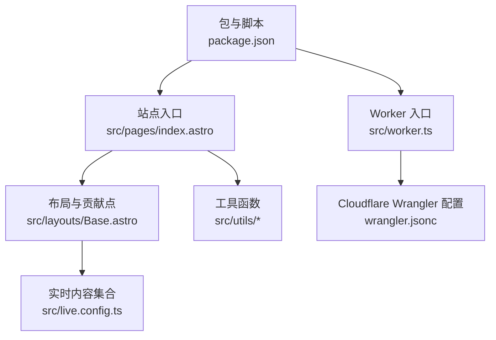
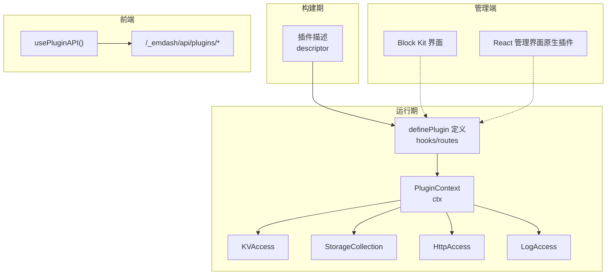
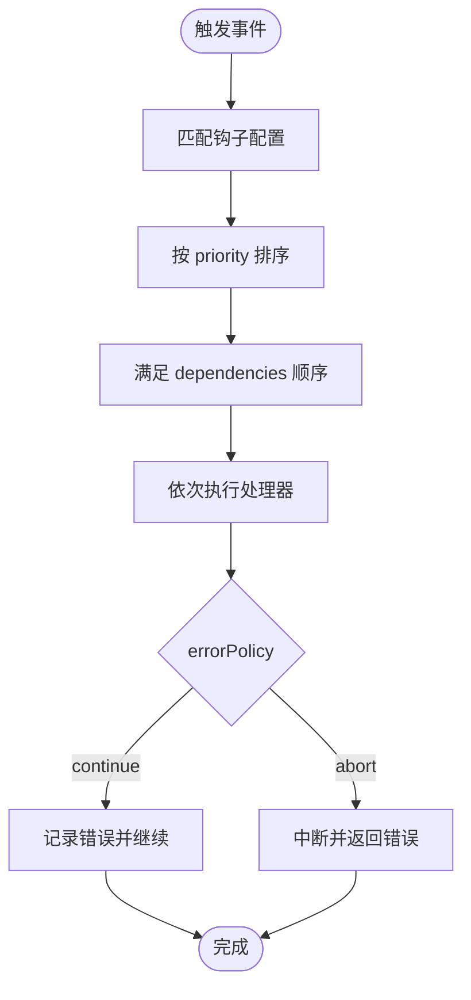
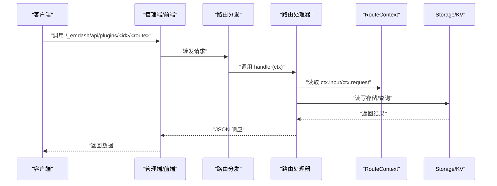
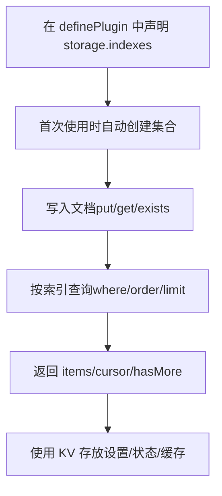
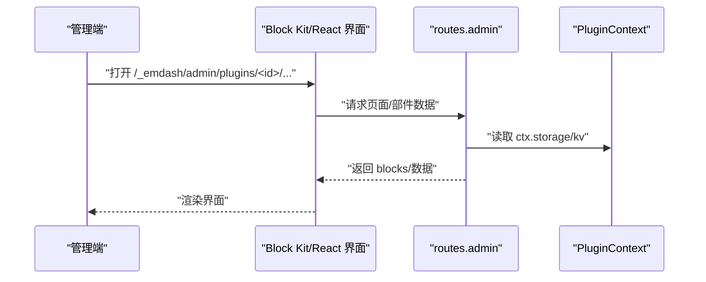
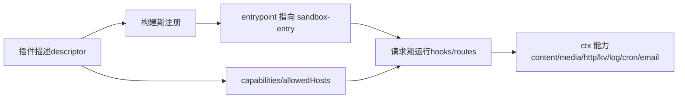

# 标准插件开发

<cite>
**本文档引用的文件**
- [README.md](file://README.md)
- [package.json](file://package.json)
- [src/live.config.ts](file://src/live.config.ts)
- [src/worker.ts](file://src/worker.ts)
- [.agents/skills/creating-plugins/SKILL.md](file://.agents/skills/creating-plugins/SKILL.md)
- [.agents/skills/creating-plugins/references/admin-ui.md](file://.agents/skills/creating-plugins/references/admin-ui.md)
- [.agents/skills/creating-plugins/references/api-routes.md](file://.agents/skills/creating-plugins/references/api-routes.md)
- [.agents/skills/creating-plugins/references/hooks.md](file://.agents/skills/creating-plugins/references/hooks.md)
- [.agents/skills/creating-plugins/references/storage.md](file://.agents/skills/creating-plugins/references/storage.md)
- [src/pages/index.astro](file://src/pages/index.astro)
- [src/layouts/Base.astro](file://src/layouts/Base.astro)
- [src/utils/constants.ts](file://src/utils/constants.ts)
- [src/utils/date.ts](file://src/utils/date.ts)
- [src/utils/reading-time.ts](file://src/utils/reading-time.ts)
- [src/utils/site-identity.ts](file://src/utils/site-identity.ts)
- [src/utils/media.ts](file://src/utils/media.ts)
- [wrangler.jsonc](file://wrangler.jsonc)
</cite>

## 目录
1. [简介](#简介)
2. [项目结构](#项目结构)
3. [核心组件](#核心组件)
4. [架构总览](#架构总览)
5. [详细组件分析](#详细组件分析)
6. [依赖关系分析](#依赖关系分析)
7. [性能考虑](#性能考虑)
8. [故障排查指南](#故障排查指南)
9. [结论](#结论)
10. [附录](#附录)

## 简介
本指南面向希望基于 EmDash 开发“标准插件”的工程师与技术作者。标准插件通过统一的插件描述（descriptor）与运行时定义（sandbox-entry），在受信任与沙箱两种模式下均可工作，支持 hooks、API 路由、存储与管理员界面（Block Kit）等能力。本文将系统讲解标准插件的开发规范、接口要求、最佳实践，并提供可直接复用的模板与流程图。

## 项目结构
该仓库是一个基于 EmDash 的博客模板，采用 Astro + Cloudflare Workers 架构，展示了插件生态在真实站点中的集成方式。关键结构如下：
- 插件开发参考：位于 `.agents/skills/creating-plugins/`，包含标准插件的技能说明与各功能参考文档（hooks、storage、admin-ui、api-routes 等）
- 运行时配置：`src/live.config.ts` 定义了内容集合的实时加载器；`src/worker.ts` 指定 Cloudflare 入口点
- 包管理与脚本：`package.json` 声明了插件依赖（如 forms、webhook-notifier）与构建脚本
- 页面与布局：`src/pages/index.astro` 展示了内容查询与渲染；`src/layouts/Base.astro` 提供公共布局与页面贡献点（如 `<EmDashHead>`、`<EmDashBodyStart>`）
- 工具函数：`src/utils/` 下包含日期、阅读时长、站点标识、媒体解析等工具
- 部署配置：`wrangler.jsonc` 定义了 D1/R2 绑定与兼容性

图表来源
- [src/pages/index.astro:1-463](file://src/pages/index.astro#L1-L463)
- [src/layouts/Base.astro:1-968](file://src/layouts/Base.astro#L1-L968)
- [src/live.config.ts:1-14](file://src/live.config.ts#L1-L14)
- [src/worker.ts:1-6](file://src/worker.ts#L1-L6)
- [wrangler.jsonc:1-20](file://wrangler.jsonc#L1-L20)
- [package.json:1-33](file://package.json#L1-L33)

章节来源
- [README.md:1-68](file://README.md#L1-L68)
- [package.json:1-33](file://package.json#L1-L33)
- [src/live.config.ts:1-14](file://src/live.config.ts#L1-L14)
- [src/worker.ts:1-6](file://src/worker.ts#L1-L6)
- [wrangler.jsonc:1-20](file://wrangler.jsonc#L1-L20)

## 核心组件
标准插件由两部分组成，分别在不同上下文运行：
- 插件描述（Descriptor，构建时）：返回插件元信息、导出路径、能力声明等，用于在构建期注册插件
- 插件定义（definePlugin，请求时）：包含 hooks、routes 等运行逻辑，注入到运行时上下文（ctx）

标准插件的关键特性：
- 可在受信任（trusted）与沙箱（sandboxed）两种模式下运行，代码一致，差异在于权限与资源限制
- 支持能力声明（capabilities），如 content:read/write、media:read/write、network:request、users:read、email:send 等
- 提供 KV 存储、Storage 文档集合、日志、HTTP 访问等上下文能力
- 支持 Block Kit 管理界面（沙箱模式下为 JSON 声明式 UI）

章节来源
- [.agents/skills/creating-plugins/SKILL.md:23-88](file://.agents/skills/creating-plugins/SKILL.md#L23-L88)
- [.agents/skills/creating-plugins/SKILL.md:115-177](file://.agents/skills/creating-plugins/SKILL.md#L115-L177)
- [.agents/skills/creating-plugins/SKILL.md:410-427](file://.agents/skills/creating-plugins/SKILL.md#L410-L427)

## 架构总览
标准插件在站点中的运行架构如下：
- 描述（descriptor）在构建期导入，决定插件入口与能力
- 运行时（sandbox-entry）在请求期执行，访问 ctx 中的能力
- 管理端通过 Block Kit 或 React（原生插件）扩展后台界面
- API 路由暴露在 `/_emdash/api/plugins/<plugin-id>/<route>`，供前端或外部调用

图表来源
- [.agents/skills/creating-plugins/SKILL.md:115-177](file://.agents/skills/creating-plugins/SKILL.md#L115-L177)
- [.agents/skills/creating-plugins/references/admin-ui.md:1-192](file://.agents/skills/creating-plugins/references/admin-ui.md#L1-L192)
- [.agents/skills/creating-plugins/references/api-routes.md:1-266](file://.agents/skills/creating-plugins/references/api-routes.md#L1-L266)

## 详细组件分析

### 钩子系统（Hooks）
钩子是插件响应事件的核心机制，支持生命周期、内容、媒体、邮件、定时任务以及页面贡献等类型。标准插件中，钩子在 `definePlugin({ hooks })` 中声明，处理器签名统一为 `(event, ctx)`。

- 生命周期钩子：plugin:install、plugin:activate、plugin:deactivate、plugin:uninstall
- 内容钩子：content:beforeSave、content:afterSave、content:beforeDelete、content:afterDelete、content:afterPublish、content:afterUnpublish
- 媒体钩子：media:beforeUpload、media:afterUpload
- 邮件钩子：email:beforeSend、email:deliver（独占）、email:afterSend
- 定时钩子：cron（需在激活时通过 ctx.cron.schedule 配置）
- 页面钩子：page:metadata（可信模式）、page:fragments（仅可信模式）

钩子配置项：
- priority：数值越小优先级越高，默认 100
- timeout：执行超时时间（毫秒），默认 5000
- dependencies：依赖其他插件 ID，强制顺序
- errorPolicy：abort（默认，失败中断）或 continue（记录错误但继续）

图表来源
- [.agents/skills/creating-plugins/references/hooks.md:1-441](file://.agents/skills/creating-plugins/references/hooks.md#L1-L441)

章节来源
- [.agents/skills/creating-plugins/references/hooks.md:1-441](file://.agents/skills/creating-plugins/references/hooks.md#L1-L441)

### API 路由（Routes）
标准插件支持在 hooks 之外定义 REST 路由，统一暴露在 `/_emdash/api/plugins/<plugin-id>/<route>`。路由定义在 `definePlugin({ routes })` 中，处理器接收 RouteContext（继承 PluginContext），包含 input、request、storage、kv、log 等。

- 输入校验：使用 Zod schema，GET/DELETE 从查询参数读取，POST/PUT/PATCH 从请求体读取
- 返回值：任意可 JSON 序列化对象，Content-Type 自动设置为 application/json
- 错误处理：抛出异常返回 500；自定义状态码可通过抛出 Response 实例
- 方法支持：所有 HTTP 方法均可用，可在处理器内根据 request.method 分发
- 外部代理：需要网络访问时声明 network:request 能力与 allowedHosts

图表来源
- [.agents/skills/creating-plugins/references/api-routes.md:1-266](file://.agents/skills/creating-plugins/references/api-routes.md#L1-L266)

章节来源
- [.agents/skills/creating-plugins/references/api-routes.md:1-266](file://.agents/skills/creating-plugins/references/api-routes.md#L1-L266)

### 存储与 KV（Storage & KV）
标准插件拥有三种数据机制：
- Storage：带索引的文档集合，适合结构化数据（如提交记录、日志）
- KV：键值对存储，适合设置、状态、缓存
- 设置 Schema：通过 admin.settingsSchema 自动生成配置表单

存储要点：
- 在 definePlugin 中声明 storage.indexes，自动建模，无需迁移
- 查询仅支持已建立索引字段，不支持全表扫描
- 支持 get/put/delete/exist、批量操作、分页查询、计数等
- 类型安全：可将 collection 强制为具体接口以获得编译期检查

KV 要点：
- 建议使用前缀命名：settings:（用户配置）、state:（内部状态）、cache:（缓存）
- 列表读取支持前缀过滤
- 默认始终可用，无需声明能力

设置 Schema：
- 在 admin.settingsSchema 中声明字段类型、标签、默认值、范围等
- UI 为自动生成的表单；默认值仅为 UI 默认，实际持久化需在安装时写入 KV

图表来源
- [.agents/skills/creating-plugins/references/storage.md:1-265](file://.agents/skills/creating-plugins/references/storage.md#L1-L265)

章节来源
- [.agents/skills/creating-plugins/references/storage.md:1-265](file://.agents/skills/creating-plugins/references/storage.md#L1-L265)

### 管理员界面集成（Admin UI）
标准插件通过 Block Kit 为沙箱插件提供声明式管理界面；原生插件可使用 React 组件。插件在描述或定义中声明 admin 元数据，页面挂载在 `/_emdash/admin/plugins/<plugin-id>/<path>`。

- Block Kit 页面与部件：通过 routes.admin 处理器返回 blocks 结构，支持表格、头部、按钮等
- React 管理界面（原生插件）：通过 src/admin.tsx 导出 pages 与 widgets，使用 @emdash-cms/admin 组件库
- usePluginAPI：在 React 组件中调用插件路由，自动拼接插件 ID 前缀

图表来源
- [.agents/skills/creating-plugins/references/admin-ui.md:1-192](file://.agents/skills/creating-plugins/references/admin-ui.md#L1-L192)

章节来源
- [.agents/skills/creating-plugins/references/admin-ui.md:1-192](file://.agents/skills/creating-plugins/references/admin-ui.md#L1-L192)

## 依赖关系分析
标准插件的依赖关系围绕“描述”和“定义”两条主线展开，并通过能力声明约束运行时权限。

图表来源
- [.agents/skills/creating-plugins/SKILL.md:179-221](file://.agents/skills/creating-plugins/SKILL.md#L179-L221)
- [.agents/skills/creating-plugins/SKILL.md:234-261](file://.agents/skills/creating-plugins/SKILL.md#L234-L261)

章节来源
- [.agents/skills/creating-plugins/SKILL.md:179-221](file://.agents/skills/creating-plugins/SKILL.md#L179-L221)
- [.agents/skills/creating-plugins/SKILL.md:234-261](file://.agents/skills/creating-plugins/SKILL.md#L234-L261)

## 性能考虑
- 选择合适的索引：在 storage.indexes 中为常用查询字段建立索引，避免全表扫描
- 合理分页：使用 cursor 与 limit 控制每次查询规模，避免一次性拉取大量数据
- 使用 KV 缓存热点数据：对频繁读取的配置或计算结果使用 cache: 前缀键
- 控制钩子执行时间：为高耗时任务设置合理 timeout，必要时拆分为 cron 定时任务
- 网络访问限制：沙箱模式下仅允许 allowedHosts 白名单域名，减少跨域风险与延迟
- 避免 Node.js API：沙箱模式禁用 Node 内置模块，使用 Web API 替代

## 故障排查指南
- 输入校验失败：确认 Zod schema 是否覆盖所有场景，检查 GET/POST 参数映射是否正确
- 权限不足：核对 capabilities 与 allowedHosts 是否齐全；沙箱模式下未声明的能力会被拒绝
- 查询无结果：检查 where 条件是否命中索引；复合索引需遵循“前缀过滤 + 第二字段排序”的规则
- 钩子未触发：确认钩子名称拼写、优先级与依赖顺序；errorPolicy 为 abort 时会中断后续钩子
- 管理界面空白：检查 routes.admin 返回的 blocks 结构是否符合 Block Kit 规范；原生插件需确保 React 组件正确导出

章节来源
- [.agents/skills/creating-plugins/references/api-routes.md:128-141](file://.agents/skills/creating-plugins/references/api-routes.md#L128-L141)
- [.agents/skills/creating-plugins/references/storage.md:62-118](file://.agents/skills/creating-plugins/references/storage.md#L62-L118)
- [.agents/skills/creating-plugins/references/hooks.md:406-418](file://.agents/skills/creating-plugins/references/hooks.md#L406-L418)

## 结论
标准插件通过清晰的“描述 + 定义”双层结构，在受信任与沙箱两种模式下保持一致的开发体验。借助 hooks、routes、storage、kv 与 Block Kit 管理界面，开发者可以快速构建可发布、可维护的插件。遵循本文档的规范与最佳实践，可显著提升插件的稳定性、安全性与可扩展性。

## 附录

### 开发模板与输出清单
标准格式插件至少包含以下文件：
- src/index.ts：插件描述（descriptor），声明 id/version/format/entrypoint/capabilities/storage/admin 元数据
- src/sandbox-entry.ts：definePlugin({ hooks, routes }) 默认导出
- package.json：配置 exports（"." 与 "./sandbox"），声明 peerDependencies
- tsconfig.json：标准 TS 配置

章节来源
- [.agents/skills/creating-plugins/SKILL.md:447-460](file://.agents/skills/creating-plugins/SKILL.md#L447-L460)

### 页面贡献与 SEO
站点通过 `<EmDashHead>`、`<EmDashBodyStart>`、`<EmDashBodyEnd>` 将插件贡献注入页面渲染，实现 SEO 元数据与脚本片段的安全注入。

章节来源
- [src/layouts/Base.astro:1-968](file://src/layouts/Base.astro#L1-L968)