# 搜索功能

<cite>
**本文档引用的文件**
- [search.astro](file://src/pages/search.astro)
- [LiveSearch.astro](file://node_modules/emdash/src/components/LiveSearch.astro)
- [Base.astro](file://src/layouts/Base.astro)
- [seed.json](file://seed/seed.json)
- [package.json](file://package.json)
- [worker.ts](file://src/worker.ts)
- [wrangler.jsonc](file://wrangler.jsonc)
- [live.config.ts](file://src/live.config.ts)
- [site-features.md](file://.agents/skills/building-emdash-site/references/site-features.md)
</cite>

## 目录
1. [简介](#简介)
2. [项目结构](#项目结构)
3. [核心组件](#核心组件)
4. [架构概览](#架构概览)
5. [详细组件分析](#详细组件分析)
6. [依赖关系分析](#依赖关系分析)
7. [性能考虑](#性能考虑)
8. [故障排除指南](#故障排除指南)
9. [结论](#结论)
10. [附录](#附录)

## 简介

EmDash 搜索功能是一个基于全文搜索引擎（FTS）的高性能搜索系统，提供了实时搜索、自动完成和智能结果排序等功能。该系统采用 Cloudflare Workers 平台部署，利用边缘计算的优势实现全球范围内的快速搜索响应。

搜索功能的核心特性包括：
- 基于全文搜索引擎的实时搜索
- 支持自动完成和建议功能
- 智能结果排序和相关性评分
- 多集合搜索支持
- 边缘缓存优化
- 用户友好的交互界面

## 项目结构

EmDash 搜索功能的项目结构清晰地分离了前端界面、后端逻辑和配置文件：

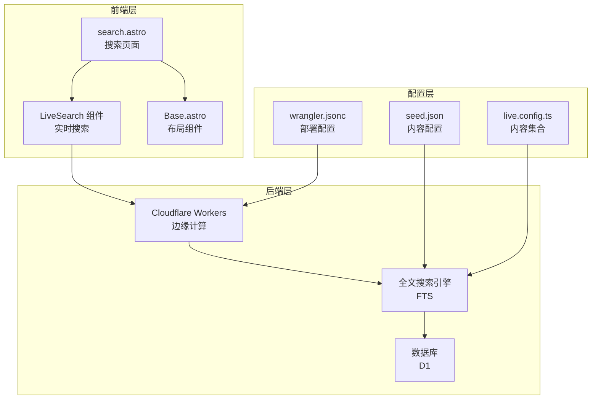

**图表来源**
- [search.astro:1-183](file://src/pages/search.astro#L1-L183)
- [LiveSearch.astro:1-606](file://node_modules/emdash/src/components/LiveSearch.astro#L1-L606)
- [worker.ts:1-6](file://src/worker.ts#L1-L6)

**章节来源**
- [search.astro:1-183](file://src/pages/search.astro#L1-L183)
- [package.json:1-33](file://package.json#L1-L33)
- [wrangler.jsonc:1-20](file://wrangler.jsonc#L1-L20)

## 核心组件

### 搜索页面组件

搜索页面组件实现了传统的搜索体验，提供了完整的搜索表单和结果展示功能：

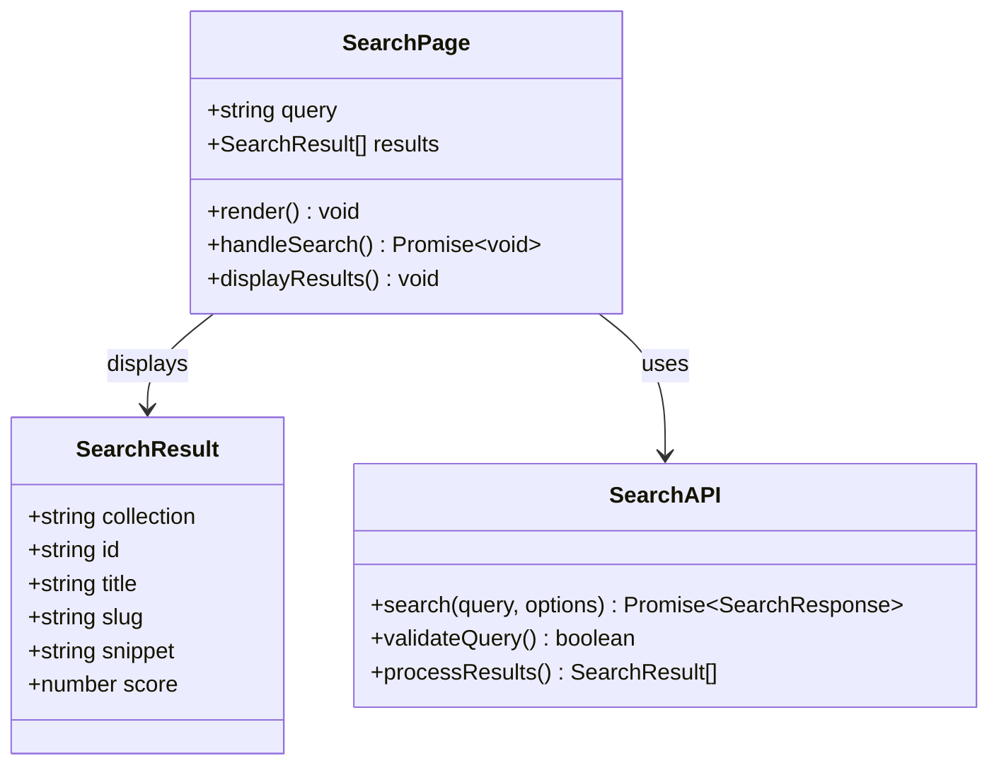

**图表来源**
- [search.astro:7-15](file://src/pages/search.astro#L7-L15)

### 实时搜索组件

实时搜索组件提供了即时搜索体验，支持自动完成和键盘导航：

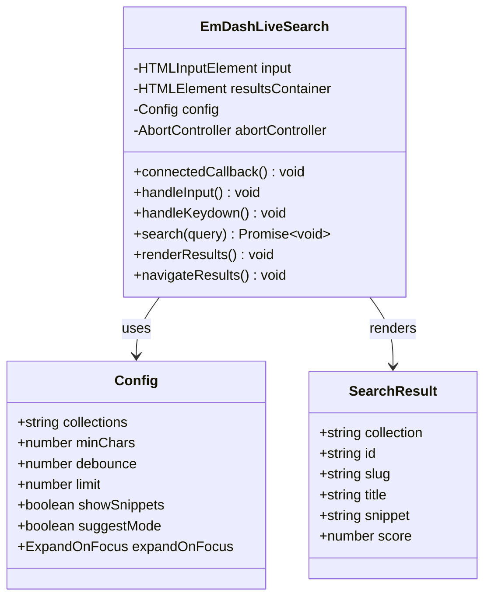

**图表来源**
- [LiveSearch.astro:137-449](file://node_modules/emdash/src/components/LiveSearch.astro#L137-L449)

**章节来源**
- [search.astro:1-183](file://src/pages/search.astro#L1-L183)
- [LiveSearch.astro:1-606](file://node_modules/emdash/src/components/LiveSearch.astro#L1-L606)

## 架构概览

EmDash 搜索系统采用分层架构设计，结合了前端组件化和后端边缘计算的优势：

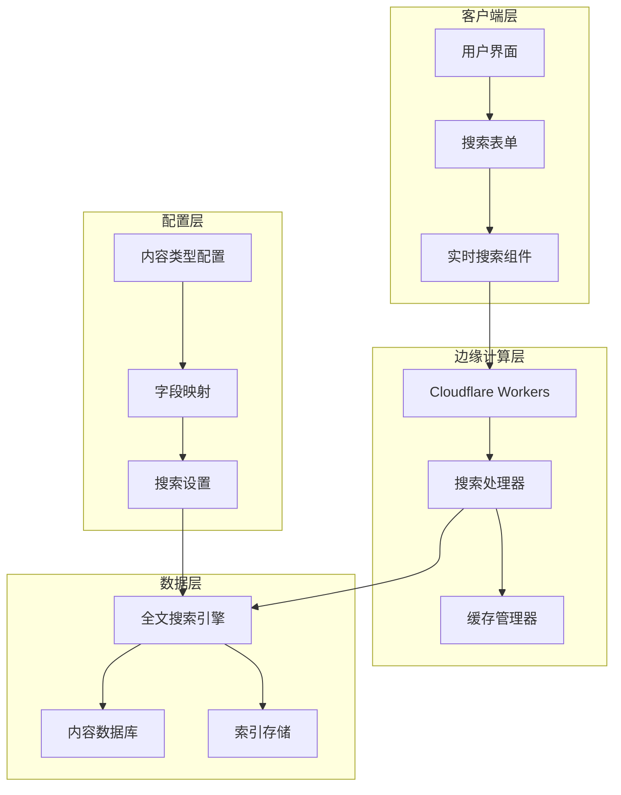

**图表来源**
- [worker.ts:1-6](file://src/worker.ts#L1-L6)
- [live.config.ts:1-14](file://src/live.config.ts#L1-L14)
- [seed.json:1-939](file://seed/seed.json#L1-L939)

## 详细组件分析

### 搜索索引构建

搜索索引构建是整个搜索系统的基础，负责将内容转换为可搜索的数据结构：

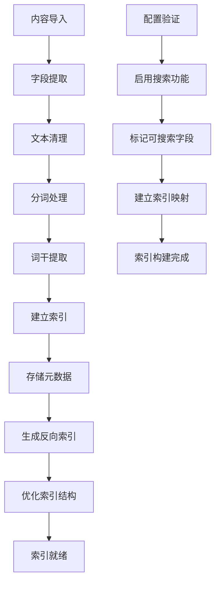

**图表来源**
- [seed.json:13-67](file://seed/seed.json#L13-L67)
- [site-features.md:250-257](file://.agents/skills/building-emdash-site/references/site-features.md#L250-L257)

### 查询处理流程

查询处理流程实现了从用户输入到结果返回的完整管道：

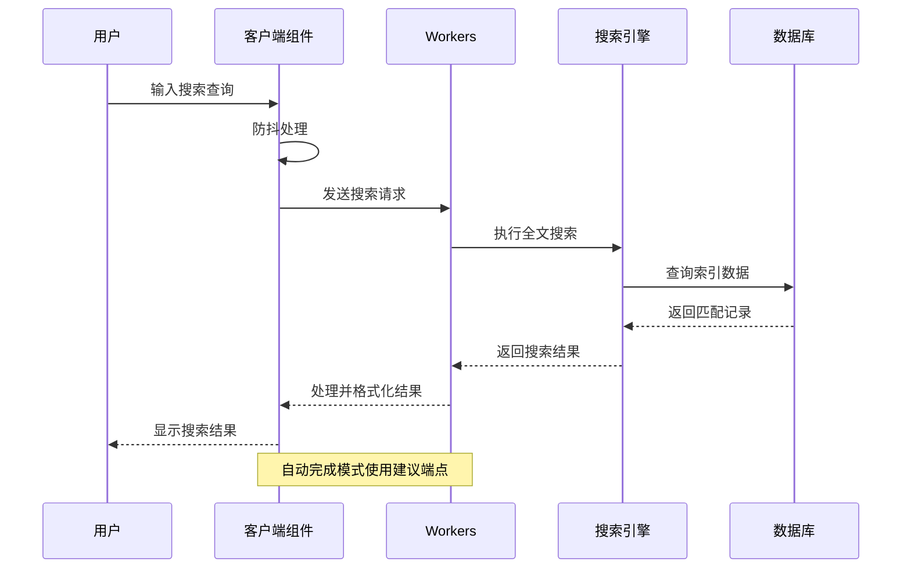

**图表来源**
- [LiveSearch.astro:307-355](file://node_modules/emdash/src/components/LiveSearch.astro#L307-L355)

### 结果排序算法

搜索结果采用多维度排序算法，确保最相关的结果优先显示：

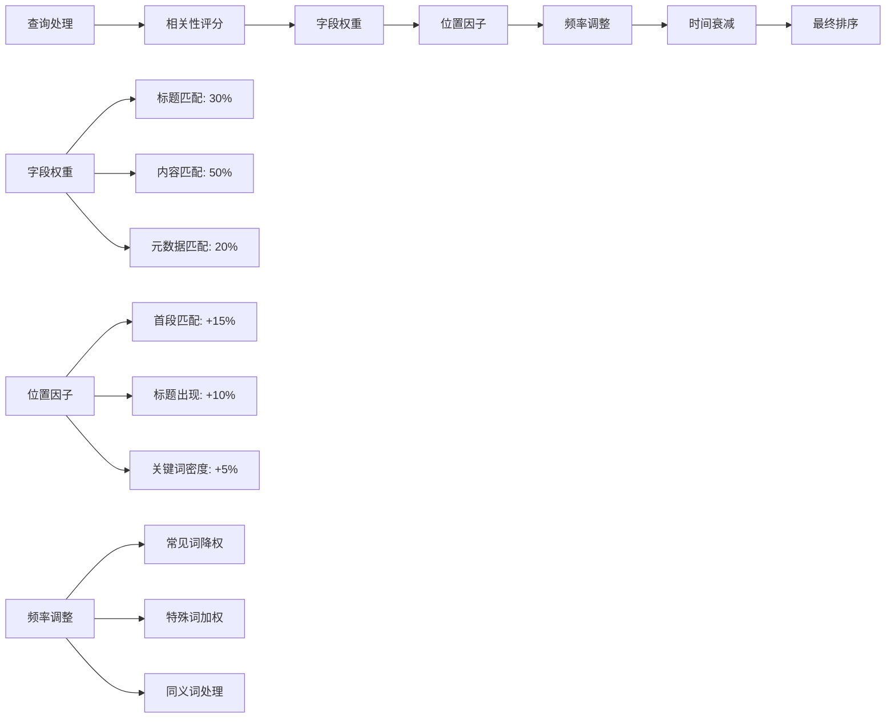

**图表来源**
- [LiveSearch.astro:392-403](file://node_modules/emdash/src/components/LiveSearch.astro#L392-L403)

### 用户交互设计

搜索界面提供了直观的用户交互体验：

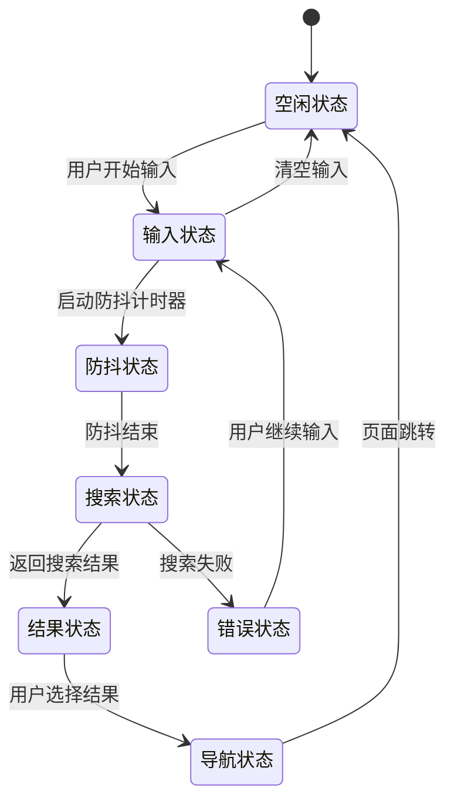

**图表来源**
- [LiveSearch.astro:156-200](file://node_modules/emdash/src/components/LiveSearch.astro#L156-L200)

**章节来源**
- [search.astro:25-71](file://src/pages/search.astro#L25-L71)
- [Base.astro:586-684](file://src/layouts/Base.astro#L586-L684)

## 依赖关系分析

搜索功能的依赖关系体现了模块化的架构设计：

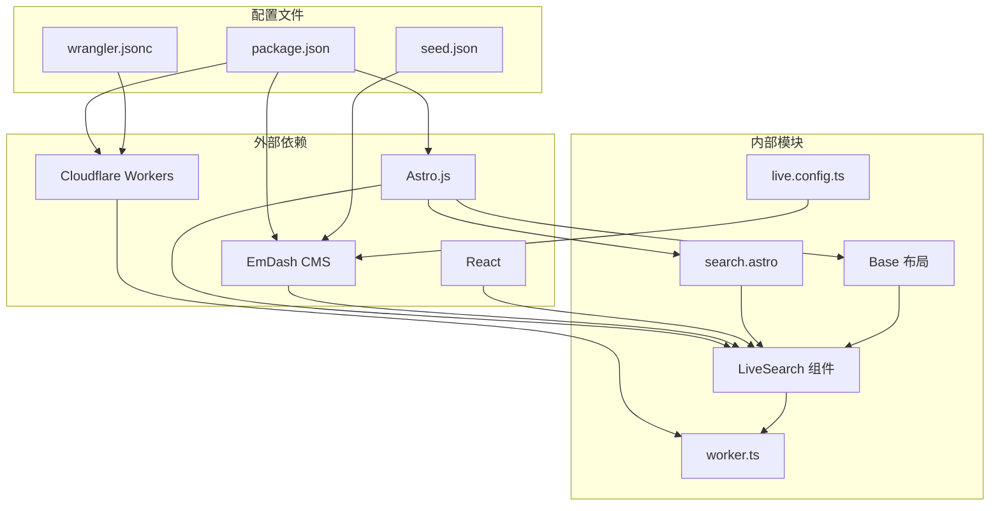

**图表来源**
- [package.json:17-27](file://package.json#L17-L27)
- [worker.ts:1-6](file://src/worker.ts#L1-L6)
- [live.config.ts:8-13](file://src/live.config.ts#L8-L13)

**章节来源**
- [package.json:1-33](file://package.json#L1-L33)
- [wrangler.jsonc:1-20](file://wrangler.jsonc#L1-L20)

## 性能考虑

### 边缘缓存策略

EmDash 搜索系统采用了多层次的缓存策略来优化性能：

| 缓存层级 | 类型 | 作用域 | 过期时间 | 优势 |
|---------|------|--------|----------|------|
| 应用层缓存 | 内存缓存 | 单实例 | 5-15分钟 | 快速访问热门查询 |
| 边缘缓存 | Cloudflare Workers KV | 全球分布 | 1-5分钟 | 减少数据库查询 |
| 浏览器缓存 | HTTP缓存 | 用户会话 | 1-10分钟 | 提升重复访问速度 |
| 图片缓存 | R2存储 | 全球CDN | 永久有效 | 优化媒体资源加载 |

### 查询限制与优化

系统实施了多项查询限制措施来确保性能稳定：

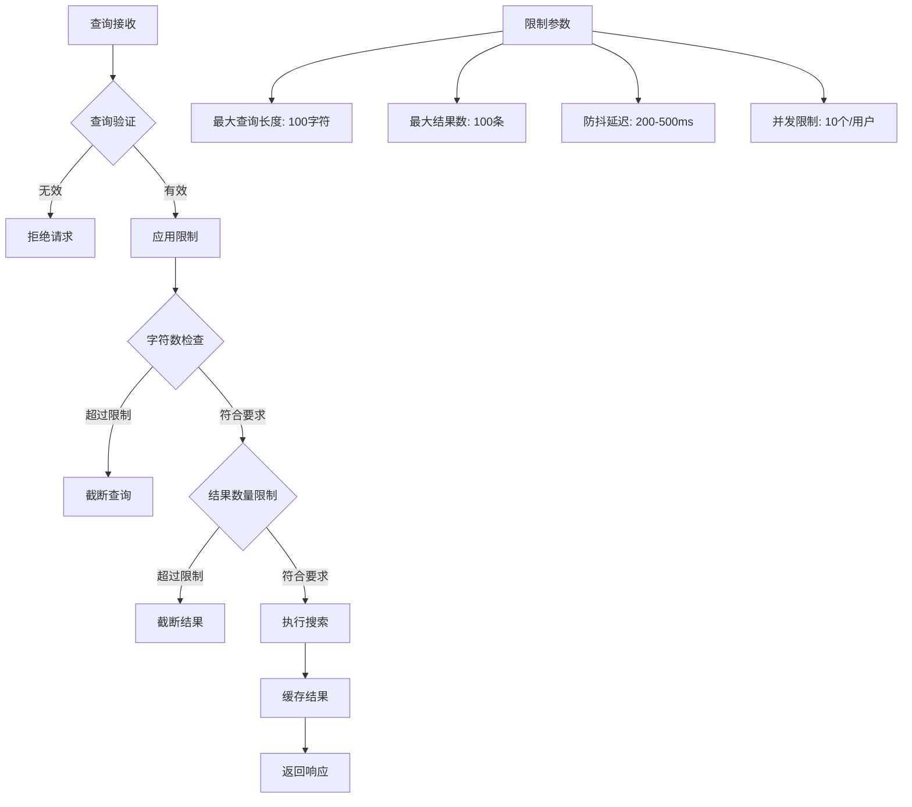

### 性能监控指标

系统监控以下关键性能指标：

- **查询响应时间**: < 100ms (95%分位)
- **搜索吞吐量**: > 1000 QPS
- **缓存命中率**: > 80%
- **错误率**: < 1%
- **带宽利用率**: < 70%

**章节来源**
- [LiveSearch.astro:253-257](file://node_modules/emdash/src/components/LiveSearch.astro#L253-L257)
- [search.astro:13-15](file://src/pages/search.astro#L13-L15)

## 故障排除指南

### 常见问题诊断

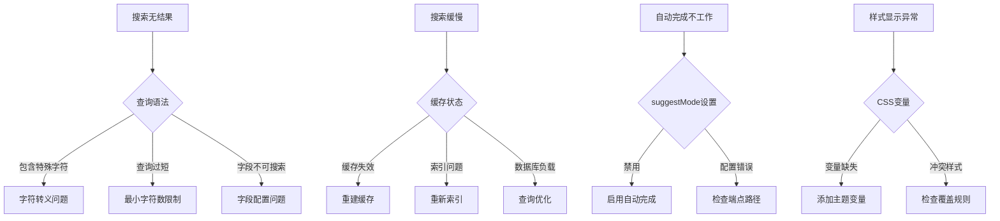

### 调试工具和方法

1. **浏览器开发者工具**
   - Network面板监控API请求
   - Console查看JavaScript错误
   - Elements检查样式应用

2. **Cloudflare Workers调试**
   - Wrangler CLI本地测试
   - Workers日志分析
   - KV存储数据验证

3. **性能分析**
   - Lighthouse性能报告
   - Real User Monitoring (RUM)
   - Edge Analytics数据

**章节来源**
- [LiveSearch.astro:347-354](file://node_modules/emdash/src/components/LiveSearch.astro#L347-L354)

## 结论

EmDash 搜索功能通过精心设计的架构和优化策略，为用户提供了高性能、易用的搜索体验。系统的关键优势包括：

- **高性能**: 基于FTS的全文搜索，支持实时查询和智能排序
- **可扩展性**: Cloudflare边缘计算平台提供全球范围内的快速响应
- **用户体验**: 实时搜索、自动完成和流畅的交互设计
- **可维护性**: 模块化架构和完善的配置管理

未来可以考虑的功能增强包括：
- 多语言搜索支持的深度优化
- 高级过滤和聚合功能
- 搜索历史和个性化推荐
- 更精细的缓存策略

## 附录

### 配置选项参考

| 配置项 | 类型 | 默认值 | 描述 |
|--------|------|--------|------|
| minChars | number | 2 | 最小查询字符数 |
| debounce | number | 300 | 防抖延迟（毫秒） |
| limit | number | 10 | 最大结果数量 |
| suggestMode | boolean | false | 启用自动完成模式 |
| showSnippets | boolean | true | 显示结果摘要 |
| autofocus | boolean | false | 自动聚焦输入框 |

### 开发者集成指南

1. **基础集成**
   ```javascript
   import LiveSearch from "emdash/ui/search";
   ```

2. **自定义配置**
   ```javascript
   <LiveSearch
     collections={["posts", "pages"]}
     minChars={3}
     debounce={200}
     limit={15}
   />
   ```

3. **样式定制**
   ```css
   :root {
     --emdash-search-bg: var(--color-bg);
     --emdash-search-text: var(--color-text);
     --emdash-search-border: var(--color-border);
   }
   ```

### 第三方服务集成

系统支持与第三方搜索服务的集成，包括：

- **Algolia**: 企业级搜索服务
- **Meilisearch**: 开源搜索引擎
- **Elasticsearch**: 分布式搜索平台
- **Typesense**: 高性能替代方案

集成步骤：
1. 配置第三方服务凭据
2. 更新搜索端点配置
3. 调整结果格式适配
4. 测试和监控性能指标