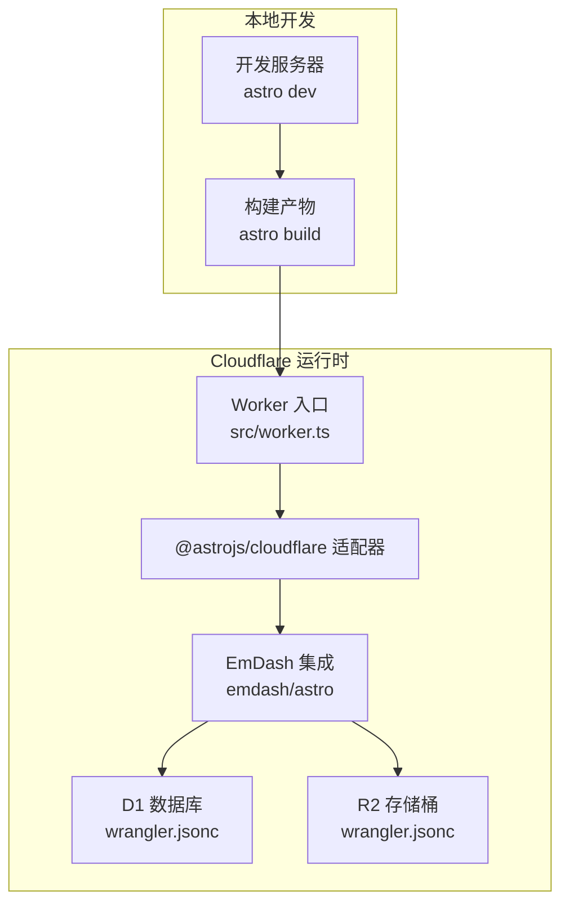
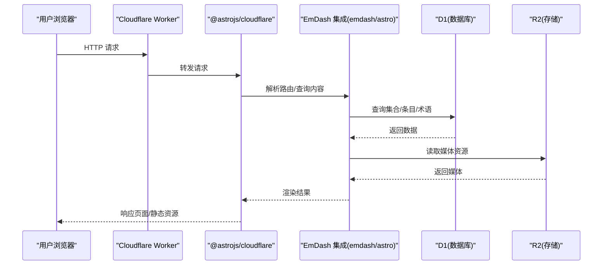
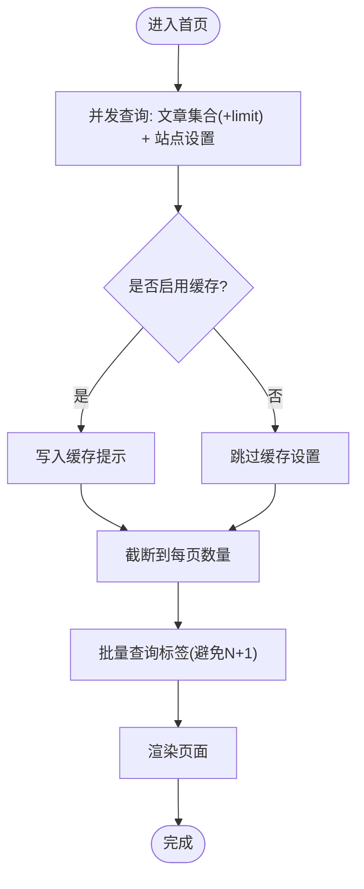
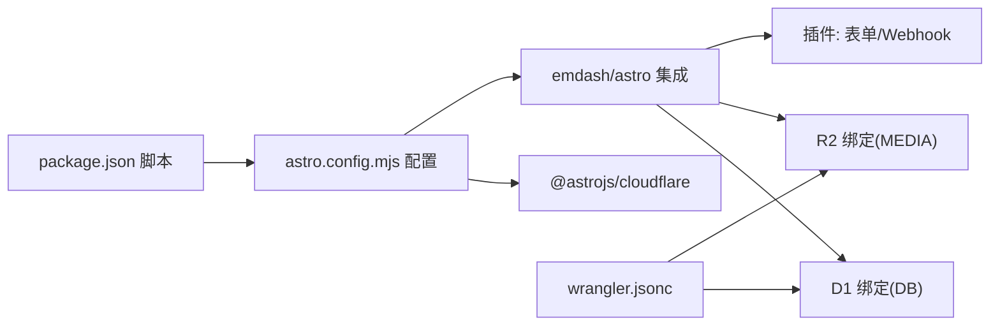

# 故障排除

<cite>
**本文引用的文件**
- [README.md](file://README.md)
- [package.json](file://package.json)
- [astro.config.mjs](file://astro.config.mjs)
- [wrangler.jsonc](file://wrangler.jsonc)
- [src/worker.ts](file://src/worker.ts)
- [src/live.config.ts](file://src/live.config.ts)
- [src/pages/index.astro](file://src/pages/index.astro)
- [src/layouts/Base.astro](file://src/layouts/Base.astro)
- [src/components/layout/ThemeScript.astro](file://src/components/layout/ThemeScript.astro)
- [seed/seed.json](file://seed/seed.json)
- [.agents/skills/building-emdash-site/references/configuration.md](file://.agents/skills/building-emdash-site/references/configuration.md)
- [.agents/skills/creating-plugins/references/hooks.md](file://.agents/skills/creating-plugins/references/hooks.md)
- [.agents/skills/creating-plugins/references/api-routes.md](file://.agents/skills/creating-plugins/references/api-routes.md)
- [.agents/skills/creating-plugins/references/storage.md](file://.agents/skills/creating-plugins/references/storage.md)
- [.mcp.json](file://.mcp.json)
</cite>

## 目录
1. [简介](#简介)
2. [项目结构](#项目结构)
3. [核心组件](#核心组件)
4. [架构总览](#架构总览)
5. [详细组件分析](#详细组件分析)
6. [依赖关系分析](#依赖关系分析)
7. [性能考虑](#性能考虑)
8. [故障排除指南](#故障排除指南)
9. [结论](#结论)
10. [附录](#附录)

## 简介
本指南面向 EmDash 项目的开发者与运维人员，聚焦于开发、本地运行、构建与部署阶段的常见问题与系统化排查方法。内容覆盖数据库连接、存储权限、路由配置、性能瓶颈（加载慢、内存泄漏、API 超时）、日志与错误追踪、调试工具与最佳实践，并提供社区支持与问题反馈渠道。

## 项目结构
EmDash 在 Cloudflare Workers 上运行，采用 Astro 作为前端框架并通过 @astrojs/cloudflare 适配器部署；数据层使用 D1（SQLite 兼容），媒体存储使用 R2；通过 emdash/astro 集成内容管理能力，支持插件生态与沙箱执行。

图表来源
- [astro.config.mjs:1-45](file://astro.config.mjs#L1-L45)
- [wrangler.jsonc:1-20](file://wrangler.jsonc#L1-L20)
- [src/worker.ts:1-6](file://src/worker.ts#L1-L6)

章节来源
- [README.md:40-68](file://README.md#L40-L68)
- [astro.config.mjs:1-45](file://astro.config.mjs#L1-L45)
- [wrangler.jsonc:1-20](file://wrangler.jsonc#L1-L20)

## 核心组件
- 运行时与适配器：Cloudflare Workers + @astrojs/cloudflare
- 内容与数据：emdash/astro 集成，D1 绑定 DB，R2 绑定 MEDIA
- 插件与安全：表单插件、Webhook 通知器、沙箱执行与隔离
- 构建与部署：astro build && wrangler deploy

章节来源
- [package.json:10-16](file://package.json#L10-L16)
- [astro.config.mjs:16-26](file://astro.config.mjs#L16-L26)
- [wrangler.jsonc:7-18](file://wrangler.jsonc#L7-L18)

## 架构总览
下图展示从请求到内容渲染的关键路径，以及数据库与存储的交互。

图表来源
- [src/worker.ts:1-6](file://src/worker.ts#L1-L6)
- [astro.config.mjs:16-26](file://astro.config.mjs#L16-L26)
- [wrangler.jsonc:7-18](file://wrangler.jsonc#L7-L18)

## 详细组件分析

### 页面渲染与缓存策略
- 首页通过批量查询获取文章、标签与站点设置，并利用 Astro 缓存提示进行缓存设置。
- 使用分页常量限制每页文章数量，避免一次性加载过多数据。

图表来源
- [src/pages/index.astro:19-68](file://src/pages/index.astro#L19-L68)

章节来源
- [src/pages/index.astro:19-68](file://src/pages/index.astro#L19-L68)

### 主布局与 SEO/社交元数据
- 基础布局负责注入 SEO 头部、站点标识、菜单与页脚部件区。
- 提供公共页面上下文，用于插件在内容页贡献 SEO 数据。

章节来源
- [src/layouts/Base.astro:16-78](file://src/layouts/Base.astro#L16-L78)

### 主题切换与防闪烁
- 首屏内联脚本根据 Cookie 或系统偏好应用主题，避免 FOUC。
- 提供主题按钮切换逻辑与系统偏好监听。

章节来源
- [src/components/layout/ThemeScript.astro:5-83](file://src/components/layout/ThemeScript.astro#L5-L83)

### Worker 入口与沙箱桥接
- Worker 导出 Cloudflare 服务端入口与插件桥接，确保插件在沙箱中安全执行。

章节来源
- [src/worker.ts:1-6](file://src/worker.ts#L1-L6)

### 内容实时集合
- 定义 _emdash 实时集合，通过 emdashLoader 加载数据库内容，供页面与组件使用。

章节来源
- [src/live.config.ts:11-13](file://src/live.config.ts#L11-L13)

## 依赖关系分析
- 构建脚本：dev/build/preview/deploy 由 astro 与 wrangler 协作完成。
- 运行时：@astrojs/cloudflare 将 Astro 应用适配至 Cloudflare Runtime。
- 数据与存储：通过 wrangler.jsonc 的绑定映射到 D1 与 R2。
- 插件：表单与 Webhook 插件注册于 emdash 集成中，部分插件在沙箱中运行。

图表来源
- [package.json:10-16](file://package.json#L10-L16)
- [astro.config.mjs:16-26](file://astro.config.mjs#L16-L26)
- [wrangler.jsonc:7-18](file://wrangler.jsonc#L7-L18)

章节来源
- [package.json:10-16](file://package.json#L10-L16)
- [astro.config.mjs:16-26](file://astro.config.mjs#L16-L26)
- [wrangler.jsonc:7-18](file://wrangler.jsonc#L7-L18)

## 性能考虑
- 首屏渲染与缓存
  - 利用 Astro 缓存提示减少重复计算与网络往返。
  - 首页按需限制查询数量，避免前端大列表渲染。
- 图片与媒体
  - 使用响应式图片与合适的尺寸参数，结合 R2 存储优化加载。
- 插件与沙箱
  - 沙箱执行可隔离潜在性能风险，但需关注插件超时与资源占用。
- 构建与预览
  - 使用 astro build 生成静态/边缘产物，配合 wrangler 部署提升边缘分发效率。

章节来源
- [src/pages/index.astro:28-32](file://src/pages/index.astro#L28-L32)
- [astro.config.mjs:12-15](file://astro.config.mjs#L12-L15)

## 故障排除指南

### 一、本地开发与构建问题
- 症状：本地启动报错或端口占用
  - 排查要点：确认 pnpm 安装依赖与版本兼容；检查端口占用；确认 dev host/代理环境变量。
  - 参考：本地开发命令与脚本定义。
  
  章节来源
  - [README.md:47-53](file://README.md#L47-L53)
  - [package.json:10-16](file://package.json#L10-L16)

- 症状：类型检查失败或 TS 报错
  - 排查要点：执行类型检查脚本；核对 tsconfig 与 Astro 类型；检查插件类型声明。
  
  章节来源
  - [package.json:15](file://package.json#L15)
  - [tsconfig.json](file://tsconfig.json)

- 症状：构建产物缺失或部署前构建失败
  - 排查要点：确认 astro build 成功；检查输出目录与适配器配置；验证 wrangler 配置。

  章节来源
  - [package.json:12-14](file://package.json#L12-L14)
  - [astro.config.mjs:9-11](file://astro.config.mjs#L9-L11)

### 二、部署与路由问题
- 症状：部署后页面 404 或路由异常
  - 排查要点：确认路由规则与静态页面生成；检查 Worker 入口导出；核对站点 URL 与 CSRF/重定向配置。
  
  章节来源
  - [src/worker.ts:1-6](file://src/worker.ts#L1-L6)
  - [.agents/skills/building-emdash-site/references/configuration.md:57-86](file://.agents/skills/building-emdash-site/references/configuration.md#L57-L86)

- 症状：本地开发与生产环境差异导致的路由不一致
  - 排查要点：确认 siteUrl 与代理 TLS 终止场景下的主机配置；校验相对路径与绝对路径一致性。

  章节来源
  - [.agents/skills/building-emdash-site/references/configuration.md:57-60](file://.agents/skills/building-emdash-site/references/configuration.md#L57-L60)

### 三、数据库连接与 D1 问题
- 症状：D1 连接失败或查询超时
  - 排查要点：确认 wrangler.jsonc 中 D1 绑定名称与 astro.config.mjs 中 d1 绑定一致；检查数据库名称与权限；验证迁移/种子数据是否正确导入。
  
  章节来源
  - [wrangler.jsonc:7-12](file://wrangler.jsonc#L7-L12)
  - [astro.config.mjs:19](file://astro.config.mjs#L19)
  - [seed/seed.json:1-20](file://seed/seed.json#L1-L20)

- 症状：查询结果为空或内容未显示
  - 排查要点：确认集合与字段定义；检查状态与草稿发布；核对索引与全文检索配置。

  章节来源
  - [seed/seed.json:13-67](file://seed/seed.json#L13-L67)
  - [src/pages/index.astro:20-25](file://src/pages/index.astro#L20-L25)

### 四、存储权限与 R2 问题
- 症状：媒体无法上传/访问或返回 403/404
  - 排查要点：确认 R2 绑定名称与 astro.config.mjs 中 r2 绑定一致；检查 bucket 权限与 CORS；验证媒体 URL 生成与鉴权中间件。
  
  章节来源
  - [wrangler.jsonc:13-18](file://wrangler.jsonc#L13-L18)
  - [astro.config.mjs:20](file://astro.config.mjs#L20)

### 五、插件与 Webhook 问题
- 症状：插件未生效或执行失败
  - 排查要点：确认插件已注册；检查插件生命周期钩子（安装/激活/停用/卸载）；核对超时与错误策略；查看沙箱日志。
  
  章节来源
  - [.agents/skills/creating-plugins/references/hooks.md:39-93](file://.agents/skills/creating-plugins/references/hooks.md#L39-L93)
  - [astro.config.mjs:21-23](file://astro.config.mjs#L21-L23)

- 症状：Webhook 未触发或响应异常
  - 排查要点：确认 Webhook 配置与目标地址；检查沙箱隔离与网络访问；核对响应状态码与错误抛出方式。
  
  章节来源
  - [.agents/skills/creating-plugins/references/api-routes.md:128-158](file://.agents/skills/creating-plugins/references/api-routes.md#L128-L158)

### 六、性能问题定位
- 症状：页面加载慢
  - 排查要点：检查首屏请求数与体积；确认图片尺寸与懒加载；评估查询复杂度与 N+1；利用浏览器性能面板与边缘日志分析。
  
  章节来源
  - [src/pages/index.astro:44-48](file://src/pages/index.astro#L44-L48)

- 症状：内存泄漏或长时间运行不稳定
  - 排查要点：检查插件与沙箱中的长生命周期对象；避免全局缓存无限增长；定期清理定时器与事件监听。
  
  章节来源
  - [.agents/skills/creating-plugins/references/hooks.md:25-34](file://.agents/skills/creating-plugins/references/hooks.md#L25-L34)

- 症状：API 调用超时
  - 排查要点：确认插件 handler 超时配置；检查外部网络调用与重试策略；核对 D1 查询索引与事务大小。
  
  章节来源
  - [.agents/skills/creating-plugins/references/hooks.md:27](file://.agents/skills/creating-plugins/references/hooks.md#L27)

### 七、日志与错误追踪
- 日志位置与来源
  - Cloudflare Workers 控制台日志；插件钩子中的日志记录；EmDash Head 注入的 SEO/结构化数据相关错误。
  
  章节来源
  - [src/layouts/Base.astro:89](file://src/layouts/Base.astro#L89)

- 错误抛出与响应
  - 插件路由可通过抛出 Response 自定义状态码与 JSON 错误体；统一错误格式便于前端处理。
  
  章节来源
  - [.agents/skills/creating-plugins/references/api-routes.md:130-140](file://.agents/skills/creating-plugins/references/api-routes.md#L130-L140)

### 八、调试工具与最佳实践
- 工具与入口
  - 本地调试：astro dev；类型检查：astro check；部署：astro build && wrangler deploy。
  
  章节来源
  - [package.json:10-16](file://package.json#L10-L16)

- 最佳实践
  - 合理使用缓存提示；避免一次性拉取大量数据；为插件设置合理超时与错误策略；保持 D1 索引与查询计划更新。
  
  章节来源
  - [src/pages/index.astro:28-32](file://src/pages/index.astro#L28-L32)
  - [.agents/skills/creating-plugins/references/hooks.md:25-34](file://.agents/skills/creating-plugins/references/hooks.md#L25-L34)

### 九、社区支持与问题反馈
- 文档与参考
  - EmDash 官方文档与 MCP 服务器配置。
  
  章节来源
  - [.mcp.json:1-8](file://.mcp.json#L1-L8)
  - [README.md:63-68](file://README.md#L63-L68)

## 结论
通过明确的本地开发流程、严格的 D1/R2 绑定配置、合理的缓存与查询策略、以及插件沙箱与错误处理机制，可以有效降低运行时风险并提升稳定性。建议在变更数据库/存储/路由配置后，优先进行小范围回归测试，并结合边缘日志与浏览器性能面板进行持续优化。

## 附录

### 常见问题速查清单
- 开发：依赖安装失败 → 检查包管理器与网络；本地启动失败 → 检查端口与代理；类型检查失败 → 修复 TS 错误。
- 构建：构建失败 → 检查适配器与配置；产物缺失 → 校验输出目录。
- 部署：404/路由异常 → 校验 Worker 导出与路由；TLS 代理 → 校验 siteUrl 与主机。
- 数据库：连接失败 → 核对 D1 绑定与数据库名；查询为空 → 核对集合/字段/状态。
- 存储：媒体不可用 → 核对 R2 绑定与权限；URL 生成。
- 插件：未生效/超时 → 核对注册与超时；错误策略；沙箱日志。
- 性能：加载慢 → 减少首屏请求数与体积；优化查询；图片尺寸；API 超时 → 设置合理超时与重试。