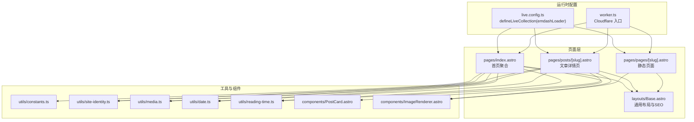
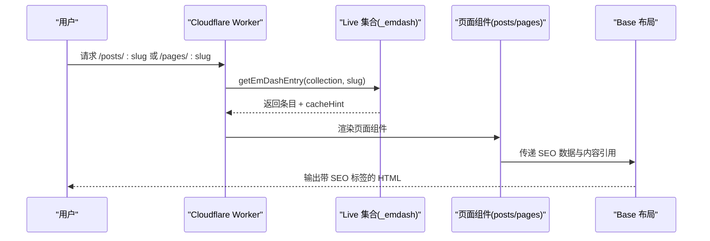
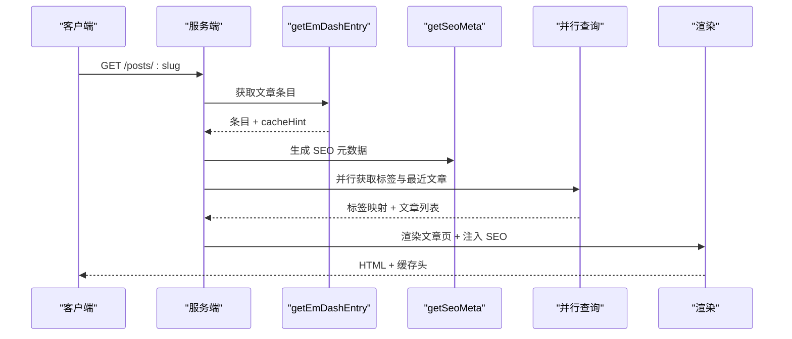
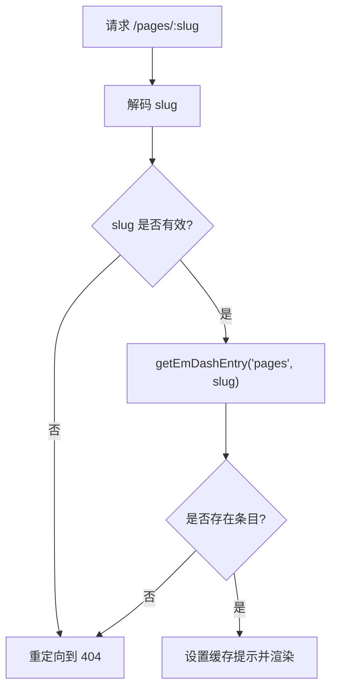
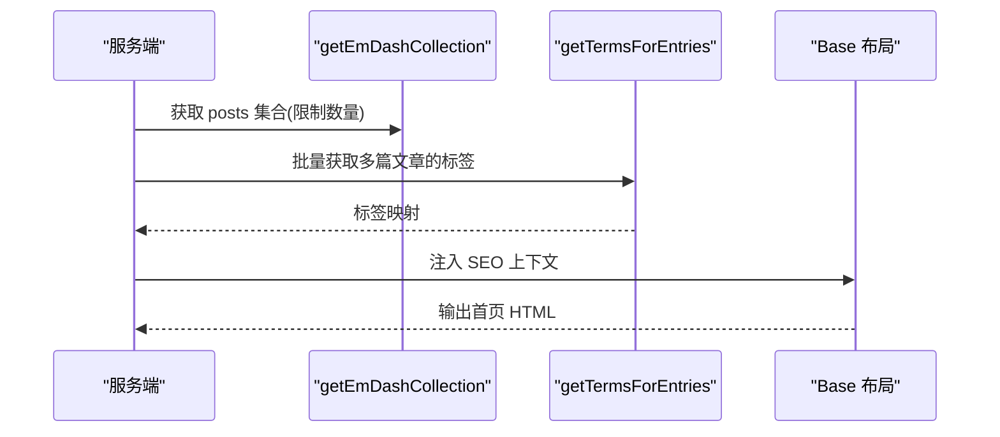
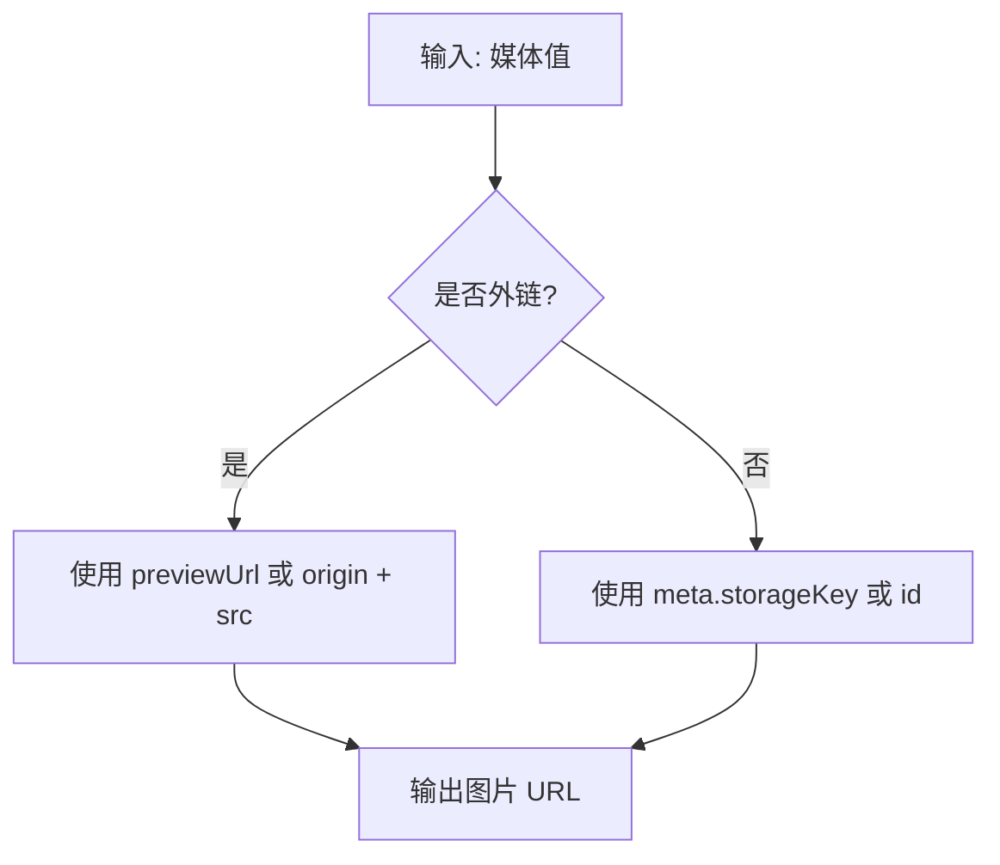
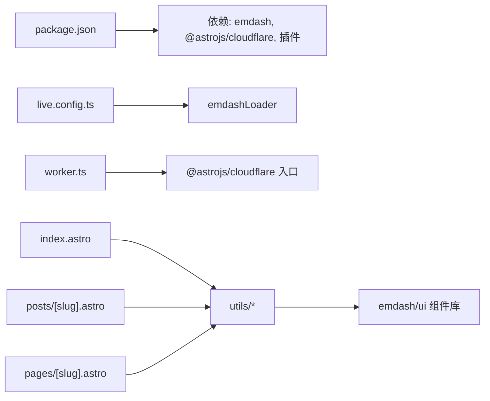

# 内容页面处理

<cite>
**本文档引用的文件**
- [src/pages/pages/[slug].astro](file://src/pages/pages/[slug].astro)
- [src/pages/posts/[slug].astro](file://src/pages/posts/[slug].astro)
- [src/layouts/Base.astro](file://src/layouts/Base.astro)
- [src/live.config.ts](file://src/live.config.ts)
- [src/worker.ts](file://src/worker.ts)
- [src/utils/constants.ts](file://src/utils/constants.ts)
- [src/utils/site-identity.ts](file://src/utils/site-identity.ts)
- [src/utils/media.ts](file://src/utils/media.ts)
- [src/utils/date.ts](file://src/utils/date.ts)
- [src/utils/reading-time.ts](file://src/utils/reading-time.ts)
- [src/components/PostCard.astro](file://src/components/PostCard.astro)
- [src/components/ImageRenderer.astro](file://src/components/ImageRenderer.astro)
- [src/pages/index.astro](file://src/pages/index.astro)
- [package.json](file://package.json)
- [README.md](file://README.md)
</cite>

## 目录
1. [简介](#简介)
2. [项目结构](#项目结构)
3. [核心组件](#核心组件)
4. [架构总览](#架构总览)
5. [详细组件分析](#详细组件分析)
6. [依赖关系分析](#依赖关系分析)
7. [性能考量](#性能考量)
8. [故障排查指南](#故障排查指南)
9. [结论](#结论)
10. [附录](#附录)

## 简介
本文件面向 EmDash 的内容页面处理系统，聚焦以下主题：
- 文章页面与静态页面内容的加载、渲染与缓存机制
- 内容查询优化、批量数据获取与 N+1 查询问题的解决方案
- 内容版本管理、草稿状态处理与发布流程
- SEO 优化策略（结构化数据、Open Graph、Twitter Card）
- 性能监控与缓存失效策略
- 开发者扩展与自定义字段处理指导

## 项目结构
EmDash 博客模板采用 Astro + EmDash 运行时，结合 Cloudflare Workers/D1/R2 的部署方案。内容通过统一的 _emdash 集合在运行时动态加载，页面路由按集合类型分发到对应的 Astro 页面组件进行渲染。



**图表来源**
- [src/live.config.ts:1-14](file://src/live.config.ts#L1-L14)
- [src/worker.ts:1-6](file://src/worker.ts#L1-L6)
- [src/pages/index.astro:1-463](file://src/pages/index.astro#L1-L463)
- [src/pages/posts/[slug].astro:1-980](file://src/pages/posts/[slug].astro#L1-L980)
- [src/pages/pages/[slug].astro:1-109](file://src/pages/pages/[slug].astro#L1-L109)
- [src/layouts/Base.astro:1-968](file://src/layouts/Base.astro#L1-L968)
- [src/utils/constants.ts:1-9](file://src/utils/constants.ts#L1-L9)
- [src/utils/site-identity.ts:1-25](file://src/utils/site-identity.ts#L1-L25)
- [src/utils/media.ts:1-39](file://src/utils/media.ts#L1-L39)
- [src/utils/date.ts:1-18](file://src/utils/date.ts#L1-L18)
- [src/utils/reading-time.ts:1-67](file://src/utils/reading-time.ts#L1-L67)
- [src/components/PostCard.astro:1-285](file://src/components/PostCard.astro#L1-L285)
- [src/components/ImageRenderer.astro:1-36](file://src/components/ImageRenderer.astro#L1-L36)

**章节来源**
- [src/live.config.ts:1-14](file://src/live.config.ts#L1-L14)
- [src/worker.ts:1-6](file://src/worker.ts#L1-L6)
- [README.md:1-68](file://README.md#L1-L68)

## 核心组件
- 内容加载器：通过 EmDash 提供的 getEmDashEntry/getEmDashCollection 等 API 在构建时或运行时从 _emdash 集合中获取内容。
- 页面组件：文章详情页与静态页面分别负责渲染不同集合的内容，并注入 SEO 元数据与缓存提示。
- 布局组件：Base.astro 负责站点标识、菜单、页脚、插件区域以及 SEO 头部输出。
- 工具函数：媒体解析、日期格式化、阅读时长计算、站点身份解析等。
- 组件库：PortableText 渲染、图片渲染器、文章卡片等。

**章节来源**
- [src/pages/posts/[slug].astro:1-125](file://src/pages/posts/[slug].astro#L1-L125)
- [src/pages/pages/[slug].astro:1-35](file://src/pages/pages/[slug].astro#L1-L35)
- [src/layouts/Base.astro:1-75](file://src/layouts/Base.astro#L1-L75)
- [src/utils/media.ts:1-39](file://src/utils/media.ts#L1-L39)
- [src/utils/date.ts:1-18](file://src/utils/date.ts#L1-L18)
- [src/utils/reading-time.ts:1-67](file://src/utils/reading-time.ts#L1-L67)

## 架构总览
EmDash 的内容页面处理遵循“统一内容源 + 动态页面渲染”的模式。所有内容由 emdashLoader 驱动的 _emdash 集合提供，页面通过 Astro 的内容 API 获取条目与集合，并在渲染阶段生成 SEO 数据与缓存提示。



**图表来源**
- [src/worker.ts:1-6](file://src/worker.ts#L1-L6)
- [src/live.config.ts:11-13](file://src/live.config.ts#L11-L13)
- [src/pages/posts/[slug].astro:31-37](file://src/pages/posts/[slug].astro#L31-L37)
- [src/pages/pages/[slug].astro:12-18](file://src/pages/pages/[slug].astro#L12-L18)
- [src/layouts/Base.astro:61-74](file://src/layouts/Base.astro#L61-L74)

## 详细组件分析

### 文章详情页（posts/[slug]）
- 加载与缓存
  - 使用 getEmDashEntry("posts", slug) 获取条目，并将返回的 cacheHint 设置到 Astro.cache 中以启用边缘缓存。
  - 同步获取站点设置与站点标识，用于 SEO 标题与 Open Graph 图片。
- SEO 元数据
  - 通过 getSeoMeta 生成标题、描述、OG 图片、canonical、robots 等。
  - 将 publishedTime、modifiedTime、type 等作为 article 类型的结构化数据注入。
- 并行查询与批量获取
  - 并行获取标签与最近文章列表，避免串行往返导致的延迟。
  - 使用 getTermsForEntries 对多个条目的标签进行一次性批量查询，解决 N+1 问题。
- 渲染与交互
  - 使用 PortableText 渲染内容块。
  - 图片通过 ImageRenderer 组件支持本地与外链图片。
  - JavaScript 动态生成目录（TOC），并使用 IntersectionObserver 实现滚动高亮。



**图表来源**
- [src/pages/posts/[slug].astro:31-125](file://src/pages/posts/[slug].astro#L31-L125)
- [src/pages/posts/[slug].astro:84-109](file://src/pages/posts/[slug].astro#L84-L109)
- [src/utils/media.ts:5-30](file://src/utils/media.ts#L5-L30)
- [src/utils/site-identity.ts:18-24](file://src/utils/site-identity.ts#L18-L24)

**章节来源**
- [src/pages/posts/[slug].astro:1-359](file://src/pages/posts/[slug].astro#L1-L359)
- [src/utils/media.ts:1-39](file://src/utils/media.ts#L1-L39)
- [src/utils/site-identity.ts:1-25](file://src/utils/site-identity.ts#L1-L25)

### 静态页面（pages/[slug]）
- 加载与缓存
  - 使用 getEmDashEntry("pages", slug) 获取条目，设置 Astro.cache 以启用缓存。
  - 渲染 PortableText 内容并应用基础样式。
- 错误处理
  - 当 slug 解码失败或条目不存在时，重定向至 404。



**图表来源**
- [src/pages/pages/[slug].astro:6-18](file://src/pages/pages/[slug].astro#L6-L18)

**章节来源**
- [src/pages/pages/[slug].astro:1-109](file://src/pages/pages/[slug].astro#L1-L109)

### 首页（index）
- 批量查询与 N+1 优化
  - 并行获取文章集合与站点设置，减少往返。
  - 使用 getTermsForEntries 对首页展示的文章批量查询标签，避免逐条查询。
- 结构化数据与 SEO
  - 通过 Base 布局注入站点标识与 SEO 上下文，确保首页具备标准 SEO 元素。



**图表来源**
- [src/pages/index.astro:19-65](file://src/pages/index.astro#L19-L65)

**章节来源**
- [src/pages/index.astro:1-463](file://src/pages/index.astro#L1-L463)

### 布局与 SEO（Base.astro）
- 站点标识与菜单
  - 读取站点设置与菜单，渲染头部导航与页脚。
- SEO 上下文
  - 通过 createPublicPageContext 构建公共页面上下文，传入标题、描述、图像、canonical、robots、文章元信息等。
  - EmDashHead 负责输出结构化数据与 Open Graph/Twitter Card 标签。
- 插件贡献
  - 支持插件在内容页面注入自定义区块或脚本。

```mermaid
classDiagram
class BaseLayout {
+props : SEO + 内容引用
+getSiteSettings()
+getMenu()
+createPublicPageContext()
+render EmDashHead()
}
class PublicPageContext {
+kind : "content"|"custom"
+pageType : "website"|"article"
+seo : { ogImage, robots }
+articleMeta : { publishedTime, modifiedTime, author }
}
BaseLayout --> PublicPageContext : "构建并传递"
```

**图表来源**
- [src/layouts/Base.astro:16-74](file://src/layouts/Base.astro#L16-L74)

**章节来源**
- [src/layouts/Base.astro:1-968](file://src/layouts/Base.astro#L1-L968)

### 工具与组件
- 媒体解析与图片渲染
  - resolveImageUrl 支持外链与本地存储键生成 URL；ImageRenderer 根据图片类型选择原生 img 或 EmDashImage。
- 日期与阅读时长
  - formatDate 提供中文本地化日期格式；getReadingTime 基于字词与 CJK 字符估算分钟数。
- 文章卡片
  - PostCard 组件封装文章卡片 UI，支持 byline、标签、摘要与图片。



**图表来源**
- [src/utils/media.ts:5-30](file://src/utils/media.ts#L5-L30)

**章节来源**
- [src/utils/media.ts:1-39](file://src/utils/media.ts#L1-L39)
- [src/utils/date.ts:1-18](file://src/utils/date.ts#L1-L18)
- [src/utils/reading-time.ts:1-67](file://src/utils/reading-time.ts#L1-L67)
- [src/components/PostCard.astro:1-285](file://src/components/PostCard.astro#L1-L285)
- [src/components/ImageRenderer.astro:1-36](file://src/components/ImageRenderer.astro#L1-L36)

## 依赖关系分析
- 运行时与部署
  - live.config.ts 定义 _emdash 集合与 emdashLoader，使 Astro 可在构建时或运行时访问内容。
  - worker.ts 指定 Cloudflare 服务器入口，配合 @astrojs/cloudflare 插件部署。
- 包与脚本
  - package.json 指定 emdash 版本、插件与部署脚本，支持 pnpm 生态与 Wrangler 部署。
- 页面与工具
  - 页面组件依赖工具模块与组件库，形成清晰的分层：页面负责业务逻辑，工具负责数据处理，组件负责 UI。



**图表来源**
- [package.json:17-32](file://package.json#L17-L32)
- [src/live.config.ts:8-13](file://src/live.config.ts#L8-L13)
- [src/worker.ts:1-6](file://src/worker.ts#L1-L6)

**章节来源**
- [package.json:1-33](file://package.json#L1-L33)
- [src/live.config.ts:1-14](file://src/live.config.ts#L1-L14)
- [src/worker.ts:1-6](file://src/worker.ts#L1-L6)

## 性能考量
- 查询优化
  - 并行查询：文章详情页对标签与最近文章使用 Promise.all 并行获取，降低网络往返成本。
  - 批量查询：首页与文章页使用 getTermsForEntries 对多条内容一次性查询标签，避免 N+1。
- 缓存策略
  - 页面通过 Astro.cache.set(cacheHint) 启用边缘缓存，提升重复访问性能。
  - 首页限制查询数量并在数据库侧裁剪，减少前端处理开销。
- 渲染优化
  - 图片渲染器根据媒体类型选择最优路径，外链直接使用原图，本地媒体通过 EmDashImage 优化。
  - 文章页目录通过 JS 动态生成并使用 IntersectionObserver 实现平滑高亮，避免阻塞首屏。
- 代码分割与懒执行
  - TOC 构建仅在客户端执行，且在无标题时隐藏目录，减少不必要的 DOM 操作。

**章节来源**
- [src/pages/posts/[slug].astro:84-109](file://src/pages/posts/[slug].astro#L84-L109)
- [src/pages/index.astro:41-48](file://src/pages/index.astro#L41-L48)
- [src/pages/pages/[slug].astro:18](file://src/pages/pages/[slug].astro#L18)
- [src/components/ImageRenderer.astro:17-35](file://src/components/ImageRenderer.astro#L17-L35)

## 故障排查指南
- 404 重定向
  - 当 slug 解码失败或条目不存在时，页面会重定向到 404，检查内容是否存在或 slug 是否正确。
- SEO 标签缺失
  - 确认 Base 布局已正确创建公共页面上下文并传入 SEO 数据；检查 getSeoMeta 的参数（站点标题、URL、路径、默认 OG 图）。
- 图片显示异常
  - 外链图片需提供 previewUrl 或完整 URL；本地图片需确保 meta.storageKey 或 id 存在。
- 缓存未生效
  - 确认 Astro.cache.enabled 为真，且页面设置了 cacheHint；检查部署环境的缓存策略。
- 目录不显示
  - 若文章内容不含 h2/h3 标题，JS 会隐藏目录；可在内容中添加标题或禁用自动目录。

**章节来源**
- [src/pages/pages/[slug].astro:8-18](file://src/pages/pages/[slug].astro#L8-L18)
- [src/pages/posts/[slug].astro:71-76](file://src/pages/posts/[slug].astro#L71-L76)
- [src/utils/media.ts:5-30](file://src/utils/media.ts#L5-L30)
- [src/pages/posts/[slug].astro:295-357](file://src/pages/posts/[slug].astro#L295-L357)

## 结论
EmDash 的内容页面处理系统通过统一的内容集合与运行时加载器，实现了高效的内容加载、灵活的 SEO 注入与完善的缓存机制。通过并行与批量查询优化、严格的错误处理与可扩展的布局/组件体系，系统在性能与可维护性之间取得了良好平衡。开发者可基于现有模式快速扩展新页面类型、自定义字段与插件功能。

## 附录

### 内容版本管理与发布流程
- 版本与草稿
  - EmDash 提供内容版本与草稿管理能力，页面通过 getEmDashEntry 获取当前可见版本；在管理后台完成审核与发布后，前端即可看到更新内容。
- 发布策略
  - 建议在发布前预热热点页面（如首页、热门文章），利用 Astro.cache 的 cacheHint 提升首次访问速度。
- 变更传播
  - 发布后可通过 CDN 刷新策略或设置合理的缓存 TTL，确保边缘节点尽快同步最新内容。

[本节为概念性说明，无需特定文件引用]

### SEO 优化策略
- 结构化数据
  - 使用 createPublicPageContext 与 EmDashHead 输出 JSON-LD 与 Open Graph/Twitter Card 标签。
- Open Graph 与 Twitter Card
  - 通过 getSeoMeta 生成 og:title、og:description、og:image、twitter:card 等；若无默认图片，可回退到文章首图。
- Canonical 与 Robots
  - 为每篇文章设置 canonical 与 robots，避免重复索引与爬虫干扰。

**章节来源**
- [src/layouts/Base.astro:61-74](file://src/layouts/Base.astro#L61-L74)
- [src/pages/posts/[slug].astro:71-76](file://src/pages/posts/[slug].astro#L71-L76)

### 性能监控与缓存失效
- 监控指标
  - 关注边缘缓存命中率、TTFB、首屏渲染时间与 TOC 构建耗时。
- 缓存失效
  - 对于热点内容，可设置较短 TTL 或在发布后主动刷新；对于静态资源，建议使用文件指纹与 CDN 缓存策略。

[本节为通用实践建议，无需特定文件引用]

### 开发者扩展与自定义字段
- 新增页面类型
  - 在 live.config.ts 中定义新的内容集合，参考 _emdash 的方式；新增对应 Astro 页面组件并复用 Base 布局。
- 自定义字段
  - 在内容模型中添加字段后，在页面组件中读取并渲染；必要时扩展工具函数（如媒体解析、日期格式化）。
- 插件集成
  - 通过 Base 布局的插件区域与 createPublicPageContext，安全地向页面注入脚本或区块。

**章节来源**
- [src/live.config.ts:11-13](file://src/live.config.ts#L11-L13)
- [src/layouts/Base.astro:59-74](file://src/layouts/Base.astro#L59-L74)