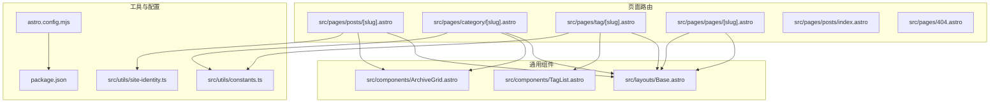
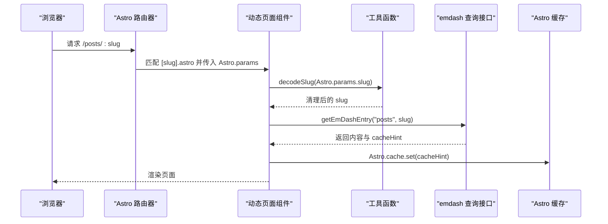
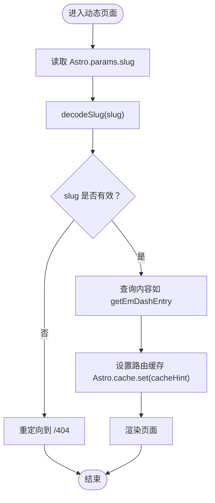
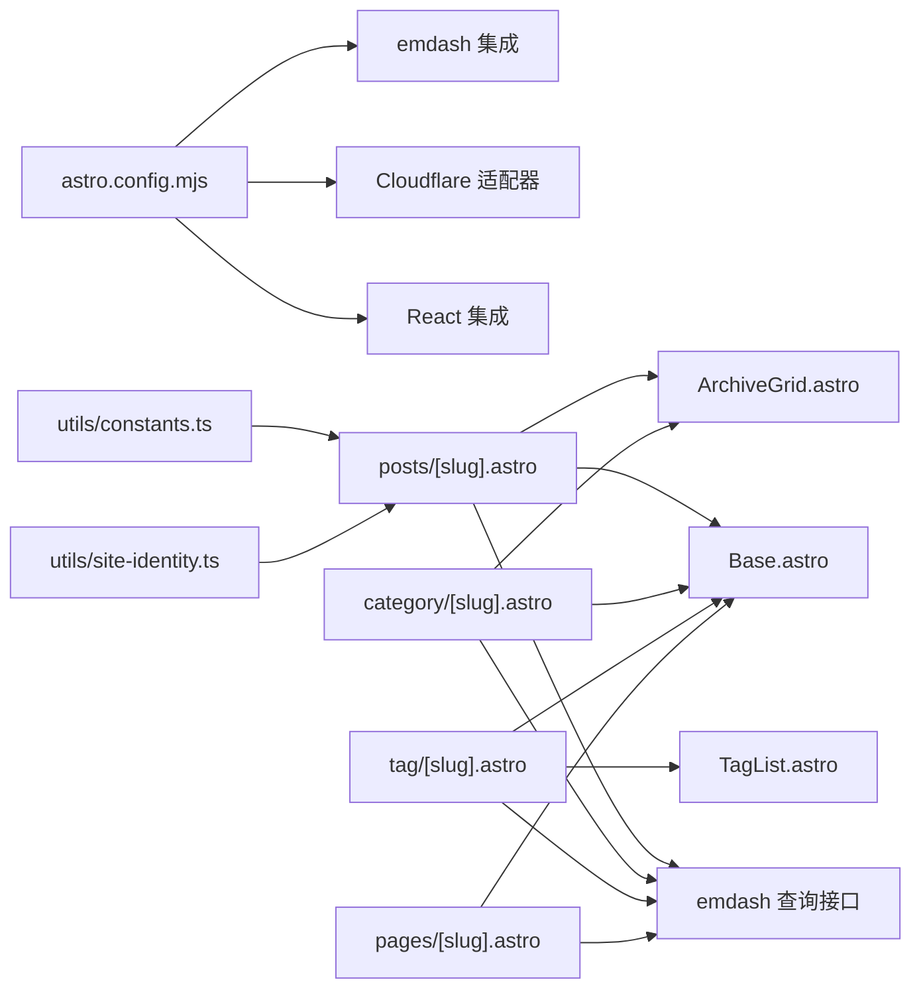

# 动态路由实现

<cite>
**本文档引用的文件**
- [src/pages/posts/[slug].astro](file://src/pages/posts/[slug].astro)
- [src/pages/category/[slug].astro](file://src/pages/category/[slug].astro)
- [src/pages/tag/[slug].astro](file://src/pages/tag/[slug].astro)
- [src/pages/pages/[slug].astro](file://src/pages/pages/[slug].astro)
- [src/pages/posts/index.astro](file://src/pages/posts/index.astro)
- [src/pages/404.astro](file://src/pages/404.astro)
- [astro.config.mjs](file://astro.config.mjs)
- [src/utils/constants.ts](file://src/utils/constants.ts)
- [src/utils/site-identity.ts](file://src/utils/site-identity.ts)
- [src/components/ArchiveGrid.astro](file://src/components/ArchiveGrid.astro)
- [src/components/TagList.astro](file://src/components/TagList.astro)
- [src/layouts/Base.astro](file://src/layouts/Base.astro)
- [src/pages/rss.xml.ts](file://src/pages/rss.xml.ts)
- [package.json](file://package.json)
</cite>

## 目录
1. [简介](#简介)
2. [项目结构](#项目结构)
3. [核心组件](#核心组件)
4. [架构总览](#架构总览)
5. [详细组件分析](#详细组件分析)
6. [依赖关系分析](#依赖关系分析)
7. [性能考量](#性能考量)
8. [故障排除指南](#故障排除指南)
9. [结论](#结论)

## 简介
本文件系统性阐述 EmDash 基于 Astro 的动态路由实现，重点覆盖：
- 文件命名约定与路由参数提取（方括号语法）
- 路由匹配优先级与参数处理流程
- 参数验证、清理与类型转换
- SEO 元数据生成与 URL 规范化
- 性能优化与缓存策略
- 自定义路由处理器与中间件实现思路

## 项目结构
EmDash 使用 Astro 的静态站点生成能力，结合 emdash 集成，通过文件系统路由自动映射到页面组件。动态路由以“方括号”语法在路径中声明参数段，例如 `/posts/[slug].astro`、`/category/[slug].astro`、`/tag/[slug].astro`、`/pages/[slug].astro`。

图表来源
- [src/pages/posts/[slug].astro](file://src/pages/posts/[slug].astro#L1-L120)
- [src/pages/category/[slug].astro](file://src/pages/category/[slug].astro#L1-L40)
- [src/pages/tag/[slug].astro](file://src/pages/tag/[slug].astro#L1-L40)
- [src/pages/pages/[slug].astro](file://src/pages/pages/[slug].astro#L1-L40)
- [src/pages/posts/index.astro:1-40](file://src/pages/posts/index.astro#L1-L40)
- [src/pages/404.astro:1-12](file://src/pages/404.astro#L1-L12)
- [src/components/ArchiveGrid.astro:1-40](file://src/components/ArchiveGrid.astro#L1-L40)
- [src/components/TagList.astro:1-20](file://src/components/TagList.astro#L1-L20)
- [src/layouts/Base.astro:1-40](file://src/layouts/Base.astro#L1-L40)
- [src/utils/constants.ts:1-9](file://src/utils/constants.ts#L1-L9)
- [src/utils/site-identity.ts:1-25](file://src/utils/site-identity.ts#L1-L25)
- [astro.config.mjs:1-45](file://astro.config.mjs#L1-L45)
- [package.json:1-33](file://package.json#L1-L33)

章节来源
- [astro.config.mjs:1-45](file://astro.config.mjs#L1-L45)
- [package.json:1-33](file://package.json#L1-L33)

## 核心组件
- 动态路由页面：基于方括号语法的页面文件，接收路由参数并通过 Astro.params 访问。
- 通用布局：Base.astro 提供统一的 HTML head、导航与样式注入。
- 通用组件：ArchiveGrid、TagList 等复用组件，用于归档列表与标签展示。
- 工具模块：constants.ts 提供断点与分页常量；site-identity.ts 解析站点标识信息。
- 错误页面：404.astro 提供统一的 404 页面。

章节来源
- [src/pages/posts/[slug].astro:1-L120](file://src/pages/posts/[slug].astro#L1-L120)
- [src/pages/category/[slug].astro:1-L40](file://src/pages/category/[slug].astro#L1-L40)
- [src/pages/tag/[slug].astro:1-L40](file://src/pages/tag/[slug].astro#L1-L40)
- [src/pages/pages/[slug].astro:1-L40](file://src/pages/pages/[slug].astro#L1-L40)
- [src/pages/posts/index.astro:1-40](file://src/pages/posts/index.astro#L1-L40)
- [src/pages/404.astro:1-12](file://src/pages/404.astro#L1-L12)
- [src/layouts/Base.astro:1-40](file://src/layouts/Base.astro#L1-L40)
- [src/components/ArchiveGrid.astro:1-40](file://src/components/ArchiveGrid.astro#L1-L40)
- [src/components/TagList.astro:1-20](file://src/components/TagList.astro#L1-L20)
- [src/utils/constants.ts:1-9](file://src/utils/constants.ts#L1-L9)
- [src/utils/site-identity.ts:1-25](file://src/utils/site-identity.ts#L1-L25)

## 架构总览
EmDash 的动态路由遵循 Astro 的约定式路由规则：
- 文件系统层级决定 URL 结构
- 方括号语法定义动态段，如 [slug]
- Astro.params 暴露动态段值
- 页面逻辑通过 decodeSlug 清理参数，随后查询内容并渲染
- 通过 Astro.cache.set(cacheHint) 实现路由级缓存

图表来源
- [src/pages/posts/[slug].astro:25-L37](file://src/pages/posts/[slug].astro#L25-L37)
- [src/pages/category/[slug].astro:11-L23](file://src/pages/category/[slug].astro#L11-L23)
- [src/pages/tag/[slug].astro:11-L23](file://src/pages/tag/[slug].astro#L11-L23)
- [src/pages/pages/[slug].astro:6-L18](file://src/pages/pages/[slug].astro#L6-L18)

## 详细组件分析

### 动态段与参数提取
- 路径中的 [slug] 表示动态段，Astro 将其作为 Astro.params.slug 传递给页面组件。
- 所有动态页面均调用 decodeSlug 对参数进行清理，确保安全与一致性。
- 若清理后 slug 为空，则重定向至 404 页面。

图表来源
- [src/pages/posts/[slug].astro:25-L37](file://src/pages/posts/[slug].astro#L25-L37)
- [src/pages/category/[slug].astro:11-L16](file://src/pages/category/[slug].astro#L11-L16)
- [src/pages/tag/[slug].astro:11-L16](file://src/pages/tag/[slug].astro#L11-L16)
- [src/pages/pages/[slug].astro:6-L16](file://src/pages/pages/[slug].astro#L6-L16)

章节来源
- [src/pages/posts/[slug].astro:25-L37](file://src/pages/posts/[slug].astro#L25-L37)
- [src/pages/category/[slug].astro:11-L16](file://src/pages/category/[slug].astro#L11-L16)
- [src/pages/tag/[slug].astro:11-L16](file://src/pages/tag/[slug].astro#L11-L16)
- [src/pages/pages/[slug].astro:6-L16](file://src/pages/pages/[slug].astro#L6-L16)

### 路由匹配优先级与冲突处理
- Astro 的路由匹配遵循文件系统层级与精确度：更具体的路径优先级更高。
- 在本项目中，动态段位于子目录下（如 /posts/[slug].astro），与静态页面（如 /posts/index.astro）互不冲突。
- 当请求 /posts/xxx 时，Astro 会优先匹配 /posts/[slug].astro；若该资源不存在或查询不到内容，则可按需回退到 404 或其他策略。

章节来源
- [src/pages/posts/index.astro:1-40](file://src/pages/posts/index.astro#L1-L40)
- [src/pages/404.astro:1-12](file://src/pages/404.astro#L1-L12)

### 参数验证与类型转换
- decodeSlug 用于清理输入，避免无效字符与大小写问题，保证 slug 与数据库一致。
- 文章详情页中，post.id 为 slug（用于 URL），而 post.data.id 为数据库 ULID（用于查询标签等关联数据）。
- 归档页通过 getTerm 获取术语对象，再以 term.slug 作为查询条件筛选文章集合。

章节来源
- [src/pages/posts/[slug].astro:25-L37](file://src/pages/posts/[slug].astro#L25-L37)
- [src/pages/category/[slug].astro:11-L23](file://src/pages/category/[slug].astro#L11-L23)
- [src/pages/tag/[slug].astro:11-L23](file://src/pages/tag/[slug].astro#L11-L23)

### SEO 元数据与 URL 规范化
- 使用 getSeoMeta 从内容生成标题、描述、OG 图像与 canonical 链接。
- canonical 通常基于 Astro.url.origin 与当前路径拼接，确保搜索引擎识别唯一 URL。
- 站点标识通过 resolveBlogSiteIdentity 从站点设置解析，统一标题与副标题。

章节来源
- [src/pages/posts/[slug].astro:71-L76](file://src/pages/posts/[slug].astro#L71-L76)
- [src/utils/site-identity.ts:18-24](file://src/utils/site-identity.ts#L18-L24)

### 数据加载与并发优化
- 文章详情页采用 Promise.all 并发加载相关内容（如标签、相关文章），减少往返时间。
- 归档页使用批量查询 getTermsForEntries，避免 N+1 查询问题。
- 列表页按数据库排序，减少客户端排序开销。

章节来源
- [src/pages/posts/[slug].astro:88-L109](file://src/pages/posts/[slug].astro#L88-L109)
- [src/pages/category/[slug].astro:28-L36](file://src/pages/category/[slug].astro#L28-L36)
- [src/pages/posts/index.astro:18-28](file://src/pages/posts/index.astro#L18-L28)

### 错误处理策略
- 参数为空或查询不到内容时，统一重定向到 404 页面。
- 404 页面提供简洁的提示与返回首页链接，保持用户体验一致。

章节来源
- [src/pages/posts/[slug].astro:27-L35](file://src/pages/posts/[slug].astro#L27-L35)
- [src/pages/category/[slug].astro:14-L16](file://src/pages/category/[slug].astro#L14-L16)
- [src/pages/tag/[slug].astro:14-L16](file://src/pages/tag/[slug].astro#L14-L16)
- [src/pages/pages/[slug].astro:8-L16](file://src/pages/pages/[slug].astro#L8-L16)
- [src/pages/404.astro:1-12](file://src/pages/404.astro#L1-L12)

### 组件与布局协作
- Base.astro 作为统一布局，接收 SEO 元数据与内容上下文，注入到页面 head 与结构中。
- ArchiveGrid 与 TagList 复用性强，支持不同页面的数据结构输出。

章节来源
- [src/layouts/Base.astro:1-40](file://src/layouts/Base.astro#L1-L40)
- [src/components/ArchiveGrid.astro:1-40](file://src/components/ArchiveGrid.astro#L1-L40)
- [src/components/TagList.astro:1-20](file://src/components/TagList.astro#L1-L20)

### RSS 与 API 路由
- rss.xml.ts 作为 APIRoute，使用 getEmDashCollection 获取文章列表，拼接 canonical URL 输出 RSS。
- 该模式可借鉴到自定义路由处理器中，实现 API 层与页面层的分离。

章节来源
- [src/pages/rss.xml.ts:1-33](file://src/pages/rss.xml.ts#L1-L33)

## 依赖关系分析
- Astro 配置启用 Cloudflare 适配器与 React 集成，emdash 集成为内容与存储后端。
- 页面组件依赖 emdash 查询接口与工具函数，布局与组件提供复用能力。
- package.json 定义了构建脚本与部署命令，支持一键构建与部署到 Cloudflare。

图表来源
- [astro.config.mjs:1-45](file://astro.config.mjs#L1-L45)
- [src/pages/posts/[slug].astro:1-L25](file://src/pages/posts/[slug].astro#L1-L25)
- [src/pages/category/[slug].astro:1-L10](file://src/pages/category/[slug].astro#L1-L10)
- [src/pages/tag/[slug].astro:1-L10](file://src/pages/tag/[slug].astro#L1-L10)
- [src/pages/pages/[slug].astro:1-L10](file://src/pages/pages/[slug].astro#L1-L10)
- [src/layouts/Base.astro:1-40](file://src/layouts/Base.astro#L1-L40)
- [src/components/ArchiveGrid.astro:1-20](file://src/components/ArchiveGrid.astro#L1-L20)
- [src/components/TagList.astro:1-20](file://src/components/TagList.astro#L1-L20)
- [src/utils/constants.ts:1-9](file://src/utils/constants.ts#L1-L9)
- [src/utils/site-identity.ts:1-25](file://src/utils/site-identity.ts#L1-L25)

章节来源
- [astro.config.mjs:1-45](file://astro.config.mjs#L1-L45)
- [package.json:1-33](file://package.json#L1-L33)

## 性能考量
- 路由级缓存：所有动态页面在成功查询后调用 Astro.cache.set(cacheHint)，实现自动失效与缓存命中。
- 并发查询：文章详情页使用 Promise.all 并发获取标签与相关文章，降低网络延迟影响。
- 批量查询：归档页使用 getTermsForEntries 批量获取多个条目的标签，避免逐条查询。
- 数据库排序：列表页在数据库层面按发布时间排序，减少客户端排序成本。
- 响应式断点：constants.ts 中的断点常量用于媒体查询，提升移动端体验。

章节来源
- [src/pages/posts/[slug].astro:37-L37](file://src/pages/posts/[slug].astro#L37-L37)
- [src/pages/category/[slug].astro:23-L23](file://src/pages/category/[slug].astro#L23-L23)
- [src/pages/tag/[slug].astro:23-L23](file://src/pages/tag/[slug].astro#L23-L23)
- [src/pages/posts/[slug].astro:88-L109](file://src/pages/posts/[slug].astro#L88-L109)
- [src/pages/category/[slug].astro:28-L36](file://src/pages/category/[slug].astro#L28-L36)
- [src/pages/posts/index.astro:18-28](file://src/pages/posts/index.astro#L18-L28)
- [src/utils/constants.ts:1-9](file://src/utils/constants.ts#L1-L9)

## 故障排除指南
- 404 重定向：当 decodeSlug 返回空或查询不到内容时，页面会重定向到 404。检查 slug 是否正确、内容是否存在以及数据库连接是否正常。
- SEO 链接异常：确认 getSeoMeta 的 siteUrl 与 path 参数正确，避免 canonical 重复或缺失。
- 缓存未生效：确保每次成功查询后都调用 Astro.cache.set(cacheHint)，并确认缓存后端配置正确。
- Cloudflare 部署问题：检查 astro.config.mjs 中 adapter 与绑定，以及 wrangler.jsonc 的 D1/R2 绑定。

章节来源
- [src/pages/posts/[slug].astro:27-L37](file://src/pages/posts/[slug].astro#L27-L37)
- [src/pages/category/[slug].astro:14-L16](file://src/pages/category/[slug].astro#L14-L16)
- [src/pages/tag/[slug].astro:14-L16](file://src/pages/tag/[slug].astro#L14-L16)
- [src/pages/pages/[slug].astro:8-L16](file://src/pages/pages/[slug].astro#L8-L16)
- [src/pages/404.astro:1-12](file://src/pages/404.astro#L1-L12)
- [astro.config.mjs:1-45](file://astro.config.mjs#L1-L45)

## 结论
EmDash 的动态路由实现以 Astro 的约定式路由为基础，结合 emdash 的查询接口与缓存机制，提供了清晰、可维护且高性能的路由体系。通过参数清理、批量查询、并发优化与路由级缓存，系统在保证 SEO 与用户体验的同时，具备良好的扩展性。建议在新增路由时遵循现有模式：使用 [slug] 动态段、调用 decodeSlug、查询内容并设置缓存、生成 SEO 元数据，并在需要时引入自定义 APIRoute 或中间件以满足特定需求。