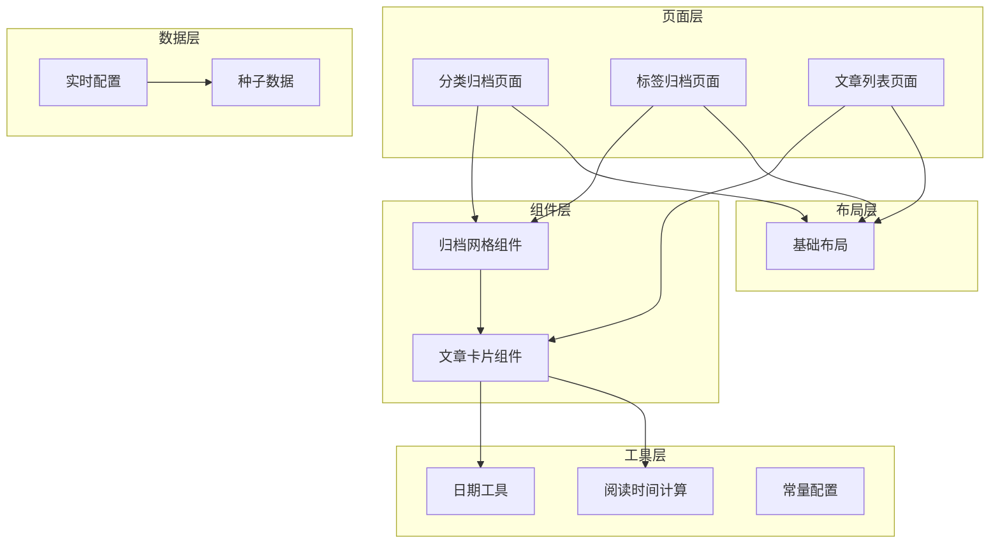
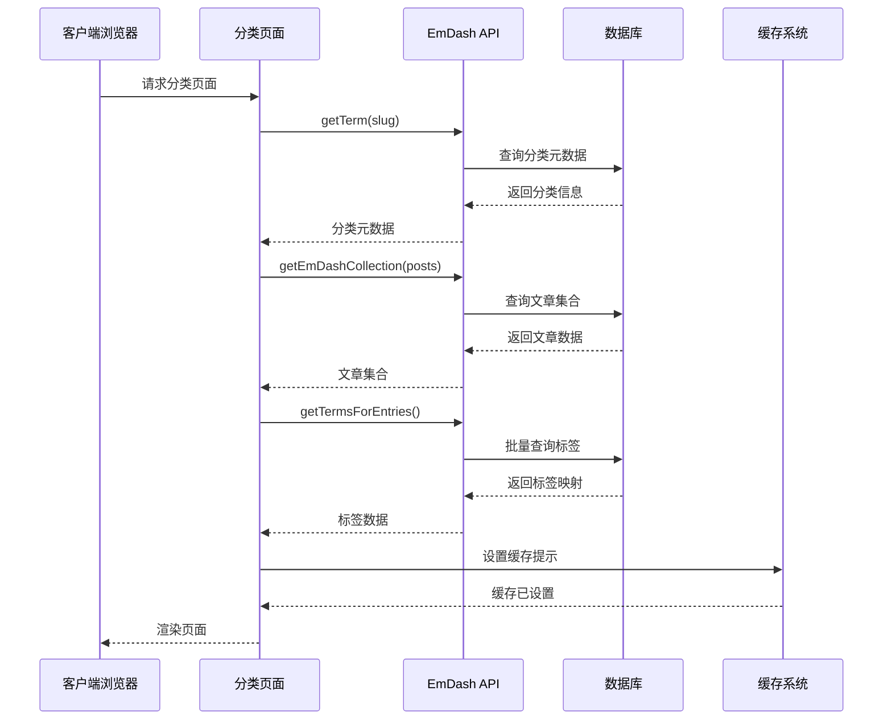
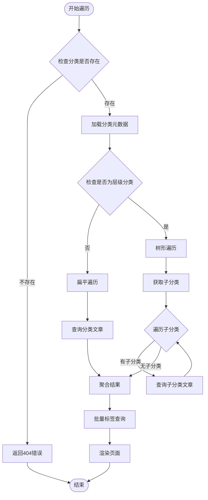
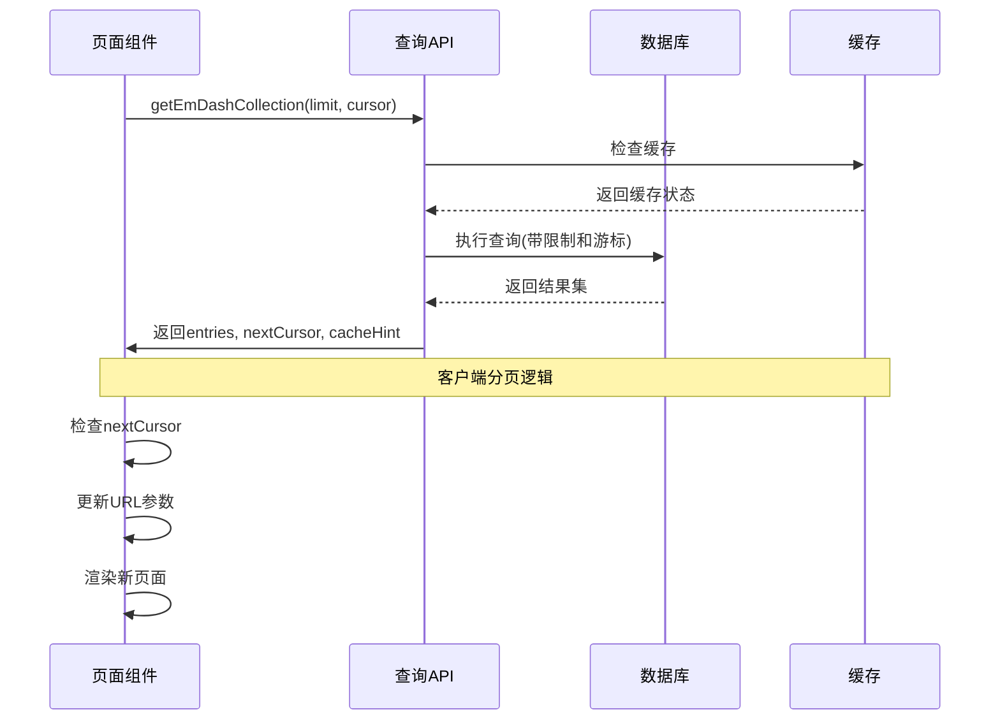
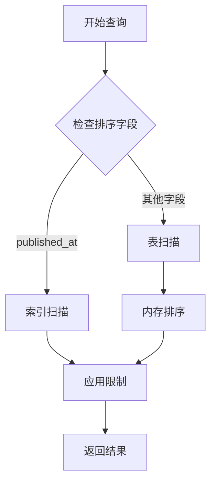
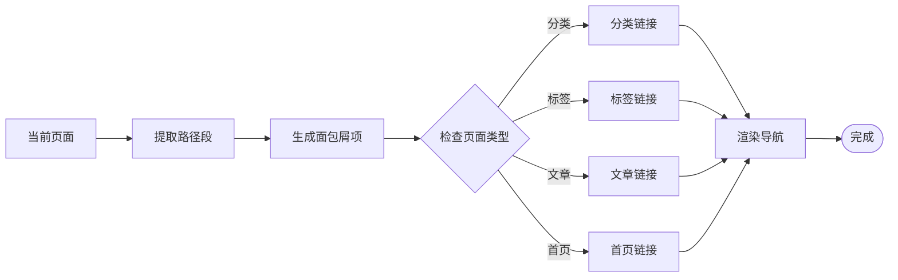
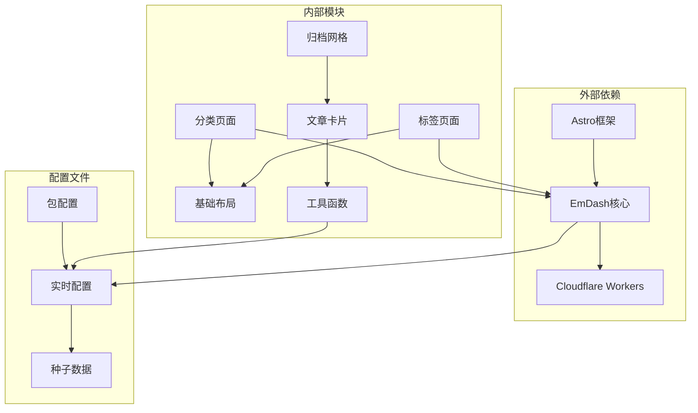
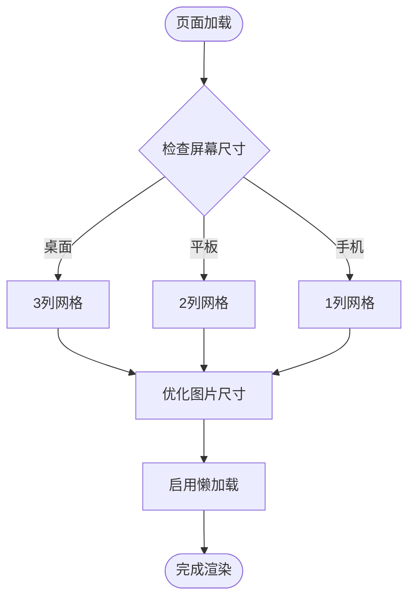
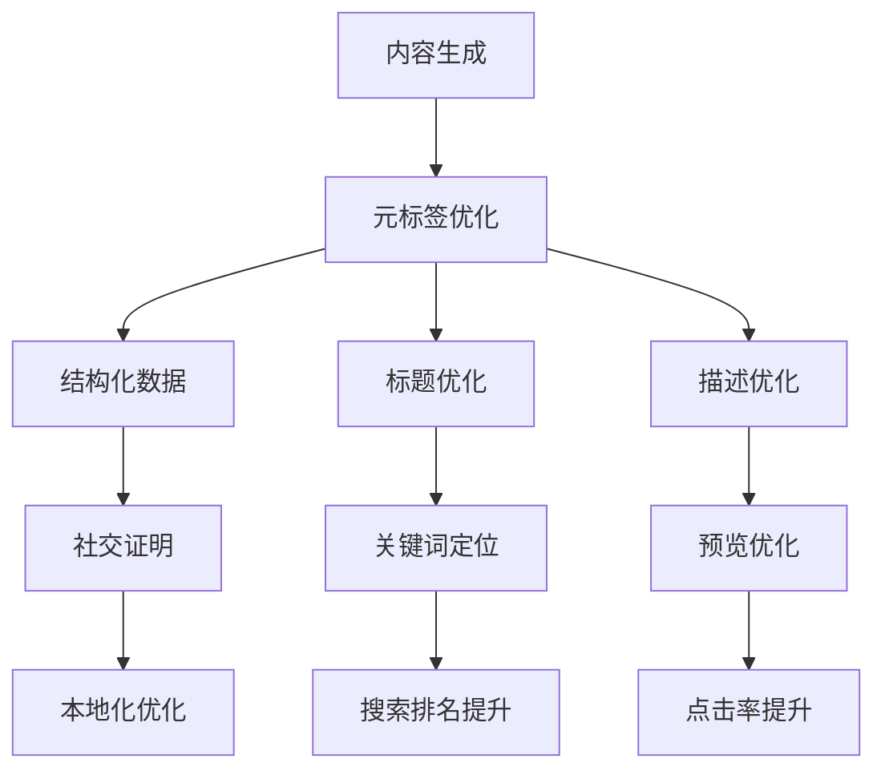
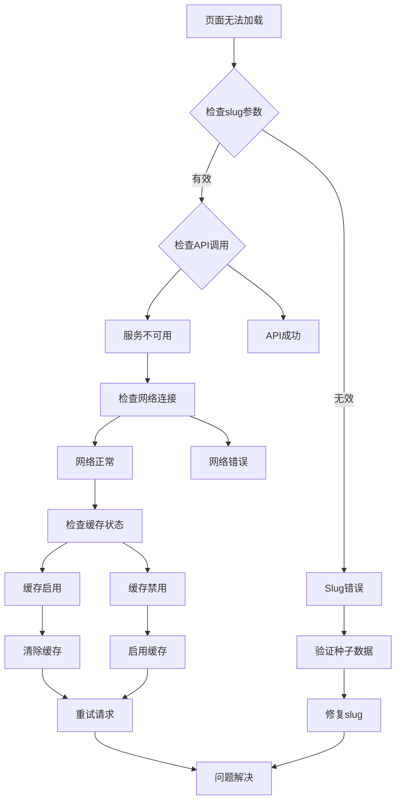

# 归档页面系统

<cite>
**本文档引用的文件**
- [src/pages/category/[slug].astro](file://src/pages/category/[slug].astro)
- [src/pages/tag/[slug].astro](file://src/pages/tag/[slug].astro)
- [src/components/ArchiveGrid.astro](file://src/components/ArchiveGrid.astro)
- [src/components/PostCard.astro](file://src/components/PostCard.astro)
- [src/pages/posts/index.astro](file://src/pages/posts/index.astro)
- [src/layouts/Base.astro](file://src/layouts/Base.astro)
- [src/utils/constants.ts](file://src/utils/constants.ts)
- [src/utils/date.ts](file://src/utils/date.ts)
- [src/utils/reading-time.ts](file://src/utils/reading-time.ts)
- [src/live.config.ts](file://src/live.config.ts)
- [seed/seed.json](file://seed/seed.json)
- [.agents/skills/building-emdash-site/references/querying-and-rendering.md](file://.agents/skills/building-emdash-site/references/querying-and-rendering.md)
- [.agents/skills/building-emdash-site/references/site-features.md](file://.agents/skills/building-emdash-site/references/site-features.md)
- [package.json](file://package.json)
</cite>

## 目录
1. [简介](#简介)
2. [项目结构](#项目结构)
3. [核心组件](#核心组件)
4. [架构概览](#架构概览)
5. [详细组件分析](#详细组件分析)
6. [依赖关系分析](#依赖关系分析)
7. [性能考虑](#性能考虑)
8. [SEO 优化策略](#seo-优化策略)
9. [故障排除指南](#故障排除指南)
10. [结论](#结论)
11. [附录](#附录)

## 简介

EmDash 的归档页面系统是一个基于 Astro 和 EmDash 内容管理框架构建的高性能内容归档解决方案。该系统提供了完整的分类和标签归档功能，支持大规模内容的高效展示和检索。

系统的核心特性包括：
- 实时内容查询和渲染
- 高效的批量数据处理
- 响应式布局设计
- 完善的 SEO 支持
- 可扩展的插件架构

## 项目结构

归档页面系统主要由以下模块组成：



**图表来源**
- [src/pages/category/[slug].astro](file://src/pages/category/[slug].astro#L1-L93)
- [src/pages/tag/[slug].astro](file://src/pages/tag/[slug].astro#L1-L95)
- [src/components/ArchiveGrid.astro:1-64](file://src/components/ArchiveGrid.astro#L1-L64)

**章节来源**
- [src/pages/category/[slug].astro](file://src/pages/category/[slug].astro#L1-L93)
- [src/pages/tag/[slug].astro](file://src/pages/tag/[slug].astro#L1-L95)
- [src/components/ArchiveGrid.astro:1-64](file://src/components/ArchiveGrid.astro#L1-L64)

## 核心组件

### 分类归档页面

分类归档页面负责展示特定分类下的所有文章。系统通过 slug 参数解析分类标识符，并使用 EmDash 查询 API 获取相关的文章集合。

关键实现特点：
- 使用 `getTerm` 函数获取分类元数据
- 通过 `getEmDashCollection` 进行高效的内容查询
- 实现批量标签查询以减少数据库往返次数
- 支持缓存提示优化性能

### 标签归档页面

标签归档页面与分类页面类似，但专注于标签维度的内容组织。两者在实现上高度相似，体现了良好的代码复用性。

### 归档网格组件

ArchiveGrid 组件是归档页面的核心展示组件，负责：
- 接收文章数据和标签信息
- 实现响应式网格布局
- 处理空状态显示
- 支持不同屏幕尺寸的适配

**章节来源**
- [src/pages/category/[slug].astro](file://src/pages/category/[slug].astro#L11-L36)
- [src/pages/tag/[slug].astro](file://src/pages/tag/[slug].astro#L11-L35)
- [src/components/ArchiveGrid.astro:11-39](file://src/components/ArchiveGrid.astro#L11-L39)

## 架构概览

归档页面系统采用分层架构设计，确保了良好的可维护性和扩展性：



**图表来源**
- [src/pages/category/[slug].astro](file://src/pages/category/[slug].astro#L18-L36)
- [.agents/skills/building-emdash-site/references/querying-and-rendering.md:7-34](file://.agents/skills/building-emdash-site/references/querying-and-rendering.md#L7-L34)

## 详细组件分析

### 分类树遍历机制

虽然当前实现主要处理扁平的分类结构，但系统架构为未来的分类树遍历提供了基础支持：



**图表来源**
- [seed/seed.json:68-115](file://seed/seed.json#L68-L115)
- [src/pages/category/[slug].astro](file://src/pages/category/[slug].astro#L11-L36)

### 标签云生成算法

标签云的生成采用了高效的批量查询策略：


**图表来源**
- [src/pages/category/[slug].astro](file://src/pages/category/[slug].astro#L25-L36)
- [src/pages/tag/[slug].astro](file://src/pages/tag/[slug].astro#L25-L35)

### 数据聚合与分页处理

系统实现了高效的分页机制：



**图表来源**
- [.agents/skills/building-emdash-site/references/querying-and-rendering.md:356-376](file://.agents/skills/building-emdash-site/references/querying-and-rendering.md#L356-L376)

### 排序算法实现

系统支持多种排序方式，主要通过数据库层面的索引优化：



**图表来源**
- [.agents/skills/building-emdash-site/references/querying-and-rendering.md:26-33](file://.agents/skills/building-emdash-site/references/querying-and-rendering.md#L26-L33)

### 面包屑导航实现

面包屑导航通过动态路径生成实现：



**图表来源**
- [src/layouts/Base.astro:1-800](file://src/layouts/Base.astro#L1-L800)

**章节来源**
- [src/pages/category/[slug].astro](file://src/pages/category/[slug].astro#L18-L36)
- [src/pages/tag/[slug].astro](file://src/pages/tag/[slug].astro#L18-L35)
- [src/components/ArchiveGrid.astro:21-39](file://src/components/ArchiveGrid.astro#L21-L39)

## 依赖关系分析

归档页面系统的依赖关系体现了清晰的分层设计：



**图表来源**
- [package.json:17-27](file://package.json#L17-L27)
- [src/live.config.ts:1-14](file://src/live.config.ts#L1-L14)
- [seed/seed.json:68-115](file://seed/seed.json#L68-L115)

**章节来源**
- [package.json:1-33](file://package.json#L1-L33)
- [src/live.config.ts:1-14](file://src/live.config.ts#L1-L14)

## 性能考虑

### 查询优化策略

系统采用了多项查询优化技术：

1. **批量查询优化**
   - 使用 `getTermsForEntries` 进行批量标签查询
   - 避免 N+1 查询问题
   - 减少数据库往返次数

2. **索引策略**
   - 在 `published_at` 字段上建立索引
   - 支持复合索引优化复杂查询
   - 利用数据库查询计划优化

3. **缓存机制**
   - 使用 `cacheHint` 优化缓存策略
   - 支持客户端和服务器端缓存
   - 实现智能缓存失效

### 响应式设计优化



**图表来源**
- [src/components/ArchiveGrid.astro:42-62](file://src/components/ArchiveGrid.astro#L42-L62)

### 内存管理

系统通过以下方式优化内存使用：
- 按需加载文章内容
- 实现虚拟滚动支持
- 合理的组件生命周期管理

**章节来源**
- [src/pages/category/[slug].astro](file://src/pages/category/[slug].astro#L25-L36)
- [src/pages/tag/[slug].astro](file://src/pages/tag/[slug].astro#L25-L35)
- [src/components/ArchiveGrid.astro:42-62](file://src/components/ArchiveGrid.astro#L42-L62)

## SEO 优化策略

### URL 结构设计

归档页面采用语义化的 URL 结构：
- 分类页面: `/category/:slug`
- 标签页面: `/tag/:slug`
- 文章列表: `/posts`

这种设计有利于搜索引擎理解和索引。

### 内容相关性提升



**图表来源**
- [.agents/skills/building-emdash-site/references/site-features.md:258-283](file://.agents/skills/building-emdash-site/references/site-features.md#L258-L283)

### 图片优化

系统实现了智能的图片处理：
- 自动响应式图片生成
- WebP 格式优先
- 懒加载和预加载策略

### 加载性能优化

- 使用 Cloudflare Workers 进行边缘计算
- 实现静态资源缓存
- 优化首字节时间(TTFB)

**章节来源**
- [.agents/skills/building-emdash-site/references/site-features.md:258-283](file://.agents/skills/building-emdash-site/references/site-features.md#L258-L283)

## 故障排除指南

### 常见问题诊断



### 性能问题排查

1. **查询超时**
   - 检查数据库索引
   - 优化查询条件
   - 实施分页策略

2. **内存泄漏**
   - 检查组件生命周期
   - 释放事件监听器
   - 清理定时器

3. **缓存失效**
   - 验证缓存键生成
   - 检查缓存过期策略
   - 实施缓存预热

**章节来源**
- [src/pages/category/[slug].astro](file://src/pages/category/[slug].astro#L14-L16)
- [src/pages/tag/[slug].astro](file://src/pages/tag/[slug].astro#L14-L16)

## 结论

EmDash 的归档页面系统展现了现代静态站点生成的最佳实践。通过合理的架构设计、高效的查询优化和完善的 SEO 支持，系统能够为用户提供优秀的阅读体验。

系统的主要优势包括：
- **高性能**: 通过批量查询和缓存机制实现快速响应
- **可扩展性**: 插件架构支持功能扩展
- **SEO 友好**: 完善的元数据管理和语义化结构
- **用户体验**: 响应式设计和流畅的交互体验

未来可以考虑的改进方向：
- 实现分类树的完整遍历支持
- 增强标签云的动态生成能力
- 优化移动端的交互体验
- 添加更多的个性化推荐功能

## 附录

### 开发者指南

#### 自定义归档类型

要添加新的归档类型，需要：

1. **更新种子配置**
   ```json
   {
     "name": "custom_taxonomy",
     "label": "Custom Taxonomies",
     "hierarchical": false,
     "collections": ["posts"]
   }
   ```

2. **创建页面组件**
   ```astro
   ---
   import { getEmDashCollection } from "emdash";
   ---
   
   const { entries } = await getEmDashCollection("posts", {
     where: { custom_taxonomy: slug },
     orderBy: { published_at: "desc" }
   });
   ```

3. **实现路由配置**
   ```
   /src/pages/custom/[slug].astro
   ```

#### 自定义过滤器

系统支持多种过滤器类型：

```typescript
const filters = {
  // 精确匹配
  status: "published",
  
  // 范围查询
  publishedAt: { gte: startDate },
  
  // 数组包含
  categories: { in: ["tech", "design"] },
  
  // 模糊匹配
  title: { contains: searchTerm }
};
```

#### 性能监控

建议实施以下监控指标：
- 页面加载时间
- 首字节时间(TTFB)
- 缓存命中率
- 数据库查询时间
- 用户交互延迟