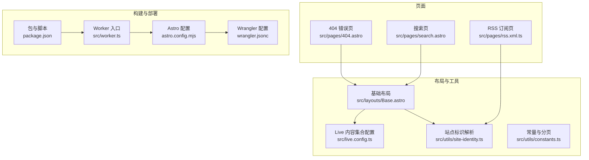
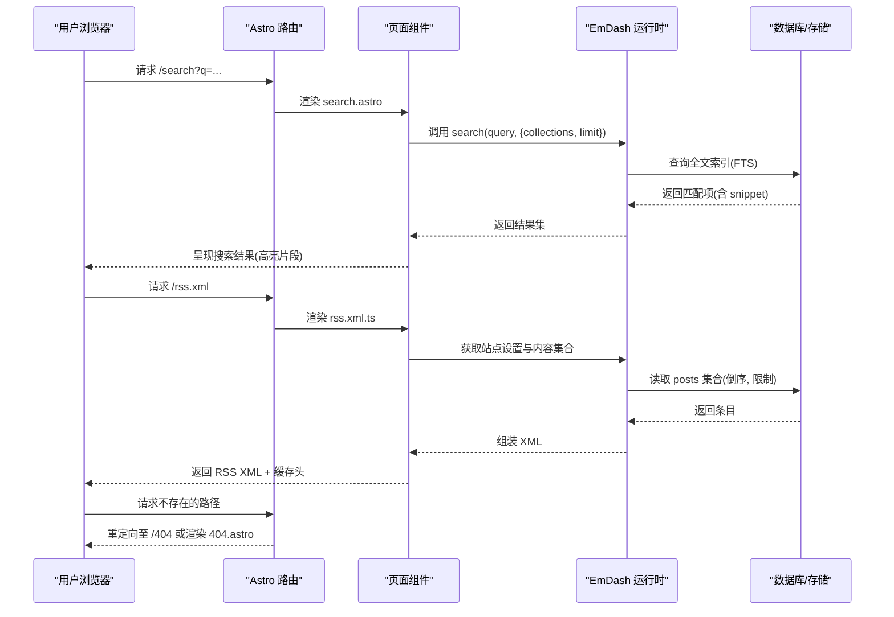
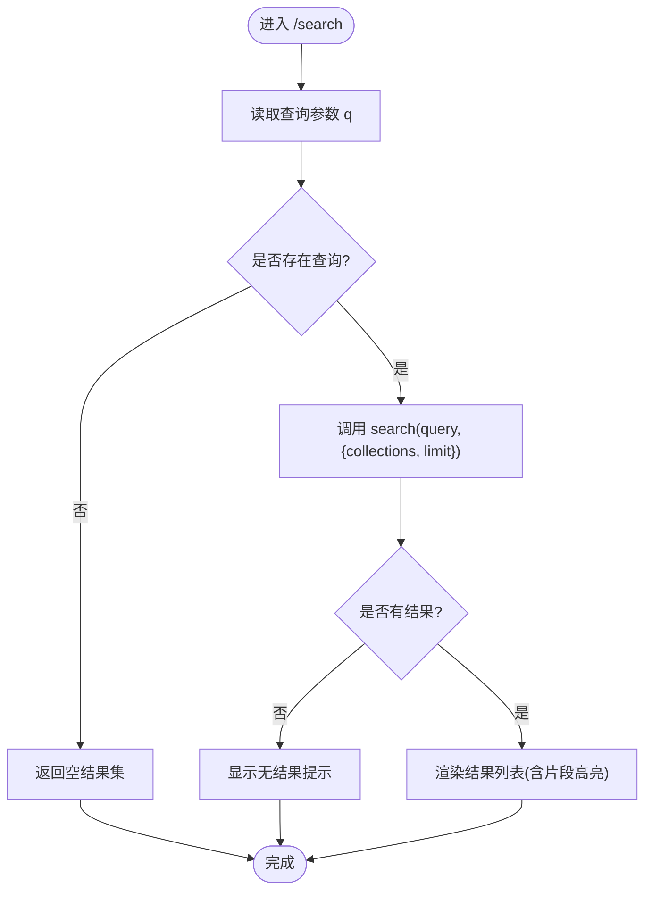
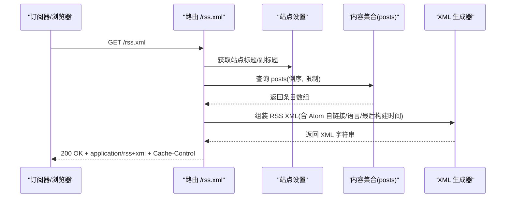
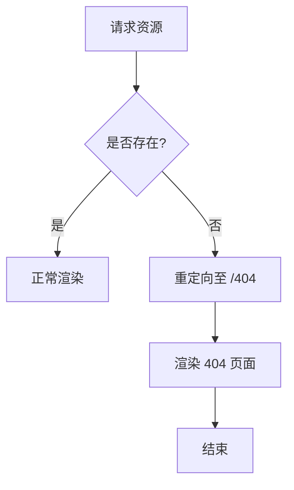
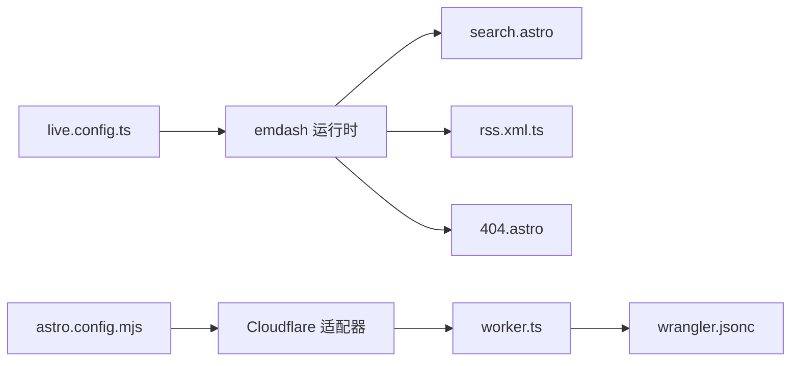

# 特殊页面处理

<cite>
**本文引用的文件**
- [search.astro](file://src/pages/search.astro)
- [rss.xml.ts](file://src/pages/rss.xml.ts)
- [404.astro](file://src/pages/404.astro)
- [Base.astro](file://src/layouts/Base.astro)
- [live.config.ts](file://src/live.config.ts)
- [site-identity.ts](file://src/utils/site-identity.ts)
- [constants.ts](file://src/utils/constants.ts)
- [astro.config.mjs](file://astro.config.mjs)
- [wrangler.jsonc](file://wrangler.jsonc)
- [worker.ts](file://src/worker.ts)
- [package.json](file://package.json)
</cite>

## 目录
1. [简介](#简介)
2. [项目结构](#项目结构)
3. [核心组件](#核心组件)
4. [架构总览](#架构总览)
5. [详细组件分析](#详细组件分析)
6. [依赖关系分析](#依赖关系分析)
7. [性能考虑](#性能考虑)
8. [故障排查指南](#故障排查指南)
9. [结论](#结论)
10. [附录](#附录)

## 简介
本文件面向 EmDash 博客模板中的“特殊页面”（搜索页、RSS 订阅页、404 错误页）处理系统，提供从实现机制到性能优化与可访问性实践的完整说明，并给出扩展与自定义的开发指引。重点覆盖：
- 搜索页面：全文检索（FTS）、实时搜索、结果排序与高亮
- RSS 订阅页：XML 生成、缓存策略与 SEO 友好性
- 404 页面：设计与用户体验优化
- 性能优化：索引建立、缓存与渲染策略
- SEO 与可访问性最佳实践
- 开发者自定义与 API 扩展

## 项目结构
EmDash 使用 Astro 作为前端框架，并通过 Cloudflare Workers 进行服务端部署。特殊页面位于 src/pages 下，布局与主题样式在 src/layouts 与 src/styles 中定义；内容集合通过 live.config.ts 配置并由 emdash 运行时加载。

图表来源
- [search.astro](file://src/pages/search.astro)
- [rss.xml.ts](file://src/pages/rss.xml.ts)
- [404.astro](file://src/pages/404.astro)
- [Base.astro](file://src/layouts/Base.astro)
- [live.config.ts](file://src/live.config.ts)
- [site-identity.ts](file://src/utils/site-identity.ts)
- [constants.ts](file://src/utils/constants.ts)
- [astro.config.mjs](file://astro.config.mjs)
- [wrangler.jsonc](file://wrangler.jsonc)
- [worker.ts](file://src/worker.ts)
- [package.json](file://package.json)

章节来源
- [astro.config.mjs](file://astro.config.mjs)
- [wrangler.jsonc](file://wrangler.jsonc)
- [worker.ts](file://src/worker.ts)
- [live.config.ts](file://src/live.config.ts)

## 核心组件
- 搜索页面：基于 EmDash 提供的全文检索 API，按查询词返回带片段高亮的结果列表，支持分页限制与集合筛选。
- RSS 订阅页：动态生成符合 RSS 2.0 规范的 XML，包含站点标题、描述、语言、最后构建时间与条目列表，设置公共缓存头。
- 404 页面：简洁明确的错误提示与返回首页链接，统一使用基础布局以保持品牌一致性。

章节来源
- [search.astro](file://src/pages/search.astro)
- [rss.xml.ts](file://src/pages/rss.xml.ts)
- [404.astro](file://src/pages/404.astro)
- [Base.astro](file://src/layouts/Base.astro)

## 架构总览
下图展示特殊页面在请求生命周期中的交互路径与数据来源：

图表来源
- [search.astro](file://src/pages/search.astro)
- [rss.xml.ts](file://src/pages/rss.xml.ts)
- [404.astro](file://src/pages/404.astro)
- [Base.astro](file://src/layouts/Base.astro)
- [live.config.ts](file://src/live.config.ts)

## 详细组件分析

### 搜索页面（全文检索、实时搜索与排序）
- 实现要点
  - 使用 EmDash 提供的全文检索 API，避免在客户端对大量内容进行匹配与排序，保证可扩展性与性能。
  - 仅在存在查询参数时执行检索，空查询返回空结果集。
  - 结果包含标题、片段（含匹配词高亮标签）与链接信息，支持跳转到对应内容页。
  - 页面标题与描述动态生成，提升 SEO 与语义化。
- 数据流与控制流
  - 读取 URL 查询参数并清理空白字符。
  - 调用检索 API 并限制返回数量。
  - 渲染表单、统计摘要与结果列表，片段通过安全方式注入。
- 用户体验
  - 自动聚焦搜索框，提升可用性。
  - 高亮匹配词，便于快速定位。
  - 无结果时提供明确提示。

图表来源
- [search.astro](file://src/pages/search.astro)

章节来源
- [search.astro](file://src/pages/search.astro)
- [Base.astro](file://src/layouts/Base.astro)

### RSS 订阅页面（XML 生成、缓存与 SEO）
- 实现要点
  - 动态生成 RSS 2.0 XML，包含频道标题、描述、语言、最后构建时间与条目列表。
  - 条目字段来自内容集合，包含标题、链接、永久 GUID、发布时间与摘要。
  - 对文本进行 XML 安全转义，防止注入与格式错误。
  - 设置公共缓存头，降低重复请求开销。
- 数据来源与顺序
  - 获取站点设置（标题、副标题），解析站点标识。
  - 查询内容集合（按发布时间倒序，限制数量）。
  - 组装 XML 字符串并返回响应。
- SEO 与可访问性
  - 提供 Atom 自链接，利于订阅器识别。
  - 语言声明为 zh-CN，增强可读性。
  - 缓存头减少服务器压力，改善首屏性能。

图表来源
- [rss.xml.ts](file://src/pages/rss.xml.ts)
- [site-identity.ts](file://src/utils/site-identity.ts)

章节来源
- [rss.xml.ts](file://src/pages/rss.xml.ts)
- [site-identity.ts](file://src/utils/site-identity.ts)

### 404 错误页面（设计与用户体验）
- 实现要点
  - 明确的错误状态与提示文案，引导用户返回首页。
  - 使用基础布局，确保品牌一致与样式统一。
  - 在内容页中，若解析失败或条目不存在，统一重定向至 404。
- 用户体验
  - 信息清晰、动作明确（返回首页）。
  - 与整体视觉风格一致，避免“跳出感”。

图表来源
- [404.astro](file://src/pages/404.astro)

章节来源
- [404.astro](file://src/pages/404.astro)

### 实时搜索（全局搜索框）
- 实现要点
  - 基础布局内集成实时搜索组件，支持多集合检索与结果高亮。
  - 支持键盘快捷键聚焦搜索框，提升效率。
  - 主题变量可定制搜索框外观与交互反馈。
- 与搜索页的关系
  - 实时搜索用于即时反馈，搜索页用于深度检索与结果浏览。

章节来源
- [Base.astro](file://src/layouts/Base.astro)

## 依赖关系分析
- 页面与运行时
  - 搜索页依赖 EmDash 的检索 API；RSS 页依赖内容集合与站点设置；404 页依赖基础布局。
- 配置与适配器
  - Astro 配置启用 Cloudflare 适配器与 emdash 集成，wrangler.jsonc 定义 D1/R2 绑定，worker.ts 导出默认入口。
- 内容集合
  - live.config.ts 定义 _emdash 集合，由 emdashLoader 加载，为页面与布局提供统一的数据访问层。

图表来源
- [live.config.ts](file://src/live.config.ts)
- [astro.config.mjs](file://astro.config.mjs)
- [worker.ts](file://src/worker.ts)
- [wrangler.jsonc](file://wrangler.jsonc)

章节来源
- [live.config.ts](file://src/live.config.ts)
- [astro.config.mjs](file://astro.config.mjs)
- [worker.ts](file://src/worker.ts)
- [wrangler.jsonc](file://wrangler.jsonc)

## 性能考虑
- 搜索性能
  - 使用全文检索（FTS）替代客户端全量扫描，复杂度随内容规模线性增长，避免 O(n) 文本匹配导致的卡顿。
  - 限制返回条数，减少 DOM 渲染与网络传输。
  - 片段高亮由后端返回，前端仅做安全注入，避免二次解析成本。
- RSS 性能
  - 设置公共缓存头，降低重复请求的计算与 I/O 开销。
  - 限制条目数量，缩短 XML 生成与传输时间。
- 渲染与缓存
  - 基础布局与主题变量集中管理，减少重复样式计算。
  - 页面级缓存提示（如内容页）可结合平台能力进一步优化。
- 部署与边缘
  - Cloudflare Workers 提供就近分发与冷启动优化，适合静态/半静态页面与轻量 API。

章节来源
- [search.astro](file://src/pages/search.astro)
- [rss.xml.ts](file://src/pages/rss.xml.ts)
- [Base.astro](file://src/layouts/Base.astro)
- [astro.config.mjs](file://astro.config.mjs)
- [wrangler.jsonc](file://wrangler.jsonc)

## 故障排查指南
- 搜索无结果或结果异常
  - 确认内容集合已启用“搜索”功能且字段标记为可搜索。
  - 检查检索参数是否为空或被清理。
  - 查看检索 API 返回结构与限制参数。
- RSS XML 解析错误
  - 核对 XML 转义逻辑，确保标题、描述等字段正确转义。
  - 检查条目必填字段（发布时间）是否缺失。
- 404 未生效
  - 确认内容页在解析失败时会重定向至 /404。
  - 检查路径参数与解码逻辑。
- 缓存问题
  - RSS 页面缓存头是否正确设置。
  - Cloudflare 缓存策略是否覆盖该路径。

章节来源
- [search.astro](file://src/pages/search.astro)
- [rss.xml.ts](file://src/pages/rss.xml.ts)
- [404.astro](file://src/pages/404.astro)
- [Base.astro](file://src/layouts/Base.astro)

## 结论
EmDash 的特殊页面处理系统以“高性能、可扩展、易维护”为核心目标：通过全文检索 API 保障搜索体验，通过动态 RSS 生成与缓存策略提升订阅体验，通过统一布局与简洁 404 设计强化品牌一致性。配合 Cloudflare 部署与 Astro 配置，系统在可访问性、SEO 与性能方面均具备良好基础。开发者可在现有接口与组件上进行扩展，实现更丰富的特殊页面与 API。

## 附录

### SEO 与可访问性最佳实践
- 搜索页
  - 使用语义化标题与描述，确保搜索引擎正确理解页面意图。
  - 保持片段高亮与链接可点击，提升可读性与可达性。
- RSS 页
  - 提供 Atom 自链接与语言声明，增强订阅器识别与可读性。
  - 控制条目数量与更新频率，避免过大的 XML 文件。
- 404 页
  - 明确错误信息与返回路径，减少用户迷失。
  - 保持与整体设计一致，避免视觉割裂。

### 开发者自定义与 API 扩展指引
- 自定义搜索页面
  - 复用检索 API，扩展集合范围或增加过滤条件。
  - 自定义结果排序与高亮样式，结合主题变量实现一致外观。
- 自定义 RSS 页面
  - 在现有基础上增加自定义字段或调整条目来源。
  - 调整缓存策略与内容长度，平衡新鲜度与性能。
- 自定义 404 页面
  - 增加面包屑、推荐链接或社交分享按钮，提升回访率。
- 插件与 API
  - 参考插件 API 路由规范，定义输入校验与返回值结构。
  - 使用 KV 存储状态或缓存中间结果，减少重复计算。

章节来源
- [search.astro](file://src/pages/search.astro)
- [rss.xml.ts](file://src/pages/rss.xml.ts)
- [404.astro](file://src/pages/404.astro)
- [.agents/skills/creating-plugins/references/api-routes.md](file://.agents/skills/creating-plugins/references/api-routes.md)