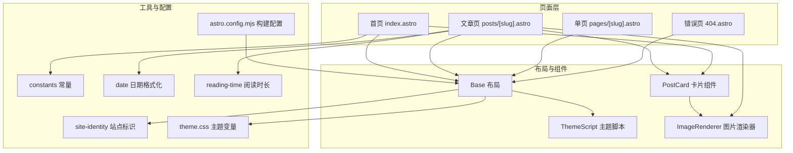
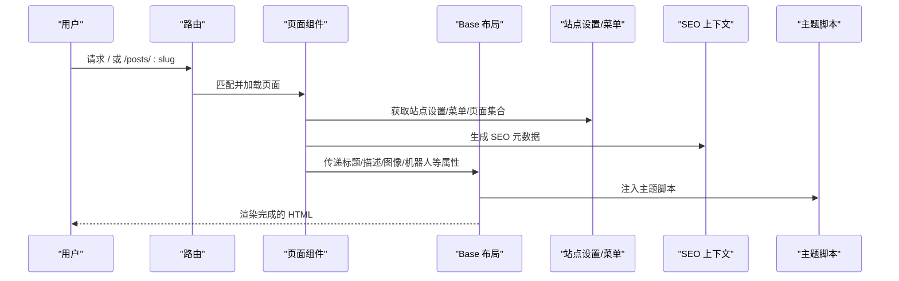
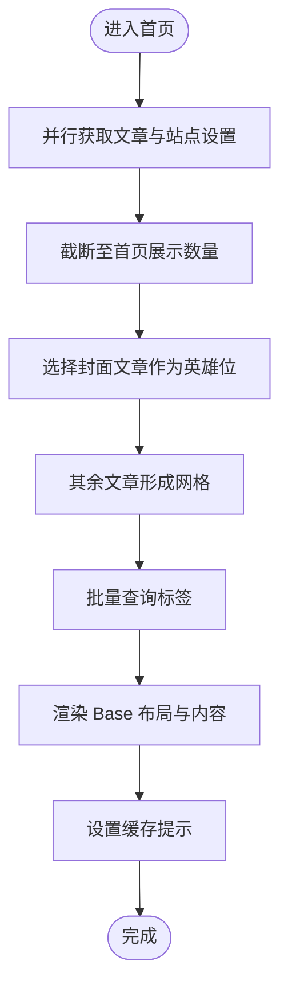
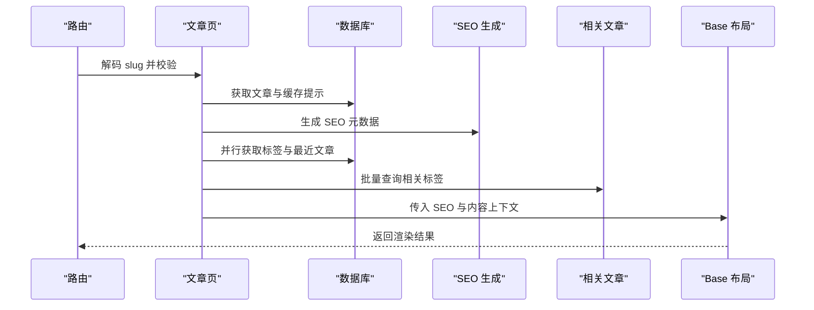
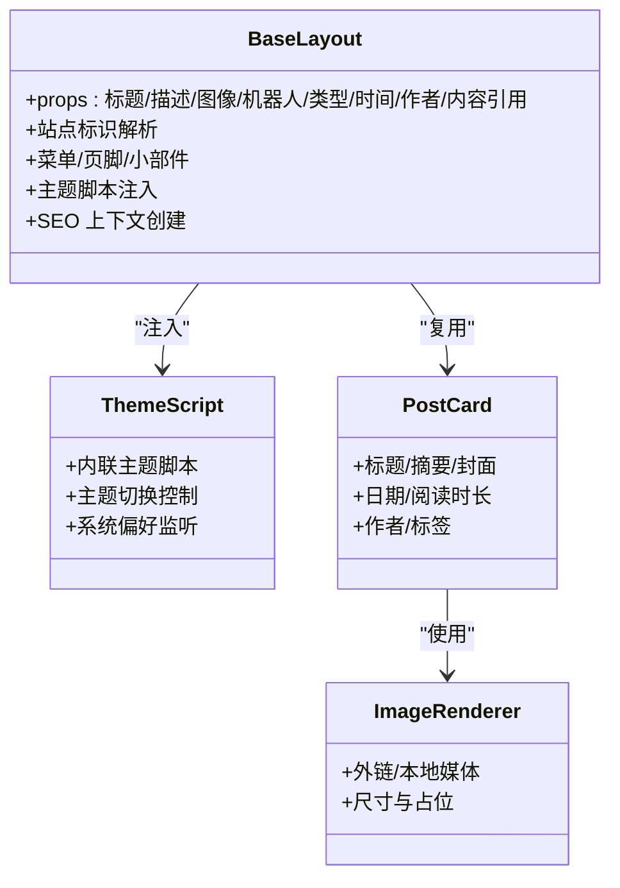
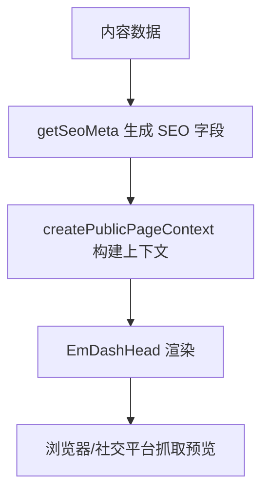
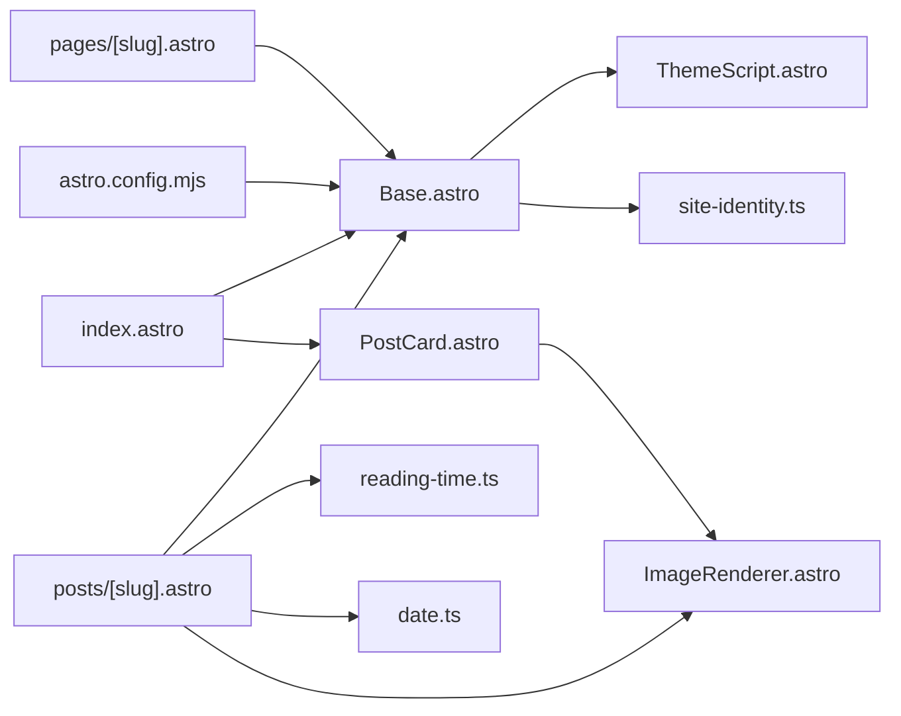

# 静态页面系统

<cite>
**本文档引用的文件**
- [src/pages/index.astro](file://src/pages/index.astro)
- [src/pages/404.astro](file://src/pages/404.astro)
- [src/pages/posts/[slug].astro](file://src/pages/posts/[slug].astro)
- [src/pages/pages/[slug].astro](file://src/pages/pages/[slug].astro)
- [src/layouts/Base.astro](file://src/layouts/Base.astro)
- [src/components/layout/ThemeScript.astro](file://src/components/layout/ThemeScript.astro)
- [src/components/PostCard.astro](file://src/components/PostCard.astro)
- [src/components/ImageRenderer.astro](file://src/components/ImageRenderer.astro)
- [src/utils/site-identity.ts](file://src/utils/site-identity.ts)
- [src/utils/constants.ts](file://src/utils/constants.ts)
- [src/utils/date.ts](file://src/utils/date.ts)
- [src/utils/reading-time.ts](file://src/utils/reading-time.ts)
- [src/styles/theme.css](file://src/styles/theme.css)
- [astro.config.mjs](file://astro.config.mjs)
- [seed/seed.json](file://seed/seed.json)
</cite>

## 目录
1. [简介](#简介)
2. [项目结构](#项目结构)
3. [核心组件](#核心组件)
4. [架构总览](#架构总览)
5. [详细组件分析](#详细组件分析)
6. [依赖关系分析](#依赖关系分析)
7. [性能考虑](#性能考虑)
8. [故障排除指南](#故障排除指南)
9. [结论](#结论)
10. [附录](#附录)

## 简介
本文件系统性阐述 EmDash 在 Astro 中的静态页面体系：从纯 HTML 页面与 Astro 组件页面的差异，到首页、单页与错误页的实现模式；覆盖页面元数据管理、SEO 设置与社交媒体预览配置；总结预渲染、缓存与压缩等性能优化策略；并给出模板继承与组件复用的最佳实践及扩展建议。

## 项目结构
EmDash 的静态页面主要位于 src/pages 下，采用 Astro 的路由约定（动态参数以方括号命名）。页面通过 Base 布局统一注入站点信息、菜单、搜索、主题切换与 SEO 元数据。工具函数与样式位于 src/utils 与 src/styles，构建配置在 astro.config.mjs。

**图表来源**
- [src/pages/index.astro:1-463](file://src/pages/index.astro#L1-L463)
- [src/pages/posts/[slug].astro](file://src/pages/posts/[slug].astro#L1-L980)
- [src/pages/pages/[slug].astro](file://src/pages/pages/[slug].astro#L1-L109)
- [src/pages/404.astro:1-34](file://src/pages/404.astro#L1-L34)
- [src/layouts/Base.astro:1-968](file://src/layouts/Base.astro#L1-L968)
- [src/components/layout/ThemeScript.astro:1-84](file://src/components/layout/ThemeScript.astro#L1-L84)
- [src/components/PostCard.astro:1-285](file://src/components/PostCard.astro#L1-L285)
- [src/components/ImageRenderer.astro:1-36](file://src/components/ImageRenderer.astro#L1-L36)
- [src/utils/constants.ts:1-9](file://src/utils/constants.ts#L1-L9)
- [src/utils/date.ts:1-18](file://src/utils/date.ts#L1-L18)
- [src/utils/reading-time.ts:1-67](file://src/utils/reading-time.ts#L1-L67)
- [src/utils/site-identity.ts:1-25](file://src/utils/site-identity.ts#L1-L25)
- [src/styles/theme.css:1-109](file://src/styles/theme.css#L1-L109)
- [astro.config.mjs:1-45](file://astro.config.mjs#L1-L45)

**章节来源**
- [astro.config.mjs:1-45](file://astro.config.mjs#L1-L45)
- [src/layouts/Base.astro:1-968](file://src/layouts/Base.astro#L1-L968)

## 核心组件
- Base 布局：负责注入站点标识、菜单、页头 SEO 上下文、主题脚本、页脚与小部件区域，并作为所有页面的模板容器。
- ThemeScript：内联主题脚本，避免首屏闪烁，支持用户选择与系统偏好联动。
- PostCard：文章卡片组件，复用图片渲染、作者信息、标签与摘要展示。
- ImageRenderer：根据媒体来源（本地或外链）选择合适的渲染方式。
- 工具模块：站点标识解析、常量定义、日期格式化、阅读时长计算。
- 主题样式：通过 CSS 变量与图层机制提供可定制的主题基线。

**章节来源**
- [src/layouts/Base.astro:1-968](file://src/layouts/Base.astro#L1-L968)
- [src/components/layout/ThemeScript.astro:1-84](file://src/components/layout/ThemeScript.astro#L1-L84)
- [src/components/PostCard.astro:1-285](file://src/components/PostCard.astro#L1-L285)
- [src/components/ImageRenderer.astro:1-36](file://src/components/ImageRenderer.astro#L1-L36)
- [src/utils/site-identity.ts:1-25](file://src/utils/site-identity.ts#L1-L25)
- [src/utils/constants.ts:1-9](file://src/utils/constants.ts#L1-L9)
- [src/utils/date.ts:1-18](file://src/utils/date.ts#L1-L18)
- [src/utils/reading-time.ts:1-67](file://src/utils/reading-time.ts#L1-L67)
- [src/styles/theme.css:1-109](file://src/styles/theme.css#L1-L109)

## 架构总览
EmDash 的静态页面渲染遵循 Astro 的“页面即组件”模型：每个页面由一个 Astro 文件组成，包含页面逻辑与模板；页面通过 Base 布局实现模板继承；SEO 与社交预览通过 createPublicPageContext 与 EmDashHead 注入；主题与字体通过 Base 布局集中管理；图片与媒体通过 ImageRenderer 与 Cloudflare R2 存储集成。

**图表来源**
- [src/pages/index.astro:1-463](file://src/pages/index.astro#L1-L463)
- [src/pages/posts/[slug].astro](file://src/pages/posts/[slug].astro#L1-L980)
- [src/pages/pages/[slug].astro](file://src/pages/pages/[slug].astro#L1-L109)
- [src/pages/404.astro:1-34](file://src/pages/404.astro#L1-L34)
- [src/layouts/Base.astro:1-968](file://src/layouts/Base.astro#L1-L968)
- [src/components/layout/ThemeScript.astro:1-84](file://src/components/layout/ThemeScript.astro#L1-L84)

## 详细组件分析

### 首页实现模式
- 数据获取：并行拉取文章集合与站点设置，限制首页展示数量并预留“查看更多”判断位。
- 内容组织：优先选取带封面图的文章作为英雄位，其余文章形成网格；批量查询标签以避免 N+1。
- 模板渲染：使用 Base 布局包裹，为空状态提供引导链接。
- 性能要点：利用 Astro.cache.set 提示缓存；服务端并行查询减少往返。

**图表来源**
- [src/pages/index.astro:19-65](file://src/pages/index.astro#L19-L65)

**章节来源**
- [src/pages/index.astro:1-463](file://src/pages/index.astro#L1-L463)
- [src/utils/constants.ts:1-9](file://src/utils/constants.ts#L1-L9)

### 文章单页实现模式
- 路由与校验：解码 slug 并进行存在性检查，不存在则重定向 404。
- SEO 生成：基于内容生成标题、描述、OG 图像与 canonical，支持默认 OG 图像回退。
- 关联内容：并行获取标签与相关文章，批量查询标签减少查询次数。
- 结构化布局：三栏式布局（元信息/主内容/侧边栏），内置目录生成与滚动高亮。
- 评论与表单：通过 UI 组件集成评论系统。

**图表来源**
- [src/pages/posts/[slug].astro](file://src/pages/posts/[slug].astro#L25-L125)

**章节来源**
- [src/pages/posts/[slug].astro](file://src/pages/posts/[slug].astro#L1-L980)
- [src/utils/date.ts:1-18](file://src/utils/date.ts#L1-L18)
- [src/utils/reading-time.ts:1-67](file://src/utils/reading-time.ts#L1-L67)

### 单页实现模式
- 路由与校验：与文章页一致，解码 slug 并处理不存在情况。
- 内容渲染：使用 PortableText 渲染富文本内容。
- SEO 与上下文：传递页面内容上下文给 Base 布局。

**章节来源**
- [src/pages/pages/[slug].astro](file://src/pages/pages/[slug].astro#L1-L109)

### 错误页面实现模式
- 基于 Base 布局，提供简洁的 404 提示与返回首页链接。
- 适合全局错误页与路由兜底。

**章节来源**
- [src/pages/404.astro:1-34](file://src/pages/404.astro#L1-L34)

### 布局与模板继承
- Base 布局作为所有页面的父级容器，集中处理站点标识、菜单、页脚、小部件区、主题脚本与 SEO 上下文。
- 通过 createPublicPageContext 将页面类型、标题、描述、图像、内容引用等安全地传递给 EmDashHead。
- 支持“自定义页面”与“内容页面”的差异化上下文。

**图表来源**
- [src/layouts/Base.astro:1-968](file://src/layouts/Base.astro#L1-L968)
- [src/components/layout/ThemeScript.astro:1-84](file://src/components/layout/ThemeScript.astro#L1-L84)
- [src/components/PostCard.astro:1-285](file://src/components/PostCard.astro#L1-L285)
- [src/components/ImageRenderer.astro:1-36](file://src/components/ImageRenderer.astro#L1-L36)

**章节来源**
- [src/layouts/Base.astro:1-968](file://src/layouts/Base.astro#L1-L968)
- [src/components/layout/ThemeScript.astro:1-84](file://src/components/layout/ThemeScript.astro#L1-L84)
- [src/components/PostCard.astro:1-285](file://src/components/PostCard.astro#L1-L285)
- [src/components/ImageRenderer.astro:1-36](file://src/components/ImageRenderer.astro#L1-L36)

### 页面元数据管理、SEO 设置与社交媒体预览
- SEO 元数据生成：在文章页通过 getSeoMeta 从内容派生标题、描述、OG 图像与 robots 等字段。
- 社交预览：通过 EmDashHead 渲染 Open Graph、Twitter Card 等标签。
- canonical 与 robots：支持按内容动态设置，便于搜索引擎优化。
- 站点标识：resolveBlogSiteIdentity 统一解析站点标题、副标题与 Logo。

**图表来源**
- [src/pages/posts/[slug].astro](file://src/pages/posts/[slug].astro#L70-L76)
- [src/layouts/Base.astro:61-74](file://src/layouts/Base.astro#L61-L74)
- [src/utils/site-identity.ts:18-24](file://src/utils/site-identity.ts#L18-L24)

**章节来源**
- [src/pages/posts/[slug].astro](file://src/pages/posts/[slug].astro#L70-L76)
- [src/layouts/Base.astro:61-74](file://src/layouts/Base.astro#L61-L74)
- [src/utils/site-identity.ts:18-24](file://src/utils/site-identity.ts#L18-L24)

### 组件复用最佳实践
- PostCard：统一卡片结构，支持作者、日期、阅读时长、标签与封面图，便于在首页、文章页与归档页复用。
- ImageRenderer：抽象外链与本地媒体渲染差异，减少重复逻辑。
- Base 布局：将通用头部、导航、页脚、小部件与主题脚本集中管理，降低页面耦合度。
- 工具函数：日期格式化、阅读时长计算、站点标识解析，确保跨页面一致性。

**章节来源**
- [src/components/PostCard.astro:1-285](file://src/components/PostCard.astro#L1-L285)
- [src/components/ImageRenderer.astro:1-36](file://src/components/ImageRenderer.astro#L1-L36)
- [src/layouts/Base.astro:1-968](file://src/layouts/Base.astro#L1-L968)
- [src/utils/date.ts:1-18](file://src/utils/date.ts#L1-L18)
- [src/utils/reading-time.ts:1-67](file://src/utils/reading-time.ts#L1-L67)
- [src/utils/site-identity.ts:1-25](file://src/utils/site-identity.ts#L1-L25)

## 依赖关系分析
- 页面依赖 Base 布局与站点工具模块；文章页额外依赖 SEO 与阅读时长工具。
- 组件之间通过 props 传递数据，保持低耦合高内聚。
- 构建配置启用 Cloudflare 适配器与 React 集成，字体通过 Google Fonts 提供。

**图表来源**
- [src/pages/index.astro:1-463](file://src/pages/index.astro#L1-L463)
- [src/pages/posts/[slug].astro](file://src/pages/posts/[slug].astro#L1-L980)
- [src/pages/pages/[slug].astro](file://src/pages/pages/[slug].astro#L1-L109)
- [src/layouts/Base.astro:1-968](file://src/layouts/Base.astro#L1-L968)
- [src/components/layout/ThemeScript.astro:1-84](file://src/components/layout/ThemeScript.astro#L1-L84)
- [src/components/PostCard.astro:1-285](file://src/components/PostCard.astro#L1-L285)
- [src/components/ImageRenderer.astro:1-36](file://src/components/ImageRenderer.astro#L1-L36)
- [src/utils/date.ts:1-18](file://src/utils/date.ts#L1-L18)
- [src/utils/reading-time.ts:1-67](file://src/utils/reading-time.ts#L1-L67)
- [src/utils/site-identity.ts:1-25](file://src/utils/site-identity.ts#L1-L25)
- [astro.config.mjs:1-45](file://astro.config.mjs#L1-L45)

**章节来源**
- [astro.config.mjs:1-45](file://astro.config.mjs#L1-L45)
- [src/layouts/Base.astro:1-968](file://src/layouts/Base.astro#L1-L968)

## 性能考虑
- 预渲染与缓存
  - 利用 Astro.cache.set 提示缓存，结合 Cloudflare 边缘缓存提升命中率。
  - 首页与文章页采用并行查询，减少请求往返。
- 资源优化
  - 图片渲染器自动区分外链与本地媒体，配合 Cloudflare R2 存储与图像优化。
  - 字体通过 Google Fonts 提供，Base 布局中预加载关键字体变量。
- 压缩与传输
  - 构建输出为 server 模式并使用 Cloudflare 适配器，结合平台压缩能力。
- 代码分割与懒加载
  - 文章页目录与评论等模块按需加载，避免阻塞首屏。
- 主题与样式
  - 使用 CSS 变量与图层机制，减少样式冲突与重绘开销。

**章节来源**
- [src/pages/index.astro:19-28](file://src/pages/index.astro#L19-L28)
- [src/pages/posts/[slug].astro](file://src/pages/posts/[slug].astro#L88-L96)
- [src/components/ImageRenderer.astro:1-36](file://src/components/ImageRenderer.astro#L1-L36)
- [src/styles/theme.css:1-109](file://src/styles/theme.css#L1-L109)
- [astro.config.mjs:10-15](file://astro.config.mjs#L10-L15)

## 故障排除指南
- 404 页面
  - 当 slug 无效或内容不存在时，页面会重定向至 404.astro，确保用户体验与 SEO 友好。
- SEO 问题
  - 若社交预览未显示，检查文章是否正确生成 OG 图像与描述；确认 EmDashHead 已被渲染。
- 主题闪烁
  - ThemeScript 为内联脚本，确保在 DOM 解析前执行，避免主题切换导致的闪烁。
- 图片不显示
  - 检查 ImageRenderer 的外链与本地媒体分支；确认 Cloudflare R2 绑定与权限配置。

**章节来源**
- [src/pages/404.astro:1-34](file://src/pages/404.astro#L1-L34)
- [src/components/layout/ThemeScript.astro:1-84](file://src/components/layout/ThemeScript.astro#L1-L84)
- [src/components/ImageRenderer.astro:1-36](file://src/components/ImageRenderer.astro#L1-L36)

## 结论
EmDash 的静态页面系统以 Astro 组件化页面为核心，通过 Base 布局实现模板继承与统一资源管理；借助 SEO 工具与 Cloudflare 生态实现高性能与良好的社交预览体验；组件化设计与并行查询策略保障了可维护性与性能表现。开发者可在现有模式上扩展新页面、增强 SEO 与主题定制能力。

## 附录
- 动态路由约定
  - 首页：/ → index.astro
  - 文章详情：/posts/:slug → posts/[slug].astro
  - 单页：/pages/:slug → pages/[slug].astro
  - 错误页：/404 → 404.astro
- 小部件区域
  - 侧边栏：文章页右侧目录与小部件
  - 页脚：站点标识、导航与社交链接
- 主题定制
  - 修改 src/styles/theme.css 中的 CSS 变量即可完成主题重写

**章节来源**
- [seed/seed.json:137-207](file://seed/seed.json#L137-L207)
- [src/styles/theme.css:1-109](file://src/styles/theme.css#L1-L109)
- [src/layouts/Base.astro:135-271](file://src/layouts/Base.astro#L135-L271)