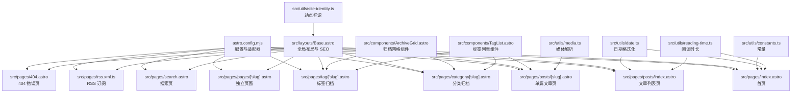
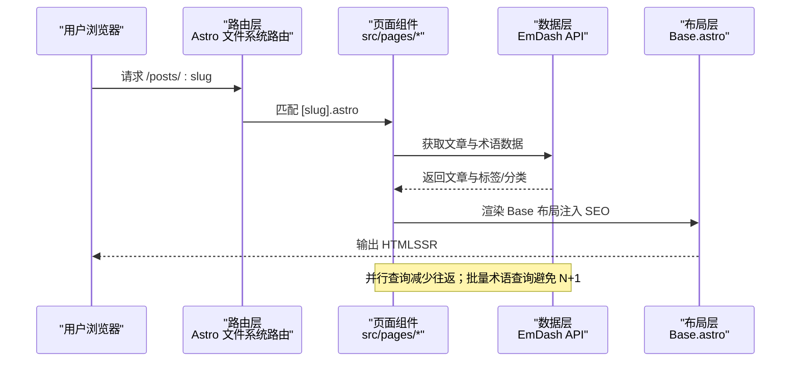
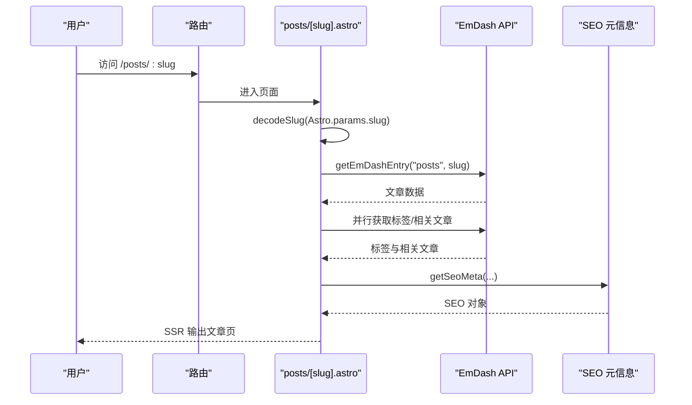
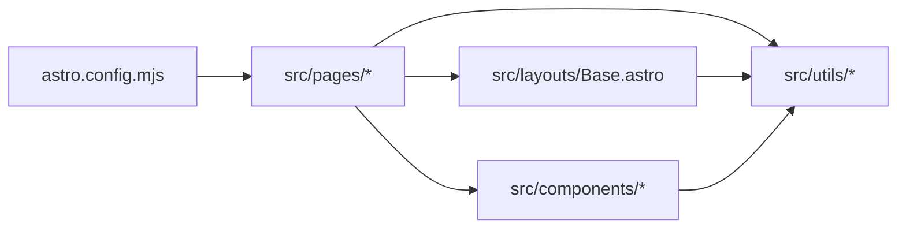

# 页面和路由

<cite>
**本文引用的文件**
- [src/pages/index.astro](file://src/pages/index.astro)
- [src/pages/posts/[slug].astro](file://src/pages/posts/[slug].astro)
- [src/pages/posts/index.astro](file://src/pages/posts/index.astro)
- [src/pages/category/[slug].astro](file://src/pages/category/[slug].astro)
- [src/pages/tag/[slug].astro](file://src/pages/tag/[slug].astro)
- [src/pages/pages/[slug].astro](file://src/pages/pages/[slug].astro)
- [src/pages/search.astro](file://src/pages/search.astro)
- [src/pages/rss.xml.ts](file://src/pages/rss.xml.ts)
- [src/pages/404.astro](file://src/pages/404.astro)
- [src/layouts/Base.astro](file://src/layouts/Base.astro)
- [src/components/ArchiveGrid.astro](file://src/components/ArchiveGrid.astro)
- [src/components/TagList.astro](file://src/components/TagList.astro)
- [src/utils/constants.ts](file://src/utils/constants.ts)
- [src/utils/date.ts](file://src/utils/date.ts)
- [src/utils/media.ts](file://src/utils/media.ts)
- [src/utils/reading-time.ts](file://src/utils/reading-time.ts)
- [src/utils/site-identity.ts](file://src/utils/site-identity.ts)
- [astro.config.mjs](file://astro.config.mjs)
- [package.json](file://package.json)
</cite>

## 目录
1. [简介](#简介)
2. [项目结构](#项目结构)
3. [核心组件](#核心组件)
4. [架构总览](#架构总览)
5. [详细组件分析](#详细组件分析)
6. [依赖分析](#依赖分析)
7. [性能考虑](#性能考虑)
8. [故障排查指南](#故障排查指南)
9. [结论](#结论)
10. [附录](#附录)

## 简介
本文件系统性梳理 EmDash 博客在 Astro 基础上的页面与路由体系，覆盖静态页面生成与动态内容加载、各类页面类型（首页、文章列表、单篇文章、分类归档、标签归档、搜索页面、RSS 订阅、404）的路由配置与实现细节；解释路由参数处理、URL 重写与 404 机制；总结页面组件生命周期与数据获取模式；给出 SEO 友好 URL 设计与性能优化策略，并提供可扩展的自定义路由与页面开发指引。

## 项目结构
EmDash 使用 Astro 作为前端框架，结合 EmDash CMS 提供的集成能力，页面位于 src/pages 下，布局与通用组件位于 src/layouts 与 src/components，工具函数位于 src/utils。站点适配 Cloudflare Workers，使用服务端渲染输出。

图表来源
- [astro.config.mjs:1-45](file://astro.config.mjs#L1-L45)
- [src/pages/index.astro:1-463](file://src/pages/index.astro#L1-L463)
- [src/pages/posts/index.astro:1-269](file://src/pages/posts/index.astro#L1-L269)
- [src/pages/posts/[slug].astro:1-980](file://src/pages/posts/[slug].astro#L1-L980)
- [src/pages/category/[slug].astro:1-93](file://src/pages/category/[slug].astro#L1-L93)
- [src/pages/tag/[slug].astro:1-95](file://src/pages/tag/[slug].astro#L1-L95)
- [src/pages/pages/[slug].astro:1-109](file://src/pages/pages/[slug].astro#L1-L109)
- [src/pages/search.astro:1-183](file://src/pages/search.astro#L1-L183)
- [src/pages/rss.xml.ts:1-71](file://src/pages/rss.xml.ts#L1-L71)
- [src/pages/404.astro:1-34](file://src/pages/404.astro#L1-L34)
- [src/layouts/Base.astro:1-968](file://src/layouts/Base.astro#L1-L968)
- [src/components/ArchiveGrid.astro:1-64](file://src/components/ArchiveGrid.astro#L1-L64)
- [src/components/TagList.astro:1-45](file://src/components/TagList.astro#L1-L45)
- [src/utils/constants.ts:1-9](file://src/utils/constants.ts#L1-L9)
- [src/utils/date.ts](file://src/utils/date.ts)
- [src/utils/media.ts](file://src/utils/media.ts)
- [src/utils/reading-time.ts](file://src/utils/reading-time.ts)
- [src/utils/site-identity.ts](file://src/utils/site-identity.ts)

章节来源
- [astro.config.mjs:1-45](file://astro.config.mjs#L1-L45)
- [package.json:1-33](file://package.json#L1-L33)

## 核心组件
- 全局布局 Base.astro：负责注入 SEO 头部、站点菜单、社交链接、页脚部件区、主题切换等；为内容页提供统一的页面上下文（含 SEO 数据与文章元信息）。
- 归档网格 ArchiveGrid.astro：用于分类/标签归档页的列表展示，支持响应式网格与标签渲染。
- 标签列表 TagList.astro：用于文章详情页或归档页的标签展示，提供统一的标签链接样式。
- 工具模块：
  - constants.ts：定义断点与首页显示条数等常量。
  - date.ts：日期格式化工具。
  - media.ts：媒体资源解析与 URL 构建。
  - reading-time.ts：阅读时长计算。
  - site-identity.ts：站点标题、副标题、Logo 等标识解析。

章节来源
- [src/layouts/Base.astro:1-968](file://src/layouts/Base.astro#L1-L968)
- [src/components/ArchiveGrid.astro:1-64](file://src/components/ArchiveGrid.astro#L1-L64)
- [src/components/TagList.astro:1-45](file://src/components/TagList.astro#L1-L45)
- [src/utils/constants.ts:1-9](file://src/utils/constants.ts#L1-L9)

## 架构总览
EmDash 的页面与路由遵循 Astro 的文件系统路由约定，结合 EmDash 提供的数据访问 API 实现动态内容加载。站点采用服务端渲染输出，Cloudflare 适配器负责部署与边缘缓存。

图表来源
- [src/pages/posts/[slug].astro:1-980](file://src/pages/posts/[slug].astro#L1-L980)
- [src/layouts/Base.astro:1-968](file://src/layouts/Base.astro#L1-L968)

## 详细组件分析

### 首页（src/pages/index.astro）
- 功能要点
  - 并行获取文章集合与站点设置，限制首页展示数量并裁剪“溢出”以判断“查看全部”按钮。
  - 选择首张带封面图的文章作为英雄位，其余文章组成网格（最多 6 个），并批量获取标签以避免 N+1。
  - 使用站点标识构建标题与描述，注入 Astro 缓存提示。
- SEO 与性能
  - 通过 Base 布局注入站点标题与描述，确保首页 SEO 友好。
  - 批量术语查询与数据库侧排序降低客户端开销。
- 路由与参数
  - 静态路由，无需参数。

章节来源
- [src/pages/index.astro:1-463](file://src/pages/index.astro#L1-L463)
- [src/utils/constants.ts:7-9](file://src/utils/constants.ts#L7-L9)

### 文章列表页（src/pages/posts/index.astro）
- 功能要点
  - 数据库侧按发布时间倒序，批量获取所有文章及其标签与署名信息。
  - 列表项包含标题、摘要、发布时间、阅读时长与标签云。
- 性能
  - 批量术语查询与数据库排序，避免客户端全量处理。

章节来源
- [src/pages/posts/index.astro:1-269](file://src/pages/posts/index.astro#L1-L269)

### 单篇文章页（src/pages/posts/[slug].astro）
- 功能要点
  - 解码路由参数 slug，若无效则重定向至 404。
  - 获取文章、SEO 元信息、相关文章与标签；并行请求提升性能。
  - 构建 OpenGraph 图片 URL（支持外链与本地存储键）。
  - 客户端脚本自动生成目录（基于 h2/h3），并高亮当前段落。
- SEO 与缓存
  - 使用 getSeoMeta 生成标题、描述、OG 图与 canonical；注入 Astro 缓存提示。
- 错误处理
  - 文章不存在或 slug 解码失败时重定向到 404。

图表来源
- [src/pages/posts/[slug].astro:1-980](file://src/pages/posts/[slug].astro#L1-L980)
- [src/utils/media.ts](file://src/utils/media.ts)
- [src/utils/site-identity.ts](file://src/utils/site-identity.ts)

章节来源
- [src/pages/posts/[slug].astro:1-980](file://src/pages/posts/[slug].astro#L1-L980)

### 分类归档页（src/pages/category/[slug].astro）
- 功能要点
  - 通过术语 API 获取分类信息，不存在则 404。
  - 按分类筛选文章并批量获取标签，交由 ArchiveGrid 组件渲染。
- 性能
  - 批量术语查询避免逐条查询。

章节来源
- [src/pages/category/[slug].astro:1-93](file://src/pages/category/[slug].astro#L1-L93)
- [src/components/ArchiveGrid.astro:1-64](file://src/components/ArchiveGrid.astro#L1-L64)

### 标签归档页（src/pages/tag/[slug].astro）
- 功能要点
  - 通过术语 API 获取标签信息，不存在则 404。
  - 按标签筛选文章并批量获取标签，交由 ArchiveGrid 组件渲染。
- 性能
  - 批量术语查询避免逐条查询。

章节来源
- [src/pages/tag/[slug].astro:1-95](file://src/pages/tag/[slug].astro#L1-L95)
- [src/components/ArchiveGrid.astro:1-64](file://src/components/ArchiveGrid.astro#L1-L64)

### 独立页面（src/pages/pages/[slug].astro）
- 功能要点
  - 解码 slug 后获取页面内容，不存在则 404。
  - 使用 Base 布局渲染富文本内容。
- 适用场景
  - 关于、联系等非文章型页面。

章节来源
- [src/pages/pages/[slug].astro:1-109](file://src/pages/pages/[slug].astro#L1-L109)

### 搜索页（src/pages/search.astro）
- 功能要点
  - 从 URL 查询参数读取 q，使用全文检索 API 返回带片段的结果。
  - 使用 Base 布局，prerender 关闭以启用客户端交互。
- 性能
  - 采用 FTS 后端检索，避免全量加载与客户端过滤。

章节来源
- [src/pages/search.astro:1-183](file://src/pages/search.astro#L1-L183)

### RSS 订阅（src/pages/rss.xml.ts）
- 功能要点
  - API Route 动态生成 RSS 2.0，包含标题、描述、语言、最后构建时间与文章条目。
  - 条目包含标题、链接、GUID、发布时间与描述，并进行 XML 转义。
  - 设置缓存头，提升边缘分发效率。
- URL
  - /rss.xml

章节来源
- [src/pages/rss.xml.ts:1-71](file://src/pages/rss.xml.ts#L1-L71)

### 404 错误页（src/pages/404.astro）
- 功能要点
  - 简洁的错误提示与返回首页链接。
  - 作为 Astro 的 404 页面自动生效。

章节来源
- [src/pages/404.astro:1-34](file://src/pages/404.astro#L1-L34)

### 布局与 SEO（src/layouts/Base.astro）
- 功能要点
  - 注入站点标识、菜单、社交菜单、页脚页面与小部件区。
  - 通过 createPublicPageContext 构建公共页面上下文，传递 SEO 与文章元信息。
  - 提供站点搜索组件与主题切换。
- 作用
  - 为所有页面提供一致的头部、导航、页脚与 SEO 元素。

章节来源
- [src/layouts/Base.astro:1-968](file://src/layouts/Base.astro#L1-L968)

## 依赖分析
- 配置与适配器
  - astro.config.mjs：输出 server、Cloudflare 适配器、React 集成、EmDash 集成（D1/R2/Sandbox 插件）、字体配置。
- 依赖关系
  - 页面组件依赖 EmDash 数据 API（获取条目、集合、术语、SEO 元信息）。
  - 布局依赖站点设置与菜单数据。
  - 组件复用（ArchiveGrid、TagList）降低重复逻辑。

图表来源
- [astro.config.mjs:1-45](file://astro.config.mjs#L1-L45)
- [src/pages/index.astro:1-463](file://src/pages/index.astro#L1-L463)
- [src/layouts/Base.astro:1-968](file://src/layouts/Base.astro#L1-L968)
- [src/components/ArchiveGrid.astro:1-64](file://src/components/ArchiveGrid.astro#L1-L64)
- [src/components/TagList.astro:1-45](file://src/components/TagList.astro#L1-L45)

章节来源
- [astro.config.mjs:1-45](file://astro.config.mjs#L1-L45)
- [package.json:1-33](file://package.json#L1-L33)

## 性能考虑
- 数据获取优化
  - 批量术语查询：在首页、文章列表、归档页使用 getTermsForEntries 批量获取标签，避免 N+1。
  - 并行请求：文章详情页中 SEO 元信息、相关文章与标签查询并行执行。
  - 数据库侧排序：文章列表与首页均在数据库内按 published_at 排序，减少客户端处理。
- 缓存与 SSR
  - Astro 缓存提示：首页与各页面在获取数据后设置 cacheHint，配合服务端渲染与边缘缓存。
  - RSS 缓存头：设置 Cache-Control，提升 CDN 分发效率。
- 客户端优化
  - 目录生成：文章页客户端脚本仅在存在标题时生成目录，避免无意义 DOM。
  - 搜索：使用 FTS API，避免全量加载与客户端过滤。
- 响应式与资源
  - 断点与网格：constants.ts 定义断点，ArchiveGrid/TagList 组件响应式布局。
  - 媒体解析：media.ts 统一处理外链与本地存储键，保证图片 URL 正确性。

章节来源
- [src/pages/index.astro:1-463](file://src/pages/index.astro#L1-L463)
- [src/pages/posts/[slug].astro:1-980](file://src/pages/posts/[slug].astro#L1-L980)
- [src/pages/posts/index.astro:1-269](file://src/pages/posts/index.astro#L1-L269)
- [src/pages/category/[slug].astro:1-93](file://src/pages/category/[slug].astro#L1-L93)
- [src/pages/tag/[slug].astro:1-95](file://src/pages/tag/[slug].astro#L1-L95)
- [src/pages/rss.xml.ts:1-71](file://src/pages/rss.xml.ts#L1-L71)
- [src/utils/constants.ts:1-9](file://src/utils/constants.ts#L1-L9)
- [src/utils/media.ts](file://src/utils/media.ts)

## 故障排查指南
- 404 场景
  - slug 解码失败或条目不存在：页面内部直接重定向至 /404。
  - 建议检查：slug 是否正确、条目是否发布、术语是否存在。
- SEO 异常
  - 若 OG 图缺失：确认 featured_image 的 provider 或 storageKey 是否正确，或回退到默认站点图。
  - canonical 与 robots：通过 Base 布局传入，确保内容页正确注入。
- 搜索无结果
  - 确认 FTS 已建立索引且查询词有效；注意大小写与分词。
- RSS 不更新
  - 检查缓存头与构建时间；确认文章发布时间字段有效。

章节来源
- [src/pages/posts/[slug].astro:25-35](file://src/pages/posts/[slug].astro#L25-L35)
- [src/pages/category/[slug].astro:11-16](file://src/pages/category/[slug].astro#L11-L16)
- [src/pages/tag/[slug].astro:11-16](file://src/pages/tag/[slug].astro#L11-L16)
- [src/pages/rss.xml.ts:1-71](file://src/pages/rss.xml.ts#L1-L71)

## 结论
EmDash 在 Astro 上实现了清晰的文件系统路由与高效的数据加载模式：通过批量术语查询、并行请求与数据库侧排序，显著降低客户端负担；借助 Base 布局与 SEO 元信息注入，保障 SEO 友好；Cloudflare 适配器与缓存头进一步提升性能与可扩展性。开发者可在现有模式上扩展新页面类型与路由，保持一致的性能与体验标准。

## 附录

### 路由与 URL 设计
- 首页：/（index.astro）
- 文章列表：/posts（posts/index.astro）
- 单篇文章：/posts/:slug（posts/[slug].astro）
- 分类归档：/category/:slug（category/[slug].astro）
- 标签归档：/tag/:slug（tag/[slug].astro）
- 独立页面：/pages/:slug（pages/[slug].astro）
- 搜索：/search?q=...（search.astro）
- RSS：/rss.xml（rss.xml.ts）
- 404：/404（404.astro）

章节来源
- [src/pages/index.astro:1-463](file://src/pages/index.astro#L1-L463)
- [src/pages/posts/index.astro:1-269](file://src/pages/posts/index.astro#L1-L269)
- [src/pages/posts/[slug].astro:1-980](file://src/pages/posts/[slug].astro#L1-L980)
- [src/pages/category/[slug].astro:1-93](file://src/pages/category/[slug].astro#L1-L93)
- [src/pages/tag/[slug].astro:1-95](file://src/pages/tag/[slug].astro#L1-L95)
- [src/pages/pages/[slug].astro:1-109](file://src/pages/pages/[slug].astro#L1-L109)
- [src/pages/search.astro:1-183](file://src/pages/search.astro#L1-L183)
- [src/pages/rss.xml.ts:1-71](file://src/pages/rss.xml.ts#L1-L71)
- [src/pages/404.astro:1-34](file://src/pages/404.astro#L1-L34)

### 自定义路由与页面扩展建议
- 新增页面类型
  - 在 src/pages 下新增目录与文件（如 /src/pages/api/[...all].ts），参考 rss.xml.ts 的 APIRoute 写法。
  - 若为内容页，优先复用 Base 布局并注入 SEO 上下文。
- 参数处理
  - 使用 Astro.params 读取动态段；必要时调用 decodeSlug 规范化 slug。
- 数据获取
  - 优先使用 getEmDashCollection/getEmDashEntry 获取条目与集合；使用 getTermsForEntries 批量获取术语。
- SEO 与缓存
  - 使用 getSeoMeta 生成 SEO 元信息；在数据获取后设置 Astro.cache.set(cacheHint)。
- 性能
  - 尽可能在数据库侧完成排序与过滤；避免 N+1 查询；对不参与 SSR 的页面关闭预渲染（如 search.astro）。

章节来源
- [src/pages/rss.xml.ts:1-71](file://src/pages/rss.xml.ts#L1-L71)
- [src/layouts/Base.astro:1-968](file://src/layouts/Base.astro#L1-L968)
- [src/utils/site-identity.ts](file://src/utils/site-identity.ts)