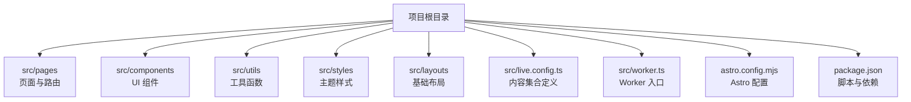
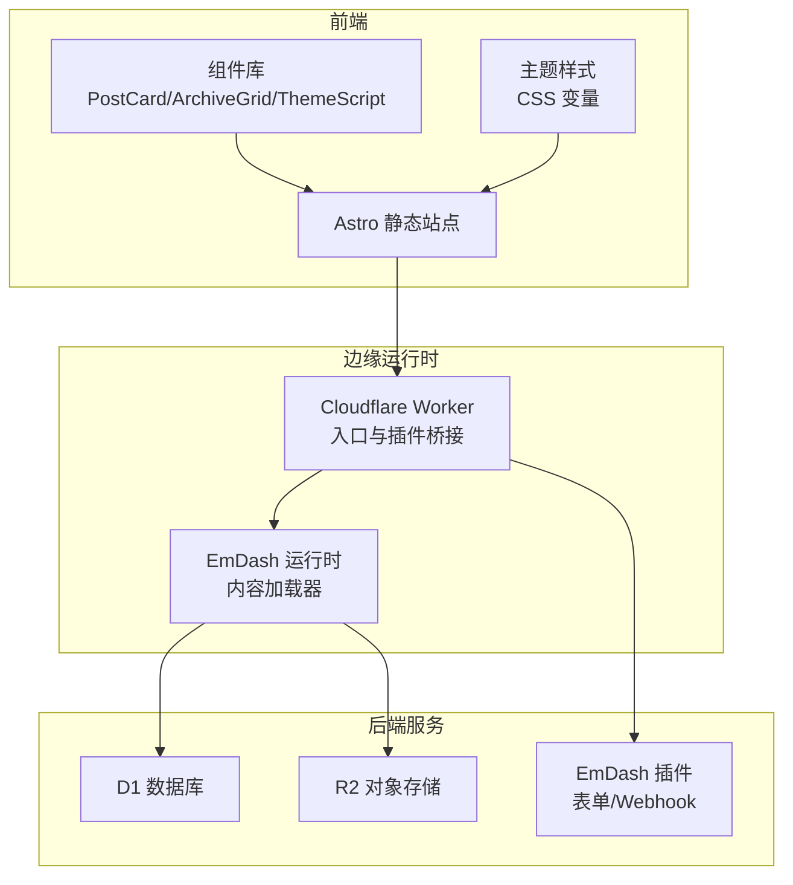
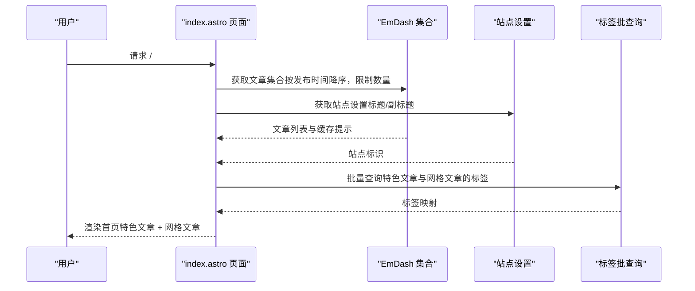
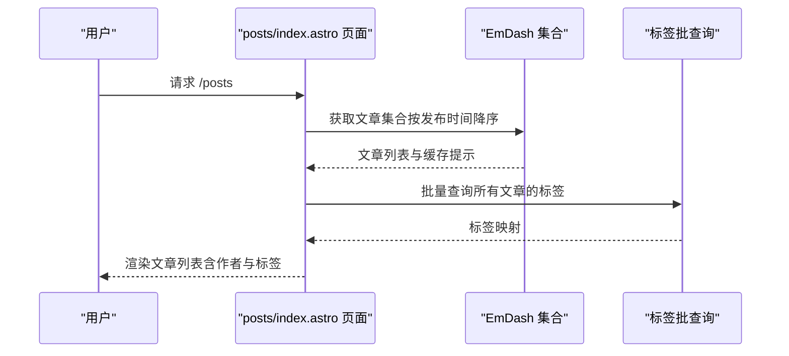
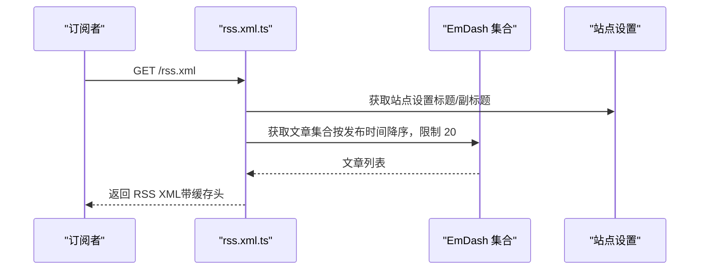
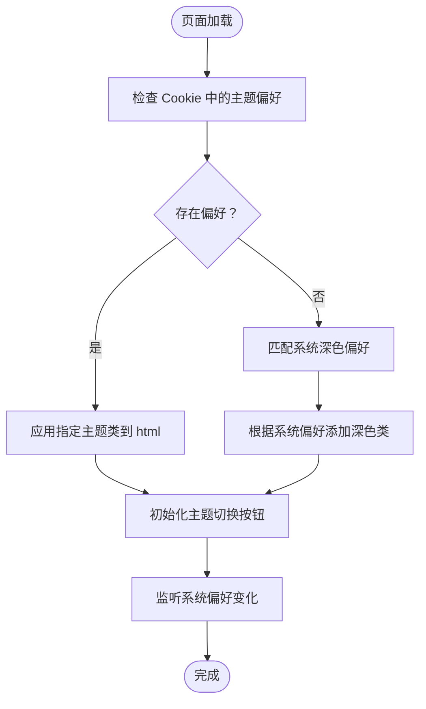
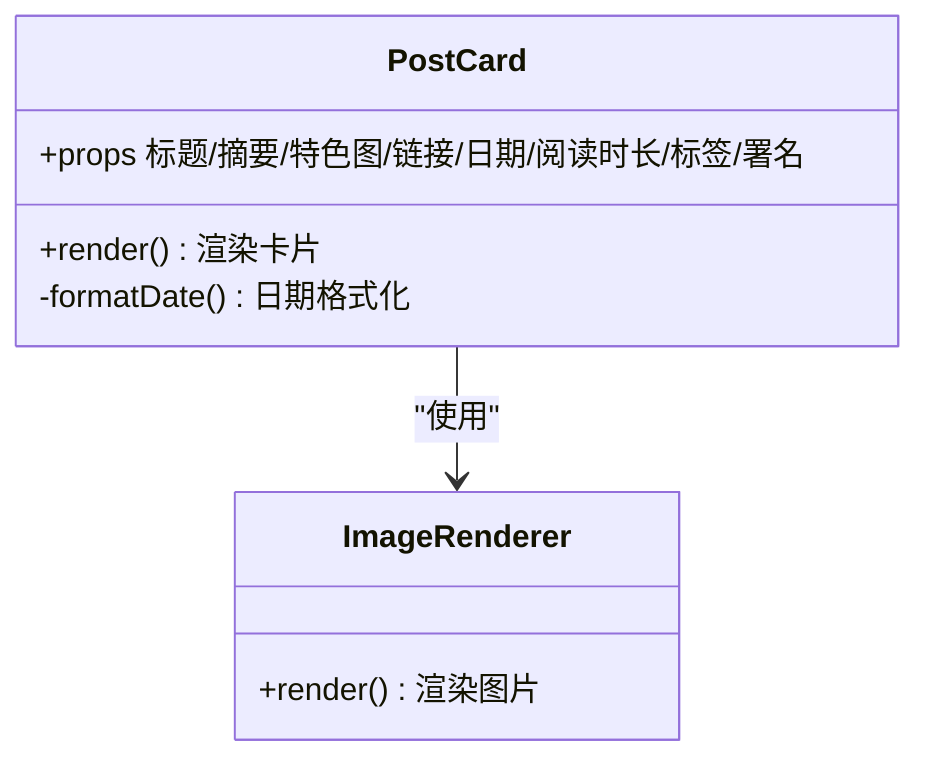
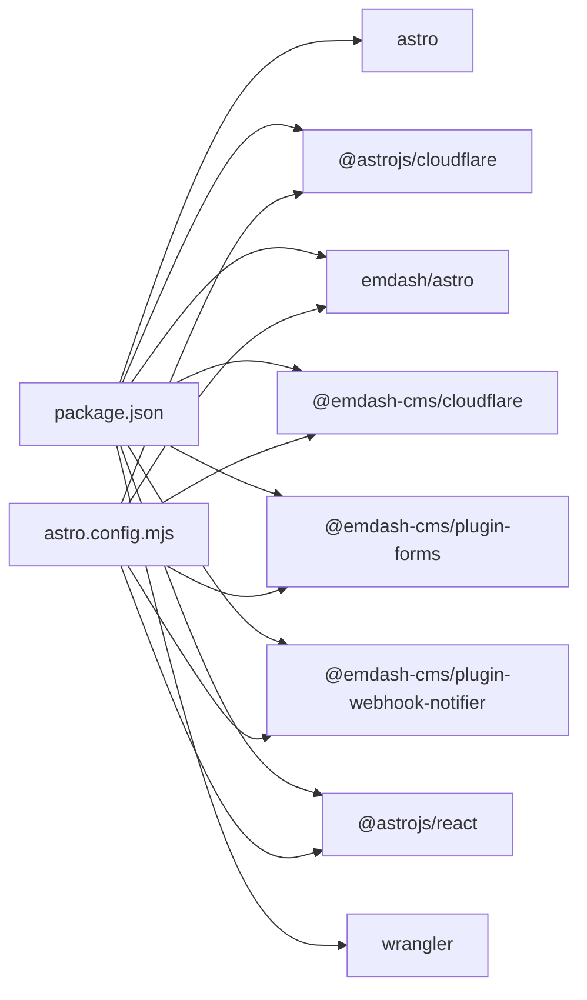

# 项目概述

<cite>
**本文档引用的文件**
- [README.md](file://README.md)
- [package.json](file://package.json)
- [astro.config.mjs](file://astro.config.mjs)
- [src/worker.ts](file://src/worker.ts)
- [src/live.config.ts](file://src/live.config.ts)
- [src/pages/index.astro](file://src/pages/index.astro)
- [src/pages/posts/index.astro](file://src/pages/posts/index.astro)
- [src/pages/rss.xml.ts](file://src/pages/rss.xml.ts)
- [src/utils/constants.ts](file://src/utils/constants.ts)
- [src/styles/theme.css](file://src/styles/theme.css)
- [src/components/layout/ThemeScript.astro](file://src/components/layout/ThemeScript.astro)
- [src/components/ArchiveGrid.astro](file://src/components/ArchiveGrid.astro)
- [src/components/PostCard.astro](file://src/components/PostCard.astro)
- [src/utils/date.ts](file://src/utils/date.ts)
- [src/utils/reading-time.ts](file://src/utils/reading-time.ts)
</cite>

## 目录
1. [简介](#简介)
2. [项目结构](#项目结构)
3. [核心组件](#核心组件)
4. [架构总览](#架构总览)
5. [详细组件分析](#详细组件分析)
6. [依赖关系分析](#依赖关系分析)
7. [性能考量](#性能考量)
8. [故障排除指南](#故障排除指南)
9. [结论](#结论)
10. [附录](#附录)

## 简介
EmDash 博客模板是一个基于 Astro 框架与 Cloudflare Workers 平台构建的现代化静态博客系统。它通过 EmDash 内容管理系统提供可编辑的文章、页面、分类与标签等内容类型，并结合 D1 数据库与 R2 对象存储实现云端部署与高性能访问。该模板支持特色文章展示、文章归档、分类标签系统、全文搜索、RSS 订阅、SEO 元数据与 JSON-LD、深色/浅色主题切换等核心功能，适合个人作者、技术博主与小型团队快速搭建高性能、可扩展的博客站点。

本项目面向初学者提供清晰的本地开发与部署流程说明，同时为有经验的开发者提供架构设计与实现细节的深入解析。

章节来源
- [README.md:1-68](file://README.md#L1-L68)

## 项目结构
该项目采用以功能与页面为中心的组织方式，核心目录与文件职责如下：
- src/pages：页面级组件与路由（首页、文章列表、单篇文章、分类/标签归档、RSS、搜索等）
- src/components：可复用的 UI 组件（布局、文章卡片、图片渲染器、标签列表等）
- src/utils：通用工具函数（日期格式化、阅读时长计算、常量定义等）
- src/styles：主题样式变量与覆盖层
- src/layouts：基础布局模板
- src/live.config.ts：定义实时内容集合，连接 EmDash 运行时加载器
- src/worker.ts：Cloudflare Worker 入口，桥接 Astro Server 与 EmDash 插件沙箱
- astro.config.mjs：Astro 配置，集成 EmDash、React、Cloudflare 适配器与字体配置
- package.json：项目脚本与依赖声明（包含 EmDash 生态插件与 Cloudflare 适配）

图表来源
- [astro.config.mjs:1-45](file://astro.config.mjs#L1-L45)
- [src/live.config.ts:1-14](file://src/live.config.ts#L1-L14)
- [src/worker.ts:1-6](file://src/worker.ts#L1-L6)
- [package.json:1-33](file://package.json#L1-L33)

章节来源
- [astro.config.mjs:1-45](file://astro.config.mjs#L1-L45)
- [src/live.config.ts:1-14](file://src/live.config.ts#L1-L14)
- [src/worker.ts:1-6](file://src/worker.ts#L1-L6)
- [package.json:1-33](file://package.json#L1-L33)

## 核心组件
- EmDash 内容管理：通过 emdash/astro 集成，提供文章、页面、分类、标签等内容类型的查询与渲染能力；支持站点设置、媒体资源与作者署名信息的自动注入。
- Cloudflare Workers 部署：使用 @astrojs/cloudflare 适配器将 Astro 应用编译为边缘运行时，配合 D1 与 R2 实现低延迟与高可用。
- 主题与样式：通过 :root 变量与 @layer 机制统一控制颜色、排版、间距、圆角、阴影等视觉变量，支持深色/浅色主题切换。
- 页面与组件：首页展示特色文章与网格文章；文章归档页列出所有文章；RSS 输出标准 XML；组件层提供可复用的 PostCard、ArchiveGrid、ImageRenderer 等。
- 工具函数：日期格式化（中文本地化）、阅读时长计算（支持中日韩字符与英文单词混合统计）。

章节来源
- [astro.config.mjs:16-26](file://astro.config.mjs#L16-L26)
- [src/styles/theme.css:17-109](file://src/styles/theme.css#L17-L109)
- [src/utils/date.ts:1-18](file://src/utils/date.ts#L1-L18)
- [src/utils/reading-time.ts:1-67](file://src/utils/reading-time.ts#L1-L67)

## 架构总览
EmDash 博客模板采用“前端静态生成 + 边缘运行时 + 云原生数据库/存储”的现代架构。Astro 在构建阶段生成静态页面，运行时通过 Cloudflare Worker 处理动态请求（如 RSS、实时内容查询），并借助 EmDash 插件生态实现表单与 Webhook 能力。D1 提供结构化数据存储，R2 提供媒体资源对象存储。

图表来源
- [astro.config.mjs:1-45](file://astro.config.mjs#L1-L45)
- [src/worker.ts:1-6](file://src/worker.ts#L1-L6)
- [src/live.config.ts:8-13](file://src/live.config.ts#L8-L13)

## 详细组件分析

### 首页组件分析（src/pages/index.astro）
首页负责展示特色文章与最新文章网格，采用数据库侧排序与分页策略，减少客户端处理开销。通过批量查询标签与作者署名信息，避免 N+1 查询问题。特色文章与网格文章在渲染前进行预处理，确保首屏性能与可读性。

图表来源
- [src/pages/index.astro:19-65](file://src/pages/index.astro#L19-L65)

章节来源
- [src/pages/index.astro:1-463](file://src/pages/index.astro#L1-L463)

### 文章归档组件分析（src/pages/posts/index.astro）
文章归档页对所有文章进行数据库侧排序，批量获取标签与作者署名信息，然后逐条渲染文章列表项。该设计保证了在大量文章场景下的查询效率与渲染性能。

图表来源
- [src/pages/posts/index.astro:9-28](file://src/pages/posts/index.astro#L9-L28)

章节来源
- [src/pages/posts/index.astro:1-269](file://src/pages/posts/index.astro#L1-L269)

### RSS 订阅组件分析（src/pages/rss.xml.ts）
RSS 页面以 APIRoute 形式实现，从 EmDash 集合获取最新文章，构造符合 RSS 2.0 规范的 XML 响应，并设置公共缓存头以提升边缘分发效率。输出包含标题、描述、链接、自链接与最后构建时间等字段。

图表来源
- [src/pages/rss.xml.ts:6-54](file://src/pages/rss.xml.ts#L6-L54)

章节来源
- [src/pages/rss.xml.ts:1-71](file://src/pages/rss.xml.ts#L1-L71)

### 主题切换组件分析（src/components/layout/ThemeScript.astro）
ThemeScript 通过内联脚本在首次绘制前应用主题，避免闪烁；支持从 Cookie 读取用户偏好或跟随系统偏好；提供按钮切换与事件监听，确保主题状态持久化与一致性。

图表来源
- [src/components/layout/ThemeScript.astro:5-83](file://src/components/layout/ThemeScript.astro#L5-L83)

章节来源
- [src/components/layout/ThemeScript.astro:1-84](file://src/components/layout/ThemeScript.astro#L1-L84)

### 文章卡片组件分析（src/components/PostCard.astro）
PostCard 是文章列表中的通用卡片组件，支持特色图、作者署名、发布日期、阅读时长与标签展示。组件内部对作者头像、标签链接与文本截断进行了优化，确保在不同屏幕尺寸下保持良好可读性。

图表来源
- [src/components/PostCard.astro:1-285](file://src/components/PostCard.astro#L1-L285)

章节来源
- [src/components/PostCard.astro:1-285](file://src/components/PostCard.astro#L1-L285)

### 工具函数分析
- 日期格式化：提供中文本地化的日期字符串输出，支持月份长短格式选择。
- 阅读时长：针对中日韩字符与英文单词分别计算字数与字符数，综合得出分钟数，最小值为 1 分钟。

章节来源
- [src/utils/date.ts:1-18](file://src/utils/date.ts#L1-L18)
- [src/utils/reading-time.ts:1-67](file://src/utils/reading-time.ts#L1-L67)

## 依赖关系分析
EmDash 博客模板的关键依赖与集成点如下：
- Astro 与 Cloudflare 适配器：负责构建与运行时适配
- EmDash 生态：emdash/astro 集成、@emdash-cms/cloudflare 插件、插件生态（表单、Webhook）
- React 集成：用于需要 React 组件的场景
- 字体与开发工具：Google Fonts 提供字体，Wrangler 用于本地开发与部署

图表来源
- [package.json:10-27](file://package.json#L10-L27)
- [astro.config.mjs:1-45](file://astro.config.mjs#L1-L45)

章节来源
- [package.json:1-33](file://package.json#L1-L33)
- [astro.config.mjs:1-45](file://astro.config.mjs#L1-L45)

## 性能考量
- 数据库侧排序与分页：首页与归档页均在数据库层面完成排序与限制，减少客户端处理与网络传输。
- 批量标签查询：通过一次调用获取多篇文章的标签，避免 N+1 查询，降低数据库往返次数。
- 缓存提示：利用 EmDash 返回的缓存提示设置 Astro 缓存，提升重复访问性能。
- 主题内联脚本：在首次绘制前应用主题，避免闪烁与重绘。
- 图片与字体：使用 Astro 图像优化与 Google Fonts 字体提供器，兼顾加载速度与可读性。
- 响应式设计：网格布局与断点在组件与样式中统一管理，适配桌面与移动端。

章节来源
- [src/pages/index.astro:19-65](file://src/pages/index.astro#L19-L65)
- [src/pages/posts/index.astro:9-28](file://src/pages/posts/index.astro#L9-L28)
- [src/components/layout/ThemeScript.astro:5-17](file://src/components/layout/ThemeScript.astro#L5-L17)
- [astro.config.mjs:12-15](file://astro.config.mjs#L12-L15)

## 故障排除指南
- 本地开发无法启动：确认已安装依赖并执行本地开发命令；检查 Wrangler 配置与 Cloudflare 凭据。
- 部署失败：确保已正确配置 D1 与 R2 绑定，并在 Wrangler 配置中启用相应环境变量。
- RSS 内容为空：检查文章集合是否返回有效数据，确认站点设置中标题与副标题已配置。
- 主题切换无效：确认 Cookie 设置与 html 根元素类名更新逻辑正常，检查系统深色偏好监听事件。
- 图片显示异常：检查媒体绑定与路径拼接，确认 R2 存储权限与访问策略。

章节来源
- [README.md:47-61](file://README.md#L47-L61)
- [src/pages/rss.xml.ts:6-54](file://src/pages/rss.xml.ts#L6-L54)
- [src/components/layout/ThemeScript.astro:5-83](file://src/components/layout/ThemeScript.astro#L5-L83)

## 结论
EmDash 博客模板通过 Astro 与 Cloudflare Workers 的组合，提供了高性能、可扩展且易于维护的静态博客解决方案。其模块化组件、批量化数据查询与主题系统设计，既满足初学者的快速上手需求，也为进阶开发者提供了灵活的扩展空间。配合 D1 与 R2 的云原生能力，该模板能够稳定支撑中小型博客的日常运营与增长。

## 附录
- 本地开发与部署：参考项目根目录的 README 与 package.json 中的脚本说明。
- 页面路由与功能对照：首页、文章列表、单篇文章、分类/标签归档、RSS、静态页面与 404 错误页。
- 技术栈概览：Astro、Cloudflare Workers、D1、R2、EmDash 生态插件、React、Google Fonts。

章节来源
- [README.md:20-61](file://README.md#L20-L61)
- [package.json:10-16](file://package.json#L10-L16)